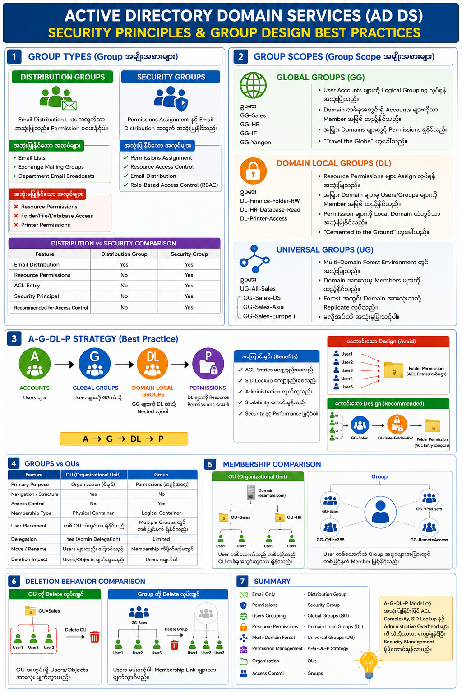

# Active Directory Domain Services (AD DS) Security Principles

## 1. Overview

Active Directory Domain Services (AD DS) သည် Microsoft Windows Environment များတွင် User Accounts, Computers, Groups နှင့် Resources များကို စီမံခန့်ခွဲရန် အသုံးပြုသော Directory Service တစ်ခုဖြစ်သည်။

AD DS Security Design တွင် Groups များကို မှန်ကန်စွာ အသုံးပြုခြင်းသည် Security Management၊ Permission Assignment နှင့် Administration Efficiency တို့အတွက် အလွန်အရေးကြီးသည်။

---

# 2. Group Types (Group အမျိုးအစားများ)

AD DS တွင် Group Types နှစ်မျိုးရှိသည်။

## 2.1 Distribution Groups

Distribution Group များကို Email Distribution Lists အဖြစ်သာ အသုံးပြုသည်။

### အသုံးပြုနိုင်သော အလုပ်များ

* Email List များ ဖန်တီးခြင်း
* Exchange Server Mailing Groups
* Department Email Broadcasts

### အသုံးမပြုနိုင်သော အလုပ်များ

* Folder Permissions
* File Share Permissions
* Database Permissions
* Printer Permissions

### ဥပမာ

Marketing Department ထဲမှ ဝန်ထမ်း 50 ယောက်ကို Email တစ်စောင်ပို့လိုပါက

```
Marketing-Distribution
```

ဟု Distribution Group တစ်ခု ဖန်တီးနိုင်သည်။

**မှတ်ချက်**

Distribution Group များကို Resource Permissions များ ချမှတ်၍ မရပါ။

---

## 2.2 Security Groups

Security Groups များသည် AD DS တွင် အရေးအကြီးဆုံး Group Type ဖြစ်သည်။

### အသုံးပြုနိုင်သော အလုပ်များ

* Permissions Assignment
* Resource Access Control
* Email Distribution
* Role-Based Access Control (RBAC)

### ဥပမာ

```
Sales-Team
```

Group ကို

* Shared Folder Access
* Database Access
* Application Access

ပေးနိုင်သည်။

Security Group တစ်ခုသည် Email Group အဖြစ်လည်း အသုံးပြုနိုင်သည်။

---

## Distribution vs Security Comparison

| Feature                        | Distribution Group | Security Group |
| ------------------------------ | ------------------ | -------------- |
| Email Distribution             | Yes                | Yes            |
| Resource Permissions           | No                 | Yes            |
| ACL Entry                      | No                 | Yes            |
| Security Principal             | No                 | Yes            |
| Recommended for Access Control | No                 | Yes            |

---

# 3. Group Scopes (Group Scope အမျိုးအစားများ)

AD DS တွင် Scope သုံးမျိုးရှိသည်။

1. Global Group
2. Domain Local Group
3. Universal Group

---

## 3.1 Global Groups (GG)

Global Group များသည် User Accounts များကို Logical Grouping လုပ်ရန် အသုံးပြုသည်။

### အဓိက ရည်ရွယ်ချက်

Department, Team, Location အလိုက် Users များကို စုစည်းခြင်း

### ဥပမာ

```
GG-Sales
GG-HR
GG-IT
GG-Yangon
GG-Mandalay
```

### Characteristics

✔ Domain တစ်ခုအတွင်းရှိ Accounts များကိုသာ Member အဖြစ် ထည့်နိုင်သည်။

✔ အခြား Domains များတွင် Permissions ရနိုင်သည်။

### မှတ်သားရန်

Global Group သည်

"Travel the Globe"

ဟု ခေါ်ဆိုကြသည်။

အကြောင်းမှာ

* Domain A တွင် ဖန်တီးထားသော်လည်း
* Domain B, Domain C များတွင် Permission ရယူနိုင်သောကြောင့် ဖြစ်သည်။

---

## 3.2 Domain Local Groups (DL)

Domain Local Group များသည် Resource Permissions များ Assign လုပ်ရန် အသုံးပြုသည်။

### အဓိက ရည်ရွယ်ချက်

Resource Access Control

### ဥပမာ

```
DL-Finance-Folder-RW
DL-HR-Database-Read
DL-Printer-Access
```

### Characteristics

✔ အခြား Domain များမှ Users သို့မဟုတ် Groups များကို Member အဖြစ် ထည့်နိုင်သည်။

✔ Permission များကို Local Domain ထဲတွင်သာ အသုံးပြုနိုင်သည်။

### မှတ်သားရန်

Domain Local Group ကို

"Cemented to the Ground"

ဟု တင်စားခေါ်ဆိုကြသည်။

အကြောင်းမှာ

Permission Assignment သည် ဖန်တီးထားသော Domain အတွင်းတွင်သာ အကျိုးသက်ရောက်သောကြောင့် ဖြစ်သည်။

---

## 3.3 Universal Groups (UG)

Universal Group များကို Multi-Domain Forest များတွင် အသုံးပြုသည်။

### အဓိက ရည်ရွယ်ချက်

Domain များစွာရှိသော Environment တွင် Global Groups များကို စုစည်းခြင်း

### ဥပမာ

Forest Structure

```
corp.local
sales.corp.local
asia.corp.local
```

Global Groups

```
GG-Sales-US
GG-Sales-Asia
GG-Sales-Europe
```

Universal Group

```
UG-All-Sales
```

### Characteristics

✔ Domain အားလုံးမှ Members များကို ထည့်နိုင်သည်။

✔ Forest အတွင်းရှိ Domain အားလုံးသို့ Replicate လုပ်သည်။

### သတိပြုရန်

Universal Groups များ၏ Membership ပြောင်းလဲမှုတိုင်းသည် Forest-wide Replication ဖြစ်စေသောကြောင့် မလိုအပ်ဘဲ အသုံးမပြုသင့်ပါ။

---

# 4. A-G-DL-P Strategy (Best Practice)

AD DS Permission Management အတွက် Microsoft မှ အကြံပြုသော Best Practice သည်

## A-G-DL-P

ဖြစ်သည်။

---

## Step 1 – Accounts → Global Groups

Users များကို Global Groups ထဲသို့ ထည့်ပါ။

```
User1
User2
User3

↓
GG-Sales
```

---

## Step 2 – Global Groups → Domain Local Groups

Global Group များကို Domain Local Groups ထဲသို့ Nest လုပ်ပါ။

```
GG-Sales

↓

DL-SalesFolder-RW
```

---

## Step 3 – Domain Local Groups → Permissions

Domain Local Group ကို Resource Permission ပေးပါ။

```
DL-SalesFolder-RW

↓

Sales Shared Folder
(Read / Write)
```

---

## Diagram

```
Accounts
    ↓
Global Groups
    ↓
Domain Local Groups
    ↓
Permissions
```

သို့မဟုတ်

```
A → G → DL → P
```

---

# 5. A-G-DL-P ကို အသုံးပြုသင့်သော အကြောင်းရင်း

## မကောင်းသော Design

Users များကို Folder Permission တိုက်ရိုက်ပေးခြင်း

```
User1
User2
User3
User4
User5
```

ACL ထဲတွင် Entries များစွာ ဖြစ်လာမည်။

---

## ပိုကောင်းသော Design

```
User1
User2
User3
    ↓
GG-Sales
    ↓
DL-SalesFolder-RW
    ↓
Folder Permission
```

ACL ထဲတွင် Entry တစ်ခုတည်းသာ ရှိမည်။

---

## Performance Benefits

### 1. ACL Size လျော့နည်းစေသည်

ACL Entries များ နည်းလာသည်။

### 2. SID Lookup လျော့နည်းစေသည်

Windows Security Engine သည် SID များကို Resolve လုပ်ရာတွင် အလုပ်နည်းသွားသည်။

### 3. Administration လွယ်ကူသည်

ဝန်ထမ်းအသစ်ဝင်လာပါက

```
User → GG-Sales
```

ထည့်ရုံသာ လိုသည်။

Permission ပြန်သတ်မှတ်ရန် မလိုတော့ပါ။

### 4. Scalability ကောင်းမွန်သည်

Enterprise Environment များတွင် အလွန်အရေးကြီးသည်။

---

# 6. အဘယ်ကြောင့် Permissions ကို User များသို့ တိုက်ရိုက် မပေးသင့်သနည်း

မကောင်းသော ဥပမာ

```
User1 → Folder A
User2 → Folder A
User3 → Folder A
User4 → Folder A
```

ပြဿနာများ

* ACL ကြီးမားလာမည်
* Troubleshooting ခက်ခဲမည်
* Administration Complexity မြင့်မည်
* Audit ပြုလုပ်ရန် ခက်ခဲမည်

---

# 7. OUs နှင့် Groups တို့၏ ကွာခြားချက်

AD Administrators များအတွက် အများဆုံး ရှုပ်ထွေးလေ့ရှိသော အချက်မှာ OU နှင့် Group တို့၏ ကွာခြားချက် ဖြစ်သည်။

## Purpose Comparison

| Feature         | OU           | Group       |
| --------------- | ------------ | ----------- |
| Primary Purpose | Organization | Permissions |
| Navigation      | Yes          | No          |
| Access Control  | No           | Yes         |
| Delegation      | Yes          | Limited     |

---

## Membership Comparison

### OU

User Object တစ်ခုသည်

OU တစ်ခုအတွင်းတွင်သာ ရှိနိုင်သည်။

ဥပမာ

```
OU=Sales
```

တွင် ရှိနေသော User သည်

```
OU=HR
```

တွင် တစ်ချိန်တည်း မရှိနိုင်ပါ။

---

### Group

User တစ်ယောက်သည် Group အများအပြားတွင် Member ဖြစ်နိုင်သည်။

ဥပမာ

```
GG-Sales
GG-VPNUsers
GG-Office365
GG-RemoteAccess
```

အားလုံးတွင် တစ်ပြိုင်နက် Member ဖြစ်နိုင်သည်။

---

## Deletion Behavior Comparison

| Action              | OU              | Group                   |
| ------------------- | --------------- | ----------------------- |
| Delete Container    | Objects Deleted | Membership Only Removed |
| User Account Impact | User Deleted    | User Remains            |
| Physical Container  | Yes             | No                      |
| Logical Container   | No              | Yes                     |

---

### OU Delete Example

```
OU=Sales
 ├ User1
 ├ User2
 └ User3
```

OU ကို ဖျက်လိုက်လျှင်

```
User1
User2
User3
```

အားလုံး ပျက်သွားမည်။

---

### Group Delete Example

```
GG-Sales
 ├ User1
 ├ User2
 └ User3
```

Group ကို ဖျက်လိုက်လျှင်

Users များ မပျက်ပါ။

Membership Link များသာ ပျက်သွားမည်။

---

# 8. Summary

AD DS Security Design အတွက် အကောင်းဆုံး လုပ်ထုံးလုပ်နည်းများမှာ

* Email Only → Distribution Group
* Permissions → Security Group
* Users → Global Groups
* Resources → Domain Local Groups
* Multi-Domain Forest → Universal Groups
* Permission Assignment → A-G-DL-P Strategy
* Organization → OUs
* Access Control → Groups

Enterprise Environment များတွင် A-G-DL-P Model ကို အသုံးပြုခြင်းအားဖြင့် Security Management ပိုမိုကောင်းမွန်လာပြီး ACL Complexity၊ SID Lookup နှင့် Administrative Overhead များကို သိသိသာသာ လျှော့ချနိုင်သည်။

---

