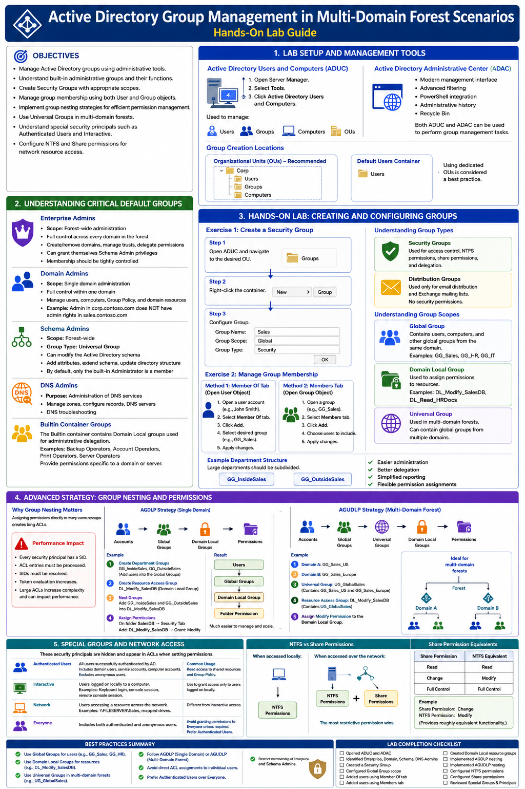
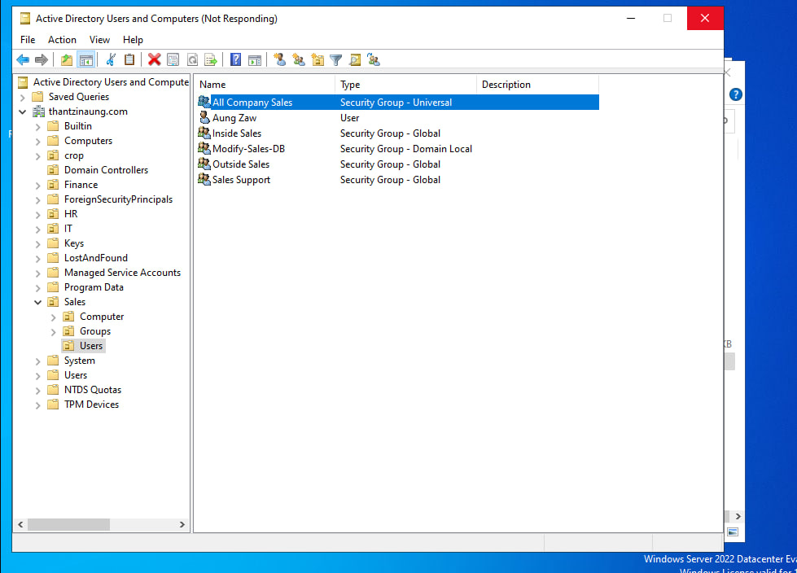
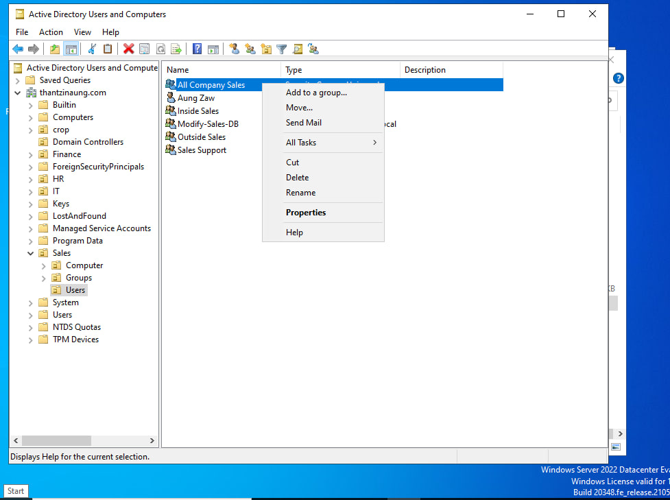
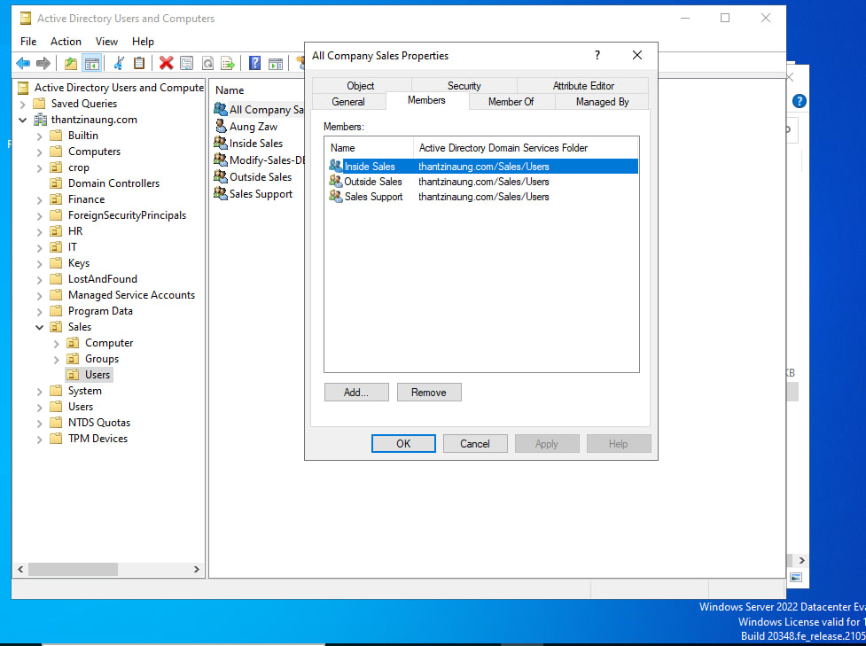
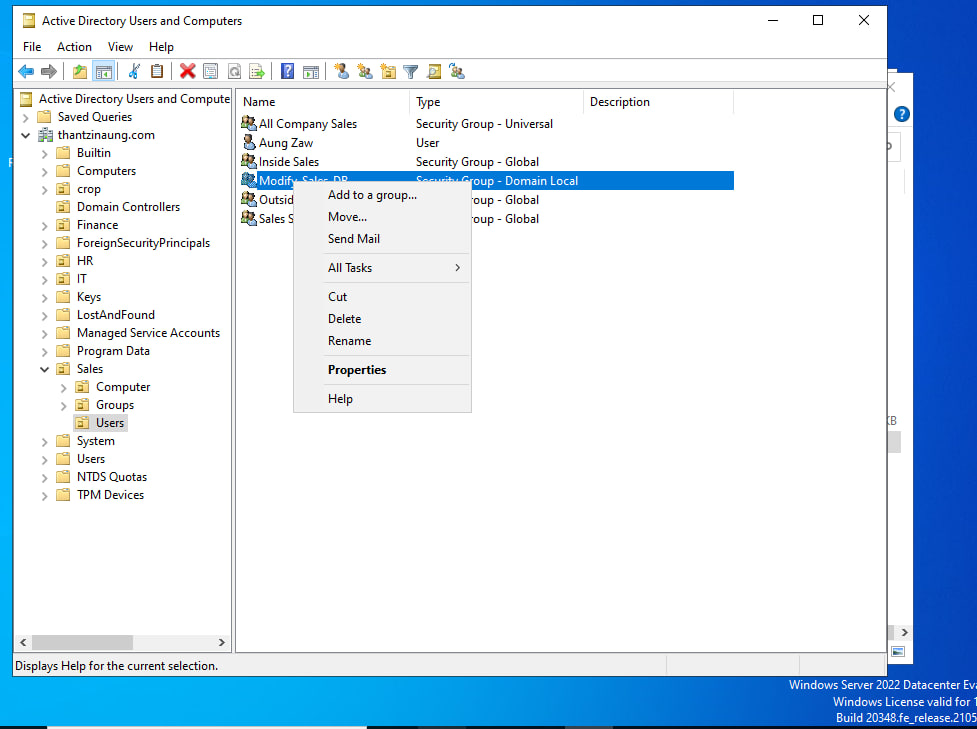
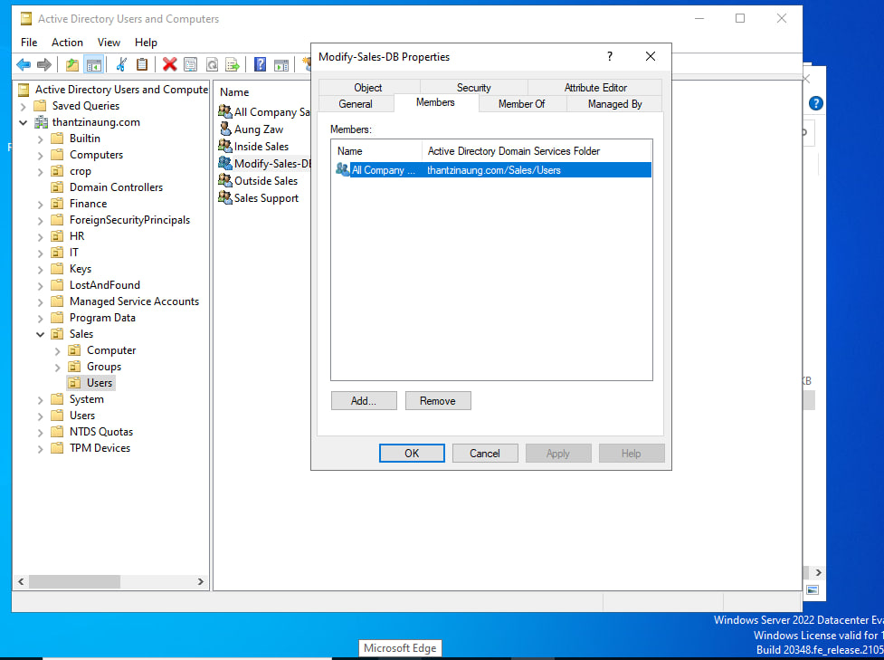
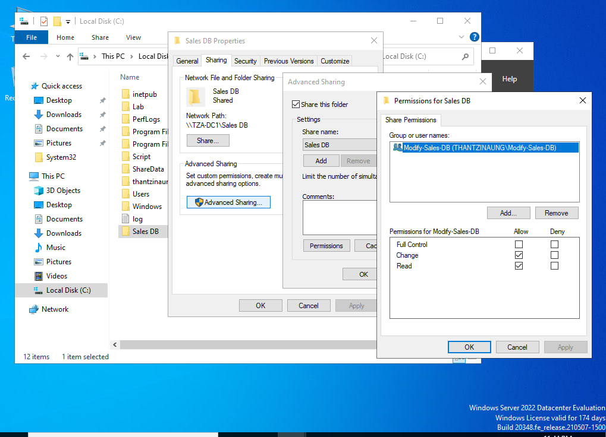

# Create and Manage Groups in a Multi-Domain Forest — Hands-On Lab

## Lab Overview

This hands-on lab demonstrates how to create and manage Active Directory groups using the A-G-DL-P (Accounts → Global Groups → Universal Groups → Domain Local Groups → Permissions) model in a multi-domain forest environment. I will create Organizational Units (OUs), users, security groups, configure group nesting, and assign permissions to a shared folder.

### Objectives

In this lab:

- Create Organizational Units (OUs)
- Create Global, Universal, and Domain Local security groups
- Configure group nesting using A-G-DL-P best practices
- Add users to groups
- Assign folder permissions using Domain Local groups
- Configure shared folder access

---

# Lab Environment

| Component | Value |
|------------|---------|
| Domain | thantzinaung.com |
| Domain Controller | TZA-DC1 |
| Tool Used | Active Directory Users and Computers |
| Shared Folder | C:\Sales DB |

---

# Understanding the A-G-DL-P Model

Before starting, understand the group structure:

```text
User Account
      ↓
Global Group
      ↓
Universal Group
      ↓
Domain Local Group
      ↓
Resource Permission
```

### Example in this Lab

```text
Aung Zaw
      ↓
Outside Sales (Global)
      ↓
All Company Sales (Universal)
      ↓
Modify-Sales-DB (Domain Local)
      ↓
Sales DB Folder Permission
```

---

# Task 1: Create the Sales Organizational Units (OU)

### Step 1: Open Active Directory Users and Computers

1. Open **Server Manager**
2. Select **Tools**
3. Click **Active Directory Users and Computers**
4. Expand:

```text
thantzinaung.com
```

### Step 2: Create Sales OU

1. Right-click **thantzinaung.com**
2. Select **New**
3. Click **Organizational Unit**

Enter:

```text
Name: Sales
```

Click **OK**

---

### Step 3: Create Users OU

1. Right-click **Sales**
2. Select **New**
3. Click **Organizational Unit**

Enter:

```text
Name: Users
```

Click **OK**

Directory structure:

```text
thantzinaung.com
└── Sales
    └── Users
```

---

# Task 2: Create Global Security Groups

Navigate to:

```text
Sales
└── Users
```

## Create Inside Sales Group

1. Right-click **Users**
2. Select **New**
3. Click **Group**

Configure:

```text
Group Name: Inside Sales
Group Scope: Global
Group Type: Security
```

Click **OK**

---

## Create Outside Sales Group

Configure:

```text
Group Name: Outside Sales
Group Scope: Global
Group Type: Security
```

Click **OK**

---

## Create Sales Support Group

Configure:

```text
Group Name: Sales Support
Group Scope: Global
Group Type: Security
```

Click **OK**

---

### Result

You should now have:

```text
Inside Sales
Outside Sales
Sales Support
```

All configured as:

```text
Security Group
Scope = Global
```

---

# Task 3: Create Universal Security Group

## Create All Company Sales

1. Right-click **Users**
2. Select **New**
3. Click **Group**

Configure:

```text
Group Name: All Company Sales
Group Scope: Universal
Group Type: Security
```

Click **OK**

---

## Add Global Groups to Universal Group

1. Right-click **All Company Sales**
2. Select **Properties**
3. Open **Members** tab
4. Click **Add**

Add:

```text
Inside Sales
Outside Sales
Sales Support
```

5. Click **Check Names**
6. Click **OK**
7. Click **Apply**
8. Click **OK**

---

### Group Structure

```text
All Company Sales
├── Inside Sales
├── Outside Sales
└── Sales Support
```

---

# Task 4: Create Domain Local Security Group

## Create Modify-Sales-DB Group

1. Right-click **Users**
2. Select **New**
3. Click **Group**

Configure:

```text
Group Name: Modify-Sales-DB
Group Scope: Domain Local
Group Type: Security
```

Click **OK**

---

## Add Universal Group to Domain Local Group

1. Right-click **Modify-Sales-DB**
2. Select **Properties**
3. Open **Members** tab
4. Click **Add**

Add:

```text
All Company Sales
```

5. Click **Check Names**
6. Click **OK**
7. Click **Apply**
8. Click **OK**

---

### Updated Group Nesting

```text
Modify-Sales-DB
└── All Company Sales
     ├── Inside Sales
     ├── Outside Sales
     └── Sales Support
```

---

# Task 5: Add User to Sales Group

## Add User Aung Zaw

1. Locate user:

```text
Aung Zaw
```

2. Right-click **Aung Zaw**
3. Select **Properties**
4. Open **Member Of** tab
5. Click **Add**

Add:

```text
Outside Sales
```

6. Click **Check Names**
7. Click **OK**
8. Click **Apply**
9. Click **OK**

---

### Membership Flow

```text
Aung Zaw
   ↓
Outside Sales
   ↓
All Company Sales
   ↓
Modify-Sales-DB
   ↓
Sales DB Folder
```

---

# Task 6: Create Sales DB Folder

## Create Folder

Open File Explorer and create:

```text
C:\Sales DB
```

---

# Task 7: Assign NTFS Permissions

## Configure Security Permissions

1. Right-click **Sales DB**
2. Select **Properties**
3. Open **Security** tab
4. Click **Edit**
5. Click **Add**

Add:

```text
Modify-Sales-DB
```

6. Click **Check Names**
7. Click **OK**

Grant:

```text
Modify
Read & Execute
List Folder Contents
Read
Write
```

8. Click **Apply**
9. Click **OK**

---

# Task 8: Configure Folder Sharing

## Enable Sharing

1. Right-click **Sales DB**
2. Select **Properties**
3. Open **Sharing** tab
4. Click **Advanced Sharing**
5. Check:

```text
Share this folder
```

6. Click **Permissions**

---

## Configure Share Permissions

1. Select **Everyone**
2. Click **Remove**

3. Click **Add**

Add:

```text
Modify-Sales-DB
```

4. Click **Check Names**
5. Click **OK**

Grant:

```text
Allow:
✓ Change
✓ Read
```

6. Click **Apply**
7. Click **OK**
8. Click **Close**

---

# Verification

## Verify Group Membership

Open:

```text
Aung Zaw Properties
→ Member Of
```

Expected:

```text
Outside Sales
```

---

## Verify Nested Groups

Open:

```text
Modify-Sales-DB
→ Members
```

Expected:

```text
All Company Sales
```

Open:

```text
All Company Sales
→ Members
```

Expected:

```text
Inside Sales
Outside Sales
Sales Support
```

---

# Final A-G-DL-P Structure

```text
User Account
└── Aung Zaw
      ↓
Global Group
└── Outside Sales
      ↓
Universal Group
└── All Company Sales
      ↓
Domain Local Group
└── Modify-Sales-DB
      ↓
Resource
└── C:\Sales DB
```
---

# Conclusion

In this lab, I successfully created and managed Active Directory security groups within a multi-domain forest environment. By implementing the A-G-DL-P model, I centralized permission management, simplified administration, and followed Microsoft Active Directory best practices for scalable enterprise environments.

---









---