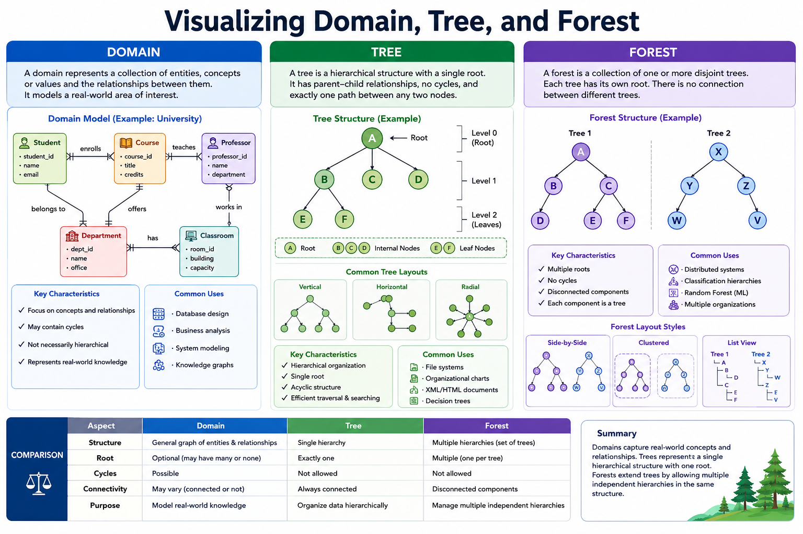

# Domain, Tree and Forest Visualization

## ၁။ OverView

Data Structure နှင့် Information System များတွင် အချက်အလက်များ၏ ဆက်နွယ်မှု (Relationship) ကို နားလည်စေရန် Visualization (မြင်သာအောင် ပုံဖော်ပြသခြင်း) သည် အလွန်အရေးကြီးသည်။ Domain, Tree နှင့် Forest တို့သည် Data Organization နှင့် Hierarchical Structure များကို ဖော်ပြရာတွင် အသုံးများသော Concept များဖြစ်ကြသည်။

---

# ၂။ Domain Visualization

## What is Domain

Domain သည် စနစ်တစ်ခုအတွင်းရှိ အရာဝတ္ထုများ (Entities) နှင့် ၎င်းတို့၏ ဆက်စပ်မှုများ (Relationships) ကို ကိုယ်စားပြုသော Concept ဖြစ်သည်။

ဥပမာ

* University Domain
* Hospital Domain
* E-Commerce Domain
* Library Domain

Domain Visualization သည် Business Process သို့မဟုတ် System Structure ကို နားလည်စေရန် အသုံးပြုသည်။

### University Domain Example

```
University
│
├── Faculty
│   ├── Computer Science
│   ├── Engineering
│   └── Business
│
├── Lecturer
│
└── Student
```

### Domain Diagram

```
+-----------+
| University|
+-----------+
      |
      |
+-----------+
| Faculty   |
+-----------+
      |
+-----------+
| Student   |
+-----------+
```

### Benefits of Domain Visualization

1. System Requirement ကို နားလည်ရန် ကူညီပေးသည်။
2. Entity Relationship များကို ရှင်းလင်းစွာ ဖော်ပြနိုင်သည်။
3. Database Design ပြုလုပ်ရာတွင် အထောက်အကူပြုသည်။
4. Software Development တွင် Communication Tool အဖြစ် အသုံးဝင်သည်။

---

# ၃။ Tree Visualization

## Tree ဆိုသည်မှာ အဘယ်နည်း

Tree သည် Hierarchical Data Structure တစ်ခုဖြစ်ပြီး Nodes များနှင့် Edges များဖြင့် ဖွဲ့စည်းထားသည်။

Tree တွင်

* Root Node
* Parent Node
* Child Node
* Leaf Node

တို့ ပါဝင်သည်။

### Tree Structure Example

```
        A
      / | \
     B  C  D
    / \     \
   E   F     G
```

### Node အမျိုးအစားများ

| Node  | Description |
| ----- | ----------- |
| A     | Root Node   |
| B,C,D | Child Nodes |
| E,F,G | Leaf Nodes  |

### Tree Visualization Example

```
CEO
│
├── Manager A
│   ├── Employee 1
│   └── Employee 2
│
└── Manager B
    ├── Employee 3
    └── Employee 4
```

### Usage of Tree

* Organization Chart
* File System
* XML/HTML Document
* Decision Tree
* Family Tree

### Benefits of Tree Visualization

1. Hierarchical Relationship ကို ရှင်းလင်းစွာ မြင်နိုင်သည်။
2. Data Navigation လွယ်ကူစေသည်။
3. Parent-Child Relationship များကို ဖော်ပြနိုင်သည်။
4. Large Data Structure များကို စနစ်တကျ စီမံနိုင်သည်။

---

# ၄။ Forest Visualization

## Forest ဆိုသည်မှာ အဘယ်နည်း

Forest သည် Tree များစွာ၏ စုစည်းမှု (Collection of Trees) ဖြစ်သည်။

Tree တစ်ခုတွင် Root Node တစ်ခုသာ ရှိသော်လည်း Forest တွင် Root Nodes အများအပြား ရှိနိုင်သည်။

### Forest Example

```
Tree 1

      A
     / \
    B   C


Tree 2

      D
     / \
    E   F
```

Forest အဖြစ်

```
      A          D
     / \        / \
    B   C      E   F
```

### Real-World Example

Company Group Structure

```
Company Group
│
├── Company A
│   ├── HR
│   └── IT
│
├── Company B
│   ├── Sales
│   └── Finance
│
└── Company C
    └── Marketing
```

### Forest Visualization ၏ အသုံးများ

* Multi-Organization Structure
* Distributed Systems
* Multiple Decision Trees
* Machine Learning Random Forest
* Large-Scale Knowledge Graphs

### Forest Visualization ၏ အကျိုးကျေးဇူးများ

1. Multiple Hierarchies ကို တစ်ပြိုင်နက် ဖော်ပြနိုင်သည်။
2. Complex Systems များကို အုပ်စုလိုက် စီမံနိုင်သည်။
3. Large Dataset များကို ပိုမိုနားလည်စေသည်။
4. Scalability ပိုမိုကောင်းမွန်စေသည်။

---

# ၅။ Domain, Tree နှင့် Forest တို့၏ ကွာခြားချက်

| Feature      | Domain            | Tree               | Forest                       |
| ------------ | ----------------- | ------------------ | ---------------------------- |
| Purpose      | System Model      | Hierarchical Data  | Multiple Trees               |
| Root Node    | မလိုအပ်            | ၁ ခု                | အများအပြား                    |
| Relationship | General           | Parent-Child       | Multiple Parent-Child Groups |
| Complexity   | Medium            | Simple to Medium   | Medium to High               |
| Example      | University System | Organization Chart | Multiple Organizations       |

---

# ၆။ Visualization Tools

Domain, Tree နှင့် Forest များကို Visualization ပြုလုပ်ရာတွင် အသုံးများသော Tools များမှာ

* Microsoft Visio
* Draw.io (diagrams.net) ***
* Lucidchart
* Graphviz
* Mermaid
* PlantUML
* D3.js
* Cytoscape

တို့ဖြစ်ကြသည်။

---

# ၇။ နိဂုံးချုပ်

Domain Visualization သည် System အတွင်းရှိ Entity များနှင့် Relationship များကို ဖော်ပြရန် အသုံးပြုသည်။ Tree Visualization သည် Hierarchical Structure များကို Root Node တစ်ခုအောက်တွင် ဖော်ပြပေးသည်။ Forest Visualization သည် Tree များစွာကို တစ်စုတစ်စည်းတည်း ဖော်ပြနိုင်ပြီး Complex System များကို စီမံခန့်ခွဲရာတွင် အရေးပါသော နည်းလမ်းတစ်ခုဖြစ်သည်။

Data Analysis, Database Design, Software Engineering, Artificial Intelligence နှင့် Information Management နယ်ပယ်များတွင် Domain, Tree နှင့် Forest Visualization များကို ကျယ်ပြန့်စွာ အသုံးပြုလျက်ရှိသည်။

