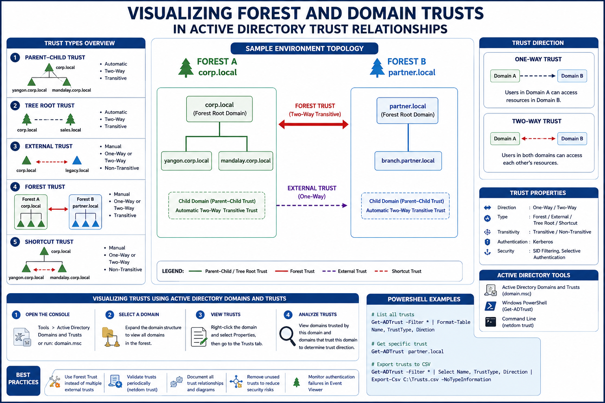
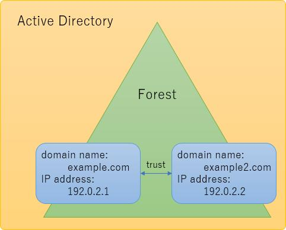
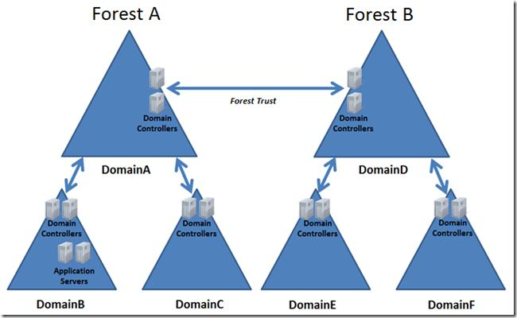
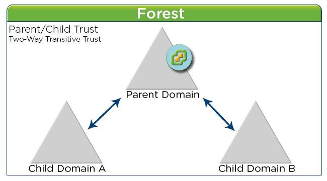
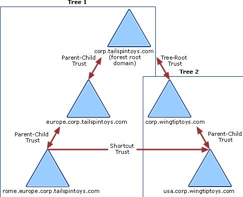
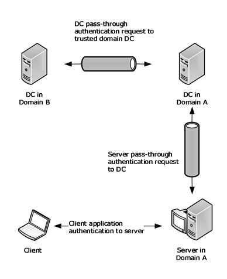

# Visualizing Forest and Domain Trusts in Active Directory Trust Relationships

## နိဒါန်း

Active Directory (AD) Environment များတွင် Domain များနှင့် Forest များအကြား အပြန်အလှန် ဆက်သွယ်နိုင်ရန် Trust Relationship များကို အသုံးပြုကြသည်။
ဤ Documentation တွင် Forest Trust နှင့် Domain Trust များကို Active Directory Domain and Trusts Console မှတစ်ဆင့် မည်သို့ Visualize လုပ်ရမည်ကို လေ့လာသည်။

---

# Learning Objectives

* Active Directory Trust Relationship များကို နားလည်ခြင်း
* Forest Trust နှင့် Domain Trust ကွာခြားချက်များကို သိရှိခြင်း
* Trust Direction များကို ခွဲခြားသိရှိခြင်း
* Active Directory Domains and Trusts Console ကို အသုံးပြု၍ Trust များကို Visualize လုပ်နိုင်ခြင်း
* PowerShell ဖြင့် Trust Information များကို စစ်ဆေးနိုင်ခြင်း

---

# Prerequisites

* Windows Server 2022 / 2025
* Active Directory Domain Services (AD DS) Installed
* Enterprise Admin Privileges
* Multiple Domains or Forests Configured

ဥပမာ Environment

Forest A

```
corp.local
├── yangon.corp.local
└── mandalay.corp.local
```

Forest B

```
partner.local
├── branch.partner.local
```

---

# Active Directory Trust Types

## 1. Parent-Child Trust

Domain Tree အတွင်း Parent Domain နှင့် Child Domain ကြား အလိုအလျောက် ဖန်တီးပေးသော Trust ဖြစ်သည်။

ဥပမာ

```
corp.local
   │
   └── yangon.corp.local
```

Trust Type:

* Two-Way
* Transitive

---

## 2. Tree Root Trust

Domain Tree အသစ်တစ်ခုကို Forest အတွင်း ဖန်တီးသောအခါ Tree Root Trust ကို အလိုအလျောက် ဖန်တီးပေးသည်။

ဥပမာ

```
corp.local

sales.local
```

Trust Type:

* Two-Way
* Transitive

---

## 3. External Trust

Forest မတူသော Domain နှစ်ခုကြား ချိတ်ဆက်သော Trust ဖြစ်သည်။

ဥပမာ

```
corp.local
      ↔
legacy.local
```

Trust Type:

* One-Way သို့မဟုတ် Two-Way
* Non-Transitive

---

## 4. Forest Trust

Forest တစ်ခုလုံးနှင့် အခြား Forest တစ်ခုလုံးကို ချိတ်ဆက်ပေးသော Trust ဖြစ်သည်။

ဥပမာ

```
Forest A
corp.local

      ↔

Forest B
partner.local
```

Trust Type:

* One-Way သို့မဟုတ် Two-Way
* Transitive

---

## 5. Shortcut Trust

Authentication Process ကို မြန်ဆန်စေရန် Domain နှစ်ခုကြား တိုက်ရိုက် Trust ဖန်တီးခြင်း ဖြစ်သည်။

ဥပမာ

```
corp.local
│
├── yangon.corp.local
│
└── mandalay.corp.local

yangon ↔ mandalay
```

---

# Understanding Trust Direction

## One-Way Trust

```
Domain A  -----> Domain B
```

Domain A မှ User များသည် Domain B Resource များကို Access လုပ်နိုင်သည်။

---

## Two-Way Trust

```
Domain A <-----> Domain B
```

Domain နှစ်ခုစလုံးမှ User များသည် အပြန်အလှန် Resource များကို Access လုပ်နိုင်သည်။

---

# Visualizing Trusts using Active Directory Domains and Trusts

## Step 1: Open Active Directory Domains and Trusts

Server Manager မှ

```
Tools
   └── Active Directory Domains and Trusts
```

သို့မဟုတ်

```
domain.msc
```

Run Command ဖြင့် ဖွင့်နိုင်သည်။

---

## Step 2: View Existing Domains

Console တွင်

```
Active Directory Domains and Trusts
    ├── corp.local
    ├── yangon.corp.local
    └── mandalay.corp.local
```

Domain Structure ကို မြင်တွေ့နိုင်မည်ဖြစ်သည်။

---

## Step 3: View Trust Relationships

1. Domain ကို Right Click နှိပ်ပါ
2. Properties ကိုရွေးပါ
3. Trusts Tab ကိုဖွင့်ပါ

ဥပမာ

```
corp.local Properties
   └── Trusts
```

---

## Step 4: Analyze Trust Direction

Trusts Tab တွင်

### Domains trusted by this domain

```
partner.local
```

### Domains that trust this domain

```
partner.local
```

ဆိုပါက

```
corp.local <-----> partner.local
```

Two-Way Trust ဖြစ်ကြောင်း သိနိုင်သည်။

---

# Visual Trust Diagram Example

## Forest Trust Visualization

```
+----------------------+
| Forest A             |
| corp.local           |
+----------------------+
          ||
          ||
      Forest Trust
          ||
          ||
+----------------------+
| Forest B             |
| partner.local        |
+----------------------+
```

---

## Parent Child Trust Visualization

```
corp.local
   │
   ├── yangon.corp.local
   │
   └── mandalay.corp.local
```

Automatic Two-Way Transitive Trust

---

## Shortcut Trust Visualization

```
           corp.local
           /       \
          /         \
yangon.corp      mandalay.corp
        \         /
         \       /
       Shortcut Trust
```

Authentication Path ကို လျှော့ချပေးသည်။

---

# Visualizing Trusts with PowerShell

## View All Trusts

```powershell
Get-ADTrust -Filter *
```

Output Example

```powershell
Name            : partner.local
TrustType       : Forest
Direction       : Bidirectional
```

---

## View Specific Trust

```powershell
Get-ADTrust partner.local
```

---

## Export Trust Information

```powershell
Get-ADTrust -Filter * |
Select Name,
TrustType,
Direction |
Export-Csv C:\Trusts.csv -NoTypeInformation
```

---

# Trust Relationship Design Example

Enterprise Environment

```
                     Forest A
                  corp.local
                       |
      ---------------------------------
      |                               |
yangon.corp.local         mandalay.corp.local
      |
      |
      | Forest Trust
      |
      |
                partner.local
                       |
               branch.partner.local
```

Trust Flow

```
Corp Users
     ↓
Forest Trust
     ↓
Partner Resources
```

---

# Best Practices

### Use Forest Trust Instead of Multiple External Trusts

ပိုမို စီမံခန့်ခွဲရ လွယ်ကူစေသည်။

### Periodically Validate Trusts

```powershell
netdom trust
```

ဖြင့် စစ်ဆေးပါ။

### Document All Trust Relationships

Network Diagram များကို Update လုပ်ထားပါ။

### Remove Unused Trusts

Security Risk များကို လျှော့ချနိုင်သည်။

### Monitor Authentication Failures

Event Viewer Logs များကို စစ်ဆေးပါ။

---

# Summary

Active Directory Trust Relationships များသည် Domain များနှင့် Forest များအကြား Authentication နှင့် Resource Sharing ကို ခွင့်ပြုပေးသော အရေးကြီးသည့် Mechanism တစ်ခုဖြစ်သည်။

Trust Visualization ပြုလုပ်ခြင်းအားဖြင့်

* Forest Structure ကို နားလည်နိုင်သည်
* Domain Relationship များကို မြင်သာစေသည်
* Security Design ကို ပိုမိုကောင်းမွန်စေသည်
* Troubleshooting ကို လွယ်ကူစေသည်
* Enterprise Infrastructure Documentation များကို စနစ်တကျ ထိန်းသိမ်းနိုင်သည်

ထို့ကြောင့် Active Directory Administrator များအနေဖြင့် Forest Trust နှင့် Domain Trust များကို Visualize လုပ်နိုင်ခြင်းသည် မရှိမဖြစ် လိုအပ်သော Skill တစ်ခုဖြစ်သည်။


---






