# Client Domain Joining (Windows 7 & Ubuntu Linux 20.04)

## Lab Overview

This hands-on lab demonstrates how to join client computers to an Active Directory Domain hosted on Windows Server 2022. The lab environment consists of one Domain Controller, one Windows 7 client, and one Ubuntu Linux 20.04 client.

---

# Lab Objectives

* Understand Active Directory Domain Services (AD DS)
* Configure client DNS settings
* Join a Windows client to an Active Directory domain
* Join Ubuntu Linux to an Active Directory domain
* Verify successful domain authentication
* Troubleshoot common domain join issues

---

# Lab Topology

```
                        Home Network

                +-----------------------+
                |   Router / Switch     |
                |   192.168.1.1         |
                +-----------+-----------+
                            |
        ---------------------------------------------
        |                   |                       |
+----------------+   +----------------+   +-------------------+
| TZA-DC1-1      |   | Windows 7      |   | Ubuntu 20.04      |
| Windows Server |   | Client         |   | Desktop/Server    |
| 2022           |   |                |   |                   |
| AD DS + DNS    |   | Domain Client  |   | Domain Client     |
|                |   |                |   |                   |
| IP             |   | DHCP/Static    |   | DHCP/Static       |
|192.168.1.100   |   | DNS            |   | DNS               |
|                |   |192.168.1.100   |   |192.168.1.100      |
+----------------+   +----------------+   +-------------------+

Domain:
thantzinaung.com
```

---

# Lab Environment

| Device            | Operating System    | Hostname  | IP Address    |
| ----------------- | ------------------- | --------- | ------------- |
| Domain Controller | Windows Server 2022 | TZA-DC1-1 | 192.168.1.100 |
| Windows Client    | Windows 7           | WIN7-PC   | DHCP / Static |
| Linux Client      | Ubuntu Linux 20.04  | ubuntu20  | DHCP / Static |

---

# Domain Information

**Domain Name**

```
thantzinaung.com
```

**Domain Controller**

```
TZA-DC1-1
```

**IP Address**

```
192.168.1.100
```

---

# Prerequisites

Before joining the clients:

* Windows Server 2022 is already promoted as Domain Controller.
* Active Directory Domain Services installed.
* DNS Server installed.
* Domain Administrator account available.
* Clients can ping the Domain Controller.
* Firewall allows DNS, LDAP, Kerberos and SMB traffic.

---

# Step 1

## Verify Network Connectivity

From Windows Client

```
ping 192.168.1.100
```

Expected Result

```
Reply from 192.168.1.100
```

---

From Ubuntu

```
ping 192.168.1.100
```

Expected Result

```
64 bytes from 192.168.1.100
```

---

# Step 2

## Configure DNS Server

The most common reason for a failed domain join is incorrect DNS configuration.

Both clients must use the Domain Controller as their DNS server.

DNS Server

```
192.168.1.100
```

Verify DNS

Windows

```
ipconfig /all
```

Ubuntu

```
cat /etc/resolv.conf
```

---

# Step 3

# Join Windows 7 to Domain

Open

```
Control Panel
```

↓

```
System
```

↓

```
Change Settings
```

↓

```
Computer Name
```

↓

```
Change
```

Select

```
Domain
```

Enter

```
thantzinaung.com
```

Click

```
OK
```

---

# Step 4

## Enter Domain Credentials

Provide Domain Administrator credentials.

Example

```
Username

Administrator
```

```
Password

********
```

or

```
thantzinaung\Administrator
```

---

# Step 5

## Successful Domain Join

You should receive the following message.

```
Welcome to the thantzinaung.com domain.
```

Restart the computer.

---

# Step 6

## Login Using Domain Account

After restart

Select

```
Switch User
```

Login

```
thantzinaung\Administrator
```

or

```
Administrator@thantzinaung.com
```

---

# Step 7

## Verify Computer Object

On Domain Controller

Open

```
Server Manager
```

↓

```
Tools
```

↓

```
Active Directory Users and Computers
```

↓

```
Computers
```

You should now see

```
WIN7-PC
```

inside the Computers container.

---

# Step 8

# Join Ubuntu Linux 20.04 to Active Directory

Update packages

```bash
sudo apt update
```

Install required packages

```bash
        sudo apt install realmd sssd sssd-tools libnss-sss libpam-sss adcli samba-common-bin oddjob oddjob-mkhomedir packagekit krb5-user
```

---

# Step 9

## Discover Domain

```bash
realm discover thantzinaung.com
```

Expected output

```
thantzinaung.com
```

---

# Step 10

## Join Domain

Run

```bash
sudo realm join thantzinaung.com -U Administrator
```

Enter the Administrator password.

Expected output

```
Successfully enrolled machine in realm.
```

## Create Home Directory
```bash
sudo pam-auth-update
```

```text
[*] Create home directory on log 
```
---

# Step 11

## Verify Domain Join

```bash
realm list
```

Expected output

```
thantzinaung.com
```

---

# Step 12

## Verify Domain User

```bash
id Administrator@thantzinaung.com
```

Example

```
uid=...
gid=...
```

---

# Step 13

## Login with Domain User

Login format

```
Administrator@thantzinaung.com
```

or

```
username@thantzinaung.com
```

Ubuntu automatically creates the user's home directory after the first login when `oddjob-mkhomedir` is configured.

---

# Step 14

## Verify in Active Directory

On Windows Server

Open

```
Active Directory Users and Computers
```

↓

```
Computers
```

You should now see

```
ubuntu20
```

registered as a domain computer.

---

# Verification Checklist

| Test                   | Windows 7 | Ubuntu |
| ---------------------- | --------- | ------ |
| Ping Domain Controller | ✅         | ✅      |
| DNS Points to DC       | ✅         | ✅      |
| Domain Joined          | ✅         | ✅      |
| Domain Login           | ✅         | ✅      |
| Computer Appears in AD | ✅         | ✅      |

---

# Common Troubleshooting

## Cannot Find Domain

Possible causes

* Incorrect DNS
* Domain Controller offline
* Firewall blocking traffic

---

## Access Denied

Possible causes

* Incorrect Administrator password
* User lacks permission to join computers

---

## DNS Lookup Failed

Check

Windows

```
nslookup thantzinaung.com
```

Ubuntu

```bash
host thantzinaung.com
```

Both commands should resolve to

```
192.168.1.100
```

## Linux
if error when run this command `realm discover thantzinaung.com` 

```bash
sudo nano /etc/hosts
```

add end of the line specifically
```text
192.168.1.100    tza-dc1.thantzinaung.com    thantzinaung.com
```
Ctrl + O -> Enter -> Ctrl + X

retry 
```text
sudo realm join thantzinaung.com --user=Administrator --verbose
```
---

## Time Synchronization Issue

Kerberos requires system clocks to be synchronized (typically within five minutes). Ensure that both Windows and Ubuntu use the same time source as the Domain Controller.

---

# Best Practices

* Use the Domain Controller as the preferred DNS server.
* Keep system time synchronized using NTP.
* Assign meaningful computer names before joining the domain.
* Create dedicated Organizational Units (OUs) for client computers.
* Avoid using the built-in Administrator account for daily operations.
* Regularly back up Active Directory and DNS configurations.

---

# Conclusion

This home lab demonstrates how to integrate both Windows 7 and Ubuntu Linux 20.04 into a Windows Server 2022 Active Directory environment. By configuring the correct DNS settings, verifying network connectivity, and completing the domain join process, both operating systems can authenticate against the domain, enabling centralized user authentication and simplified administration in a mixed-platform network.

---

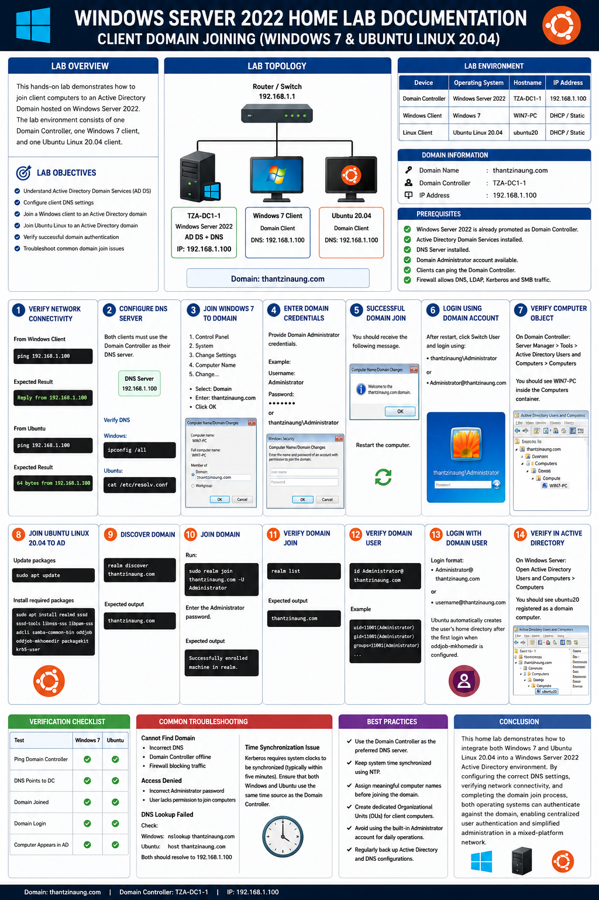
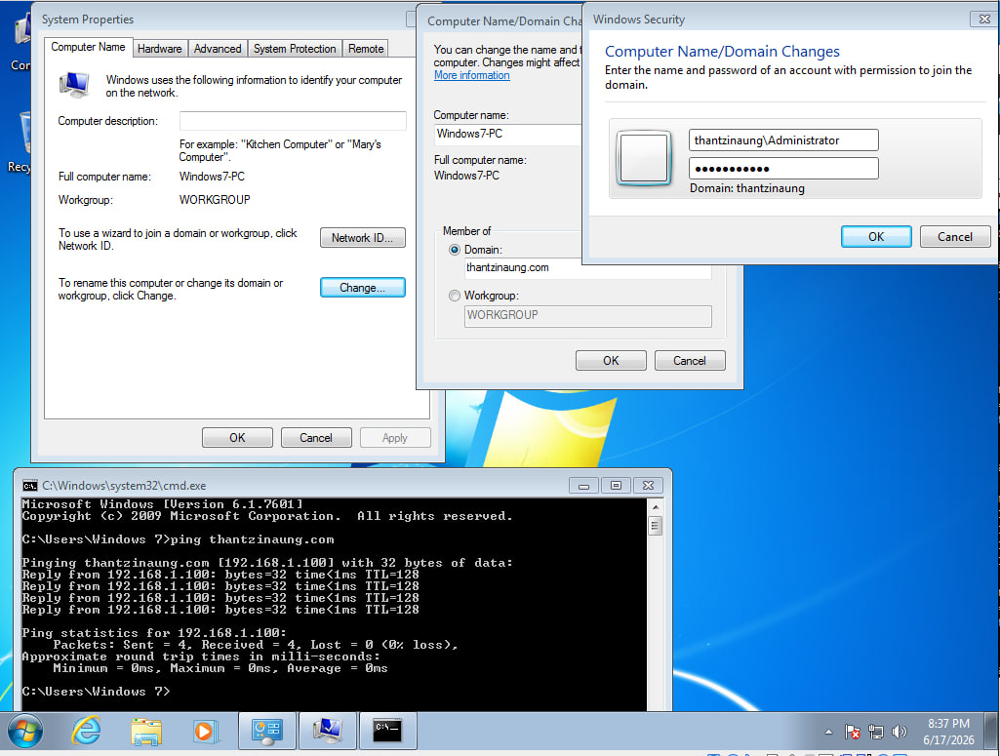
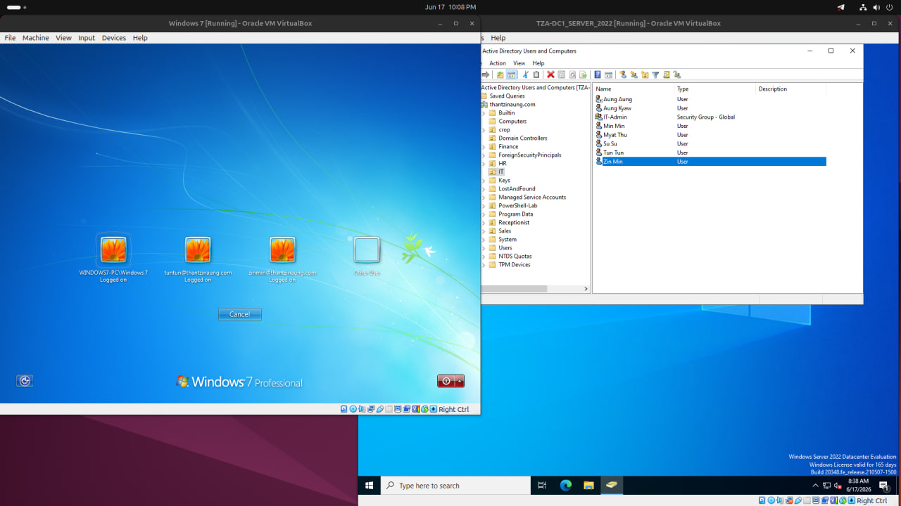
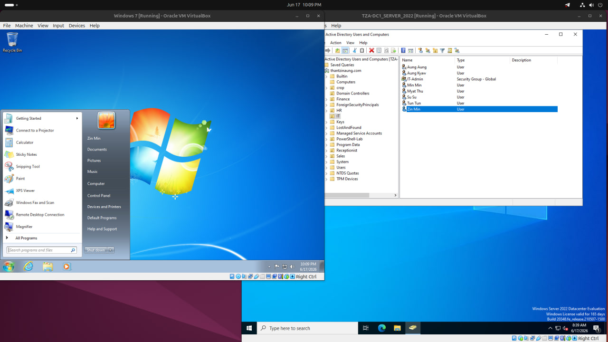
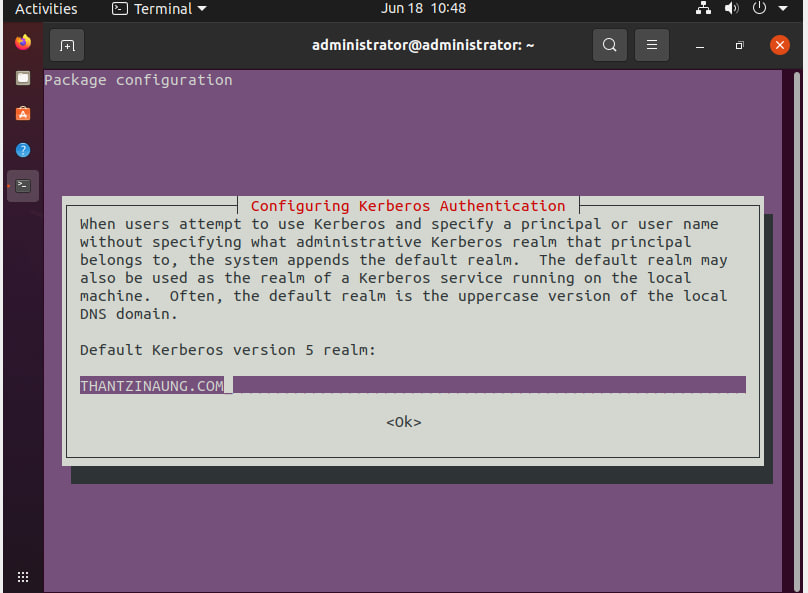
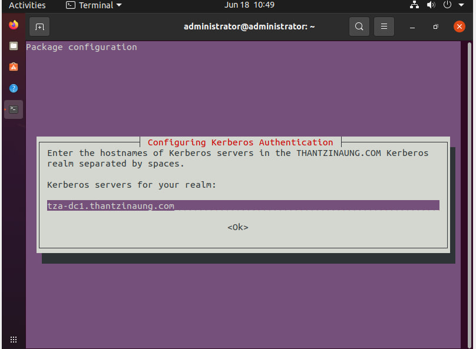
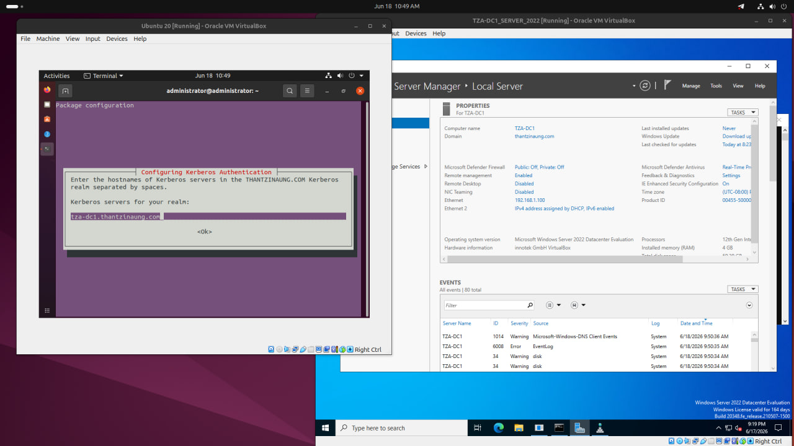
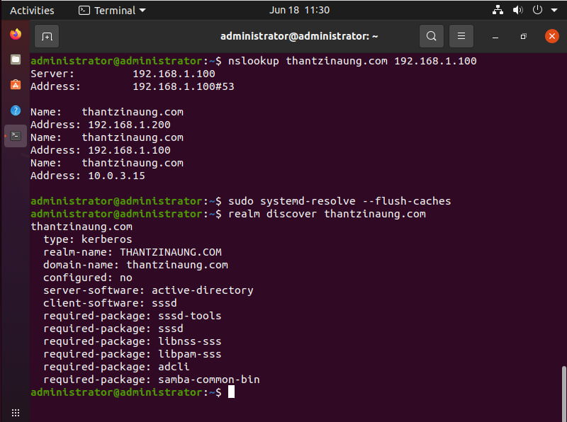
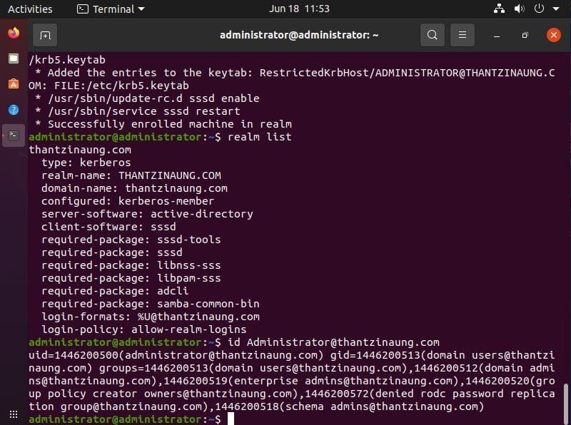
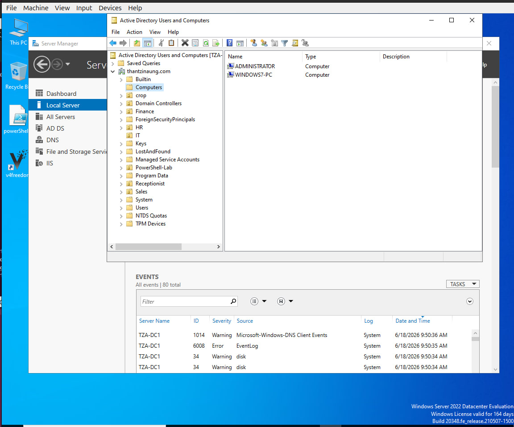
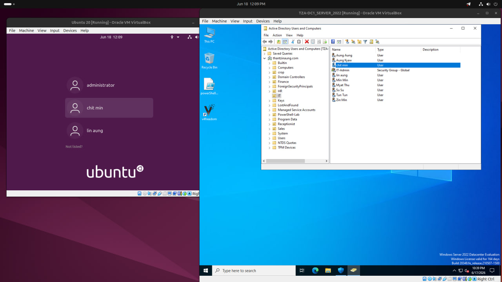
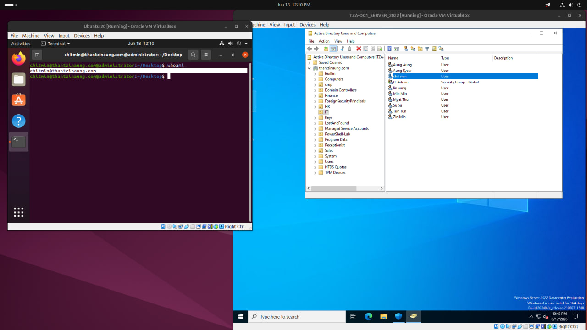
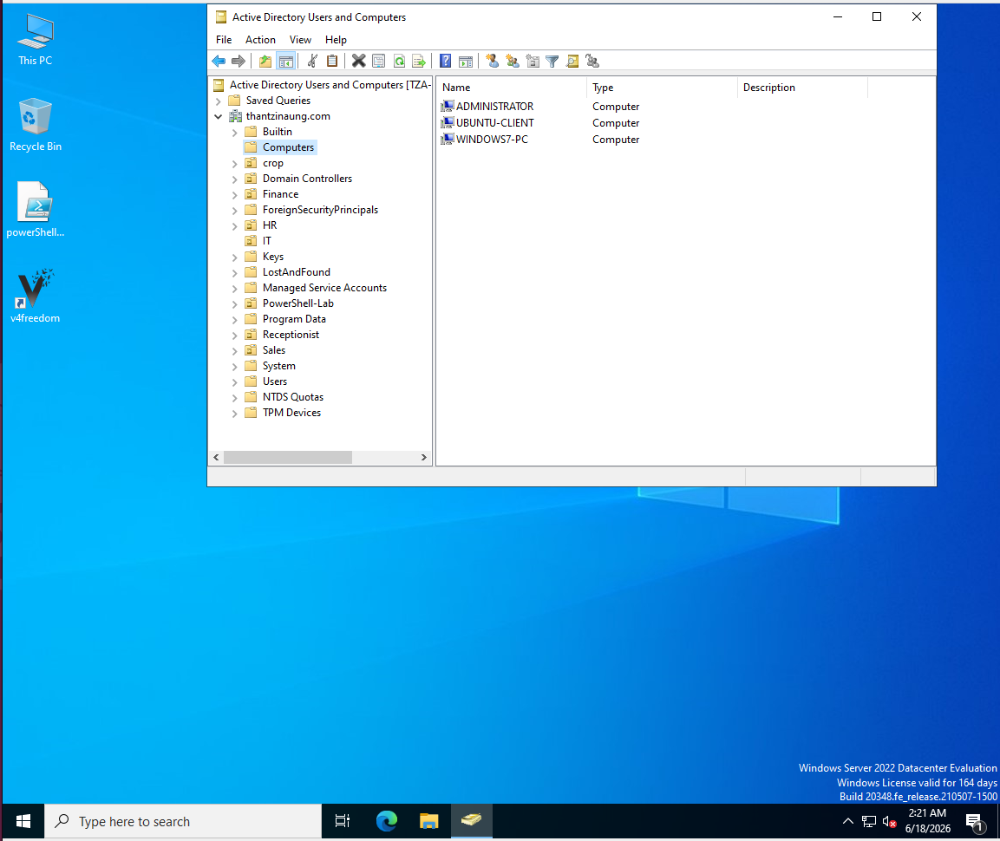


