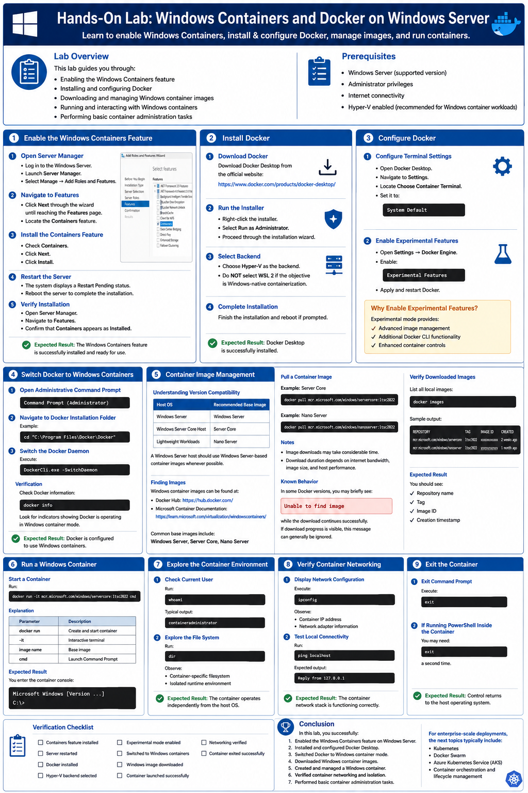

# Hands-On Lab: Windows Containers and Docker on Windows Server

## Lab Overview

This lab guides you through:

- Enabling the Windows Containers feature
- Installing and configuring Docker
- Downloading and managing Windows container images
- Running and interacting with Windows containers
- Performing basic container administration tasks

### Prerequisites

- Windows Server (supported version)
- Administrator privileges
- Internet connectivity
- Hyper-V enabled (recommended for Windows container workloads)

---

# Part 1: Enable the Windows Containers Feature

## Objective

Install the Windows Containers feature required to run Windows-based containers.

### Step 1: Open Server Manager

1. Log in to the Windows Server.
2. Launch **Server Manager**.
3. Select **Manage** → **Add Roles and Features**.

### Step 2: Navigate to Features

1. Click **Next** through the wizard until reaching the **Features** page.
2. Locate the **Containers** feature.

### Step 3: Install the Containers Feature

1. Check **Containers**.
2. Click **Next**.
3. Click **Install**.

### Step 4: Restart the Server

After installation:

- The system displays a **Restart Pending** status.
- Reboot the server to complete the installation.

### Step 5: Verify Installation

After restart:

1. Open **Server Manager**.
2. Navigate to **Features**.
3. Confirm that **Containers** appears as **Installed**.

### Expected Result

The Windows Containers feature is successfully installed and ready for use.

---

# Part 2: Install Docker

## Objective

Install Docker Desktop and configure it for Windows containers.

### Step 1: Download Docker

Download Docker Desktop from:

- Official Docker website:
  - https://www.docker.com/products/docker-desktop/

### Step 2: Run the Installer

1. Right-click the installer.
2. Select **Run as Administrator**.
3. Proceed through the installation wizard.

### Step 3: Select Backend

During installation/configuration:

- Choose **Hyper-V** as the backend.
- Do **not** select WSL 2 if the objective is Windows-native containerization.

### Step 4: Complete Installation

Finish the installation and reboot if prompted.

### Expected Result

Docker Desktop is successfully installed.

---

# Part 3: Configure Docker

## Objective

Configure Docker Desktop for Windows container workloads.

### Step 1: Configure Terminal Settings

1. Open Docker Desktop.
2. Navigate to **Settings**.
3. Locate **Choose Container Terminal**.
4. Set it to:

```text
System Default
```

### Step 2: Enable Experimental Features

1. Open:

```text
Settings → Docker Engine
```

2. Enable:

```text
Experimental Features
```

3. Apply and restart Docker.

### Why Enable Experimental Features?

Experimental mode provides:

- Advanced image management
- Additional Docker CLI functionality
- Enhanced container controls

---

# Part 4: Switch Docker to Windows Containers

## Objective

Ensure Docker uses the Windows container daemon rather than Linux containers.

### Step 1: Open Administrative Command Prompt

Launch:

```powershell
Command Prompt (Administrator)
```

### Step 2: Navigate to Docker Installation Folder

Example:

```powershell
cd "C:\Program Files\Docker\Docker"
```

### Step 3: Switch the Docker Daemon

Execute:

```powershell
DockerCli.exe -SwitchDaemon
```

### Verification

Check Docker information:

```powershell
docker info
```

Look for indicators showing Docker is operating in Windows container mode.

### Expected Result

Docker is configured to use Windows containers.

---

# Part 5: Container Image Management

## Objective

Download and manage Windows container images.

---

## Understanding Version Compatibility

### Important

The container image version must be compatible with the host operating system.

Examples:

| Host OS | Recommended Base Image |
|----------|------------------------|
| Windows Server | Windows Server |
| Windows Server Core Host | Server Core |
| Lightweight Workloads | Nano Server |

A Windows Server host should use Windows Server-based container images whenever possible.

---

## Finding Images

Windows container images can be found at:

- Docker Hub: https://hub.docker.com/
- Microsoft Container Documentation: https://learn.microsoft.com/virtualization/windowscontainers/

Common base images include:

- Windows Server
- Server Core
- Nano Server

---

## Pull a Container Image

### Example: Server Core

```powershell
docker pull mcr.microsoft.com/windows/servercore:ltsc2022
```

### Example: Nano Server

```powershell
docker pull mcr.microsoft.com/windows/nanoserver:ltsc2022
```

### Notes

- Image downloads may take considerable time.
- Download duration depends on:
  - Internet bandwidth
  - Image size
  - Host performance

### Known Behavior

In some Docker versions, you may briefly see:

```text
Unable to find image
```

while the download continues successfully.

If download progress is visible, this message can generally be ignored.

---

## Verify Downloaded Images

List all local images:

```powershell
docker images
```

Sample output:

```text
REPOSITORY                            TAG         IMAGE ID       CREATED
mcr.microsoft.com/windows/servercore  ltsc2022    xxxxxxxxxxxx   2 weeks ago
mcr.microsoft.com/windows/nanoserver  ltsc2022    yyyyyyyyyyyy   1 month ago
```

### Expected Result

You should see:

- Repository name
- Tag
- Image ID
- Creation timestamp

---

# Part 6: Run a Windows Container

## Objective

Launch and access a Windows container.

### Start a Container

Run:

```powershell
docker run -it mcr.microsoft.com/windows/servercore:ltsc2022 cmd
```

### Explanation

| Parameter | Description |
|------------|-------------|
| docker run | Create and start container |
| -it | Interactive terminal |
| image name | Base image |
| cmd | Launch Command Prompt |

### Expected Result

You enter the container console:

```text
Microsoft Windows [Version ...]
C:\>
```

---

# Part 7: Explore the Container Environment

## Objective

Understand the container's isolated environment.

### Check Current User

Run:

```powershell
whoami
```

Typical output:

```text
containeradministrator
```

### Explore the File System

Run:

```powershell
dir
```

Observe:

- Container-specific filesystem
- Isolated runtime environment

### Expected Result

The container operates independently from the host OS.

---

# Part 8: Verify Container Networking

## Objective

Inspect container networking.

### Display Network Configuration

Execute:

```powershell
ipconfig
```

Observe:

- Container IP address
- Network adapter information

### Test Local Connectivity

Run:

```powershell
ping localhost
```

Expected output:

```text
Reply from 127.0.0.1
```

### Expected Result

The container network stack is functioning correctly.

---

# Part 9: Exit the Container

## Objective

Disconnect from the running container.

### Exit Command Prompt

Execute:

```powershell
exit
```

### If Running PowerShell Inside the Container

You may need:

```powershell
exit
```

a second time.

### Expected Result

Control returns to the host operating system.

---

# Verification Checklist

| Task | Status |
|--------|--------|
| Containers feature installed | □ |
| Server restarted | □ |
| Docker installed | □ |
| Hyper-V backend selected | □ |
| Experimental mode enabled | □ |
| Switched to Windows containers | □ |
| Windows image downloaded | □ |
| Container launched successfully | □ |
| Networking verified | □ |
| Container exited successfully | □ |

---

# Conclusion

In this lab, you successfully:

1. Enabled the Windows Containers feature on Windows Server.
2. Installed and configured Docker Desktop.
3. Switched Docker to Windows container mode.
4. Downloaded Windows container images.
5. Created and managed a Windows container.
6. Verified container networking and isolation.
7. Performed basic container administration tasks.

For enterprise-scale deployments, the next topics typically include:

- Kubernetes
- Docker Swarm
- Azure Kubernetes Service (AKS)
- Container orchestration and lifecycle management

---

