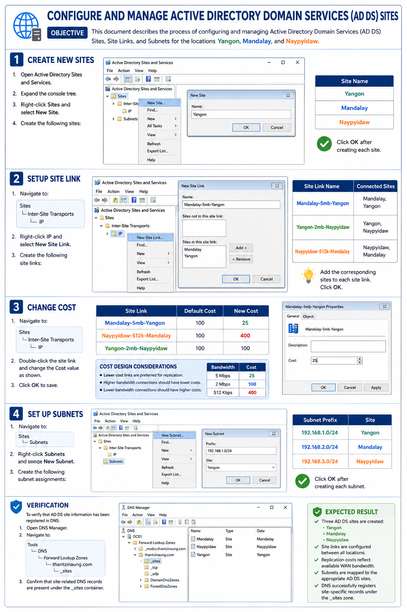
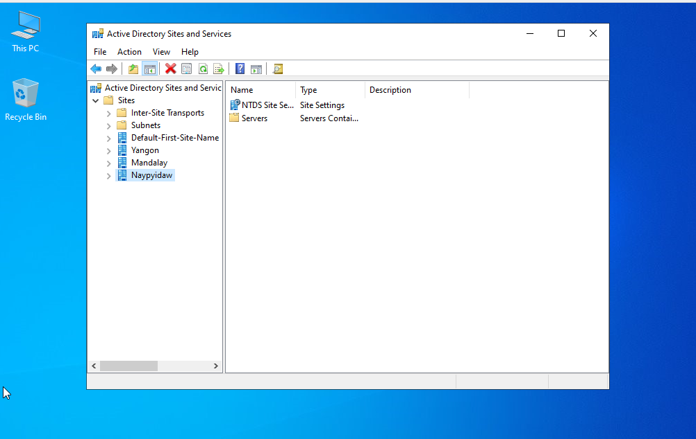
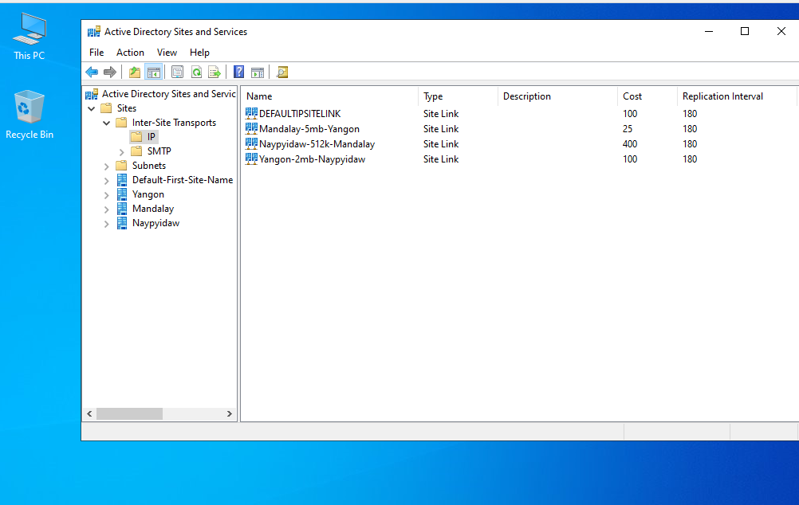
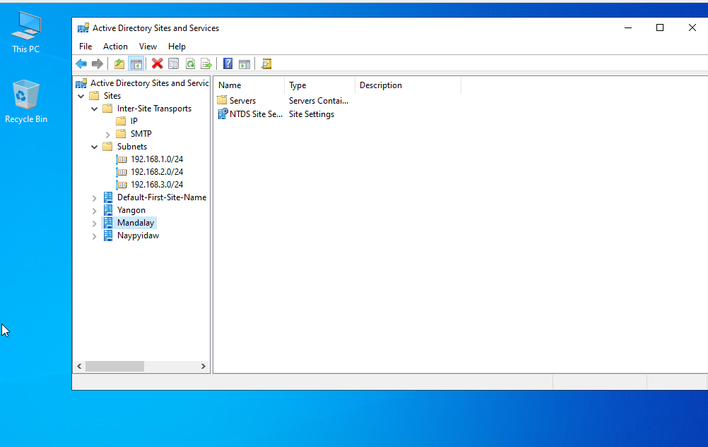

# Configure and Manage Active Directory Domain Services (AD DS) Sites

## Objective

This document describes the process of configuring and managing Active Directory Domain Services (AD DS) Sites, Site Links, and Subnets for the locations **Yangon**, **Mandalay**, and **Naypyidaw**.

---

# Step 1: Create New Sites

1. Open **Active Directory Sites and Services**.
2. Expand the console tree.
3. Right-click **Sites** and select **New Site**.
4. Create the following sites:

| Site Name |
| --------- |
| Yangon    |
| Mandalay  |
| Naypyidaw |

5. Click **OK** after creating each site.

---

# Step 2: Configure Site Links

1. Navigate to:

   ```
   Sites
      └─ Inter-Site Transports
            └─ IP
   ```

2. Right-click **IP** and select **New Site Link**.

3. Create the following site links:

| Site Link Name          | Connected Sites     |
| ----------------------- | ------------------- |
| Mandalay-5mb-Yangon     | Mandalay, Yangon    |
| Yangon-2mb-Naypyidaw    | Yangon, Naypyidaw   |
| Naypyidaw-512k-Mandalay | Naypyidaw, Mandalay |

4. Add the corresponding sites to each site link.
5. Click **OK**.

---

# Step 3: Modify Site Link Cost

1. Navigate to:

   ```
   Sites
      └─ Inter-Site Transports
            └─ IP
   ```

2. Configure the following site link costs:

| Site Link               | Default Cost | New Cost |
| ----------------------- | ------------ | -------- |
| Mandalay-5mb-Yangon     | 100          | 25       |
| Naypyidaw-512k-Mandalay | 100          | 400      |

3. Double-click the site link.
4. Change the **Cost** value as shown above.
5. Click **OK** to save the changes.

### Cost Design Considerations

* Lower cost links are preferred for replication.
* Higher bandwidth connections should have lower costs.
* Lower bandwidth connections should have higher costs.

Example:

| Bandwidth | Cost |
| --------- | ---- |
| 5 Mbps    | 25   |
| 2 Mbps    | 100  |
| 512 Kbps  | 400  |

---

# Step 4: Configure Subnets

1. Navigate to:

   ```
   Sites
      └─ Subnets
   ```

2. Right-click **Subnets** and select **New Subnet**.

3. Create the following subnet assignments:

| Subnet Prefix  | Site      |
| -------------- | --------- |
| 192.168.1.0/24 | Yangon    |
| 192.168.2.0/24 | Mandalay  |
| 192.168.3.0/24 | Naypyidaw |

4. Click **OK** after creating each subnet.

---

# Verification

To verify that AD DS site information has been registered in DNS:

1. Open **DNS Manager**.

2. Navigate to:

   ```
   Tools
      └─ DNS
          └─ Forward Lookup Zones
              └─ thantzinaung.com
                  └─ _sites
   ```

3. Confirm that site-related DNS records are present under the **_sites** container.

---

# Expected Result

After completing the configuration:

* Three AD DS sites are created:

  * Yangon
  * Mandalay
  * Naypyidaw

* Site links are configured between all locations.

* Replication costs reflect available WAN bandwidth.

* Subnets are mapped to the appropriate AD DS sites.

* DNS successfully registers site-specific records under the **_sites** zone.
----




