# Configure and Manage Forest and Domain Trust in Windows Server 2022
## Hands-on Lab Documentation

## Lab Overview

This lab demonstrates how to configure and manage a trust relationship between two separate Active Directory forests in Windows Server 2022.

## Lab Environment

| Server Name | Role | Domain Name |
|------------|------|-------------|
| TZA-DC1 | Domain Controller | thantzinaung.com |
| TZA-SVR1 | Domain Controller | hantun.com |

## Trust Relationship Type

In this lab, I will create a:

- Two-Way Forest Trust
- Authentication between both forests
- Resource sharing across forests
- Cross-forest user access

---

# Network Topology

```text
+----------------------------------+
| Forest A                         |
| Domain: thantzinaung.com         |
| Server: TZA-DC1                  |
| IP: 192.168.1.100                |
+----------------------------------+
               |
               | Forest Trust
               |
+----------------------------------+
| Forest B                         |
| Domain: hantun.com               |
| Server: TZA-SVR1                 |
| IP: 192.168.1.150                |
+----------------------------------+
```

---

# Prerequisites

Before creating the trust:

## 1. Verify Active Directory Installation

Both servers must be configured as Domain Controllers.

```powershell
Get-ADDomain
```

Expected Results:

```text
thantzinaung.com
hantun.com
```

---

## 2. Configure DNS Forwarders

Each forest must be able to resolve the other forest's DNS names.

### On TZA-DC1

Open:

```text
Server Manager
→ Tools
→ DNS
```

Right-click:

```text
DNS Server
→ Properties
→ Forwarders
→ Edit
```

Add DNS IP of hantun.com Domain Controller.

Example:

```text
192.168.1.150
```

### On TZA-SVR1

Open:

```text
DNS Manager
→ Properties
→ Forwarders
```

Add:

```text
192.168.1.100
```

---

## 3. Verify DNS Resolution

From TZA-DC1:

```powershell
nslookup hantun.com
```

From TZA-SVR1:

```powershell
nslookup thantzinaung.com
```

Expected Result:

```text
Name resolution successful
```

---

# Step 1: Open Active Directory Domains and Trusts

On TZA-DC1:

```text
Server Manager
→ Tools
→ Active Directory Domains and Trusts
```

---

# Step 2: Open Domain Properties

Right-click:

```text
thantzinaung.com
```

Select:

```text
Properties
```

Go to:

```text
Trusts Tab
```

---

# Step 3: Create New Trust

Click:

```text
New Trust
```

Trust Wizard starts.

Click:

```text
Next
```

---

# Step 4: Specify Trust Name

Enter:

```text
hantun.com
```

Click:

```text
Next
```

---

# Step 5: Select Trust Type

Choose:

```text
Forest Trust
```

Click:

```text
Next
```

---

# Step 6: Direction of Trust

Choose:

```text
Two-Way
```

### Explanation

```text
thantzinaung.com trusts hantun.com
and
hantun.com trusts thantzinaung.com
```

Click:

```text
Next
```

---

# Step 7: Sides of Trust

Choose:

```text
Both this domain and the specified domain
```

Click:

```text
Next
```

---

# Step 8: Provide Credentials

Enter Enterprise Admin credentials for:

```text
hantun.com
```

Example:

```text
Administrator
Password
```

Click:

```text
Next
```

---

# Step 9: Trust Authentication

Choose:

```text
Forest-wide Authentication
```

Recommended for lab environments.

Click:

```text
Next
```

---

# Step 10: Confirm Trust Creation

Review settings.

Click:

```text
Next
```

Then:

```text
Finish
```

---

# Step 11: Validate Trust

After trust creation:

```text
Trusts Tab
```

Select:

```text
hantun.com
```

Click:

```text
Properties
→ Validate
```

Choose:

```text
Yes, validate the incoming trust
```

Repeat for:

```text
Outgoing Trust
```

Expected Result:

```text
Trust Validation Successful
```

---

# Verify Trust Using PowerShell

Run on either Domain Controller:

```powershell
Get-ADTrust -Filter *
```

Example Output:

```text
Name                  : hantun.com
TrustType             : Forest
Direction             : Bidirectional
ForestTransitive      : True
```

---

# Step 12: Verify Trust with NLTEST

Check trust relationship:

```powershell
nltest /domain_trusts
```

Expected:

```text
thantzinaung.com
hantun.com
```

---

# Cross-Forest User Access Test

## Create Test User

### On hantun.com

```powershell
New-ADUser `
-Name "LabUser" `
-SamAccountName "LabUser" `
-Enabled $true `
-AccountPassword (ConvertTo-SecureString "P@ssw0rd123" -AsPlainText -Force)
```

---

## Grant Access on thantzinaung.com

Create a folder:

```text
C:\SharedData
```

Share:

```text
SharedData
```

### Add Permissions

```text
Properties
→ Security
→ Edit
→ Add
```

Change Location:

```text
hantun.com
```

Add:

```text
LabUser
```

Grant:

```text
Read
```

---

## Test Access

From a workstation joined to hantun.com:

```text
\\TZA-DC1\SharedData
```

Expected Result:

```text
Folder access successful
```

---

# Managing Existing Trusts

## View Trusts

```powershell
Get-ADTrust -Filter *
```

---

## Detailed Trust Information

```powershell
Get-ADTrust hantun.com | Format-List *
```

---

## Verify Secure Channel

```powershell
nltest /sc_verify:hantun.com
```

---

## Reset Trust Password

```powershell
netdom trust hantun.com /Domain:thantzinaung.com /Reset
```

---

## Disable a Trust

Open:

```text
Active Directory Domains and Trusts
→ Domain Properties
→ Trusts
```

Select trust.

```text
Properties
→ Disable
```

---

## Remove Trust

Open:

```text
Trust Properties
→ Remove
```

Or PowerShell:

```powershell
Remove-ADTrust -Identity hantun.com
```

---

# Troubleshooting

## DNS Issues

Check:

```powershell
nslookup hantun.com
nslookup thantzinaung.com
```

---

## Network Connectivity

```powershell
ping TZA-SVR1
ping TZA-DC1
```

---

## Firewall Verification

Allow the following ports:

| Service | Port |
|----------|------|
| DNS | 53 |
| Kerberos | 88 |
| RPC | 135 |
| LDAP | 389 |
| SMB | 445 |
| LDAPS | 636 |

---

## Check Replication

```powershell
repadmin /replsummary
```

---

# Best Practices

## Use Conditional Forwarders

Instead of standard forwarders:

```text
DNS Manager
→ Conditional Forwarders
```

### Benefits

- Faster name resolution
- More secure
- Easier administration

---

## Enable Selective Authentication

For production environments:

```text
Trust Properties
→ Authentication
→ Selective Authentication
```

Benefits:

- Better security
- Controlled access
- Least privilege model

---

## Monitor Trust Health

Regularly check:

```powershell
Get-ADTrust -Filter *
nltest /domain_trusts
```

---

# Conclusion

In this lab, you successfully:

- ✅ Configured DNS name resolution between forests
- ✅ Created a Two-Way Forest Trust
- ✅ Validated the trust relationship
- ✅ Tested cross-forest authentication
- ✅ Managed trust relationships using GUI and PowerShell
- ✅ Learned troubleshooting and best practices for Windows Server 2022 Active Directory Trusts

This configuration allows users and resources in **thantzinaung.com** and **hantun.com** to securely authenticate and share resources across both forests while maintaining separate administrative boundaries.

---

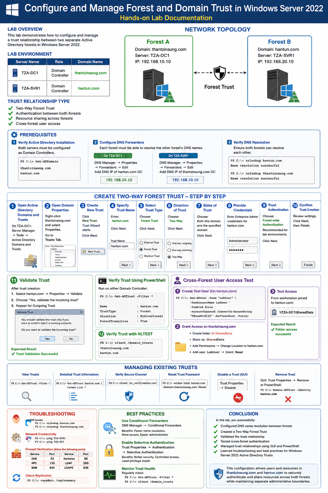
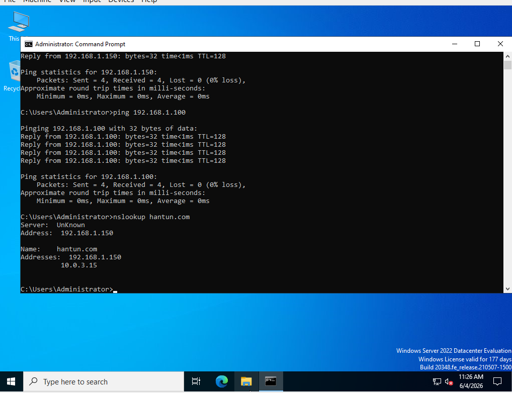
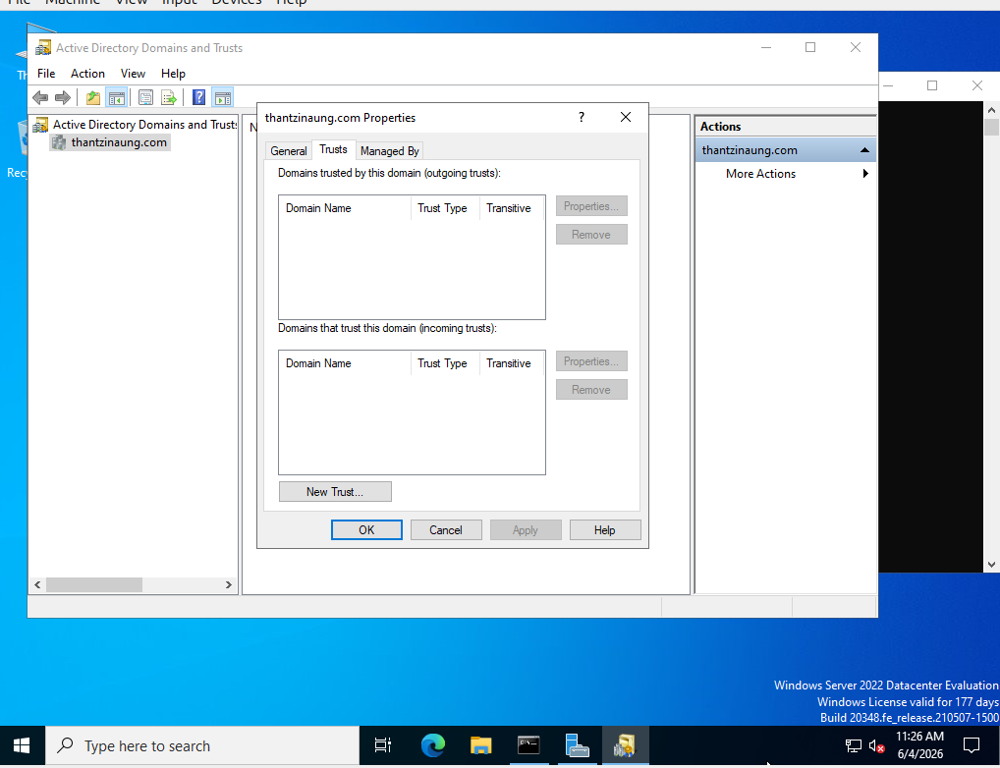
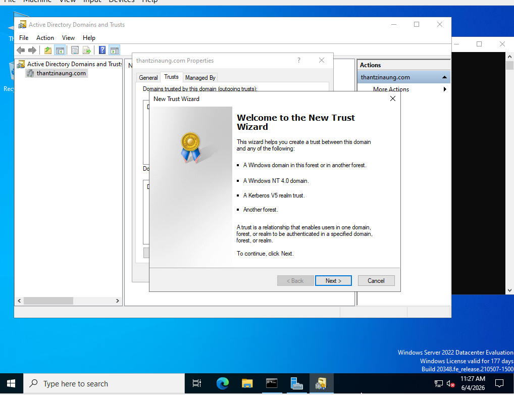
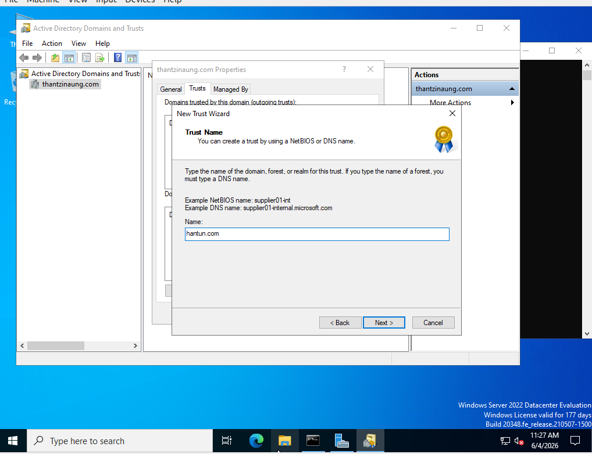

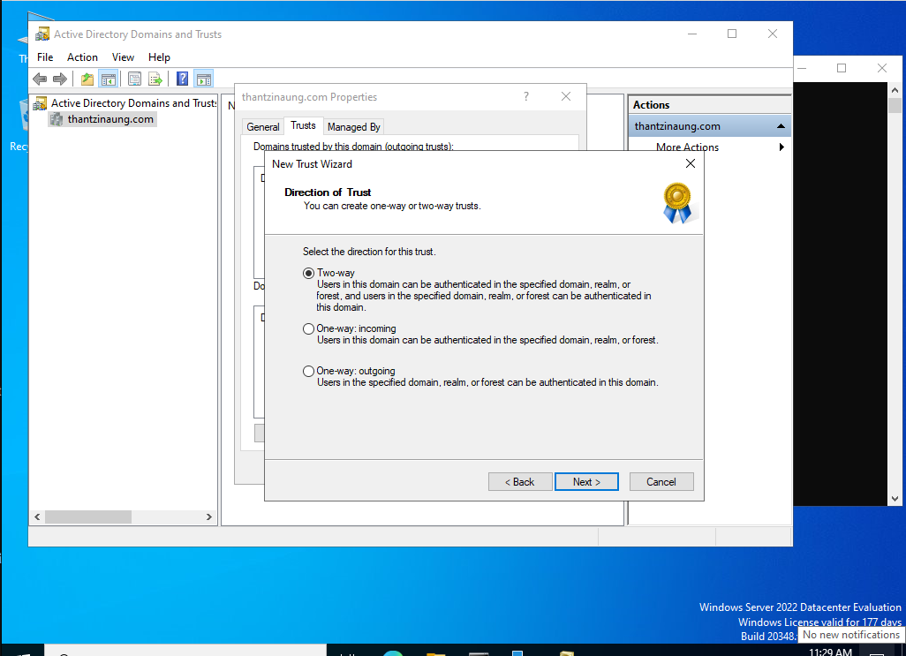
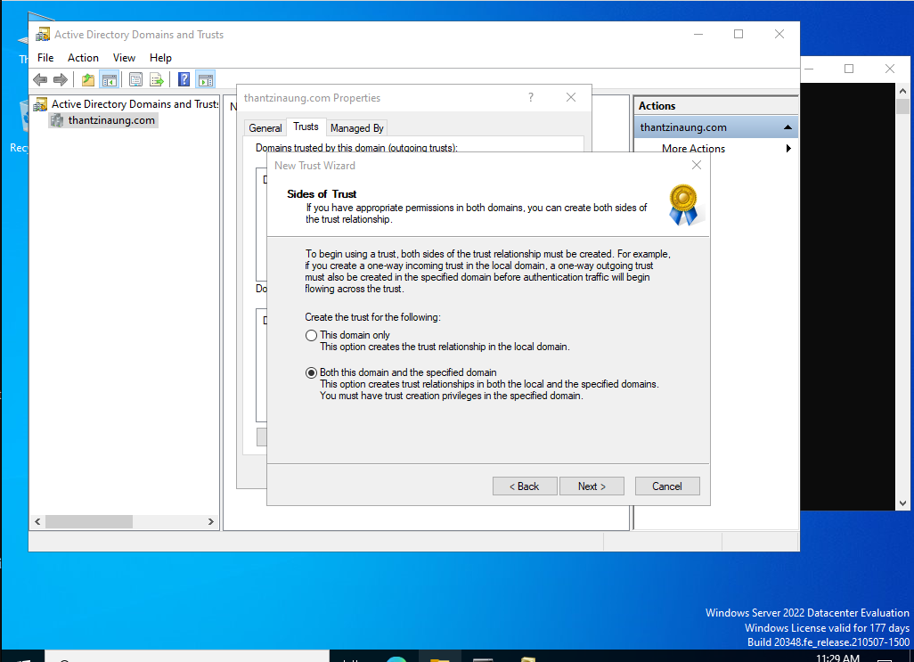
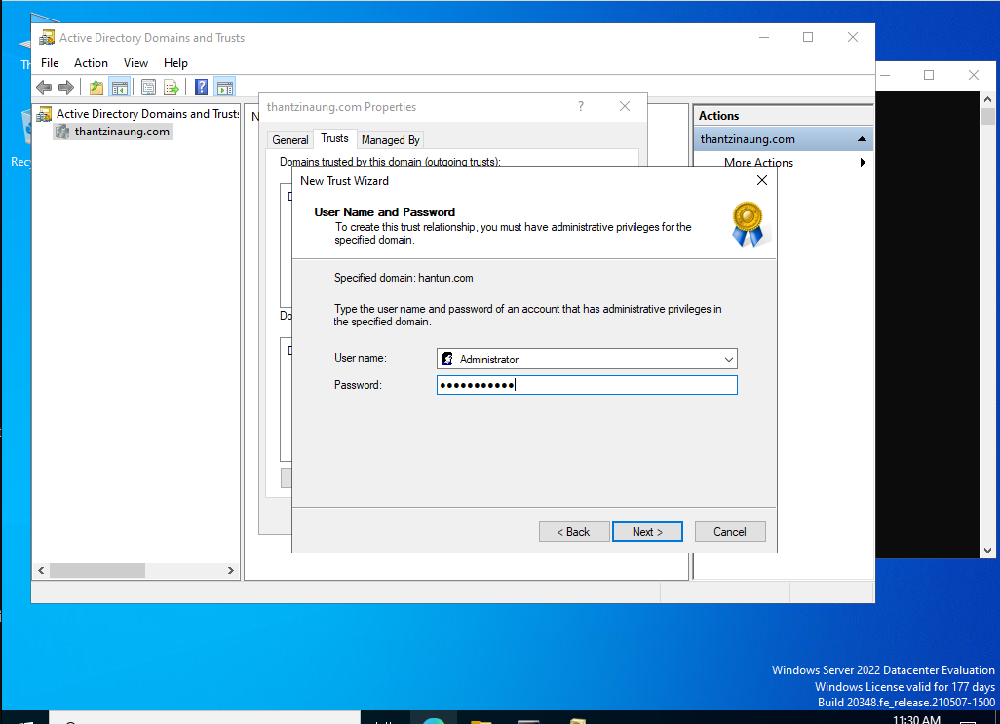
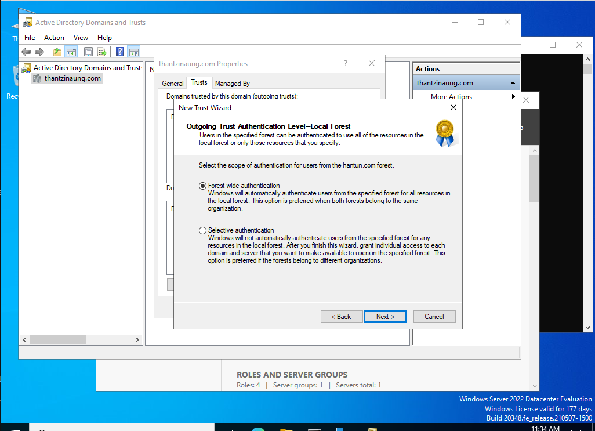
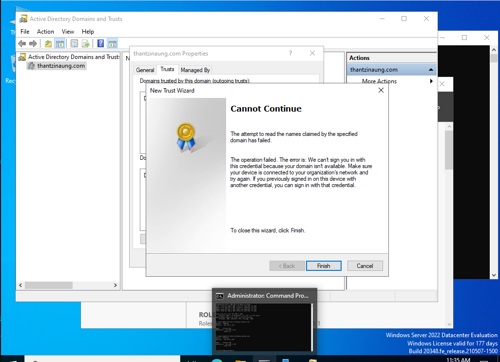
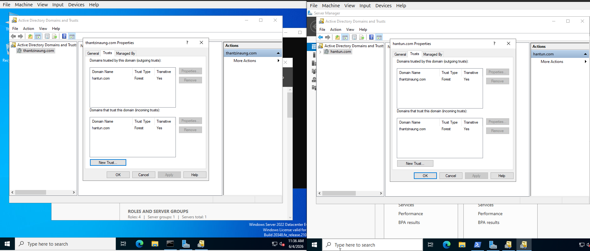
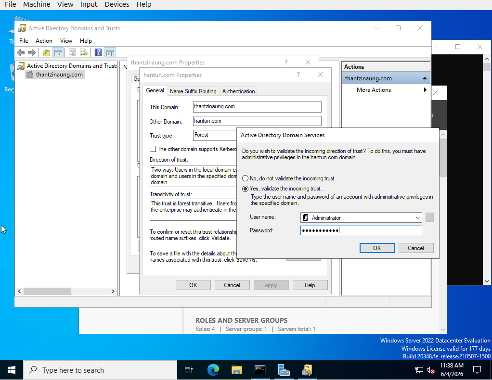
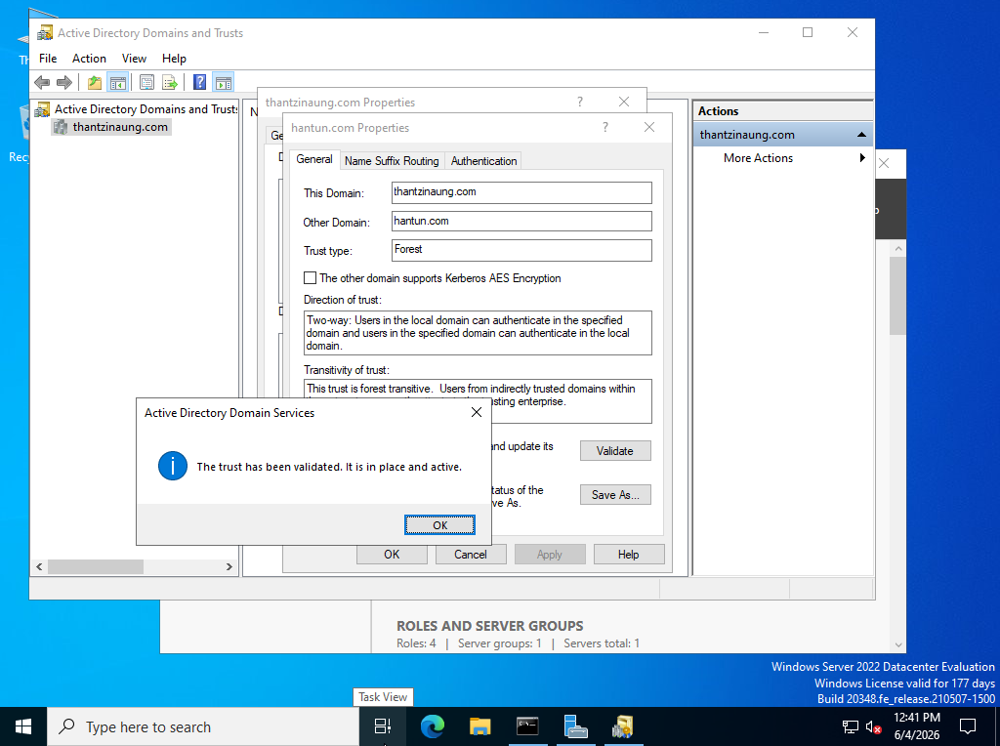
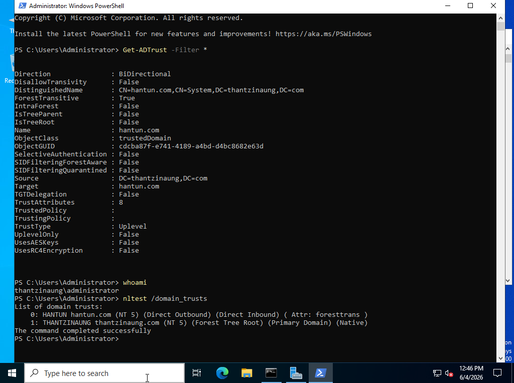
