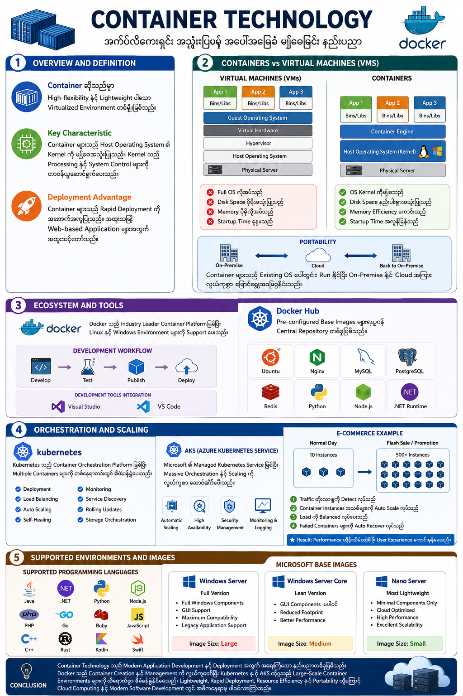

# Container Technology Documentation (မြန်မာဘာသာ)

## 1. Container Technology Overview and Definition

### Container ဆိုသည်မှာ အဘယ်နည်း

Container ဆိုသည်မှာ Application များကို လွယ်ကူစွာ တည်ဆောက်ခြင်း၊ စမ်းသပ်ခြင်း၊ Deploy ပြုလုပ်ခြင်းနှင့် စီမံခန့်ခွဲခြင်းအတွက် အသုံးပြုသော Lightweight Virtualized Environment တစ်မျိုးဖြစ်သည်။

Traditional Virtual Machine (VM) များနှင့် နှိုင်းယှဉ်ပါက Container များသည် ပိုမိုပေါ့ပါးပြီး လုပ်ဆောင်မှုမြန်ဆန်ကာ Resource အသုံးပြုမှုလည်း ထိရောက်သည်။

### Container ၏ အဓိက လက္ခဏာများ

Container များသည် Host Operating System ၏ Kernel ကို မျှဝေအသုံးပြုကြသည်။ Kernel သည် System Processing, Memory Management နှင့် System Control များကို တာဝန်ယူဆောင်ရွက်ပေးသည်။

ထို့ကြောင့် Container များသည် သီးခြား Operating System တစ်ခုစီ မလိုအပ်ဘဲ Application များကို သီးခြား Environment များအဖြစ် လုပ်ဆောင်နိုင်သည်။

### Deployment အားသာချက်

Container Technology ၏ အဓိကအားသာချက်မှာ Rapid Deployment ဖြစ်သည်။

* Application များကို စက္ကန့်ပိုင်းအတွင်း Deploy ပြုလုပ်နိုင်သည်
* Web-based Applications များအတွက် အထူးသင့်တော်သည်
* Development မှ Production အထိ Environment တူညီမှုကို ထိန်းသိမ်းနိုင်သည်
* Scalability နှင့် Portability ကောင်းမွန်သည်

---

## 2. Containers vs Virtual Machines (VMs)

### Virtual Machine (VM)

Virtual Machine တစ်ခုတွင် အောက်ပါ Components များ ပါဝင်သည်။

* Guest Operating System
* Application
* Required Libraries
* Virtual Hardware

VM တစ်ခုချင်းစီအတွက် Operating System အပြည့်အစုံ လိုအပ်သောကြောင့် -

* Disk Space ပိုမိုအသုံးပြုရသည်
* Memory ပိုမိုလိုအပ်သည်
* Startup Time နှေးကွေးသည်

### Container

Container တစ်ခုတွင် အောက်ပါ Components များသာ ပါဝင်သည်။

* Application Files
* Required Libraries
* Specific DLL/System Files
* Runtime Dependencies

Container များသည် Host OS Kernel ကို Share လုပ်အသုံးပြုသောကြောင့် -

* Disk Space နည်းပါးစွာ အသုံးပြုသည်
* Memory Efficiency ကောင်းသည်
* Startup Time အလွန်မြန်သည်
* Resource Utilization ပိုမိုကောင်းမွန်သည်

### Portability

Container Technology ၏ အရေးကြီးသော အားသာချက်တစ်ခုမှာ Portability ဖြစ်သည်။

Container များသည် Existing Operating System ပေါ်တွင် Run နိုင်ပြီး -

* On-Premise Data Center မှ Cloud သို့ ပြောင်းရွှေ့နိုင်သည်
* Cloud မှ On-Premise သို့ ပြန်လည်ပြောင်းရွှေ့နိုင်သည်
* Environment မပြောင်းလဲဘဲ Platform အမျိုးမျိုးတွင် အသုံးပြုနိုင်သည်

ဥပမာ -

* Development Machine
* Testing Environment
* Production Server
* Cloud Infrastructure

အားလုံးတွင် Container Image တစ်ခုတည်းကို အသုံးပြုနိုင်သည်။

---

## 3. Container Ecosystem and Tools

### Docker

Docker သည် ယနေ့ခေတ် Container Technology လောကတွင် Industry Leader အဖြစ် အသိအမှတ်ပြုခံထားရသော Platform ဖြစ်သည်။

Docker သည် -

* Linux Environment တွင် Support ပေးသည်
* Windows Environment တွင် Support ပေးသည်
* Container Creation ကို လွယ်ကူစေသည်
* Container Management ကို ထိရောက်စေသည်

### Docker Development Workflow

Docker ၏ အဓိက Workflow များမှာ -

#### 1. Develop

Application များကို Container Environment အတွင်း Develop ပြုလုပ်ခြင်း

#### 2. Test

Containerized Application များကို Testing ပြုလုပ်ခြင်း

#### 3. Publish

Container Images များကို Repository များသို့ Publish ပြုလုပ်ခြင်း

#### 4. Deploy

Production Environment သို့ Deploy ပြုလုပ်ခြင်း

### Development Tools Integration

Docker သည် Development Tools များနှင့် Integration ကောင်းမွန်စွာ လုပ်ဆောင်နိုင်သည်။

* Microsoft Visual Studio
* Visual Studio Code

စသော Tools များနှင့် တိုက်ရိုက်ချိတ်ဆက်အသုံးပြုနိုင်သည်။

### Docker Hub

Docker Hub သည် Container Images များကို မျှဝေရန်နှင့် Download ပြုလုပ်ရန် အသုံးပြုသော Central Repository ဖြစ်သည်။

Docker Hub တွင် -

* Pre-configured Base Images များ
* Operating System Images များ
* Database Images များ
* Web Server Images များ
* Programming Runtime Images များ

ကို ရယူအသုံးပြုနိုင်သည်။

ဥပမာ -

* Ubuntu
* Nginx
* MySQL
* PostgreSQL
* Redis
* Python Runtime
* Node.js Runtime

---

## 4. Orchestration and Scaling

### Kubernetes

Kubernetes သည် Container Orchestration Platform ဖြစ်သည်။

Container အနည်းငယ်ကို စီမံခန့်ခွဲရန် Docker လုံလောက်သော်လည်း Container ရာနှင့်ချီ၊ ထောင်နှင့်ချီလာသောအခါ Kubernetes လိုအပ်လာသည်။

Kubernetes ၏ အဓိကတာဝန်များ -

* Container Deployment
* Load Balancing
* Auto Scaling
* Self-Healing
* Monitoring
* Service Discovery

### Azure Kubernetes Service (AKS)

Azure Kubernetes Service သည် Microsoft မှ ပံ့ပိုးပေးသော Managed Kubernetes Service ဖြစ်သည်။

AKS ၏ အားသာချက်များ -

* Massive Container Orchestration
* Automatic Scaling
* High Availability
* Security Management
* Monitoring and Logging
* Reduced Operational Overhead

### E-Commerce Website Example

E-Commerce Website တစ်ခုကို စဉ်းစားကြည့်ပါ။

ပုံမှန်နေ့များတွင် -

* Web Service Instances = 10

Promotion Campaign သို့မဟုတ် Flash Sale အချိန်တွင် -

* Web Service Instances = 500+
* Concurrent Users = သိန်းနှင့်ချီ

ဖြစ်လာနိုင်သည်။

AKS သည် -

1. Traffic တိုးလာမှုကို Detect လုပ်သည်
2. Container Instances အသစ်များကို Auto Scale လုပ်သည်
3. Load ကို Balanced လုပ်ပေးသည်
4. Failed Containers များကို Auto Recover လုပ်သည်

ထို့ကြောင့် Website Performance ကို ထိန်းသိမ်းထားနိုင်သည်။

---

## 5. Supported Environments and Images

### Supported Programming Languages

Container Technology သည် Programming Language အမျိုးမျိုးကို Support ပေးသည်။

* Java
* .NET
* Python
* Node.js
* PHP
* Go
* Ruby
* JavaScript
* C++
* Rust

စသော Languages များကို Container Environment တွင် Run နိုင်သည်။

### Microsoft Base Images

Microsoft Container Ecosystem တွင် အဓိက Base Images သုံးမျိုးရှိသည်။

### 1. Windows Server

Windows Server Base Image သည် Full Version ဖြစ်သည်။

Features:

* Full Windows Components
* GUI Support
* Maximum Compatibility
* Legacy Application Support

Advantages:

* Feature အပြည့်အစုံ ပါဝင်သည်
* Compatibility အကောင်းဆုံး ဖြစ်သည်

Disadvantages:

* Image Size ကြီးမားသည်
* Resource ပိုမိုလိုအပ်သည်

### 2. Windows Server Core

Windows Server Core သည် Windows Server ထက် ပိုမိုပေါ့ပါးသော Version ဖြစ်သည်။

Features:

* GUI Components အများစု မပါဝင်
* Reduced Footprint
* Better Performance

Advantages:

* Smaller Image Size
* Faster Deployment
* Better Resource Utilization

### 3. Nano Server

Nano Server သည် အပေါ့ပါးဆုံး Windows Base Image ဖြစ်သည်။

Features:

* Minimal Components Only
* Cloud Optimized
* Container Optimized
* High Performance

Advantages:

* Smallest Image Size
* Fastest Startup Time
* Optimized Processing Power
* Excellent Scalability

Nano Server သည် Modern Cloud-Native Applications နှင့် Microservices Architecture များအတွက် အထူးသင့်တော်သည်။

---

## Conclusion

Container Technology သည် Modern Application Development နှင့် Deployment အတွက် အရေးကြီးသော နည်းပညာတစ်ခုဖြစ်သည်။

Docker သည် Container Creation နှင့် Management ကို လွယ်ကူစေပြီး Kubernetes နှင့် AKS တို့သည် Large-Scale Container Environments များကို ထိရောက်စွာ စီမံခန့်ခွဲနိုင်စေသည်။

Container များ၏ Lightweight Architecture, Rapid Deployment, Resource Efficiency နှင့် Portability တို့ကြောင့် Cloud Computing နှင့် Modern Software Development တွင် အဓိကနေရာမှ ပါဝင်လာကြသည်။

---

