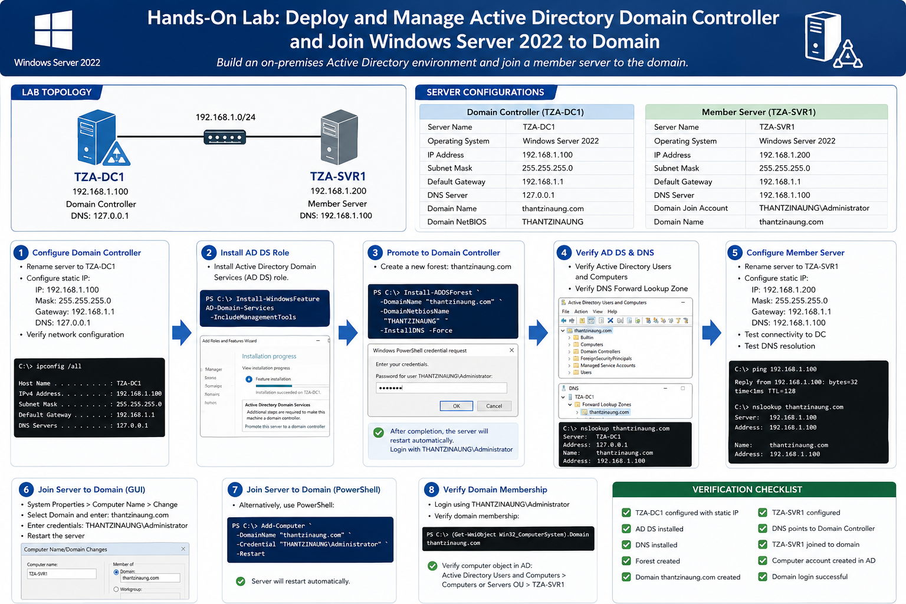
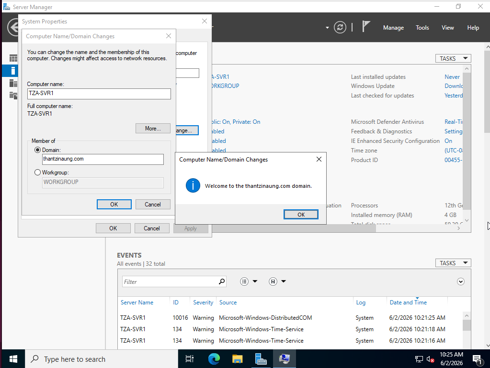
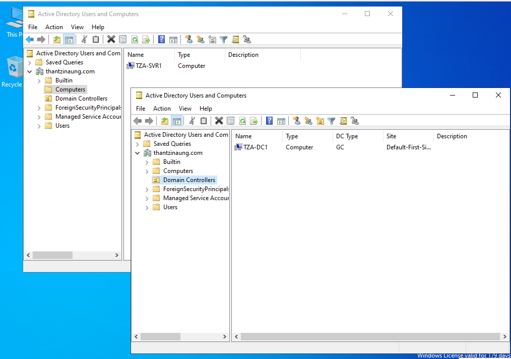

# Deploy and Manage Active Directory Domain Controller and Join Windows Server 2022 to Domain

## Lab Overview

This lab demonstrates how to:

* Configure a Windows Server 2022 Domain Controller
* Install Active Directory Domain Services (AD DS)
* Create a new forest and domain
* Verify Active Directory functionality
* Configure a member server
* Join a Windows Server 2022 server to the domain
* Validate domain membership

---

# Lab Environment

## Domain Controller

| Configuration    | Value               |
| ---------------- | ------------------- |
| Server Name      | TZA-DC1             |
| Operating System | Windows Server 2022 |
| IP Address       | 192.168.1.100       |
| Subnet Mask      | 255.255.255.0       |
| DNS Server       | 127.0.0.1           |
| Domain Name      | thantzinaung.com    |

## Member Server

| Configuration       | Value                      |
| ------------------- | -------------------------- |
| Server Name         | TZA-SVR1                   |
| Operating System    | Windows Server 2022        |
| IP Address          | 192.168.1.200              |
| Subnet Mask         | 255.255.255.0              |
| DNS Server          | 192.168.1.100              |
| Domain Join Account | THANTZINAUNG\Administrator |

---

# Exercise 1: Configure the Domain Controller

## Step 1: Rename the Server

1. Open **Server Manager**.
2. Click **Local Server**.
3. Click the current computer name.
4. Select **Change**.
5. Enter:

```
TZA-DC1
```

6. Click **OK**.
7. Restart the server.

---

## Step 2: Configure Static IP Address

1. Open:

```
Control Panel → Network and Internet → Network Connections
```

2. Right-click Ethernet Adapter.
3. Select **Properties**.
4. Select:

```
Internet Protocol Version 4 (TCP/IPv4)
```

5. Click **Properties**.

Configure:

```
IP Address : 192.168.1.100
Subnet Mask: 255.255.255.0
Default Gateway: 192.168.1.1

Preferred DNS Server: 127.0.0.1
```

6. Click **OK**.

---

## Step 3: Verify Network Configuration

Open Command Prompt and run:

```cmd
ipconfig /all
```

Verify:

```text
Hostname : TZA-DC1
IP       : 192.168.1.100
DNS      : 127.0.0.1
```

---

# Exercise 2: Install Active Directory Domain Services

## Step 1: Install AD DS Role

Open PowerShell as Administrator:

```powershell
Install-WindowsFeature AD-Domain-Services -IncludeManagementTools
```

Verify installation:

```powershell
Get-WindowsFeature AD-Domain-Services
```

Expected result:

```text
[X] Active Directory Domain Services
```

---

# Exercise 3: Promote Server to Domain Controller

## Step 1: Create New Forest

Open PowerShell:

```powershell
Install-ADDSForest `
-DomainName "thantzinaung.com" `
-DomainNetbiosName "THANTZINAUNG" `
-InstallDNS `
-Force
```

When prompted:

```text
Directory Services Restore Mode (DSRM) Password
```

Enter a strong password.

---

## Step 2: Automatic Restart

After promotion completes:

```text
Server will restart automatically.
```

Login using:

```text
THANTZINAUNG\Administrator
```

---

# Exercise 4: Verify Active Directory Installation

## Step 1: Open Active Directory Users and Computers

Launch:

```text
Server Manager
→ Tools
→ Active Directory Users and Computers
```

Verify:

```text
thantzinaung.com
```

appears in the console.

---

## Step 2: Verify DNS

Launch:

```text
Server Manager
→ Tools
→ DNS
```

Verify Forward Lookup Zone:

```text
thantzinaung.com
```

exists.

---

## Step 3: Test DNS Resolution

Open Command Prompt:

```cmd
nslookup
```

Expected:

```text
Server: TZA-DC1
Address: 127.0.0.1
```

Test:

```cmd
nslookup thantzinaung.com
```

Expected:

```text
Name: thantzinaung.com
Address: 192.168.1.100
```

---

# Exercise 5: Configure Member Server

## Step 1: Rename Server

Change computer name to:

```text
TZA-SVR1
```

Restart the server.

---

## Step 2: Configure Static IP Address

Configure:

```text
IP Address : 192.168.1.200
Subnet Mask: 255.255.255.0
Default Gateway: 192.168.1.1

Preferred DNS Server: 192.168.1.100
```

Important:

```text
Do NOT use 127.0.0.1 on the member server.
The DNS server must point to the Domain Controller.
```

---

## Step 3: Verify Connectivity

Ping Domain Controller:

```cmd
ping 192.168.1.100
```

Ping Domain Name:

```cmd
ping thantzinaung.com
```

Verify DNS:

```cmd
nslookup thantzinaung.com
```

Expected:

```text
192.168.1.100
```

---

# Exercise 6: Join TZA-SVR1 to Domain

## Method 1: GUI

### Step 1

Open:

```text
Server Manager
→ Local Server
→ Computer Name
→ Change
```

### Step 2

Select:

```text
Domain
```

Enter:

```text
thantzinaung.com
```

Click **OK**.

---

### Step 3

Enter Domain Credentials:

```text
Username:
THANTZINAUNG\Administrator

Password:
********
```

Click **OK**.

---

### Step 4

Expected Message:

```text
Welcome to the thantzinaung.com domain.
```

Restart the server.

---

# Exercise 7: Join Domain Using PowerShell

Alternatively:

```powershell
Add-Computer `
-DomainName "thantzinaung.com" `
-Credential "THANTZINAUNG\Administrator" `
-Restart
```

Enter password when prompted.

Server automatically restarts.

---

# Exercise 8: Verify Domain Membership

After reboot:

Login using:

```text
THANTZINAUNG\Administrator
```

---

## Verify Computer Object

On TZA-DC1:

Open:

```text
Active Directory Users and Computers
```

Navigate:

```text
Computers
```

Verify:

```text
TZA-SVR1
```

exists.

---

## Verify Domain Membership via PowerShell

Run:

```powershell
(Get-WmiObject Win32_ComputerSystem).Domain
```

Expected:

```text
thantzinaung.com
```

---

# Exercise 9: Basic Domain Administration

## Create Organizational Unit (OU)

Open:

```text
Active Directory Users and Computers
```

Right-click domain:

```text
thantzinaung.com
```

Select:

```text
New → Organizational Unit
```

Create:

```text
Servers
Users
Groups
```

---

## Create Test User

Navigate to:

```text
Users OU
```

Create:

```text
Username: testuser
UPN: testuser@thantzinaung.com
```

Set password and enable account.

---

## Move Server to OU

Move:

```text
TZA-SVR1
```

from:

```text
Computers
```

to:

```text
Servers OU
```

---


# Lab Summary

In this lab you successfully:

* Installed Active Directory Domain Services
* Deployed a Domain Controller named TZA-DC1
* Created the domain thantzinaung.com
* Installed and configured DNS
* Configured a member server named TZA-SVR1
* Joined the server to the Active Directory domain
* Verified domain functionality
* Performed basic Active Directory administration tasks

---



