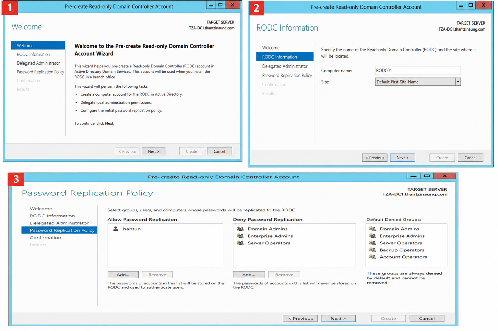
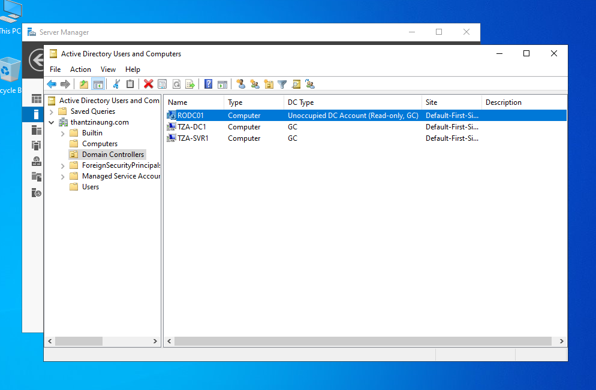
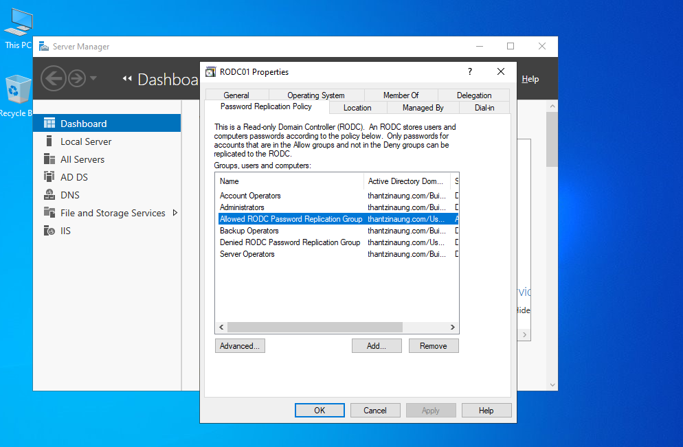
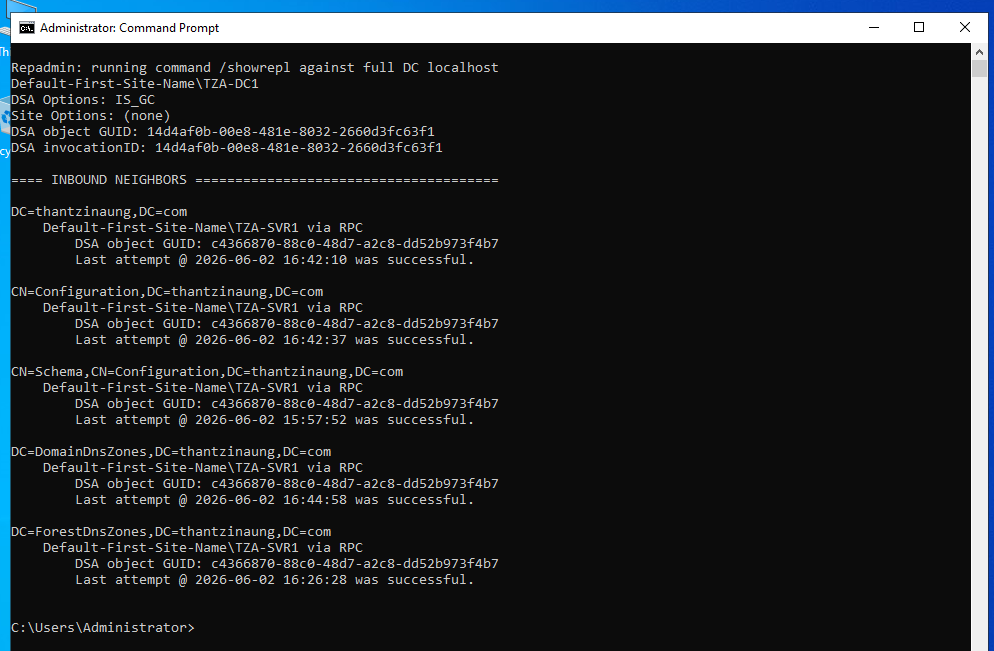

# Deploy Read-Only Domain Controller (RODC) by Using GUI: Hands-On Lab

## Lab Overview

This lab demonstrates how to deploy an Additional Domain Controller (ADC) in an existing Active Directory domain using the graphical user interface (GUI). The lab covers:

1. Direct Installation of an Additional Domain Controller
2. Pre-Staging a Domain Controller Account
3. Configuring Password Replication Policy (PRP)

---

# Lab Objectives

* Deploy an additional domain controller using Server Manager.
* Pre-stage a domain controller account in Active Directory.
* Promote a server using a pre-staged account.
* Configure Password Replication Policy for a Read-Only Domain Controller (RODC).
* Verify Active Directory replication and authentication settings.

---

# Lab Environment

| Server | Role                       | Example Name      |
| ------ | -------------------------- | ----------------- |
| TZA-DC1   | Existing Domain Controller | TZA-DC1.thantzinaung.com  |
| TZA-SVR1  | New Server to Promote      | TZA-SVR1.thantzinaung.com |
| Domain | Active Directory Domain    | thantzinaung.com       |

### Requirements

* Windows Server installed on SRV02
* Static IP configured
* SRV02 joined to the domain
* Enterprise Admin or Domain Admin credentials
* DNS resolution functioning properly

---

# Direct Installation of an Additional Domain Controller

## Task 1: Verify Prerequisites

1. Log on to SVR01.

2. Verify network connectivity:

   ```
   ping TZA-DC1.thantzinaung.com
   nslookup thantzinaung.com
   ```

3. Confirm the server is joined to the domain.

---

## Task 2: Install Active Directory Domain Services

1. Open **Server Manager**.

2. Select **Manage** → **Add Roles and Features**.

3. Click **Next** until the **Server Roles** page.

4. Select:

   * Active Directory Domain Services

5. Click **Add Features**.

6. Continue through the wizard.

7. Click **Install**.

8. Wait for installation to complete.

---

## Task 3: Promote the Server to a Domain Controller

1. In Server Manager, click the notification flag.

2. Select:

   **Promote this server to a domain controller**

3. Select:

   **Add a domain controller to an existing domain**

4. Enter:

   ```
   Domain: thantzinaung.com
   ```

5. Provide Domain Admin credentials.

6. Click **Next**.

---

## Task 4: Configure Domain Controller Options

1. Select:

   * Domain Name System (DNS) Server
   * Global Catalog (GC)

2. Leave:

   * Read Only Domain Controller (RODC) unchecked

3. Enter Directory Services Restore Mode (DSRM) password.

4. Click **Next**.

---

## Task 5: Complete the Promotion

1. Accept default DNS options.

2. Select replication source.

3. Specify database locations or accept defaults:

   ```
   NTDS Database
   Log Files
   SYSVOL
   ```

4. Review settings.

5. Click **Install**.

The server automatically reboots after promotion.

---

## Task 6: Verify the Installation

Open:

### Active Directory Users and Computers

Verify:

```
Domain Controllers OU
```

contains:

* DC01
* SRV02

### Verify Replication

Run:

```cmd
repadmin /replsummary
```

Expected result:

```
No replication errors.
```

---

# Exercise 2: Pre-Staging a Domain Controller Account

## Scenario

An administrator prepares an RODC account before the server is deployed to a branch office. 

---

## Task 1: Create a Pre-Staged RODC Account

Log on to DC01.

1. Open:

   **Active Directory Users and Computers**

2. Expand:

   ```
   Domain Controllers OU
   ```

3. Right-click:

   ```
   Domain Controllers
   ```

4. Select:

   **Pre-create Read-only Domain Controller Account**

5. Click **Next**.

---

## Task 2: Specify RODC Information

Enter:

| Setting       | Example                 |
| ------------- | ----------------------- |
| Computer Name | RODC01                  |
| Site          | Default-First-Site-Name |

Click **Next**.

---

## Task 3: Delegate Local Administration

(Optional)

Specify a user or group that will administer the RODC locally.

set > type - administrator > chename

Example:
```
THANTZINAUNG\Administrator
```

Click **Next**.

---

## Task 4: Configure Initial Password Replication Settings

Select:

### Allow Password Replication

Examples:

```
hantun
```

### Deny Password Replication

Examples:

```
Domain Admins
Enterprise Admins
Server Operators
```

Click **Next**.

Review configuration and click **Finish**.

---

## Task 5: Verify the Pre-Staged Account

In Active Directory Users and Computers:

Navigate to:

```
Domain Controllers OU
```

Verify:

```
RODC01
```

appears as a pre-created RODC account.

---

# Exercise 3: Promote the Server Using a Pre-Staged Account

## Task 1: Install AD DS Role

On RODC01:

1. Open Server Manager.

2. Install:

   ```
   Active Directory Domain Services
   ```

3. Wait for installation to complete.

---

## Task 2: Use Existing Pre-Staged Account

1. Click:

   **Promote this server to a domain controller**

2. Select:

   ```
   Add a domain controller to an existing domain
   ```

3. Choose:

   ```
   Use existing RODC account
   ```

4. Enter delegated credentials if required.

5. Click **Next**.

---

## Task 3: Complete Promotion

1. Enter DSRM password.
2. Review settings.
3. Click **Install**.
4. Allow server reboot.

---

## Task 4: Validate RODC Installation

Open:

### Active Directory Sites and Services

Verify:

* RODC appears in the correct site.
* NTDS Settings object exists.

Verify replication:

```cmd
repadmin /showrepl
```

---

# Exercise 4: Configure Password Replication Policy (PRP)

## Overview

Password Replication Policy determines which user and computer passwords may be cached on an RODC.

Caching passwords locally improves authentication performance for branch office users.

---

## Task 1: Open RODC Properties

1. Open:

   **Active Directory Users and Computers**

2. Navigate to:

   ```
   Domain Controllers OU
   ```

3. Right-click:

   ```
   RODC01
   ```

4. Select:

   **Properties**

5. Open:

   **Password Replication Policy** tab.

---

## Task 2: Review Existing Groups

Default Denied Groups include:

* Domain Admins
* Enterprise Admins
* Server Operators
* Backup Operators
* Account Operators

These accounts should never be cached on an RODC.

---

## Task 3: Allow Password Caching

Click:

```
Add
```

Select:

```
Allow passwords for the account to replicate to this RODC
```

Add:

```
hantun
```

Click **OK**.

---

## Task 4: Deny Password Caching

Add sensitive administrative groups:

```
IT Admins
Domain Admins
```

Select:

```
Deny passwords for the account to replicate to this RODC
```

Click **OK**.

---

## Task 5: View Cached Credentials

Within the Password Replication Policy tab:

Select:

```
Advanced
```

Choose:

```
Accounts Whose Passwords Are Stored On This Read-Only Domain Controller
```

Review cached credentials.

---

## Task 6: Prepopulate Password Cache

Open:

### Active Directory Users and Computers

Right-click:

```
RODC01
```

Select:

```
Replicate Passwords
```

Add users:

```
BranchUser1
BranchUser2
```

Click **OK**.

This preloads credentials into the RODC cache.

---

# Validation Tasks

## Verify Domain Controller Status

Run:

```cmd
dcdiag
```

Expected:

```
Passed all tests
```

---

## Verify Replication

Run:

```cmd
repadmin /replsummary
```

Expected:

```
0 failures
```

---

## Verify Cached Passwords

Open:

```
RODC Properties
Password Replication Policy
Advanced
```

Confirm intended users appear in:

```
Accounts Whose Passwords Are Stored On This Read-Only Domain Controller
```

---

# Lab Summary

In this lab you successfully:

* Installed AD DS on a member server.
* Promoted a server as an additional domain controller using GUI.
* Created a pre-staged RODC account.
* Promoted a server using a pre-staged account.
* Configured Password Replication Policy.
* Verified Active Directory replication and password caching functionality.

---




