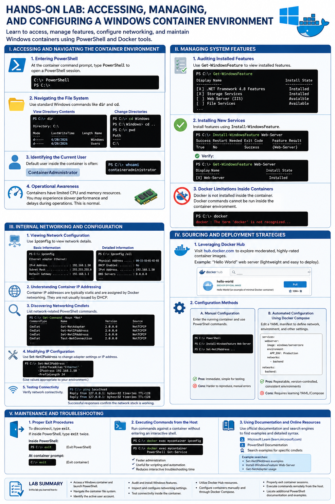

# Hands-On Lab: Accessing, Managing, and Configuring a Windows Container Environment

## Lab Objectives

In this lab, you will learn how to:

* Access and navigate a Windows container environment.
* Manage Windows Server features inside a container.
* Inspect and configure networking settings.
* Understand container deployment and configuration methods.
* Perform common maintenance and troubleshooting tasks.

---

# I. Accessing and Navigating the Container Environment

## Entering PowerShell

After connecting to the container and reaching the container command prompt, launch a PowerShell session by typing:

```powershell
PowerShell
```

This provides access to PowerShell cmdlets for system administration, configuration, and troubleshooting.

Example:

```powershell
C:\> PowerShell
PS C:\>
```

---

## Navigating the File System

The container file system behaves similarly to a standard Windows environment.

### View Directory Contents

```powershell
dir
```

Example output:

```powershell
Directory: C:\

Mode                LastWriteTime         Length Name
----                -------------         ------ ----
d-----         6/20/2026                  Windows
d-----         6/20/2026                  Users
```

### Change Directories

```powershell
cd C:\Windows
```

Move back one directory:

```powershell
cd ..
```

Display the current location:

```powershell
pwd
```

---

## Identifying the Current User

Most Windows container images run using the following default administrative account:

```text
ContainerAdministrator
```

Verify the active user:

```powershell
whoami
```

Example:

```text
containeradministrator
```

---

## Operational Awareness

Containers may have limited CPU and memory resources allocated.

You may observe:

* Slower command execution
* Delays when opening PowerShell
* Longer response times during feature installation

This behavior is normal and typically results from constrained resource allocations within the container environment.

---

# II. Managing System Features

## Auditing Installed Features

To review available and installed Windows features, run:

```powershell
Get-WindowsFeature
```

This command displays feature names, installation status, and descriptions.

Example features:

* .NET Framework
* Storage Services
* Web Server (IIS)
* File Services

---

## Installing New Services

To install a Windows feature, use:

```powershell
Install-WindowsFeature <FeatureName>
```

### Example: Install IIS Web Server

```powershell
Install-WindowsFeature Web-Server
```

Verify installation:

```powershell
Get-WindowsFeature Web-Server
```

Expected status:

```text
[X] Web-Server
```

---

## Docker Limitations Inside Containers

Windows containers do not include Docker by default.

Attempting to execute Docker commands from inside the container will typically result in:

```powershell
docker : The term 'docker' is not recognized...
```

Important:

* Docker Engine runs on the host system.
* Container management occurs externally from the host.
* Containers cannot normally manage other containers unless specifically configured for nested container scenarios.

---

# III. Internal Networking and Configuration

## Viewing Network Configuration

Display basic network information:

```powershell
ipconfig
```

Display detailed network information:

```powershell
ipconfig /all
```

Typical information includes:

* IPv4 Address
* Subnet Mask
* Default Gateway
* DNS Settings
* Adapter Information

---

## Understanding Container IP Addressing

Container network addresses are commonly assigned by Docker networking infrastructure and often remain static during the container's lifetime.

As a result:

* Addresses are generally predictable.
* DHCP lease renewals are uncommon.
* Network settings are controlled by the container runtime and host configuration.

---

## Discovering Available Networking Cmdlets

List networking-related PowerShell commands:

```powershell
Get-Command -Noun *Net*
```

Example output categories:

* Get-NetAdapter
* Get-NetIPAddress
* Set-NetIPAddress
* Get-NetRoute
* Test-NetConnection

This command helps identify available networking tools inside the container.

---

## Modifying IP Configuration

To configure network adapter settings or update an IP address, use:

```powershell
Set-NetIPAddress
```

Example syntax:

```powershell
Set-NetIPAddress `
    -InterfaceAlias "Ethernet" `
    -IPAddress 192.168.1.50 `
    -PrefixLength 24
```

Note: Actual values depend on your network design and container configuration.

---

## Testing Connectivity

Verify local network functionality:

```powershell
ping localhost
```

Expected result:

```text
Reply from 127.0.0.1
```

Successful responses confirm that the network stack is functioning correctly.

---

# IV. Sourcing and Deployment Strategies

## Leveraging Docker Hub

Docker Hub is the primary repository for container images.

Visit:

https://hub.docker.com

Benefits include:

* Community-reviewed images
* Official vendor-maintained images
* Versioned releases
* Security updates

A useful starter image is the "Hello World" web server example, which demonstrates basic container deployment concepts while maintaining a small footprint.

---

## Configuration Methods

There are two primary approaches for configuring containers.

### Method 1: Manual Configuration

Enter the running container and execute commands directly.

Example:

```powershell
PowerShell
Install-WindowsFeature Web-Server
Set-NetIPAddress ...
```

Advantages:

* Immediate changes
* Useful for testing
* Easy troubleshooting

Disadvantages:

* Changes may be difficult to reproduce
* Manual steps can introduce inconsistencies

---

### Method 2: Automated Configuration Using Docker Compose

Docker Compose allows infrastructure settings to be defined in a YAML file before container startup.

Example configuration:

```yaml
services:
  webserver:
    image: windows/servercore
    environment:
      APP_ENV: Production
    networks:
      - backend

networks:
  backend:
```

Benefits:

* Repeatable deployments
* Version-controlled configurations
* Consistent environments
* Reduced manual intervention

Network settings, environment variables, storage mappings, and service definitions can all be predefined in the compose file.

---

# V. Maintenance and Troubleshooting

## Proper Exit Procedures

To disconnect cleanly from a container session:

### If at the Container Command Prompt

```powershell
exit
```

### If Inside PowerShell

First exit PowerShell:

```powershell
exit
```

Then exit the container session:

```powershell
exit
```

In most cases, you must issue the command twice:

1. Exit PowerShell
2. Exit the container shell

---

## Executing Commands from the Host

You do not need to enter a container interactively to run commands.

Example:

```powershell
docker exec <container-name> ipconfig
```

Or:

```powershell
docker exec <container-name> PowerShell Get-Service
```

Advantages:

* Faster administration
* Script automation
* Reduced interactive troubleshooting time

---

## Using Documentation and Online Resources

PowerShell contains hundreds of cmdlets, many with extensive parameter options.

For detailed examples and syntax:

* Search Microsoft Learn documentation.
* Search official PowerShell documentation.
* Use search engines to find examples for specific cmdlets.

Example searches:

```text
Set-NetIPAddress examples
Install-WindowsFeature Web-Server
Get-NetAdapter usage
```

Official documentation often provides:

* Syntax references
* Practical examples
* Parameter descriptions
* Common troubleshooting guidance

---

# Lab Summary

In this lab you learned how to:

* Access a Windows container and launch PowerShell.
* Navigate the container file system.
* Identify the active user account.
* Audit and install Windows features.
* Inspect and configure networking settings.
* Test connectivity inside the container.
* Utilize Docker Hub resources.
* Configure containers manually and through Docker Compose.
* Properly exit container sessions.
* Execute commands remotely from the host.
* Locate additional PowerShell documentation and examples.

These skills provide a foundation for administering and troubleshooting Windows-based container environments.

---

