# Implementation Group Managed Service Accounts (gMSA)

## Lab Information

| Item | Value |
|--------|--------|
| Domain Name | thantzinaung.com |
| Feature | Group Managed Service Account (gMSA) |
| Management Tool | Windows PowerShell |
| Target Environment | Active Directory Domain Services (AD DS) |

---

# Overview

## Group Managed Service Account (gMSA) ဆိုသည်မှာ အဘယ်နည်း

Group Managed Service Account (gMSA) သည် Active Directory Domain Services (AD DS) ၏ Security Feature တစ်ခုဖြစ်ပြီး Service Accounts များ၏ Password များကို Active Directory က အလိုအလျောက် စီမံခန့်ခွဲပေးကာ Periodic Password Rotation များကိုလည်း Automatic ပြုလုပ်ပေးနိုင်သော Mechanism ဖြစ်သည်။

Traditional Service Accounts များတွင် Password ကို Administrator များက Manual သတ်မှတ်ရပြီး Password Expiration, Password Rotation နှင့် Security Management များကို ကိုယ်တိုင်ဆောင်ရွက်ရသည်။

gMSA ကို အသုံးပြုခြင်းဖြင့် Password Management ကို Active Directory က တာဝန်ယူပေးသဖြင့် Security ပိုမိုကောင်းမွန်လာသည်။

---

# Traditional Service Accounts ၏ ပြဿနာများ

Traditional Service Accounts များတွင် အောက်ပါ Security Risk များရှိသည်။

- Static Password များကို နှစ်ပေါင်းများစွာ အသုံးပြုနေခြင်း
- Password Rotation မပြုလုပ်ခြင်း
- Multiple Servers များတွင် Password တူညီစွာ အသုံးပြုခြင်း
- Administrator များ Password ကို သိရှိထားခြင်း
- Administrator တစ်ဦး Company မှ ထွက်ခွာသွားပါက Password Exposure Risk ဖြစ်နိုင်ခြင်း

ဥပမာ -

SQL Server Cluster တစ်ခုတွင် Service Account Password ကို Administrator ၅ ယောက် သိထားနိုင်သည်။

ထိုအထဲမှ Administrator တစ်ယောက် Company မှ ထွက်သွားပါက Password Change ပြုလုပ်ရန် လိုအပ်သော်လည်း မပြုလုပ်ပါက Security Risk ဖြစ်လာနိုင်သည်။

gMSA အသုံးပြုသောအခါ Password ကို မည်သူမျှ သိရန် မလိုတော့ဘဲ Active Directory ကသာ စီမံခန့်ခွဲသည်။

---

# gMSA ၏ အကျိုးကျေးဇူးများ

## Security Benefits

### Automatic Password Rotation

Password များကို Active Directory က Automatic Reset ပြုလုပ်ပေးသည်။

### Long Complex Passwords

Password များကို Randomly Generate ပြုလုပ်ပေးသောကြောင့် Brute Force Attack များကို လျော့နည်းစေသည်။

### No Human Knowledge

Administrator များသည် Password ကို သိရှိရန် မလိုအပ်ပါ။

### Centralized Management

Password Management ကို Domain Controller များက စီမံခန့်ခွဲသည်။

### Multi-Server Support

SQL Clusters, IIS Farms, Web Farms စသည့် Multiple Servers များတွင် တူညီသော Identity ဖြင့် Run နိုင်သည်။

---

# Requirements

gMSA မဖန်တီးမီ အောက်ပါ Requirement များကို ပြည့်စုံစေရမည်။

### Domain Functional Level

Windows Server 2012 နှင့်အထက်

### Active Directory Module

PowerShell Active Directory Module လိုအပ်သည်။

### KDS Root Key

KDS (Key Distribution Service) Root Key တစ်ခု ဖန်တီးထားရမည်။

---

# Important Note

## gMSA ကို GUI မှ ဖန်တီး၍ မရပါ

gMSA Account များကို

- Active Directory Users and Computers (ADUC)
- Active Directory Administrative Center (ADAC)

တို့မှ Graphical Interface ဖြင့် ဖန်တီး၍ မရပါ။

PowerShell ကိုသာ အသုံးပြုရမည်။

---

# Step 1: Create KDS Root Key

Domain Controller တွင် PowerShell ကို Administrator အနေဖြင့် Run ပါ။

```powershell
Add-KdsRootKey -EffectiveImmediately
```

---

# Production Environment Rule

Production Environment တွင် KDS Root Key Replication ပြီးစီးရန်

**10 Hours**

စောင့်ရမည်။

```text
KDS Root Key
       ↓
Replication
       ↓
10 Hours Wait
       ↓
Create gMSA
```

---

# Lab Environment Shortcut

Lab Environment များတွင် 10 Hours မစောင့်လိုပါက EffectiveTime Parameter ကို အသုံးပြုနိုင်သည်။

```powershell
Add-KdsRootKey -EffectiveTime ((Get-Date).AddHours(-10))
```

## Explanation

```powershell
(Get-Date).AddHours(-10)
```

ဆိုသည်မှာ System ကို

"ဒီ Key ဟာ 10 Hours အရင်ကတည်းက ရှိပြီးသား"

ဟု ထင်အောင် ပြုလုပ်ခြင်းဖြစ်သည်။

ထို့ကြောင့် Replication Wait Time ကို Bypass ပြုလုပ်နိုင်သည်။

> Production Environment တွင် ဤ Method ကို အသုံးမပြုသင့်ပါ။

---

# Step 2: Create Server Group

Security Best Practice အနေဖြင့် Domain Computers အားလုံးကို Access ပေးမည့်အစား Dedicated Group တစ်ခု ဖန်တီးသင့်သည်။

ဥပမာ -
```text

dsa.msc > users > Right-Click > Group > groupname: SQL-Servers

SQL-Servers
```

Group တစ်ခု ဖန်တီးပြီး SQL Servers များကို Membership ထည့်ပါ။

---

# Step 3: Create gMSA Account

PowerShell တွင်

```powershell
New-ADServiceAccount `
-Name SQL-gMSA `
-DNSHostName SQL-gMSA.thantzinaung.com `
-PrincipalsAllowedToRetrieveManagedPassword "SQL-Servers"
```

---

# Parameters Explanation

## -Name

gMSA Account Name

```powershell
-Name SQL-gMSA
```

---

## -DNSHostName

DNS Host Name သတ်မှတ်သည်။

```powershell
-DNSHostName SQL-gMSA.thantzinaung.com
```

---

## -PrincipalsAllowedToRetrieveManagedPassword

မည်သည့် Computer Group များက gMSA Password ကို အသုံးပြုခွင့်ရှိသည်ကို သတ်မှတ်သည်။

```powershell
-PrincipalsAllowedToRetrieveManagedPassword "SQL-Servers"
```

---

# Security Best Practice

### မကောင်းသော Example

```powershell
-PrincipalsAllowedToRetrieveManagedPassword "Domain Computers"
```

Domain Computer အားလုံး Access ရရှိမည်။

---

### ကောင်းသော Example

```powershell
-PrincipalsAllowedToRetrieveManagedPassword "SQL-Servers"
```

လိုအပ်သော Server များကိုသာ Access ပေးထားသည်။

---

# Verify gMSA Creation

```powershell
Get-ADServiceAccount SQL-gMSA
```

---

# Step 4: Prepare Member Server

ဥပမာ -

```text
SQL01
```

သည် Domain Controller မဟုတ်သော Member Server ဖြစ်သည်။

ထို့ကြောင့် Active Directory PowerShell Module ကို Install လုပ်ရမည်။

---

## Install RSAT PowerShell Tools

```powershell
Install-WindowsFeature RSAT-AD-PowerShell
```

---

## Import Active Directory Module

```powershell
Import-Module ActiveDirectory
```

---

# Step 5: Install gMSA on Member Server

Member Server (SQL Server) ပေါ်တွင်

Server Name: TZA-SVR2
DomainName: hantun.com

```powershell
Get-KdsRootKey
Add-KdsRootKey -EffectiveImmediately
Add-KdsRootKey -EffectiveTime ((Get-Data).AddHours(-10))
New-ADServiceAccount -Identity "SQL-gMSA" -PrincipalsAllowedToRetrieveManagedPassword "TZA-SVR2$"

Install-ADServiceAccount -Identity SQL-gMSA
```

Run ပါ။

---

# Verify Installation

```powershell
Test-ADServiceAccount SQL-gMSA
```

Result:

```text
True
```

ဖြစ်ပါက gMSA အောင်မြင်စွာ အသုံးပြုနိုင်ပြီဖြစ်သည်။

---

# Step 6: Configure Windows Service

Service တစ်ခုအား gMSA ဖြင့် Run စေရန်

```text
services.msc
```

ကို ဖွင့်ပါ။

---

## Log On Configuration

1. Service ကို Right Click နှိပ်ပါ
2. Properties ကိုရွေးပါ
3. Log On Tab သို့ သွားပါ
4. This Account ကိုရွေးပါ

Account Name ရိုက်ထည့်ပါ။

```text
hantun\SQL-gMSA$
```

> Account Name ၏ နောက်တွင် `$` ပါရမည်။

---

# The Blank Password Rule

## အရေးကြီးဆုံးအချက်

Password Field နှစ်ခုစလုံးကို

**Blank (Empty)**

ထားရမည်။

```text
Password:
[                    ]

Confirm Password:
[                    ]
```

---

# Password ကို ဘာကြောင့် မထည့်ရသလဲ

gMSA Password ကို

- Active Directory က Generate ပြုလုပ်သည်
- Active Directory က Store လုပ်ထားသည်
- Active Directory က Rotate လုပ်သည်

ထို့ကြောင့် Administrator များသည် Password ကို မသိသလို သိရန်လည်း မလိုအပ်ပါ။

Password Field တွင် Value ထည့်လိုက်ပါက Authentication Error များ ဖြစ်ပေါ်နိုင်သည်။

---

# How Password Management Works

```text
Domain Controller
        │
        │ Generates Password
        ▼
      gMSA
        │
        │ Secure Retrieval
        ▼
     SQL Server
        │
        ▼
     Service Runs
```

Password ကို Service Administrator က မမြင်ရဘဲ Authorized Server များသာ Secure Channel မှ ရယူအသုံးပြုနိုင်သည်။

---

# Verification Commands

## View gMSA Details

```powershell
Get-ADServiceAccount SQL-gMSA -Properties *
```

---

## Verify Allowed Computers

```powershell
Get-ADServiceAccount SQL-gMSA `
-Properties PrincipalsAllowedToRetrieveManagedPassword
```

---

## Test Functionality

```powershell
Test-ADServiceAccount SQL-gMSA
```

---

# Best Practices Summary

- gMSA ကို PowerShell ဖြင့်သာ ဖန်တီးပါ
- KDS Root Key ကို အရင်ဖန်တီးပါ
- Production တွင် 10 Hours Replication စောင့်ပါ
- Lab Environment တွင် `AddHours(-10)` Method ကို အသုံးပြုနိုင်သည်
- Dedicated Server Groups များ အသုံးပြုပါ
- Domain Computers အားလုံးကို Access မပေးပါနှင့်
- Member Servers တွင် RSAT-AD-PowerShell Install လုပ်ပါ
- `Install-ADServiceAccount` ဖြင့် Activate လုပ်ပါ
- Service Configuration တွင် Account Name နောက် `$` ထည့်ပါ
- Password Fields ကို လုံးဝ Blank ထားပါ
- `Test-ADServiceAccount` ဖြင့် Verify ပြုလုပ်ပါ

---

# Conclusion

Group Managed Service Accounts (gMSA) သည် Modern Active Directory Environment များတွင် Service Account Security ကို မြှင့်တင်ပေးသော အရေးကြီးသော Feature တစ်ခုဖြစ်သည်။ Password Management ကို Automatic ပြုလုပ်ပေးခြင်း၊ Human Access ကို လျော့နည်းစေခြင်းနှင့် Multi-Server Applications များအတွက် Single Secure Identity ပေးနိုင်ခြင်းကြောင့် Traditional Service Accounts များထက် Security နှင့် Manageability နှစ်မျိုးစလုံးတွင် ပိုမိုကောင်းမွန်သော Solution တစ်ခုဖြစ်သည်။

---

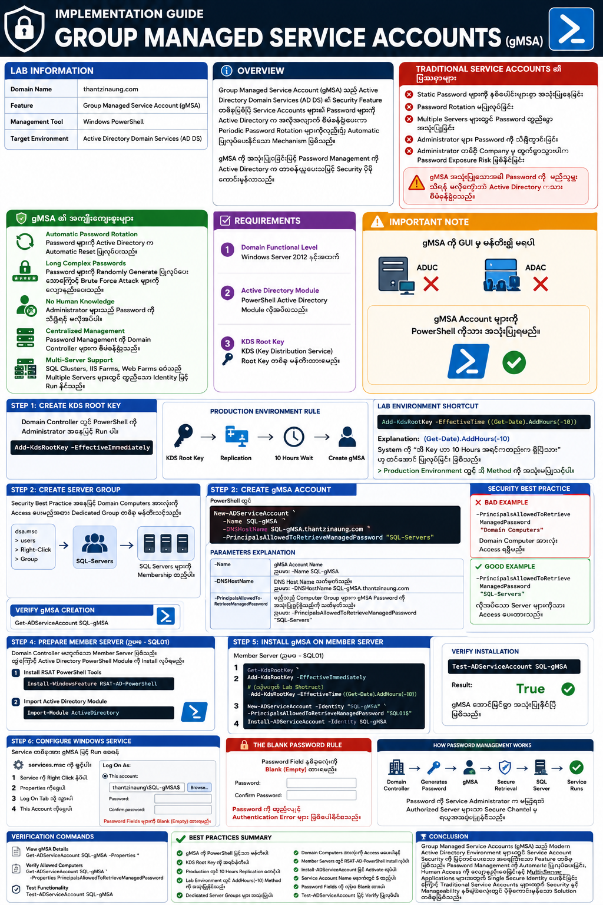
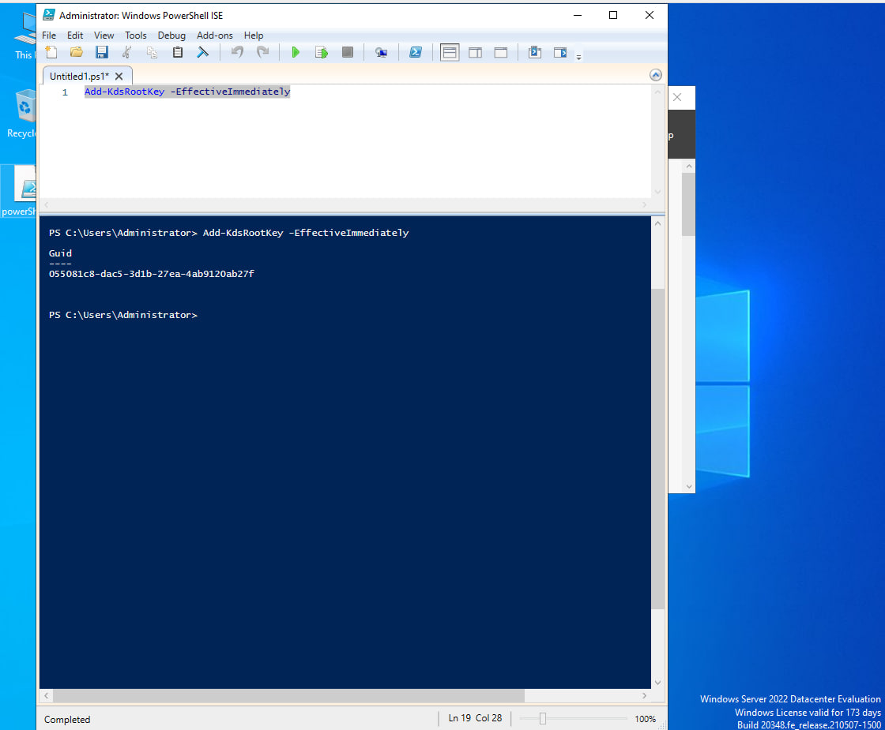
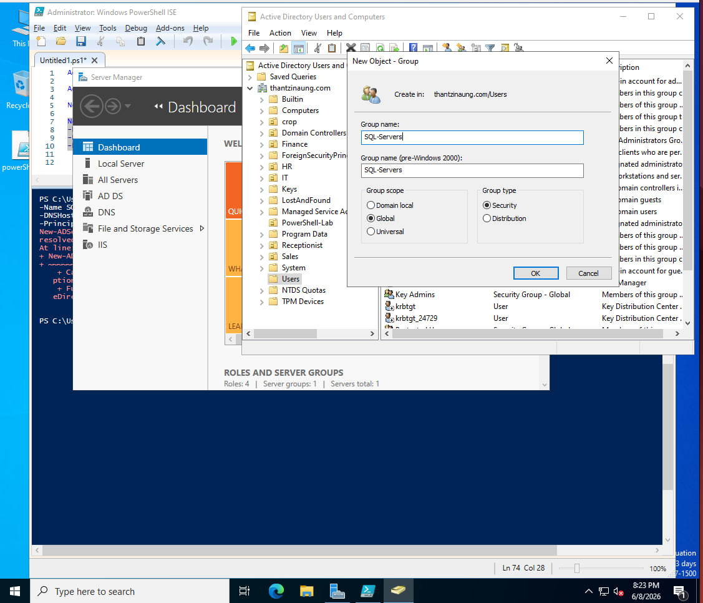
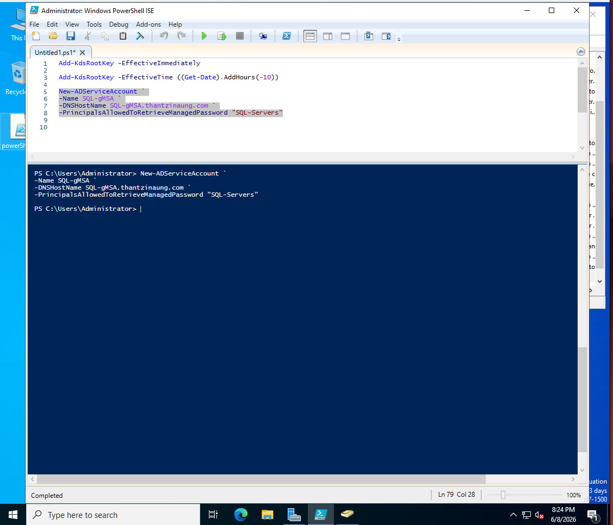
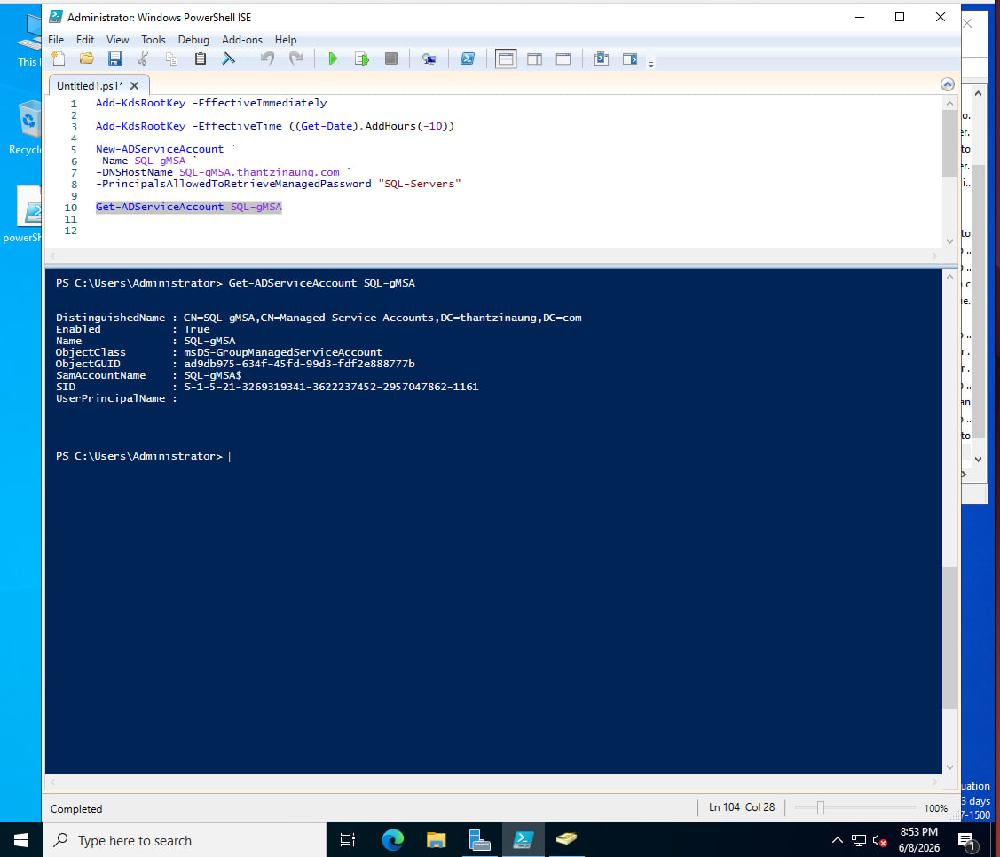
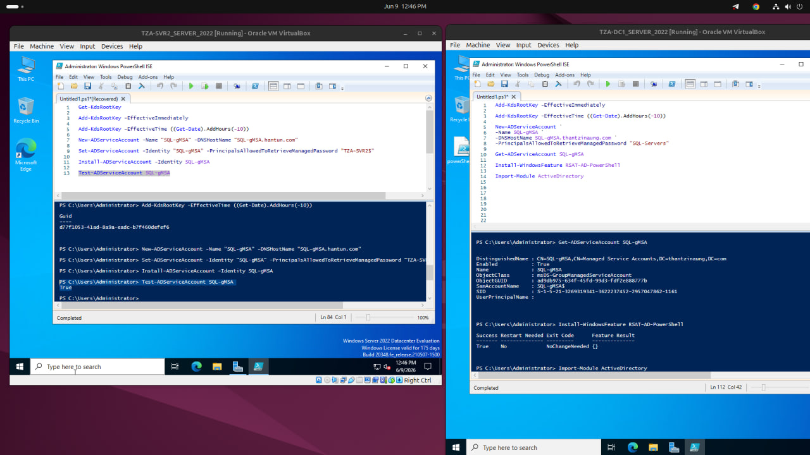
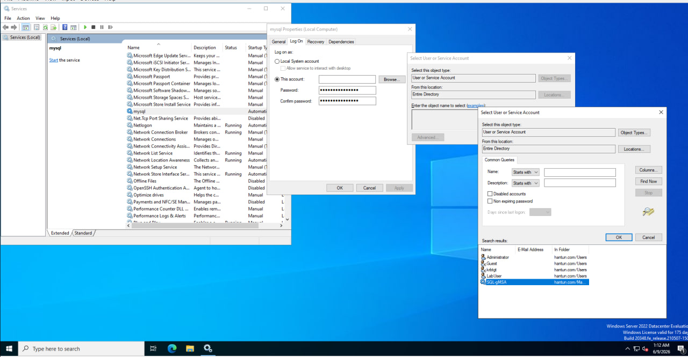
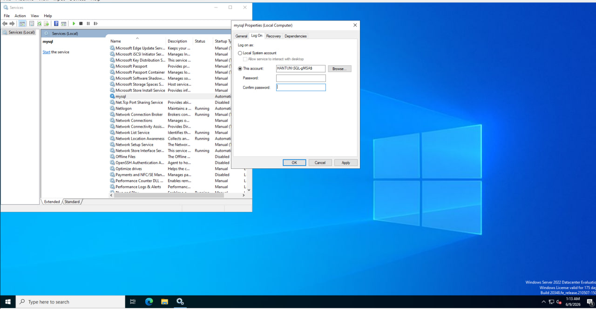
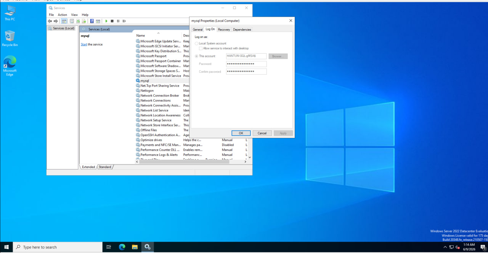
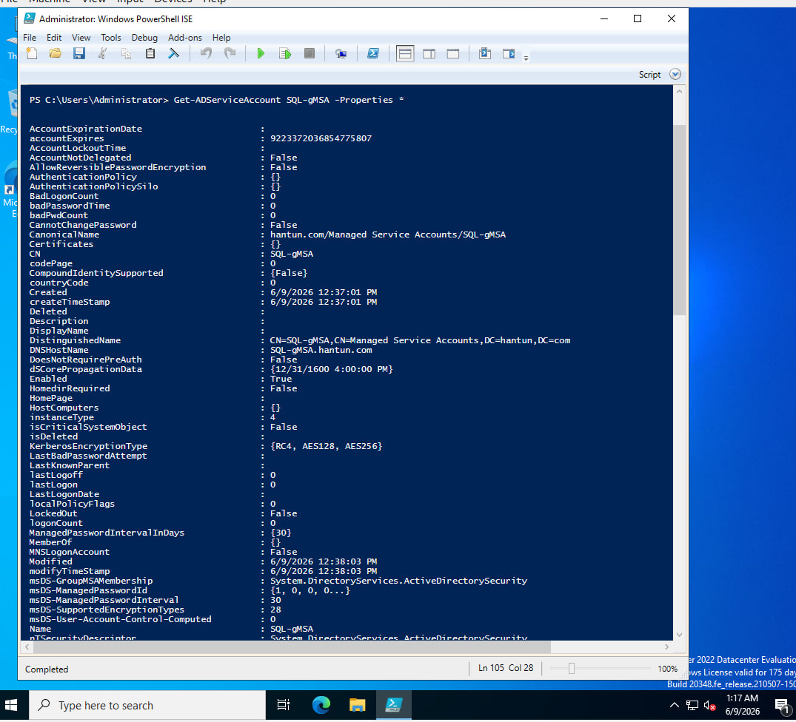
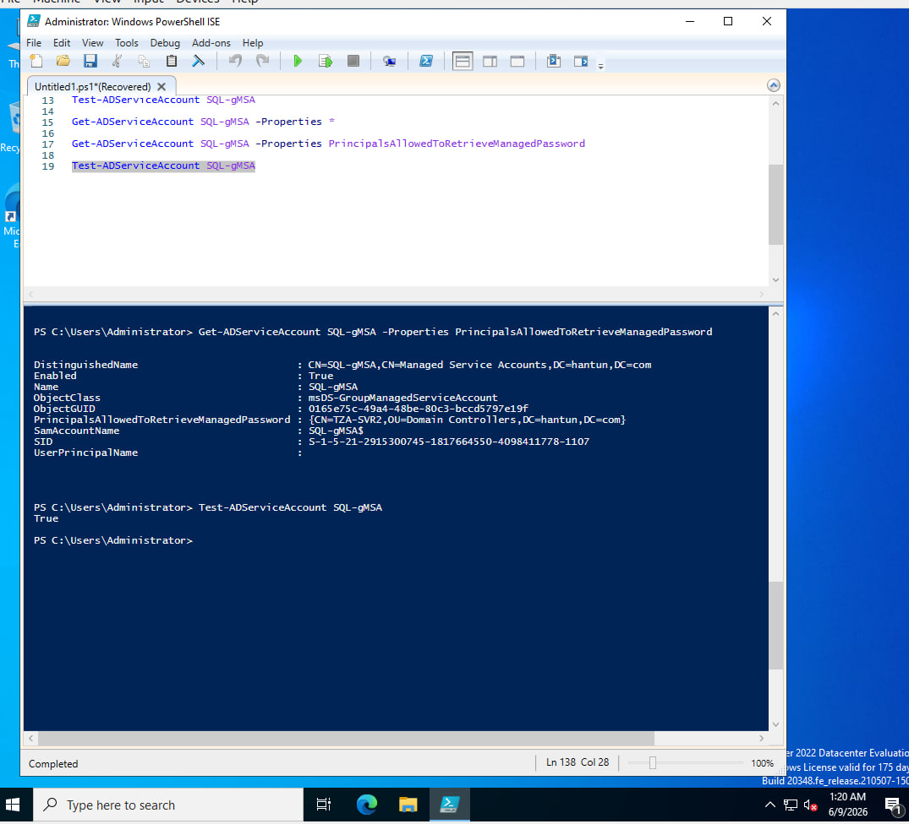