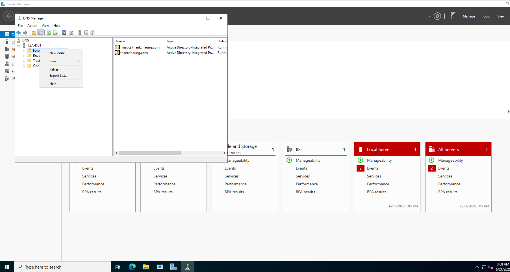
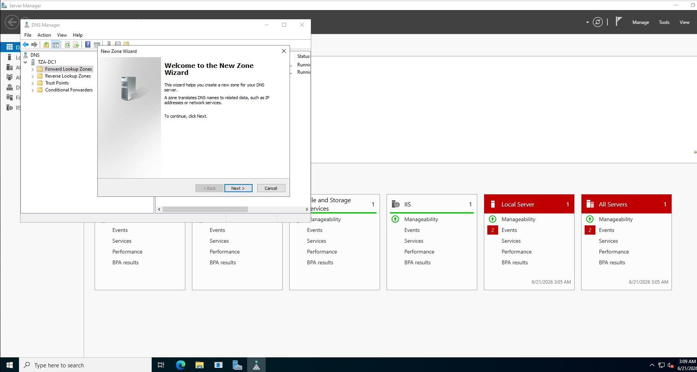
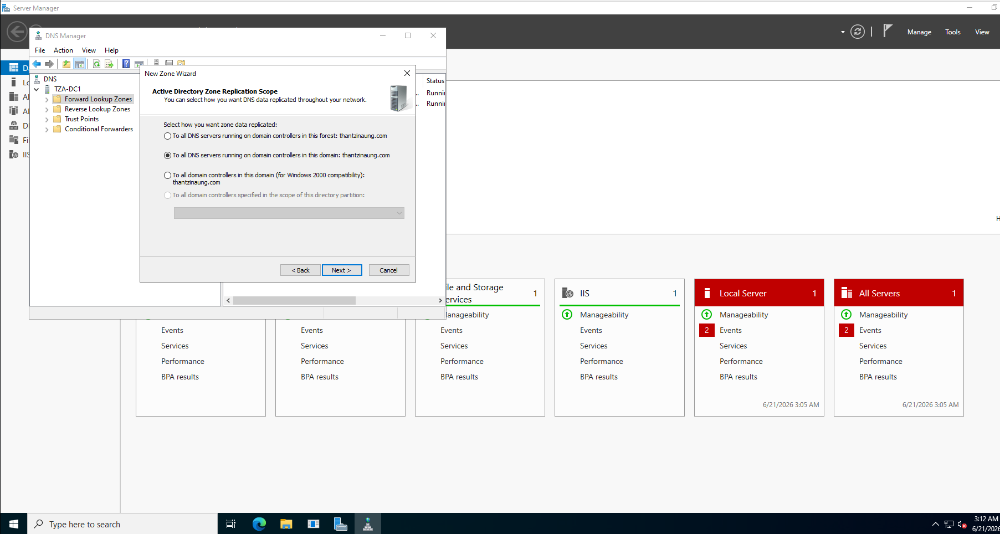
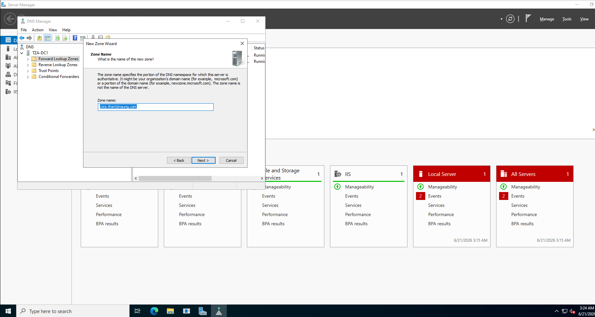
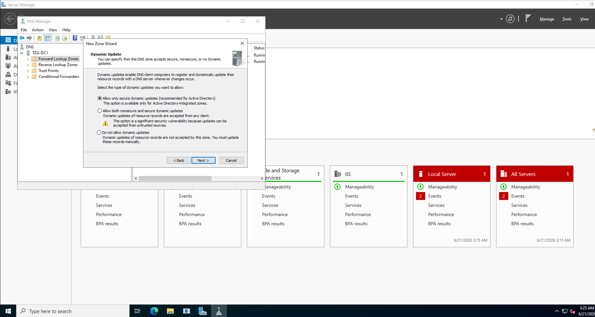
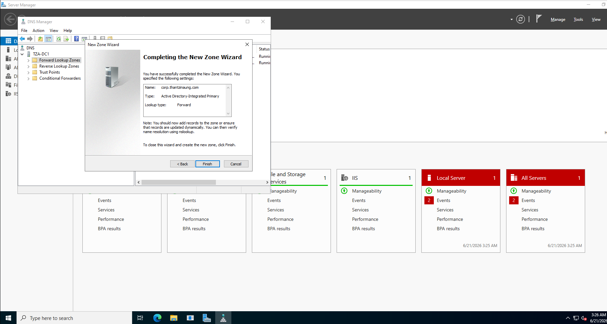
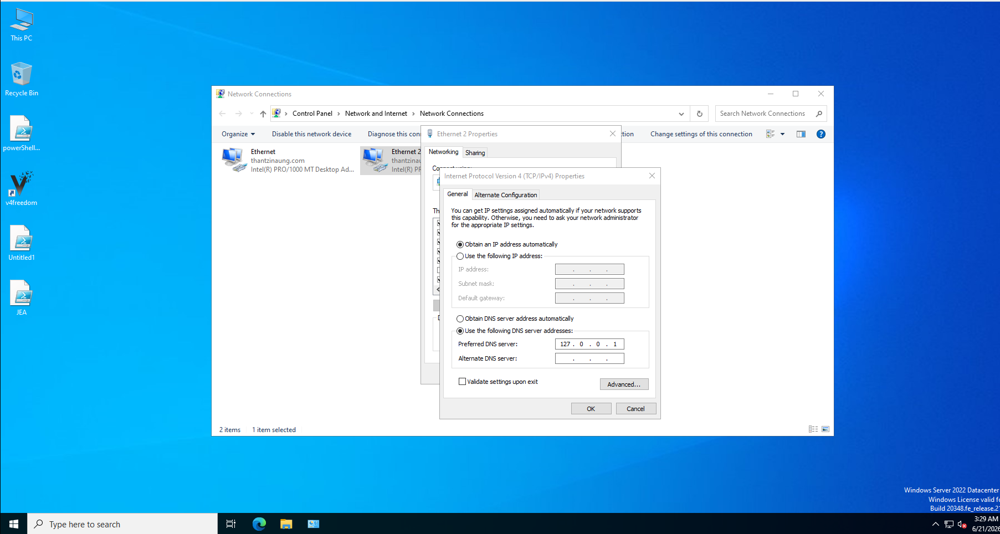
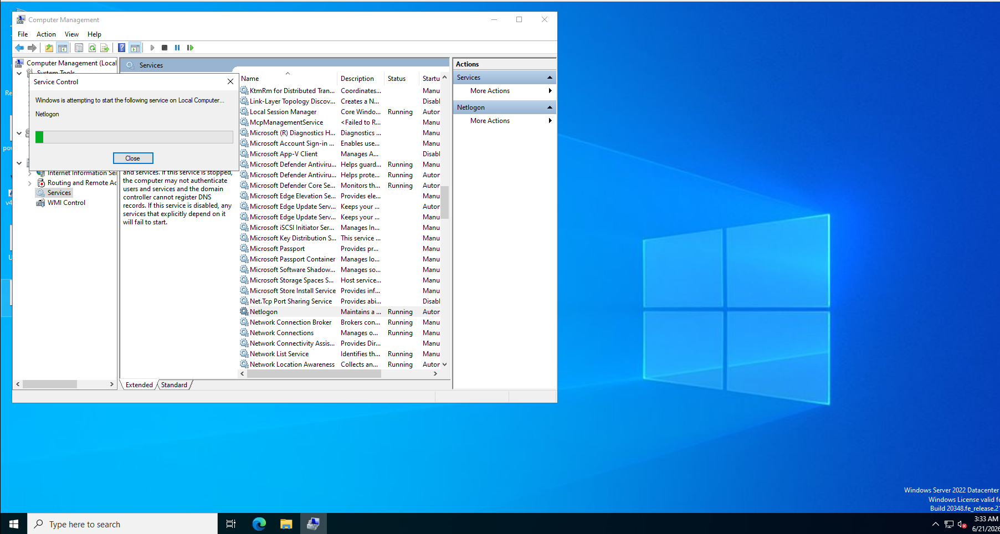
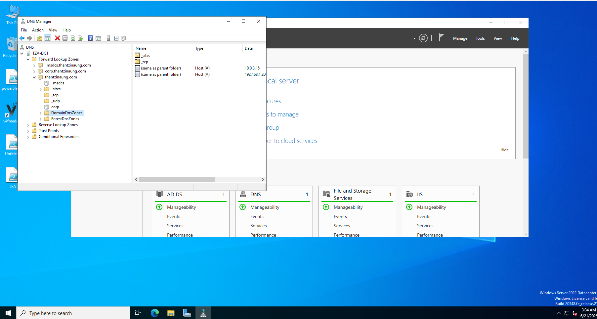
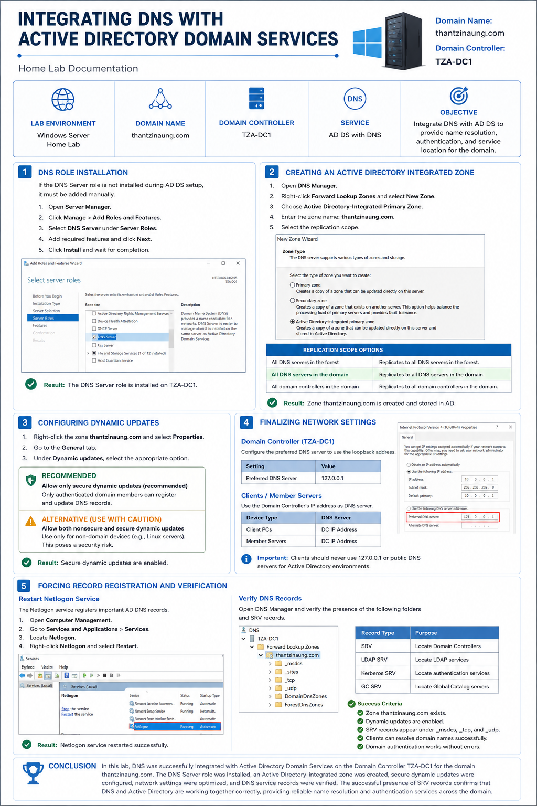

# Integrating DNS with Active Directory Domain Services (AD DS)

## Lab Information

| Item              | Value                                             |
| ----------------- | ------------------------------------------------- |
| Domain Name       | thantzinaung.com                                  |
| Domain Controller | TZA-DC1                                           |
| Service           | Active Directory Domain Services (AD DS) with DNS |
| Environment       | Windows Server Home Lab                           |

---

# Objective

The objective of this lab is to integrate Domain Name System (DNS) with Active Directory Domain Services (AD DS) to provide name resolution services required for domain authentication, service location, and Active Directory functionality.

DNS is a critical component of Active Directory because domain controllers and client computers rely on DNS records to locate domain resources and services.

---

# 1. DNS Role Installation

If the DNS Server role is not installed automatically during Active Directory Domain Services deployment, it must be added manually.

### Steps

1. Open **Server Manager**.
2. Select **Manage** → **Add Roles and Features**.
3. Click **Next** until reaching the **Server Roles** page.
4. Select **DNS Server**.
5. Click **Add Features** when prompted.
6. Continue through the wizard and click **Install**.
7. Wait for the installation to complete successfully.

### Result

The DNS Server role is installed on the Domain Controller **TZA-DC1**, enabling DNS management and name resolution services for the domain.

---

# 2. Creating an Active Directory Integrated Zone

After installing the DNS role, a DNS zone must be created to store domain name records.

### Steps

1. Open **DNS Manager** from **Server Manager → Tools → DNS**.

2. Expand the server node (**TZA-DC1**).

3. Right-click **Forward Lookup Zones**.

4. Select **New Zone**.

5. On the Zone Type page, choose:

   **Active Directory-Integrated Primary Zone**

6. Click **Next**.

### Zone Configuration

| Setting   | Value                                    |
| --------- | ---------------------------------------- |
| Zone Name | thantzinaung.com                         |
| Zone Type | Active Directory-Integrated Primary Zone |

### Replication Scope Options

Choose one of the following replication scopes:

* All DNS servers in the forest
* All DNS servers in the domain
* All domain controllers in the domain

For this lab, replication was configured for:

**All DNS servers in this domain**

given name ` zone name : corp.thantzinaung.com` and next

### Benefits of AD-Integrated Zones

* Automatic replication through Active Directory.
* Improved fault tolerance.
* Multi-master updates.
* Enhanced security.

### Result

The DNS zone **thantzinaung.com** was successfully created and stored within Active Directory.

---

# 3. Configuring Dynamic Updates

Active Directory relies on Dynamic DNS (DDNS) to automatically register and update host records.

### Steps

1. Right-click the zone **thantzinaung.com**.
2. Select **Properties**.
3. Navigate to the **General** tab.
4. Configure **Dynamic Updates**.

### Recommended Configuration

**Allow only secure dynamic updates**

This option ensures that only authenticated domain computers can create or modify DNS records.

### Alternative Configuration

**Allow both nonsecure and secure dynamic updates**

Use this option only when supporting non-domain devices such as:

* Linux servers
* Legacy systems
* Network appliances

### Security Consideration

Allowing nonsecure updates may expose the DNS database to unauthorized record registrations and potential spoofing attacks.

### Result

Secure Dynamic DNS updates were enabled to provide a secure Active Directory environment.

---

# 4. Finalizing Network Settings

Proper DNS client configuration is essential for Active Directory communication.

## Domain Controller Configuration

Configure the preferred DNS server on **TZA-DC1** as:

| Setting              | Value     |
| -------------------- | --------- |
| Preferred DNS Server | 127.0.0.1 |

The loopback address ensures the Domain Controller uses its own DNS service for name resolution.

## Client and Member Server Configuration

All domain-joined systems must use the Domain Controller's IP address as their DNS server.

Example:

| Device         | DNS Server    |
| -------------- | ------------- |
| Client PCs     | DC IP Address |
| Member Servers | DC IP Address |

### Important Note

Client computers should never use:

* 127.0.0.1
* Public DNS servers (8.8.8.8, 1.1.1.1, etc.)

for Active Directory name resolution.

### Result

DNS resolution traffic is directed through the Domain Controller, ensuring proper domain authentication and resource discovery.

---

# 5. Forcing DNS Record Registration and Verification

After DNS integration, service records should automatically appear within the DNS zone.

If records are missing, they can be manually regenerated.

## Restarting Netlogon Service

The Netlogon service is responsible for registering critical Active Directory DNS records.

### Steps

1. Open **Computer Management**.

2. Navigate to:

   Services and Applications → Services

3. Locate **Netlogon**.

4. Right-click **Netlogon**.

5. Select **Restart**.

This action forces the Domain Controller to recreate missing DNS service records.

---

## Verifying Active Directory DNS Records

Open DNS Manager and verify the presence of the following folders:

* _msdcs
* _sites
* _tcp
* _udp

These folders contain SRV (Service Locator) records used by:

* Domain authentication
* Kerberos authentication
* Domain Controller discovery
* Global Catalog discovery

### Example Records

| Record Type  | Purpose                        |
| ------------ | ------------------------------ |
| SRV          | Locate Domain Controllers      |
| LDAP SRV     | Locate LDAP services           |
| Kerberos SRV | Locate authentication services |
| GC SRV       | Locate Global Catalog servers  |

### Verification Success Criteria

The DNS integration is functioning correctly when:

✓ The zone **thantzinaung.com** exists.

✓ Dynamic updates are enabled.

✓ SRV records appear under the _msdcs, _tcp, and _udp folders.

✓ Clients can resolve domain names successfully.

✓ Domain authentication functions without errors.

---

# Conclusion

In this lab, DNS was successfully integrated with Active Directory Domain Services on the Domain Controller **TZA-DC1** for the domain **thantzinaung.com**. The DNS Server role was installed, an Active Directory-integrated zone was created, secure dynamic updates were configured, network settings were optimized, and DNS service records were verified. The successful presence of SRV records confirms that DNS and Active Directory are functioning together correctly, providing reliable name resolution and authentication services throughout the domain environment.

---

