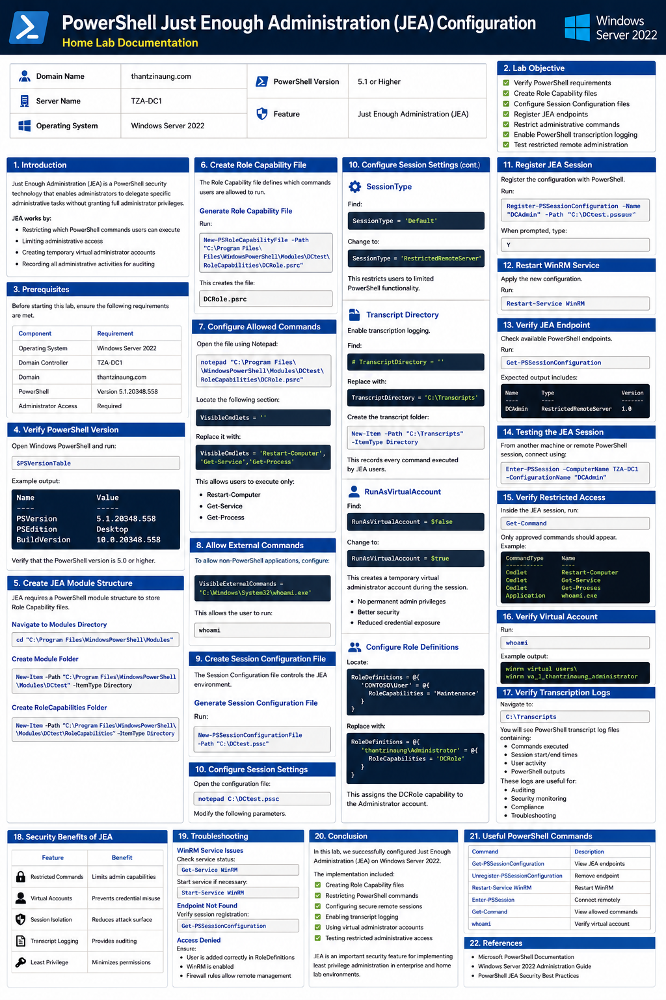
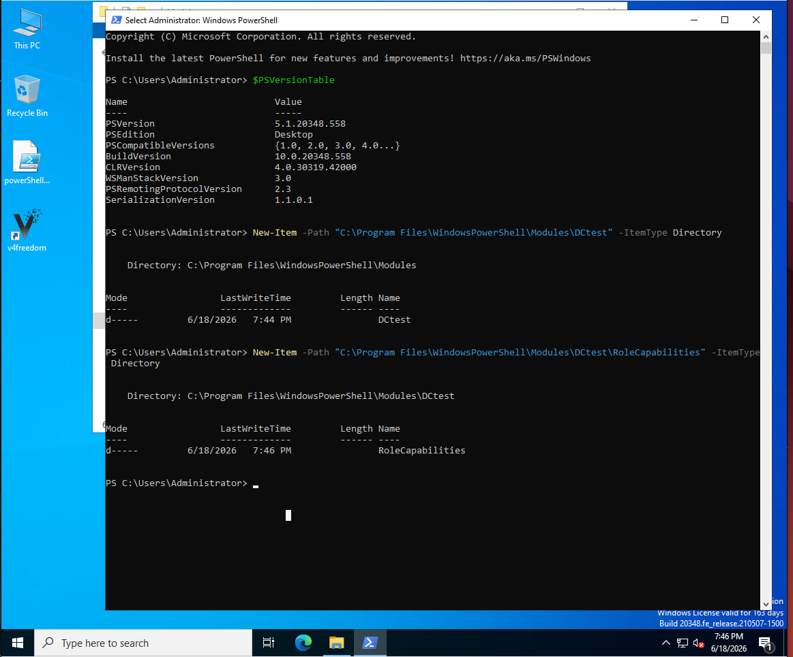
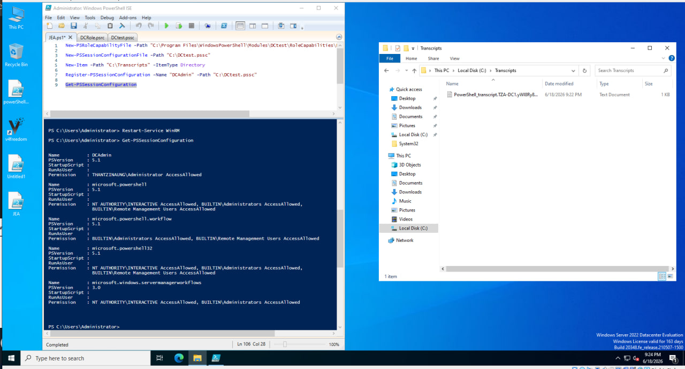
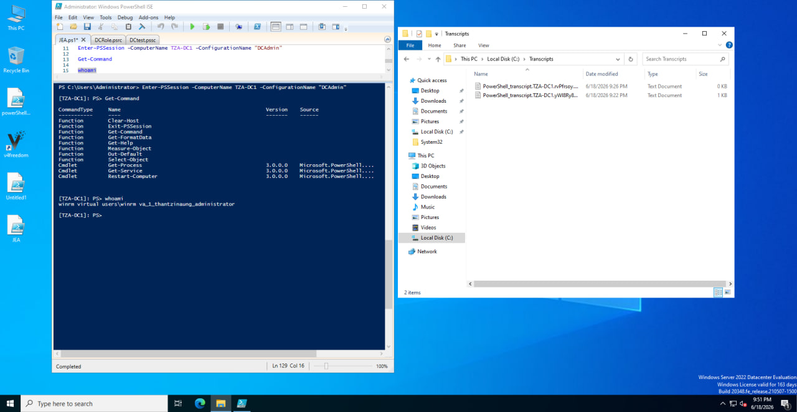

# PowerShell Just Enough Administration (JEA) Configuration — Home Lab Documentation

## Lab Information

| Item               | Value                            |
| ------------------ | -------------------------------- |
| Domain Name        | thantzinaung.com                 |
| Server Name        | TZA-DC1                          |
| Operating System   | Windows Server 2022              |
| PowerShell Version | 5.1 or Higher                    |
| Feature            | Just Enough Administration (JEA) |

---

# 1. Introduction

Just Enough Administration (JEA) is a PowerShell security technology that enables administrators to delegate specific administrative tasks without granting full administrator privileges.

JEA works by:

* Restricting which PowerShell commands users can execute
* Limiting administrative access
* Creating temporary virtual administrator accounts
* Recording all administrative activities for auditing


---

# 2. Lab Objective


* Verify PowerShell requirements
* Create Role Capability files
* Configure Session Configuration files
* Register JEA endpoints
* Restrict administrative commands
* Enable PowerShell transcription logging
* Test restricted remote administration

---

# 3. Prerequisites

Before starting this lab, ensure the following requirements are met.

## Required Components

| Component            | Requirement           |
| -------------------- | --------------------- |
| Operating System     | Windows Server 2022   |
| Domain Controller    | TZA-DC1               |
| Domain               | thantzinaung.com      |
| PowerShell           | Version 5.1.20348.558 |
| Administrator Access | Required              |

---

# 4. Verify PowerShell Version

Open Windows PowerShell and run:

```powershell
$PSVersionTable
```

Example output:

```powershell
PSVersion                      5.1.20348.558
PSEdition                      Desktop
BuildVersion                   10.0.20348.558
```

Verify that the PowerShell version is 5.0 or higher.

---

# 5. Create JEA Module Structure

JEA requires a PowerShell module structure to store Role Capability files.

## Navigate to Modules Directory

```powershell
cd "C:\Program Files\WindowsPowerShell\Modules"
```

## Create Module Folder

```powershell
New-Item -Path "C:\Program Files\WindowsPowerShell\Modules\DCtest" -ItemType Directory
```

## Create RoleCapabilities Folder

```powershell
New-Item -Path "C:\Program Files\WindowsPowerShell\Modules\DCtest\RoleCapabilities" -ItemType Directory
```

---

# 6. Create Role Capability File

The Role Capability file defines which commands users are allowed to run.

## Generate Role Capability File

Run:

```powershell
New-PSRoleCapabilityFile -Path "C:\Program Files\WindowsPowerShell\Modules\DCtest\RoleCapabilities\DCRole.psrc"
```

This creates the file:

```text
DCRole.psrc
```

---

# 7. Configure Allowed Commands

Open the file using Notepad:

```powershell
notepad "C:\Program Files\WindowsPowerShell\Modules\DCtest\RoleCapabilities\DCRole.psrc"
```

Locate the following section:

```powershell
VisibleCmdlets = ''
```

Replace it with:

```powershell
VisibleCmdlets = 'Restart-Computer','Get-Service','Get-Process'
```

This allows users to execute only:

* Restart-Computer
* Get-Service
* Get-Process

---

# 8. Allow External Commands

To allow non-PowerShell applications, configure:

```powershell
VisibleExternalCommands = 'C:\Windows\System32\whoami.exe'
```

This allows the user to run:

```powershell
whoami
```

---

# 9. Create Session Configuration File

The Session Configuration file controls the JEA environment.

## Generate Session Configuration File

Run:

```powershell
New-PSSessionConfigurationFile -Path "C:\DCtest.pssc"
```

---

# 10. Configure Session Settings

Open the configuration file:

```powershell
notepad C:\DCtest.pssc
```

Modify the following parameters.

---

## SessionType

Find:

```powershell
SessionType = 'Default'
```

Change to:

```powershell
SessionType = 'RestrictedRemoteServer'
```

This restricts users to limited PowerShell functionality.

---

## Transcript Directory

Enable transcription logging.

Find:

```powershell
# TranscriptDirectory = ''
```

Replace with:

```powershell
TranscriptDirectory = 'C:\Transcripts'
```

## RunAsVirtualAccount

Find:

```powershell
RunAsVirtualAccount = $false
```

Change to:

```powershell
RunAsVirtualAccount = $true
```

This creates a temporary virtual administrator account during the session.

Benefits:

* No permanent admin privileges
* Better security
* Reduced credential exposure

---

Create the transcript folder:

```powershell
New-Item -Path "C:\Transcripts" -ItemType Directory
```

This records every command executed by JEA users.

---

## Configure Role Definitions

Locate:

```powershell
RoleDefinitions = @{
    'CONTOSO\User' = @{
        RoleCapabilities = 'Maintenance'
    }
}
```

Replace with:

```powershell
RoleDefinitions = @{
    'thantzinaung\Administrator' = @{
        RoleCapabilities = 'DCRole'
    }
}
```

This assigns the DCRole capability to the Administrator account.

---

# 11. Register JEA Session

Register the configuration with PowerShell.

Run:

```powershell
Register-PSSessionConfiguration -Name "DCAdmin" -Path "C:\DCtest.pssc"
```

When prompted, type:

```text
Y
```

---

# 12. Restart WinRM Service

Apply the new configuration.

Run:

```powershell
Restart-Service WinRM
```

---

# 13. Verify JEA Endpoint

Check available PowerShell endpoints.

Run:

```powershell
Get-PSSessionConfiguration
```

Expected output includes:

```text
DCAdmin
```

---

# 14. Testing the JEA Session

From another machine or remote PowerShell session, connect using:

```powershell
Enter-PSSession -ComputerName TZA-DC1 -ConfigurationName "DCAdmin"
```

---

# 15. Verify Restricted Access

Inside the JEA session, run:

```powershell
Get-Command
```

Only approved commands should appear.

Example:

```powershell
Restart-Computer
Get-Service
Get-Process
whoami
```

---

# 16. Verify Virtual Account

Run:

```powershell
whoami
```

Example output:

```text
winrm virtual users\winrm va_1_thantzinaung_administrator
```

This confirms that the session uses a temporary virtual account instead of the real administrator account.

---

# 17. Verify Transcription Logs

Navigate to:

```text
C:\Transcripts
```

You will see PowerShell transcript log files containing:

* Commands executed
* Session start/end times
* User activity
* PowerShell outputs

These logs are useful for:

* Auditing
* Security monitoring
* Compliance
* Troubleshooting

---

# 18. Security Benefits of JEA

JEA improves security by:

| Feature             | Benefit                    |
| ------------------- | -------------------------- |
| Restricted Commands | Limits admin capabilities  |
| Virtual Accounts    | Prevents credential misuse |
| Session Isolation   | Reduces attack surface     |
| Transcript Logging  | Provides auditing          |
| Least Privilege     | Minimizes permissions      |

---

# 19. Troubleshooting

## WinRM Service Issues

Check service status:

```powershell
Get-Service WinRM
```

Start service if necessary:

```powershell
Start-Service WinRM
```

---

## Endpoint Not Found

Verify session registration:

```powershell
Get-PSSessionConfiguration
```

---

## Access Denied

Ensure:

* User is added correctly in RoleDefinitions
* WinRM is enabled
* Firewall rules allow remote management

---

# 20. Conclusion

In this lab, we successfully configured Just Enough Administration (JEA) on Windows Server 2022.

The implementation included:

* Creating Role Capability files
* Restricting PowerShell commands
* Configuring secure remote sessions
* Enabling transcript logging
* Using virtual administrator accounts
* Testing restricted administrative access

JEA is an important security feature for implementing least privilege administration in enterprise and home lab environments.

---

# 21. Useful PowerShell Commands

| Command                           | Description            |
| --------------------------------- | ---------------------- |
| Get-PSSessionConfiguration        | View JEA endpoints     |
| Unregister-PSSessionConfiguration | Remove endpoint        |
| Restart-Service WinRM             | Restart WinRM          |
| Enter-PSSession                   | Connect remotely       |
| Get-Command                       | View allowed commands  |
| whoami                            | Verify virtual account |

---

# 22. References

* Microsoft PowerShell Documentation
* Windows Server 2022 Administration Guide
* PowerShell JEA Security Best Practices

---




