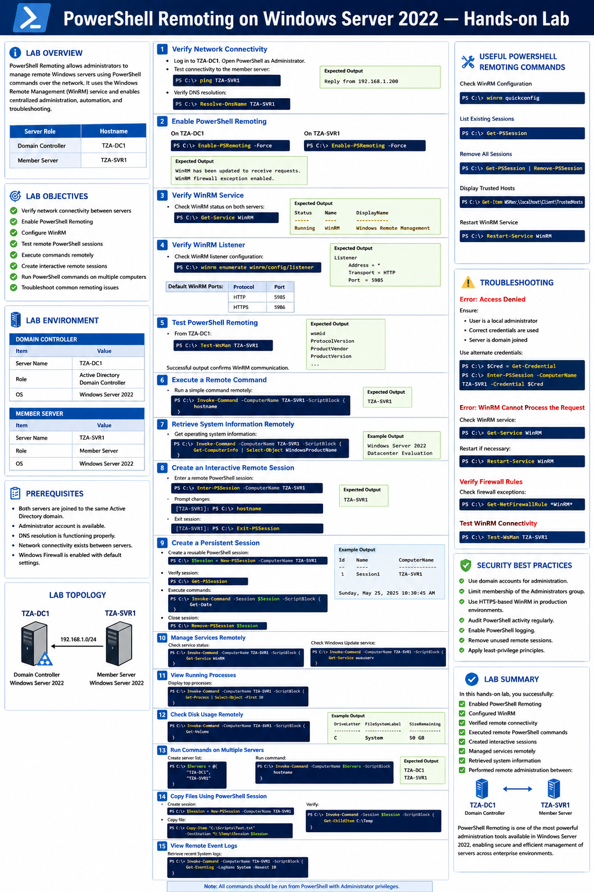
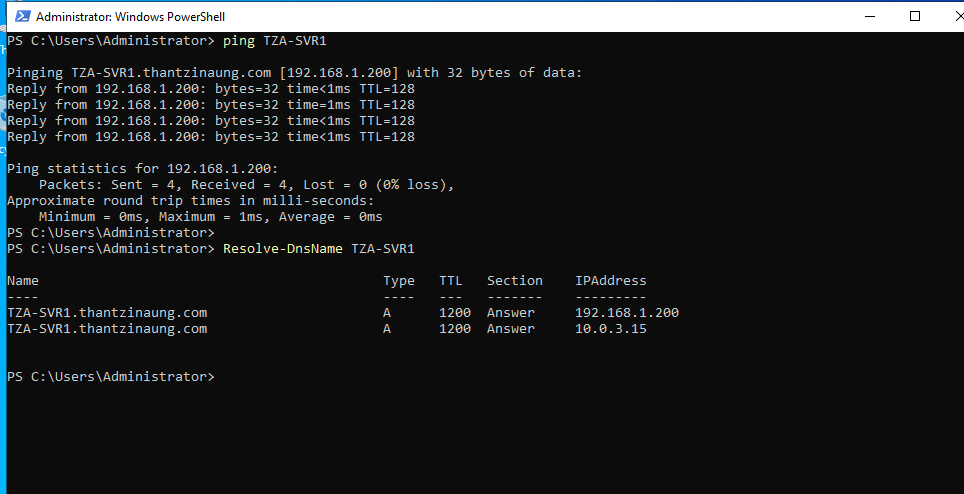
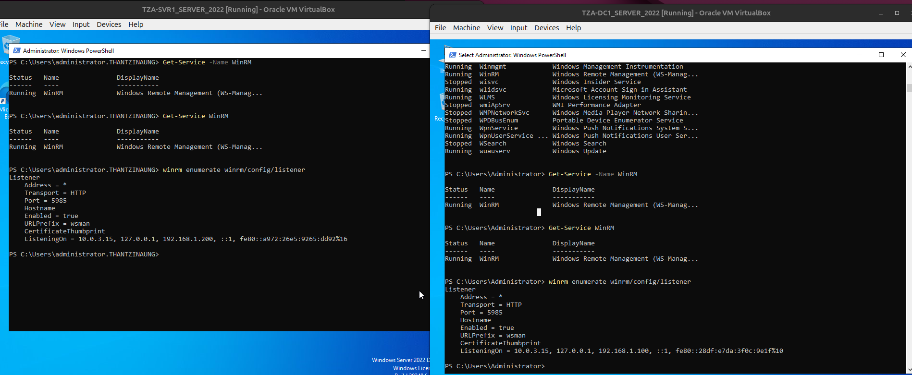
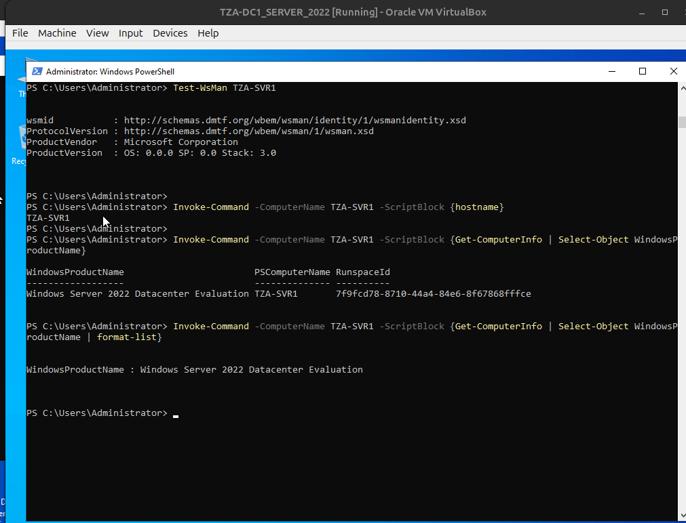
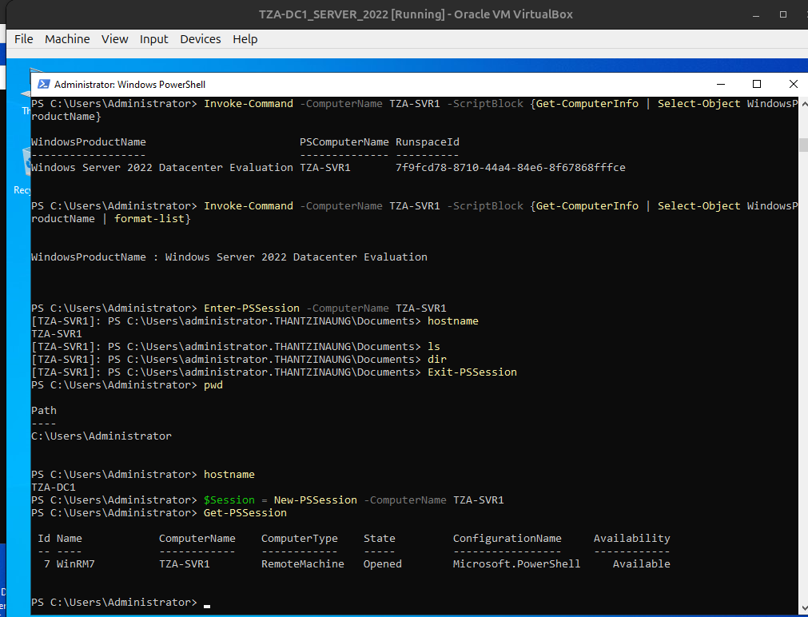
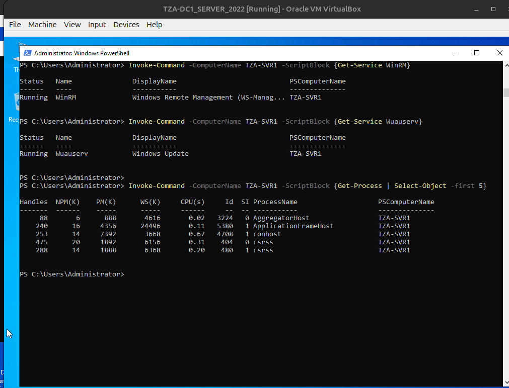
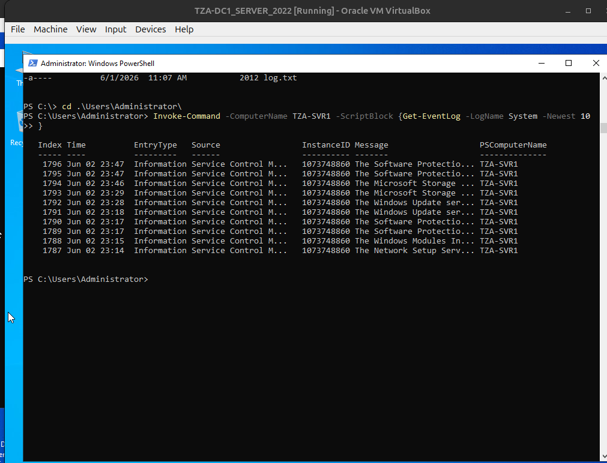
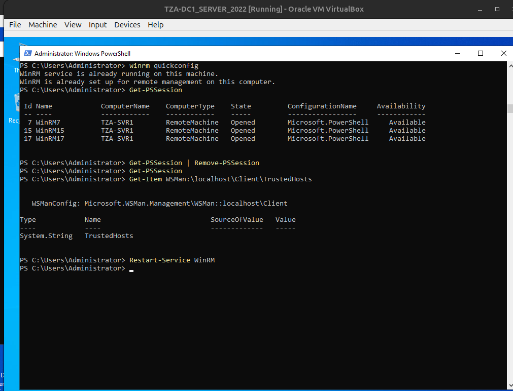

# PowerShell Remoting on Windows Server 2022 — Hands-on Lab

## Lab Overview

PowerShell Remoting allows administrators to manage remote Windows servers using PowerShell commands over the network. It uses the Windows Remote Management (WinRM) service and enables centralized administration, automation, and troubleshooting.

In this lab :

| Server Role | Hostname |
|------------|----------|
| Domain Controller | TZA-DC1 |
| Member Server | TZA-SVR1 |

---

# Lab Objectives


- Verify network connectivity between servers
- Enable PowerShell Remoting
- Configure WinRM
- Test remote PowerShell sessions
- Execute commands remotely
- Create interactive remote sessions
- Run PowerShell commands on multiple computers
- Troubleshoot common remoting issues

---

# Lab Environment

## Domain Controller

| Item | Value |
|--------|--------|
| Server Name | TZA-DC1 |
| Role | Active Directory Domain Controller |
| OS | Windows Server 2022 |

## Member Server

| Item | Value |
|--------|--------|
| Server Name | TZA-SVR1 |
| Role | Member Server |
| OS | Windows Server 2022 |

---

# Prerequisites

Before starting:

- Both servers are joined to the same Active Directory domain.
- Administrator account is available.
- DNS resolution is functioning properly.
- Network connectivity exists between servers.
- Windows Firewall is enabled with default settings.

---

# Step 1: Verify Network Connectivity

Log in to **TZA-DC1**.

Open PowerShell as Administrator.

Test connectivity to the member server:

```powershell
ping TZA-SVR1
```

Expected output:

```text
Reply from 192.168.1.200
```

Verify DNS resolution:

```powershell
Resolve-DnsName TZA-SVR1
```

---

# Step 2: Enable PowerShell Remoting

## On TZA-DC1

Open PowerShell as Administrator:

```powershell
Enable-PSRemoting -Force
```

Expected output:

```text
WinRM has been updated to receive requests.
WinRM firewall exception enabled.
```

---

## On TZA-SVR1

Open PowerShell as Administrator:

```powershell
Enable-PSRemoting -Force
```

This command:

- Starts WinRM service
- Sets WinRM startup type to Automatic
- Creates a listener
- Enables firewall rules
- Configures session endpoints

---

# Step 3: Verify WinRM Service

Check WinRM status on both servers:

```powershell
Get-Service WinRM
```

Expected output:

```text
Status   Name      DisplayName
------   ----      -----------
Running  WinRM     Windows Remote Management
```

---

# Step 4: Verify WinRM Listener

Check WinRM listener configuration:

```powershell
winrm enumerate winrm/config/listener
```

Expected output:

```text
Listener
    Address = *
    Transport = HTTP
    Port = 5985
```

Default WinRM Ports:

| Protocol | Port |
|-----------|------|
| HTTP | 5985 |
| HTTPS | 5986 |

---

# Step 5: Test PowerShell Remoting

From TZA-DC1:

```powershell
Test-WsMan TZA-SVR1
```

Expected output:

```text
wsmid
ProtocolVersion
ProductVendor
ProductVersion
```

Successful output confirms WinRM communication.

---

# Step 6: Execute a Remote Command

Run a simple command remotely:

```powershell
Invoke-Command -ComputerName TZA-SVR1 -ScriptBlock {
    hostname
}
```

Expected output:

```text
TZA-SVR1
```

---

# Step 7: Retrieve System Information Remotely

Get operating system information:

```powershell
Invoke-Command -ComputerName TZA-SVR1 -ScriptBlock {
    Get-ComputerInfo | Select-Object WindowsProductName
}
```

Example output:

```text
Windows Server 2022 Datacenter Evaluatioin 
```

---

# Step 8: Create an Interactive Remote Session

Enter a remote PowerShell session:

```powershell
Enter-PSSession -ComputerName TZA-SVR1
```

Prompt changes:

```powershell
[TZA-SVR1]: PS C:\>
```

Verify the current host:

```powershell
hostname
```

Expected output:

```text
TZA-SVR1
```

Exit session:

```powershell
Exit-PSSession
```

---

# Step 9: Create a Persistent Session

Create a reusable PowerShell session:

```powershell
$Session = New-PSSession -ComputerName TZA-SVR1
```

Verify session:

```powershell
Get-PSSession
```

Execute commands:

```powershell
Invoke-Command -Session $Session -ScriptBlock {
    Get-Date
}
```

Close session:

```powershell
Remove-PSSession $Session
```

---

# Step 10: Manage Services Remotely

Check service status:

```powershell
Invoke-Command -ComputerName TZA-SVR1 -ScriptBlock {
    Get-Service WinRM
}
```

Check Windows Update service:

```powershell
Invoke-Command -ComputerName TZA-SVR1 -ScriptBlock {
    Get-Service wuauserv
}
```

---

# Step 11: View Running Processes

Display top processes:

```powershell
Invoke-Command -ComputerName TZA-SVR1 -ScriptBlock {
    Get-Process | Select-Object -First 10
}
```

---

# Step 12: Check Disk Usage Remotely

```powershell
Invoke-Command -ComputerName TZA-SVR1 -ScriptBlock {
    Get-Volume
}
```

Example output:

```text
DriveLetter FileSystemLabel SizeRemaining
----------- --------------- -------------
C            System          50 GB
```

---

# Step 13: Run Commands on Multiple Servers

Create server list:

```powershell
$Servers = @(
    "TZA-DC1",
    "TZA-SVR1"
)
```

Run command:

```powershell
Invoke-Command -ComputerName $Servers -ScriptBlock {
    hostname
}
```

Expected output:

```text
TZA-DC1
TZA-SVR1
```

---

# Step 14: Copy Files Using PowerShell Session

Create session:

```powershell
$Session = New-PSSession -ComputerName TZA-SVR1
```

Copy file:

```powershell
Copy-Item "C:\Scripts\Test.txt" `
-Destination "C:\Temp\" `
-ToSession $Session
```

Verify:

```powershell
Invoke-Command -Session $Session -ScriptBlock {
    Get-ChildItem C:\Temp
}
```

---

# Step 15: View Remote Event Logs

Retrieve recent System logs:

```powershell
Invoke-Command -ComputerName TZA-SVR1 -ScriptBlock {
    Get-EventLog -LogName System -Newest 10
}
```

---

# Useful PowerShell Remoting Commands

## Check WinRM Configuration

```powershell
winrm quickconfig
```

## List Existing Sessions

```powershell
Get-PSSession
```

## Remove All Sessions

```powershell
Get-PSSession | Remove-PSSession
```

## Display Trusted Hosts

```powershell
Get-Item WSMan:\localhost\Client\TrustedHosts
```

## Restart WinRM Service

```powershell
Restart-Service WinRM
```

---

# Troubleshooting

## Error: Access Denied

Ensure:

- User is a local administrator
- Correct credentials are used
- Server is domain joined

Use alternate credentials:

```powershell
$Cred = Get-Credential

Enter-PSSession -ComputerName TZA-SVR1 -Credential $Cred
```

---

## Error: WinRM Cannot Process the Request

Check WinRM service:

```powershell
Get-Service WinRM
```

Restart if necessary:

```powershell
Restart-Service WinRM
```

---

## Verify Firewall Rules

Check firewall exceptions:

```powershell
Get-NetFirewallRule *WinRM*
```

---

## Test WinRM Connectivity

```powershell
Test-WsMan TZA-SVR1
```

---

# Security Best Practices

- Use domain accounts for administration.
- Limit membership of the Administrators group.
- Use HTTPS-based WinRM in production environments.
- Audit PowerShell activity regularly.
- Enable PowerShell logging.
- Remove unused remote sessions.
- Apply least-privilege principles.

---

# Lab Summary

In this hands-on lab, you successfully:

✅ Enabled PowerShell Remoting

✅ Configured WinRM

✅ Verified remote connectivity

✅ Executed remote PowerShell commands

✅ Created interactive sessions

✅ Managed services remotely

✅ Retrieved system information

✅ Performed remote administration between:

- TZA-DC1 (Domain Controller)
- TZA-SVR1 (Member Server)

PowerShell Remoting is one of the most powerful administration tools available in Windows Server 2022, enabling secure and efficient management of servers across enterprise environments.
---








