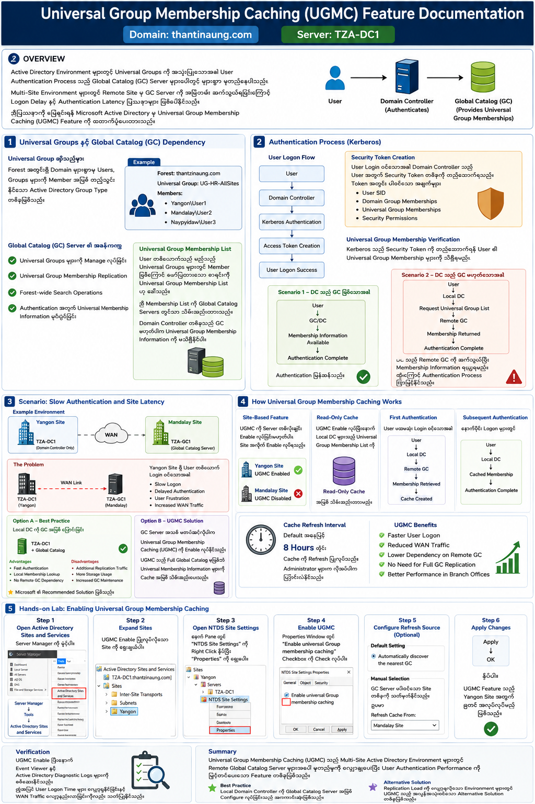
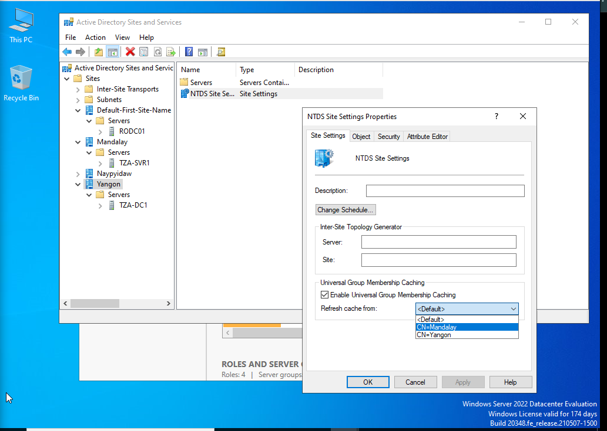

# Universal Group Membership Caching (UGMC) Feature Documentation
## Domain: thantzinaung.com
## Server: TZA-DC1

---

# Overview

Active Directory Environment များတွင် Universal Groups ကို အသုံးပြုသောအခါ User Authentication Process သည် Global Catalog (GC) Server များပေါ်တွင် များစွာ မူတည်နေပါသည်။

Multi-Site Environment များတွင် Remote Site မှ GC Server ကို အမြဲတမ်း ဆက်သွယ်ရခြင်းကြောင့် Logon Delay နှင့် Authentication Latency ပြဿနာများ ဖြစ်ပေါ်နိုင်သည်။

ဤပြဿနာကို ဖြေရှင်းရန် Microsoft Active Directory မှ **Universal Group Membership Caching (UGMC)** Feature ကို ထောက်ပံ့ပေးထားသည်။

---

# 1. Universal Groups နှင့် Global Catalog (GC) Dependency

## Universal Group ဆိုသည်မှာ

Universal Group သည် Forest အတွင်းရှိ Domain များစွာမှ Users, Groups များကို Member အဖြစ် ထည့်သွင်းနိုင်သော Active Directory Group Type တစ်ခုဖြစ်သည်။

### Example

```text
Forest: thantzinaung.com

Universal Group:
    UG-HR-AllSites

Members:
    Yangon\User1
    Mandalay\User2
    Naypyidaw\User3
```

---

## Global Catalog (GC) Server ၏ အခန်းကဏ္ဍ

Universal Groups များ၏ Membership Information များကို Global Catalog Server များကသာ သိမ်းဆည်းထားသည်။

### GC Server Responsibilities

- Universal Groups များကို Manage လုပ်ခြင်း
- Universal Group Membership Replication
- Forest-wide Search Operations
- Authentication အတွက် Universal Membership Information ပံ့ပိုးခြင်း

---

## Universal Group Membership List

User တစ်ယောက်သည် မည်သည့် Universal Groups များတွင် Member ဖြစ်ကြောင်း ဖော်ပြထားသော စာရင်းကို

**Universal Group Membership List** ဟု ခေါ်သည်။

ဤ Membership List ကို

```text
Global Catalog Servers
```

တွင်သာ သိမ်းဆည်းထားသည်။

Domain Controller တစ်ခုသည် GC မဟုတ်ပါက Universal Group Membership Information ကို မသိရှိနိုင်ပါ။

---

# 2. Authentication Process (Kerberos)

## User Logon Flow

User တစ်ယောက် Domain သို့ Login ဝင်သောအခါ Kerberos Authentication Process စတင်မည်။

```text
User
   ↓
Domain Controller
   ↓
Kerberos Authentication
   ↓
Access Token Creation
   ↓
User Logon Success
```

---

## Security Token Creation

User Login ဝင်သောအခါ Domain Controller သည် User အတွက် Security Token တစ်ခုကို တည်ဆောက်ရသည်။

Token အတွင်း ပါဝင်သော အချက်များ

- User SID
- Domain Group Memberships
- Universal Group Memberships
- Security Permissions

---

## Universal Group Membership Verification

Kerberos သည် Security Token ကို တည်ဆောက်ရန် User ၏ Universal Group Membership များကို သိရှိရမည်။

### Scenario 1 – DC သည် GC ဖြစ်သောအခါ

```text
User
  ↓
GC/DC
  ↓
Membership Information Available
  ↓
Authentication Complete
```

Authentication မြန်ဆန်သည်။

---

### Scenario 2 – DC သည် GC မဟုတ်သောအခါ

```text
User
  ↓
Local DC
  ↓
Request Universal Group List
  ↓
Remote GC
  ↓
Membership Returned
  ↓
Authentication Complete
```

DC သည် Remote GC ကို ဆက်သွယ်ပြီး Membership Information ရယူရမည်။

ထို့ကြောင့် Authentication Process ကြာမြင့်နိုင်သည်။

---

# 3. Scenario: Slow Authentication and Site Latency

## Example Environment

```text
Forest: thantzinaung.com

Yangon Site
 └── TZA-DC1
     (Domain Controller Only)

Mandalay Site
 └── TZA-GC1
     (Global Catalog Server)
```

---

## The Problem

Yangon Site ရှိ User တစ်ယောက် Login ဝင်သောအခါ

```text
TZA-DC1
   ↓
WAN Link
   ↓
TZA-GC1 (Mandalay)
```

ဆက်သွယ်ရမည်။

WAN Link Latency မြင့်မားပါက

- Slow Logon
- Delayed Authentication
- User Frustration
- Increased WAN Traffic

တို့ ဖြစ်ပေါ်နိုင်သည်။

---

# Option A – Best Practice

## Local DC ကို GC အဖြစ် ပြောင်းခြင်း

```text
Yangon Site

TZA-DC1
   +
Global Catalog
```

### Advantages

- Fast Authentication
- Local Membership Lookup
- No Remote GC Dependency

### Disadvantages

- Additional Replication Traffic
- More Storage Usage
- Increased GC Maintenance

Microsoft ၏ Recommended Solution ဖြစ်သည်။

---

# Option B – Universal Group Membership Caching (UGMC)

GC Server အသစ် မတပ်ဆင်လိုပါက

**Universal Group Membership Caching (UGMC)** ကို Enable လုပ်နိုင်သည်။

UGMC သည် Full Global Catalog မဖြစ်ဘဲ Universal Membership Information များကို Cache အဖြစ် သိမ်းဆည်းပေးသည်။

---

# 4. How Universal Group Membership Caching Works

## Site-Based Feature

UGMC ကို Server တစ်လုံးချင်း Enable လုပ်ခြင်းမဟုတ်ပါ။

Site အလိုက် Enable လုပ်ရသည်။

ဥပမာ

```text
Yangon Site
    UGMC Enabled

Mandalay Site
    UGMC Disabled
```

---

## Read-Only Cache

UGMC Enable လုပ်ပြီးနောက် Local Domain Controllers များသည် Universal Group Membership List ကို

```text
Read-Only Cache
```

အဖြစ် သိမ်းဆည်းထားမည်။

---

## First Authentication

User ပထမဆုံး Login ဝင်သောအခါ

```text
User
 ↓
Local DC
 ↓
Remote GC
 ↓
Membership Retrieved
 ↓
Cache Created
```

GC ကို ဆက်သွယ်ရမည်။

---

## Subsequent Authentication

နောက်ပိုင်း Logon များတွင်

```text
User
 ↓
Local DC
 ↓
Cached Membership
 ↓
Authentication Complete
```

ဖြစ်သောကြောင့် GC ကို အမြဲဆက်သွယ်ရန် မလိုတော့ပါ။

---

## Cache Refresh Interval

Default အနေဖြင့်

```text
8 Hours
```

တိုင်း Cache ကို Refresh ပြုလုပ်သည်။

Administrator များက လိုအပ်ပါက ပြောင်းလဲနိုင်သည်။

---

## UGMC Benefits

- Faster User Logon
- Reduced WAN Traffic
- Lower Dependency on Remote GC
- No Need for Full GC Replication
- Better Performance in Branch Offices

---

# 5. Hands-On Lab: Enabling Universal Group Membership Caching

## Lab Environment

```text
Domain : thantzinaung.com
Server : TZA-DC1

Site:
    Yangon
```

---

## Step 1: Open Active Directory Sites and Services

Server Manager ကို ဖွင့်ပါ။

```text
Server Manager
    ↓
Tools
    ↓
Active Directory Sites and Services
```

---

## Step 2: Expand Sites

```text
Sites
 └── Yangon
```

UGMC Enable ပြုလုပ်လိုသော Site ကို ရွေးချယ်ပါ။

---

## Step 3: Open NTDS Site Settings

ညာဘက် Pane တွင်

```text
NTDS Site Settings
```

ကို Right Click နှိပ်ပြီး

```text
Properties
```

ကို ရွေးပါ။

---

## Step 4: Enable Universal Group Membership Caching

Properties Window တွင်

```text
Enable Universal Group Membership Caching
```

Checkbox ကို Check လုပ်ပါ။

---

## Step 5: Configure Refresh Source (Optional)

### Default Setting

```text
Automatically discover the nearest GC
```

ကို အသုံးပြုနိုင်သည်။

### Manual Selection

GC Server ပါဝင်သော Site တစ်ခုကို သတ်မှတ်နိုင်သည်။

ဥပမာ

```text
Refresh Cache From:

Mandalay Site
```

---

## Step 6: Apply Changes

```text
Apply
  ↓
OK
```

နှိပ်ပါ။

UGMC Feature သည် Yangon Site အတွက် စတင် အလုပ်လုပ်မည် ဖြစ်သည်။

---

# Verification

UGMC Enable ပြီးနောက်

```text
Event Viewer
```

နှင့်

```text
Active Directory Diagnostic Logs
```

များကို စစ်ဆေးနိုင်သည်။

ထို့အပြင် User Logon Time များ လျှော့ချနိုင်ခြင်းနှင့် WAN Traffic လျော့နည်းလာခြင်းကိုလည်း သတိပြုနိုင်သည်။

---

# Summary

Universal Group Membership Caching (UGMC) သည် Multi-Site Active Directory Environment များတွင် Remote Global Catalog Server များအပေါ် မူတည်မှုကို လျှော့ချပေးပြီး User Authentication Performance ကို မြှင့်တင်ပေးသော Feature တစ်ခုဖြစ်သည်။

### Best Practice

Local Domain Controller ကို Global Catalog Server အဖြစ် Configure လုပ်ခြင်းသည် အကောင်းဆုံးဖြစ်သည်။

### Alternative Solution

Replication Load ကို လျှော့ချလိုသော Environment များတွင် UGMC သည် အလွန်အသုံးဝင်သော Alternative Solution တစ်ခုဖြစ်သည်။

---


