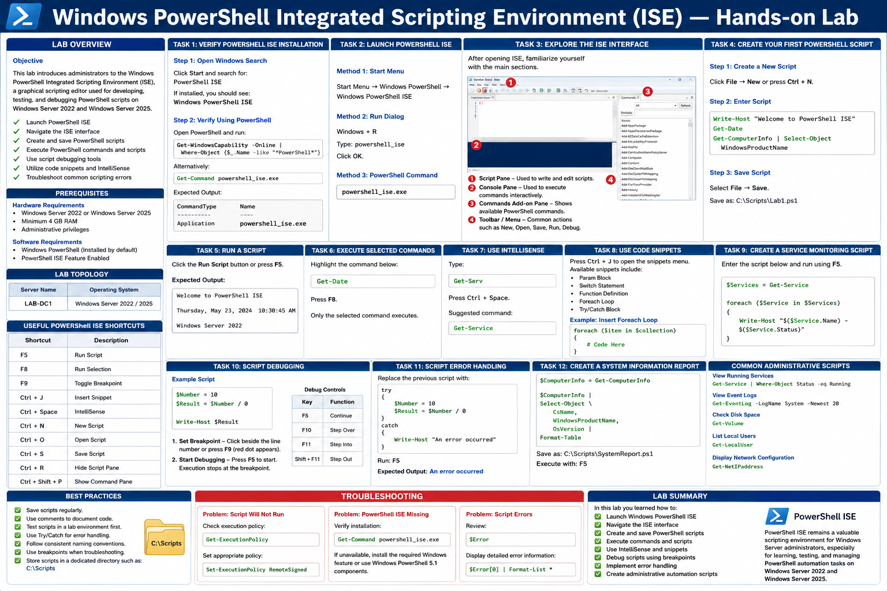
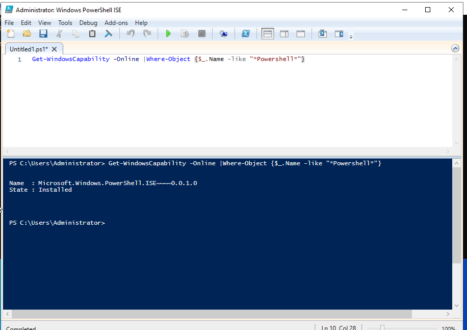
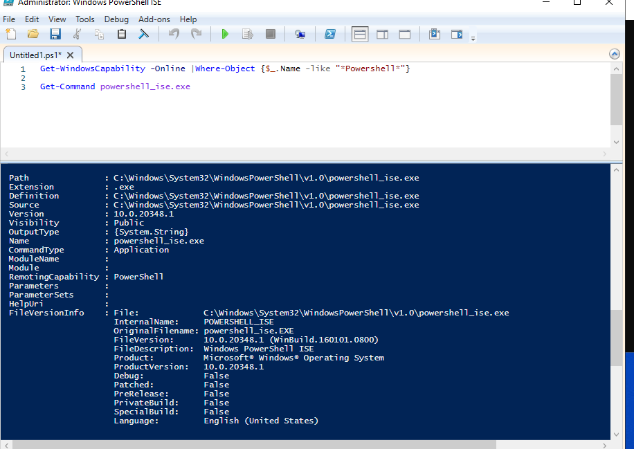
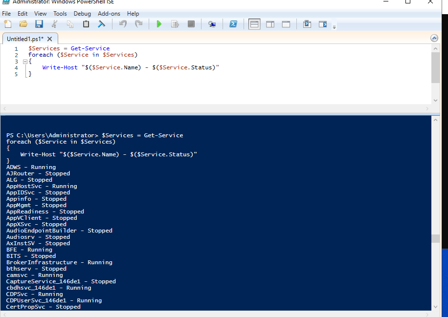
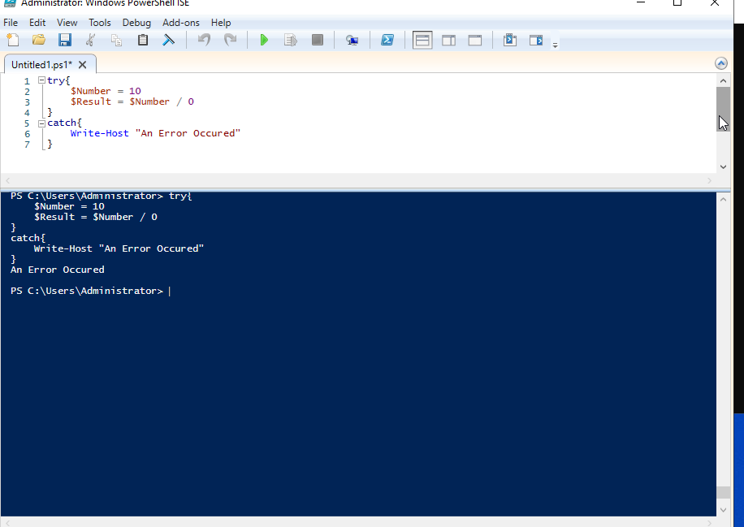
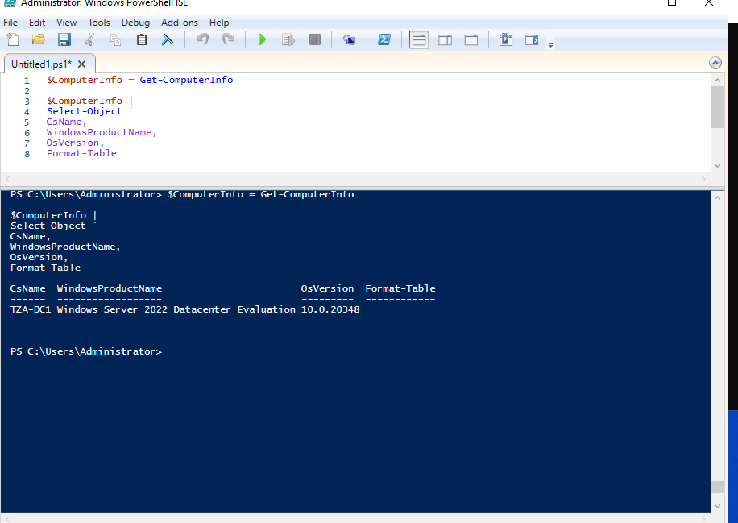
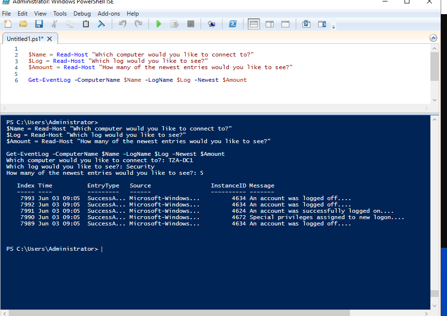

# Windows PowerShell Integrated Scripting Environment (ISE) — Hands-on Lab

## Lab Overview

### Objective

This lab introduces administrators to the Windows PowerShell Integrated Scripting Environment (ISE), a graphical scripting editor used for developing, testing, and debugging PowerShell scripts on Windows Server 2022 and Windows Server 2025.

* Launch PowerShell ISE
* Navigate the ISE interface
* Create and save PowerShell scripts
* Execute PowerShell commands and scripts
* Use script debugging tools
* Utilize code snippets and IntelliSense
* Troubleshoot common scripting errors

---

# Prerequisites

### Hardware Requirements

* Windows Server 2022 or Windows Server 2025
* Minimum 4 GB RAM
* Administrative privileges

### Software Requirements

* Windows PowerShell (Installed by default)
* PowerShell ISE Feature Enabled

---

# Lab Topology

| Server Name | Operating System           |
| ----------- | -------------------------- |
| LAB-DC1   | Windows Server 2022 / 2025 |

---

# Task 1: Verify PowerShell ISE Installation

## Step 1: Open Windows Search

Click **Start** and search for:

```text
PowerShell ISE
```

If installed, you should see:

```text
Windows PowerShell ISE
```

---

## Step 2: Verify Using PowerShell

Open PowerShell and run:

```powershell
Get-WindowsCapability -Online | Where-Object {$_.Name -like "*PowerShell*"}
```

Alternatively:

```powershell
Get-Command powershell_ise.exe
```

Expected Output:

```text
CommandType     Name
-----------     ----
Application     powershell_ise.exe
```

---

# Task 2: Launch PowerShell ISE

## Method 1: Start Menu

Navigate to:

```text
Start Menu
 └── Windows PowerShell
      └── Windows PowerShell ISE
```

---

## Method 2: Run Dialog

Press:

```text
Windows + R
```

Type:

```text
powershell_ise
```

Click **OK**.

---

## Method 3: PowerShell Command

```powershell
powershell_ise.exe
```

---

# Task 3: Explore the ISE Interface

After opening ISE, familiarize yourself with the main sections.

## Script Pane

Used to write and edit scripts.

Example:

```powershell
Write-Host "Hello World"
```

---

## Console Pane

Used to execute commands interactively.

Example:

```powershell
Get-Date
```

---

## Commands Add-on Pane

Displays available PowerShell commands.

Open it from:

```text
View → Show Command Add-on
```

Shortcut:

```text
Ctrl + Shift + P
```

---

# Task 4: Create Your First PowerShell Script

## Step 1: Create a New Script

Click:

```text
File → New
```

or

```text
Ctrl + N
```

---

## Step 2: Enter Script

```powershell
Write-Host "Welcome to PowerShell ISE"
Get-Date
Get-ComputerInfo | Select-Object WindowsProductName
```

---

## Step 3: Save Script

Select:

```text
File → Save
```

Save as:

```text
C:\Scripts\Lab1.ps1
```

---

# Task 5: Run a Script

Click the **Run Script** button or press:

```text
F5
```

Expected Output:

```text
Welcome to PowerShell ISE
Current Date and Time
Windows Server 2022
```

---

# Task 6: Execute Selected Commands

Highlight:

```powershell
Get-Date
```

Press:

```text
F8
```

Only the selected command executes.

This is useful for testing individual sections of a script.

---

# Task 7: Use IntelliSense

PowerShell ISE provides auto-completion.

Type:

```powershell
Get-Serv
```

Press:

```text
Ctrl + Space
```

Suggested command:

```powershell
Get-Service
```

---

# Task 8: Use Code Snippets

PowerShell ISE includes built-in script templates.

## Open Snippets Menu

Press:

```text
Ctrl + J
```

Available snippets include:

* Param Block
* Switch Statement
* Function Definition
* Foreach Loop
* Try/Catch Block

---

## Example: Insert Foreach Loop

```powershell
foreach ($item in $collection)
{
    # Code Here
}
```

---

# Task 9: Create a Service Monitoring Script

Create:

```powershell
$Services = Get-Service

foreach ($Service in $Services)
{
    Write-Host "$($Service.Name) - $($Service.Status)"
}
```

Run using:

```text
F5
```

Observe service status information displayed in the console pane.

---

# Task 10: Script Debugging

Debugging helps identify script errors.

---

## Example Script

```powershell
$Number = 10
$Result = $Number / 0

Write-Host $Result
```

---

## Set Breakpoint

Click beside the line number or press:

```text
F9
```

A red breakpoint indicator appears.

---

## Start Debugging

Press:

```text
F5
```

Execution stops at the breakpoint.

---

## Debug Controls

| Key         | Function  |
| ----------- | --------- |
| F5          | Continue  |
| F10         | Step Over |
| F11         | Step Into |
| Shift + F11 | Step Out  |

---

# Task 11: Script Error Handling

Replace the previous script with:

```powershell
try
{
    $Number = 10
    $Result = $Number / 0
}
catch
{
    Write-Host "An error occurred"
}
```

Run:

```text
F5
```

Expected Output:

```text
An error occurred
```

---

# Task 12: Create a System Information Report

```powershell
$ComputerInfo = Get-ComputerInfo

$ComputerInfo |
Select-Object `
CsName,
WindowsProductName,
OsVersion |
Format-Table
```

Save as:

```text
C:\Scripts\SystemReport.ps1
```

Execute with:

```text
F5
```

---

# Useful PowerShell ISE Shortcuts

| Shortcut         | Description       |
| ---------------- | ----------------- |
| F5               | Run Script        |
| F8               | Run Selection     |
| F9               | Toggle Breakpoint |
| Ctrl + J         | Insert Snippet    |
| Ctrl + Space     | IntelliSense      |
| Ctrl + N         | New Script        |
| Ctrl + O         | Open Script       |
| Ctrl + S         | Save Script       |
| Ctrl + R         | Hide Script Pane  |
| Ctrl + Shift + P | Show Command Pane |

---

# Common Administrative Scripts

## View Running Services

```powershell
Get-Service | Where-Object Status -eq Running
```

---

## View Event Logs

```powershell
Get-EventLog -LogName System -Newest 20
```

(or)

```powershell
$Name = Read-Host "Which computer would you like to connect to?"
$Log = Read-Host "Which log would you like to see?"
$Amount = Read-Host "How many of the newest entries would you like to see?"

Get-EventLog -ComputerName $Name -LogName $Log -Newest $Amount
```

---

## Check Disk Space

```powershell
Get-Volume
```

---

## List Local Users

```powershell
Get-LocalUser
```

---

## Display Network Configuration

```powershell
Get-NetIPAddress
```

---

# Best Practices

* Save scripts regularly.
* Use comments to document code.
* Test scripts in a lab environment first.
* Use Try/Catch for error handling.
* Follow consistent naming conventions.
* Use breakpoints when troubleshooting.
* Store scripts in a dedicated directory such as:

```text
C:\Scripts
```

---

# Troubleshooting

## Problem: Script Will Not Run

Check execution policy:

```powershell
Get-ExecutionPolicy
```

Set appropriate policy:

```powershell
Set-ExecutionPolicy RemoteSigned
```

---

## Problem: PowerShell ISE Missing

Verify installation:

```powershell
Get-Command powershell_ise.exe
```

If unavailable, install the required Windows feature or use Windows PowerShell 5.1 components.

---

## Problem: Script Errors

Review:

```powershell
$Error
```

Display detailed error information:

```powershell
$Error[0] | Format-List *
```

---

# Lab Summary

In this lab you learned how to:

✅ Launch Windows PowerShell ISE

✅ Navigate the ISE interface

✅ Create and save PowerShell scripts

✅ Execute commands and scripts

✅ Use IntelliSense and snippets

✅ Debug scripts using breakpoints

✅ Implement error handling

✅ Create administrative automation scripts

PowerShell ISE remains a valuable scripting environment for Windows Server administrators, especially for learning, testing, and managing PowerShell automation tasks on Windows Server 2022 and Windows Server 2025.


---







