# Using PowerShell for AD DS Users, Organizational Units, and Groups: Hands-On Lab


# Lab Overview

This hands-on lab demonstrates how to manage **Organizational Units (OUs)**, **User Accounts**, and **Groups** within Active Directory Domain Services (AD DS) using Windows PowerShell.

- Launch and use PowerShell ISE
- Create Organizational Units (OUs)
- Create Active Directory users
- Search for AD objects
- Create security groups
- Add users to groups
- Verify Active Directory objects through PowerShell

---

# Lab Environment

| Item | Value |
|--------|--------|
| Domain Name | thantzinaung.com |
| Administrator | that paing |
| Server Role | Active Directory Domain Services |
| Management Tool | Windows PowerShell ISE |
| Module Required | ActiveDirectory |

---

# Lab Objectives

In this lab:

1. Use PowerShell ISE for AD administration
2. Create Organizational Units (OUs)
3. Create AD DS user accounts
4. Search Active Directory objects
5. Create security groups
6. Add users to groups
7. Verify group memberships

---

# Exercise 1: Environment Setup and Tooling

## Step 1: Open PowerShell ISE

Although commands can be executed directly from a standard PowerShell console, **PowerShell ISE (Integrated Scripting Environment)** is recommended because it provides:

- Script editing capabilities
- Syntax highlighting
- Command IntelliSense
- Easier script development and testing
- Multi-line command support

### Method 1: Search Windows

1. Open Start Menu
2. Search for:

```powershell
PowerShell ISE
```

3. Launch the application as Administrator

---

### Method 2: Launch from PowerShell

Open a PowerShell window and execute:

```powershell
ise
```

PowerShell ISE will open automatically.

---

## Step 2: Import Active Directory Module

Verify that the Active Directory module is available:

```powershell
Get-Module -ListAvailable ActiveDirectory
```

Import the module:

```powershell
Import-Module ActiveDirectory
```

Verify the import:

```powershell
Get-Module ActiveDirectory
```

---

## Step 3: Use Microsoft Documentation

Microsoft provides detailed examples for every Active Directory cmdlet.

View built-in help:

```powershell
Get-Help New-ADUser
```

Detailed help:

```powershell
Get-Help New-ADUser -Detailed
```

Examples:

```powershell
Get-Help New-ADUser -Examples
```

Online documentation:

```powershell
Get-Help New-ADUser -Online
```

---

# Exercise 2: Managing Organizational Units (OUs)

## Step 1: Discover OU Commands

If you forget the cmdlet name, search for commands related to Organizational Units.

Execute:

```powershell
Get-Command -Noun *org*
```

Example output:

```text
Get-ADOrganizationalUnit
New-ADOrganizationalUnit
Remove-ADOrganizationalUnit
Set-ADOrganizationalUnit
```

---

## Step 2: Create an Organizational Unit

### Create IT Department OU

```powershell
New-ADOrganizationalUnit `
-Name "IT" `
-Path "DC=thantzinaung,DC=com"
```

### Create HR Department OU

```powershell
New-ADOrganizationalUnit `
-Name "HR" `
-Path "DC=thantzinaung,DC=com"
```

---

## Understanding Distinguished Names (DN)

The **-Path** parameter requires a Distinguished Name.

Correct syntax:

```text
DC=thantzinaung,DC=com
```

Incorrect syntax:

```text
DC=thantzinaung.com
```

### Important Rules

- Use commas between domain components.
- Do not use periods in Distinguished Names.
- Path values are not case-sensitive.
- Capitalization improves readability.

Example:

```text
OU=IT,DC=thantzinaung,DC=com
```

---

## Step 3: Verify OUs

List all Organizational Units:

```powershell
Get-ADOrganizationalUnit -Filter *
```

Specific OU:

```powershell
Get-ADOrganizationalUnit `
-Identity "OU=IT,DC=thantzinaung,DC=com"
```

---

# Exercise 3: Automating User Account Creation

## Step 1: Create a Secure Password Variable

Avoid storing passwords as plain text.

Create a secure password prompt:

```powershell
$password = Read-Host -AsSecureString
```

You will be prompted to enter a password securely.

---

## Step 2: Create User Account

### Create User: Aung Kyaw

```powershell
New-ADUser `
-Name "Aung Aung" `
-GivenName "Aung" `
-Surname "Aung" `
-SamAccountName "aAung" `
-UserPrincipalName "aAung@thantzinaung.com" `
-AccountPassword (Read-Host -AsSecureString) `
-Enabled $true `
-Path "OU=IT,DC=thantzinaung,DC=com"
```

---

## Parameter Explanation

| Parameter | Description |
|------------|------------|
| -Name | Full display name |
| -GivenName | First name |
| -Surname | Last name |
| -SamAccountName | Pre-Windows 2000 logon name |
| -UserPrincipalName | Email-style login name |
| -AccountPassword | Secure password |
| -Enabled $true | Enables account immediately |
| -Path | OU location |

---

## Step 3: Create User Using Password Variable

```powershell
$password = Read-Host -AsSecureString

New-ADUser `
-Name "Mya Mya" `
-GivenName "Mya" `
-Surname "Mya" `
-SamAccountName "mmya" `
-UserPrincipalName "mmya@thantzinaung.com" `
-AccountPassword $password `
-Enabled $true `
-Path "OU=HR,DC=thantzinaung,DC=com"
```

---

## Step 4: Verify User Creation

Display all users:

```powershell
Get-ADUser -Filter *
```

Display selected properties:

```powershell
Get-ADUser -Filter * `
-Properties DisplayName `
| Select Name,DisplayName
```

---

# Exercise 4: Searching Active Directory Users

## List All Users

```powershell
Get-ADUser -Filter *
```

---

## Search by Name

```powershell
Get-ADUser `
-Filter "Name -like '*Aung*'"
```

---

## Search by SamAccountName

```powershell
Get-ADUser `
-Filter "SamAccountName -eq 'akyaw'"
```

---

## Search Users Within IT OU

```powershell
Get-ADUser `
-Filter * `
-SearchBase "OU=IT,DC=thantzinaung,DC=com"
```

---

# Exercise 5: Creating Active Directory Groups

## Step 1: Create Security Group

Create a Global Security Group for IT staff:

```powershell
New-ADGroup `
-Name "IT-Admins" `
-GroupCategory Security `
-GroupScope Global `
-Path "OU=IT,DC=thantzinaung,DC=com"
```

---

## Group Categories

### Security Group

Used for:

- Permissions
- Access Control
- Resource Assignment

Example:

```powershell
-GroupCategory Security
```

### Distribution Group

Used for:

- Email distribution
- Messaging systems

Example:

```powershell
-GroupCategory Distribution
```

---

## Group Scopes

### Global

Typically contains users from the same domain.

```powershell
-GroupScope Global
```

### Domain Local

Used to assign permissions within a domain.

```powershell
-GroupScope DomainLocal
```

### Universal

Used across multiple domains within a forest.

```powershell
-GroupScope Universal
```

---

## Step 2: Verify Group Creation

```powershell
Get-ADGroup `
-Filter *
```

Display group details:

```powershell
Get-ADGroup `
-Identity "IT-Admins"
```

---

# Exercise 6: Adding Members to Groups

## Add Single User

```powershell
Add-ADGroupMember `
-Identity "IT-Admins" `
-Members "akyaw"
```

---

## Add Multiple Users

```powershell
Add-ADGroupMember `
-Identity "IT-Admins" `
-Members "akyaw","mmya"
```

---

## Verify Membership

```powershell
Get-ADGroupMember `
-Identity "IT-Admins"
```

---

# Exercise 7: Complete Automation Example

The following script creates an OU, user, group, and group membership automatically.

```powershell
Import-Module ActiveDirectory

$password = Read-Host -AsSecureString

New-ADOrganizationalUnit `
-Name "PowerShell-Lab" `
-Path "DC=thantzinaung,DC=com"

New-ADUser `
-Name "Lab User" `
-GivenName "Lab" `
-Surname "User" `
-SamAccountName "labuser" `
-UserPrincipalName "labuser@thantzinaung.com" `
-AccountPassword $password `
-Enabled $true `
-Path "OU=PowerShell-Lab,DC=thantzinaung,DC=com"

New-ADGroup `
-Name "Lab-Admins" `
-GroupCategory Security `
-GroupScope Global `
-Path "OU=PowerShell-Lab,DC=thantzinaung,DC=com"

Add-ADGroupMember `
-Identity "Lab-Admins" `
-Members "labuser"

Get-ADGroupMember `
-Identity "Lab-Admins"
```

---

# Verification Checklist

| Task | Status |
|--------|--------|
| Open PowerShell ISE | ☑ |
| Import AD Module | ☑ |
| Create OU | ☑ |
| Verify OU | ☑ |
| Create User | ☑ |
| Search User | ☑ |
| Create Group | ☑ |
| Add User to Group | ☑ |
| Verify Membership | ☑ |

---

# Lab Summary

Successfully used PowerShell to manage Active Directory Domain Services in the **thantzinaung.com** domain. 

- Work with PowerShell ISE
- Discover AD cmdlets using `Get-Command`
- Create Organizational Units using `New-ADOrganizationalUnit`
- Create users with `New-ADUser`
- Securely handle passwords with `Read-Host -AsSecureString`
- Search Active Directory objects with `Get-ADUser`
- Create groups using `New-ADGroup`
- Add members using `Add-ADGroupMember`
- Verify objects and memberships using AD DS PowerShell cmdlets

This approach enables efficient automation and large-scale Active Directory administration through scripting.

---

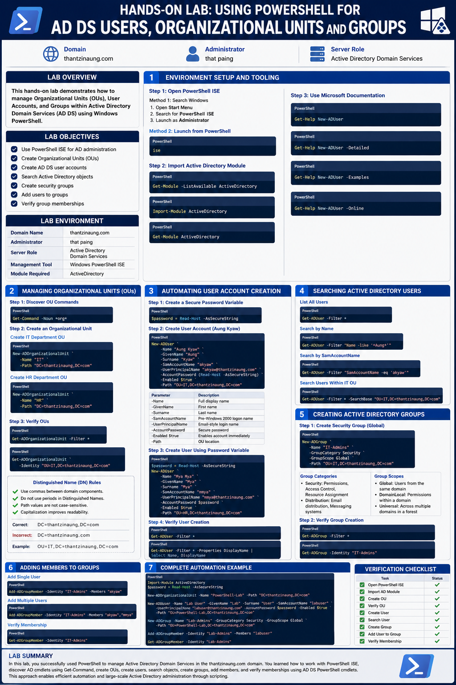
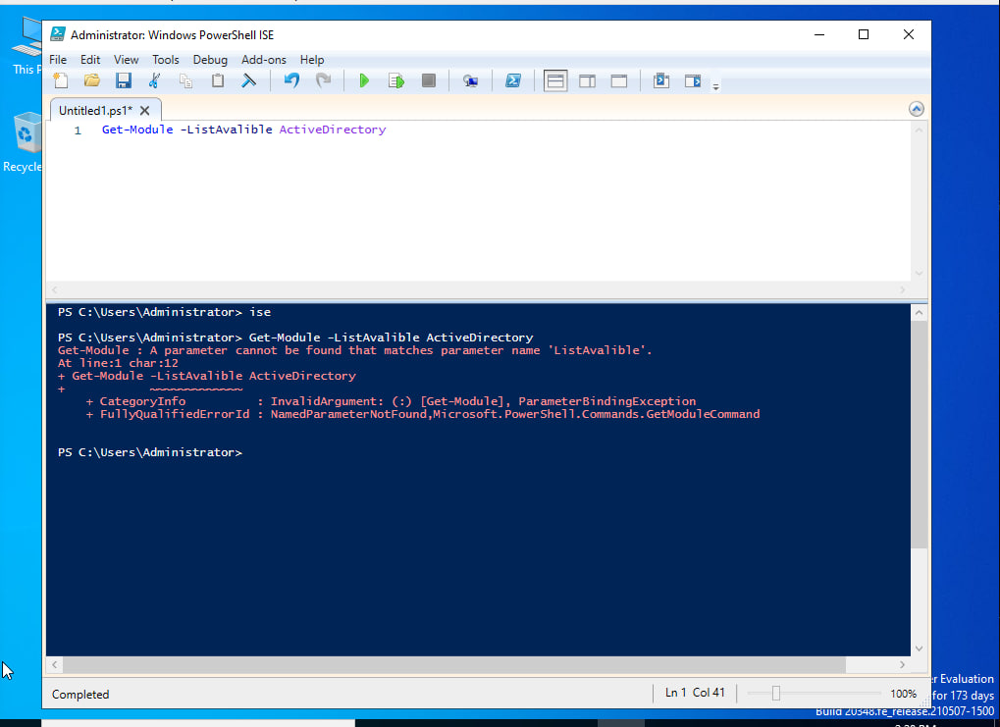
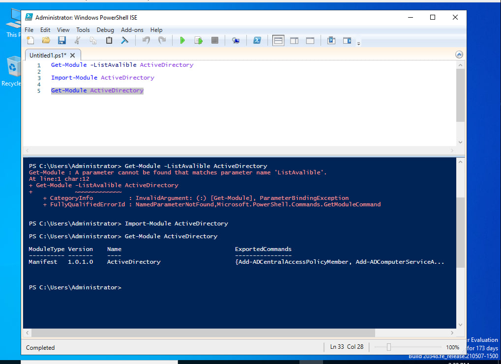
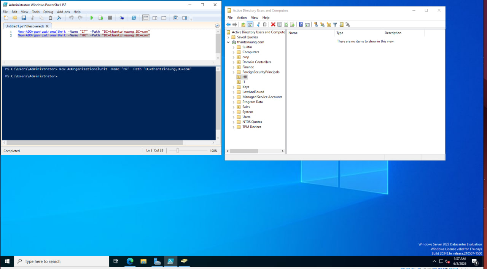
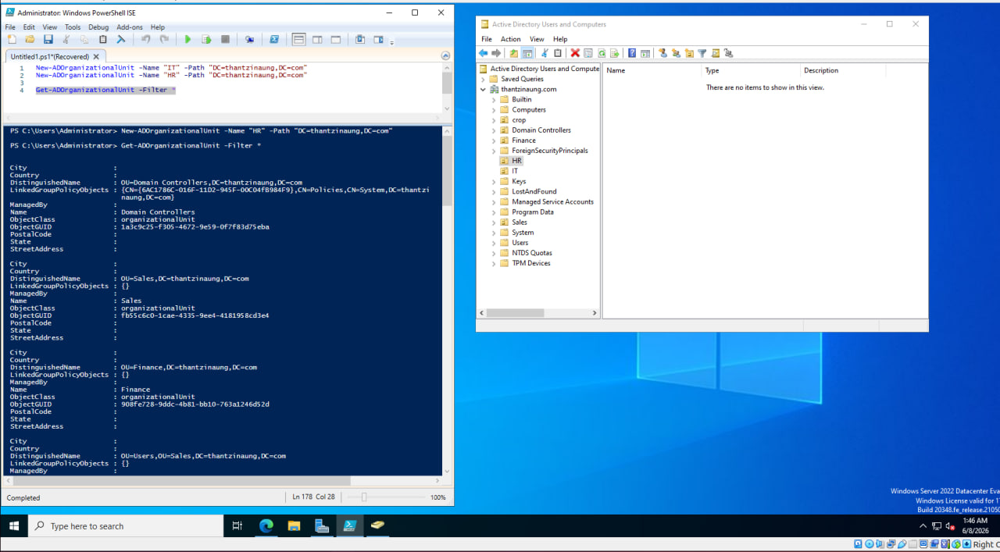
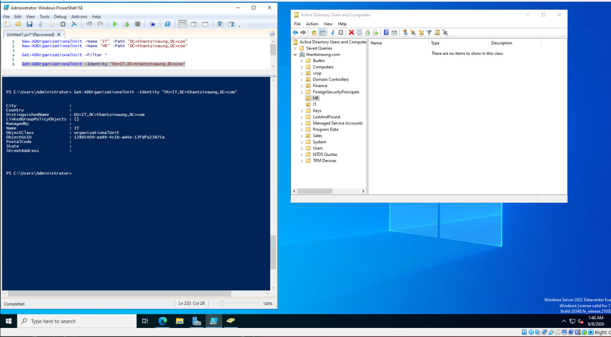
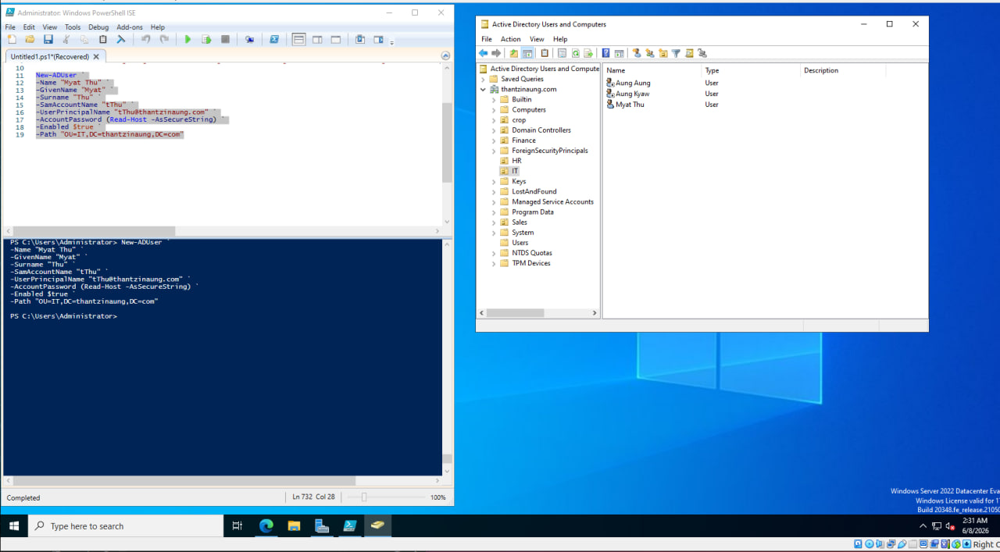
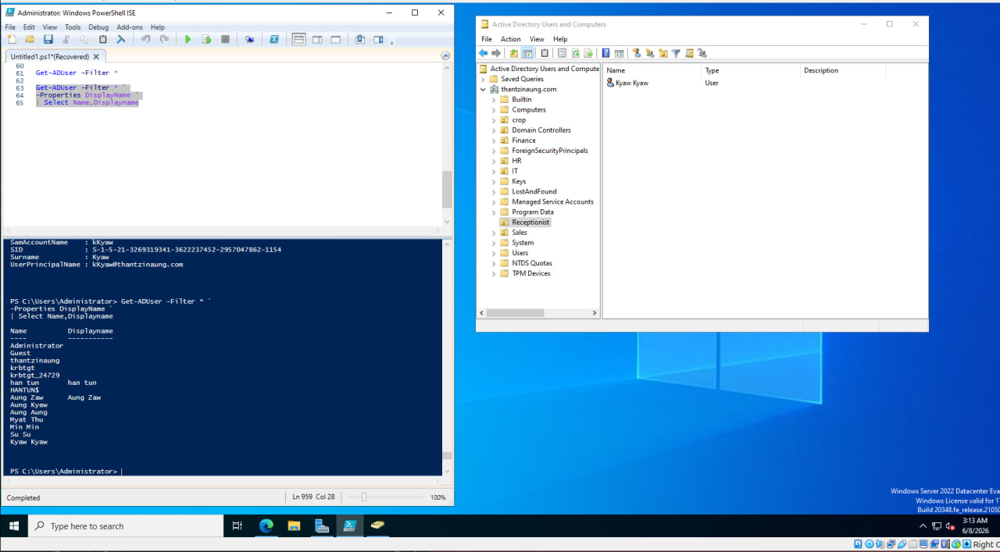
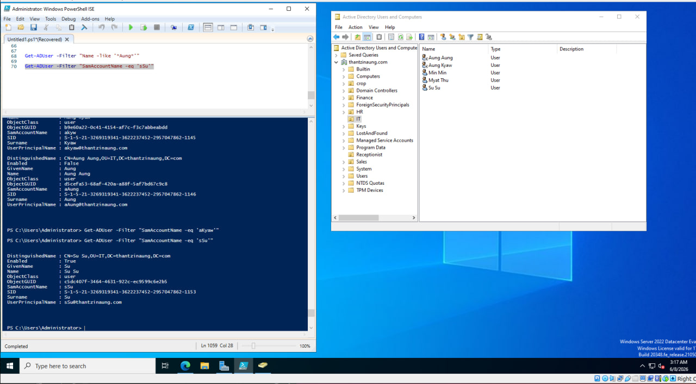
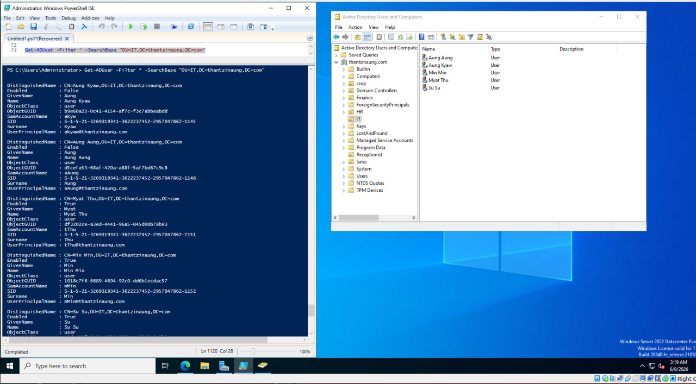
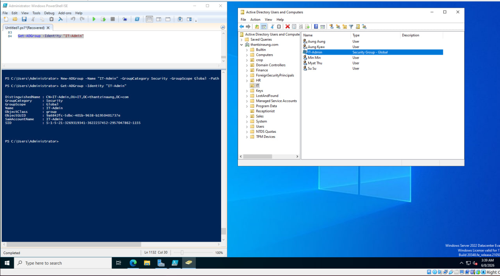
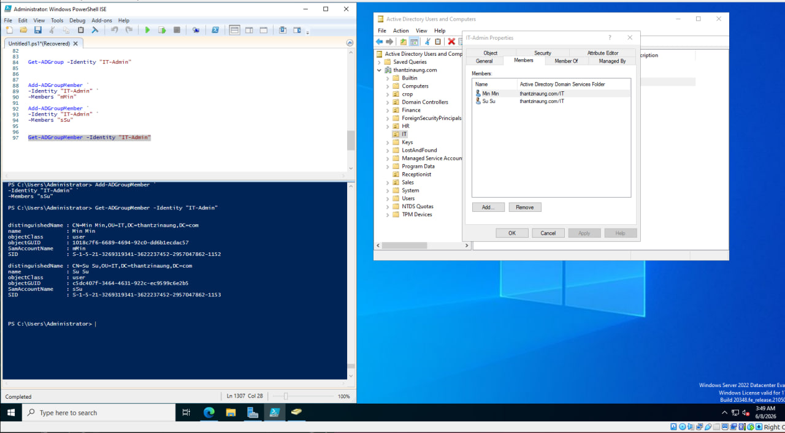
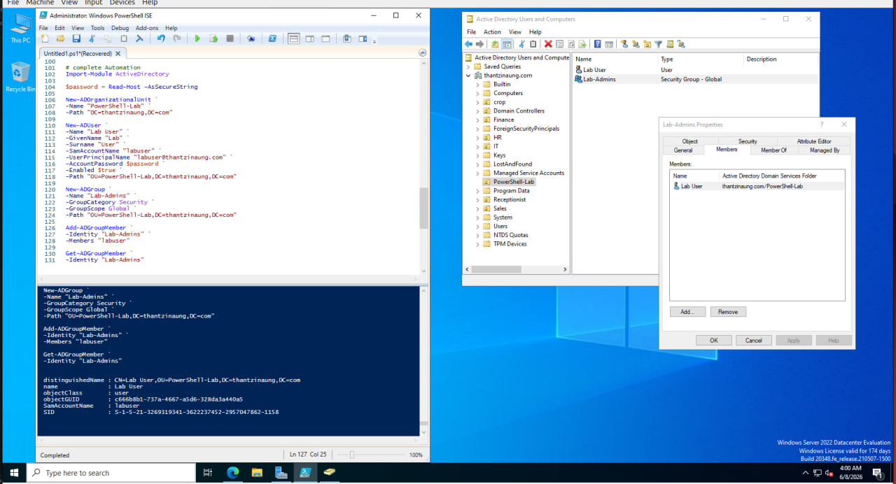
