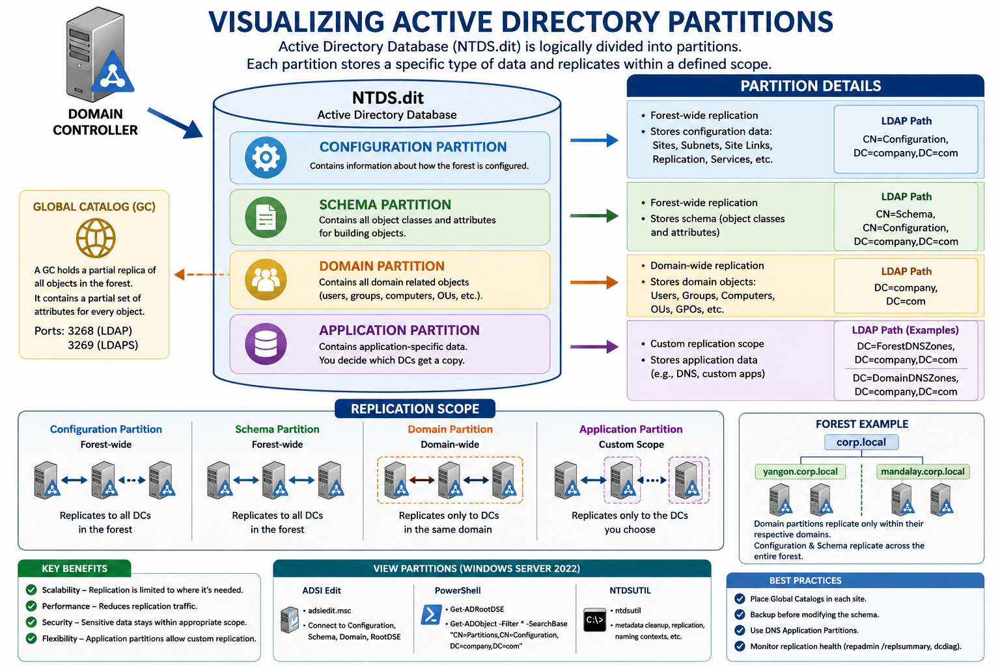

# Visualizing Active Directory Partitions in Windows Server 2022

## Overview

**Active Directory Domain Services (AD DS)** သည် Windows Server 2022 Environment တွင် User, Computer, Group, Policy နှင့် Network Resources များကို စီမံခန့်ခွဲပေးသော Directory Service ဖြစ်သည်။

Active Directory Database ကို **NTDS.dit** ဖိုင်အဖြစ် Domain Controller (DC) ပေါ်တွင် သိမ်းဆည်းထားပြီး၊ Database အတွင်းရှိ Data များကို **Partitions (Naming Contexts)** များအဖြစ် ခွဲခြားထားသည်။

အောက်ပါ Diagram သည် Active Directory Database ၏ Partition Structure ကို ဖော်ပြထားသည်။

---

## Active Directory Database Structure

```text
NTDS.dit
│
├── Configuration Partition
├── Schema Partition
├── Domain Partition
└── Application Partition
```

Partition တစ်ခုချင်းစီသည် Replication Scope နှင့် Data Type မတူညီပါ။

---

# 1. Configuration Partition

Configuration Partition တွင် Active Directory Forest ၏ Configuration ဆိုင်ရာ Information များကို သိမ်းဆည်းထားသည်။

ဥပမာ -

- Sites
- Subnets
- Site Links
- Replication Topology
- Services Configuration

## Replication

Configuration Partition သည် **Forest-wide Replication** ဖြစ်ပြီး Forest အတွင်းရှိ Domain Controller အားလုံးသို့ Replicate လုပ်သည်။

## LDAP Path

```text
CN=Configuration,DC=company,DC=com
```

## အသုံးဝင်ပုံ

Administrator များသည်

- Multi-Site AD Design
- Replication Planning
- Services Integration

များအတွက် Configuration Partition ကို အသုံးပြုကြသည်။

---

# 2. Schema Partition

Schema Partition သည် Active Directory ၏ Blueprint ဖြစ်သည်။

AD Object များကို တည်ဆောက်ရန်အတွက်

- Object Classes
- Attributes

များကို သတ်မှတ်ထားသည်။

## ဥပမာ

User Object တွင်

```text
givenName
surname
mail
telephoneNumber
```

စသည့် Attribute များ ပါဝင်နိုင်သည်။

Computer Object တွင်

```text
operatingSystem
dNSHostName
```

စသည့် Attribute များ ပါဝင်နိုင်သည်။

## Replication

Schema Partition သည် **Forest-wide Replication** ဖြစ်သည်။

Forest အတွင်းရှိ Domain Controller အားလုံးသို့ Replicate လုပ်သည်။

## LDAP Path

```text
CN=Schema,CN=Configuration,DC=company,DC=com
```

## Schema Master Role

Schema ပြောင်းလဲမှုများကို **Schema Master FSMO Role** ရှိသော Domain Controller တွင်သာ ပြုလုပ်နိုင်သည်။

---

# 3. Domain Partition

Domain Partition သည် Domain အတွက် အရေးကြီးဆုံး Partition ဖြစ်သည်။

Domain အတွင်းရှိ Objects အားလုံးကို သိမ်းဆည်းထားသည်။

ဥပမာ -

- Users
- Groups
- Computers
- Organizational Units (OU)
- Group Policies

## LDAP Path

```text
DC=company,DC=com
```

## Replication

Domain Partition သည် **Domain-wide Replication** ဖြစ်သည်။

Domain တစ်ခုအတွင်းရှိ Domain Controllers များသာ Replicate လုပ်ကြသည်။

### Example

Forest Structure

```text
corp.local
│
├── Yangon.corp.local
└── Mandalay.corp.local
```

Yangon Domain မှ User Object များကို Mandalay Domain DC များထံ မပို့ပါ။

Domain အတွင်းရှိ DC များသို့သာ Replicate လုပ်သည်။

---

# Global Catalog (GC)

## Global Catalog ဆိုသည်မှာ

Global Catalog သည် Forest အတွင်းရှိ Domain အားလုံးမှ Object များ၏ Partial Copy ကို သိမ်းဆည်းထားသည်။

Full Copy မဟုတ်ဘဲ Frequently Used Attributes များသာ ပါဝင်သည်။

## GC ၏ အကျိုးကျေးဇူး

User Search မြန်ဆန်စေသည်။

ဥပမာ -

```text
User A သည် Yangon Domain တွင်ရှိသည်။
User B သည် Mandalay Domain တွင်ရှိသည်။
```

## Global Catalog (GC)
- လုပ်ဆောင်ချက်: Global Catalog သည် Forest အတွင်းရှိ Domain အားလုံးတွင်ရှိသော Object များ၏ အစိတ်အပိုင်းအချို့ (Subset) ကို စုစည်းထားသည့် အထူးအပိုင်းဖြစ်သည်။
- အရေးပါပုံ: မတူညီသော Domain များအကြား Object များကို ရှာဖွေနိုင်ရန် ကူညီပေးသည် (ဥပမာ - Yangon domain ရှိ စက်တစ်ခုမှ Mandalay domain ရှိ User တစ်ဦးကို ရှာဖွေနိုင်ခြင်း)။
- အသုံးပြုမှု: Domain တစ်ခုတည်းသာရှိသော Network တွင် GC သည် အရေးမပါသော်လည်း Domain များစွာရှိသော Forest ပတ်ဝန်းကျင်တွင် အလွန်အရေးကြီးပါသည်။

* GC Server သည် Forest တစ်ခုလုံးကို Search ပြုလုပ်နိုင်သည်။

## GC Port

```text
3268
```

SSL

```text
3269
```

---

# 4. Application Partition

Application Partition သည် စိတ်ကြိုက် (Custom) တည်ဆောက်နိုင်သော Partition ဖြစ်ပြီး မည်သည့် DC များထံသို့ Replicate လုပ်မည်ကို ရွေးချယ်နိုင်သည် ။ ယနေ့ခေတ်တွင် DNS အချက်အလက်များ (Forest DNS zone နှင့် Domain DNS zone) အတွက် အဓိက အသုံးပြုပါသည် 

## Replication

Custom Replication ဖြစ်သည်။

လိုအပ်သော DC များထံသာ Replicate လုပ်သည်။

## အသုံးများသော Example

### ForestDNSZone

Forest အတွင်းရှိ DNS Information များကို သိမ်းဆည်းသည်။

Replication Scope

```text
All DNS Servers in Forest
```

### DomainDNSZone

Domain အလိုက် DNS Records များကို သိမ်းဆည်းသည်။

Replication Scope

```text
All DNS Servers in Domain
```

## LDAP Paths

ForestDNSZone

```text
DC=ForestDNSZones,DC=company,DC=com
```

DomainDNSZone

```text
DC=DomainDNSZones,DC=company,DC=com
```

---

# Active Directory Replication Summary

| Partition | Contains | Replication Scope |
|------------|----------|------------------|
| Configuration | Forest Configuration | Forest-wide |
| Schema | Object Definitions & Attributes | Forest-wide |
| Domain | Users, Groups, Computers, OUs | Domain-wide |
| Application | DNS & Custom Data | Custom Scope |

---

# Windows Server 2022 တွင် Partition များကို ကြည့်ရှုနည်း

## Method 1 – ADSI Edit

Run Box

```text
adsiedit.msc
```

Connect to

- Default Naming Context
- Configuration
- Schema
- RootDSE

တို့ကို ကြည့်ရှုနိုင်သည်။

---

## Method 2 – PowerShell

### Current Naming Contexts

```powershell
Get-ADRootDSE
```

Output Example

```powershell
configurationNamingContext
schemaNamingContext
defaultNamingContext
rootDomainNamingContext
```

---

### List Application Partitions

```powershell
Get-ADObject -Filter * `
-SearchBase "CN=Partitions,CN=Configuration,DC=company,DC=com"
```

---

## Method 3 – NTDSUTIL

```cmd
ntdsutil
```

အသုံးပြုပြီး

- Replication
- Metadata
- Naming Contexts

များကို စစ်ဆေးနိုင်သည်။

---

# Windows Server 2022 Best Practices

### 1. Global Catalog ကို Site အလိုက် ထားပါ

Large Enterprise Environment တွင် Login နှင့် Search Performance ကောင်းစေသည်။

### 2. Schema Modification မပြုမီ Backup ယူပါ

Schema ပြောင်းလဲမှုသည် Forest တစ်ခုလုံးအပေါ် သက်ရောက်မှုရှိသည်။

### 3. DNS ကို Application Partition တွင် သိမ်းပါ

ForestDNSZones နှင့် DomainDNSZones အသုံးပြုခြင်းသည် Replication Traffic ကို လျှော့ချပေးသည်။

### 4. Replication Health ကို စစ်ဆေးပါ

```powershell
repadmin /replsummary
```

```powershell
dcdiag /test:dns
```

---

# Conclusion

Windows Server 2022 Active Directory Database (NTDS.dit) ကို အဓိကအားဖြင့်

1. **Configuration Partition**
2. **Schema Partition**
3. **Domain Partition**
4. **Application Partition**

ဟူ၍ ခွဲခြားထားသည်။

- **Configuration** → Forest Configuration
- **Schema** → Object Template & Attributes
- **Domain** → Users, Groups, Computers
- **Application** → DNS နှင့် Custom Data

တို့ကို သိမ်းဆည်းထားပြီး Replication Scope များကွဲပြားခြင်းကြောင့် Active Directory သည် Scalability, Performance နှင့် Efficient Replication ကို ပံ့ပိုးပေးနိုင်ပါသည်။ Windows Server 2022 Environment တွင် AD Architecture ကို နက်နက်ရှိုင်းရှိုင်း နားလည်ရန် Partition Structure ကို သိရှိထားခြင်းသည် အရေးကြီးသော အခြေခံအချက်တစ်ခု ဖြစ်ပါသည်။

