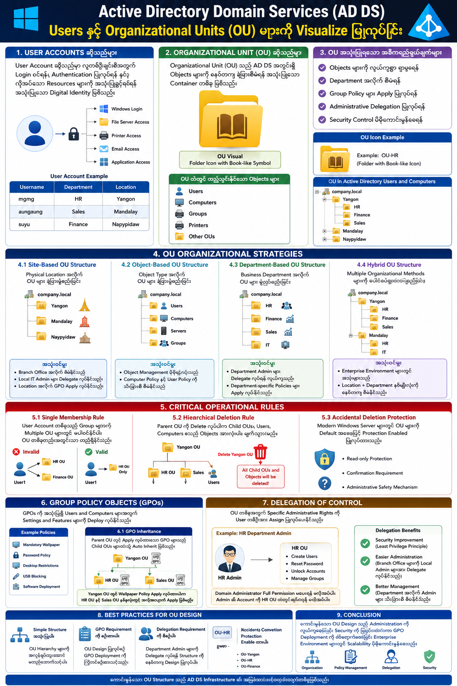

# Visualizing Active Directory Domain Services (AD DS) Users & Organizational Units (OU) 

## 1. Overview

Active Directory Domain Services (AD DS) သည် Windows Server Environment များတွင် အသုံးပြုသော Centralized Identity နှင့် Resource Management System ဖြစ်သည်။
AD DS ကို အသုံးပြုခြင်းဖြင့် Users, Computers, Groups နှင့် Policies များကို စနစ်တကျ စီမံခန့်ခွဲနိုင်သည်။

ဤ Documentation တွင် —

* User Accounts များ၏ အဓိပ္ပါယ်
* Organizational Units (OU) များ၏ အသုံးဝင်ပုံ
* OU Structure Design Strategy များ
* Management နှင့် Security Features များ
* Visual Organization Method များ

---

# 2. User Accounts ဆိုသည်မှာ

User Account ဆိုသည်မှာ —

လူတစ်ဦးချင်းစီအတွက် Login ဝင်ရန်၊ Authentication ပြုလုပ်ရန် နှင့် Network Resources များကို အသုံးပြုခွင့်ရရန် အသုံးပြုသော Digital Identity ဖြစ်သည်။

User Account များမှတဆင့် —

* Windows Login ဝင်ခြင်း
* File Server Access
* Printer Access
* Email အသုံးပြုခြင်း
* Application Authentication

တို့ကို ဆောင်ရွက်နိုင်သည်။

## User Account Example

| Username | Department | Location  |
| -------- | ---------- | --------- |
| mgmg     | HR         | Yangon    |
| aungaung | Sales      | Mandalay  |
| suyu     | Finance    | Naypyidaw |

---

# 3. Organizational Unit (OU) ဆိုသည်မှာ

Organizational Unit (OU) သည် AD DS အတွင်းရှိ Objects များကို စနစ်တကျ ခွဲခြားစီမံရန် အသုံးပြုသော Container တစ်ခု ဖြစ်သည်။

OU ထဲတွင် —

* Users
* Computers
* Groups
* Printers
* Other OUs

များကို ထည့်သွင်းထားနိုင်သည်။

Visual အနေဖြင့် OU ကို Folder Symbol နှင့် Book-like Icon ပုံစံဖြင့် တွေ့ရသည်။

## OU အသုံးပြုရသော အဓိကရည်ရွယ်ချက်များ

* Objects များကို လွယ်ကူစွာ ရှာဖွေရန်
* Department အလိုက် စီမံရန်
* Group Policy များ Apply ပြုလုပ်ရန်
* Administrative Delegation ပြုလုပ်ရန်
* Security Control ပိုမိုကောင်းမွန်စေရန်

---

# 4. OU Organizational Strategies

AD DS Environment တွင် OU Structure Design ကို စနစ်တကျ ပြုလုပ်ရန် အရေးကြီးသည်။

အောက်ပါ Strategies များကို အသုံးများကြသည်။

---

# 4.1 Site-Based OU Structure

Physical Location အလိုက် OU များ ခွဲခြားဖွဲ့စည်းခြင်း ဖြစ်သည်။

## Example

```text
Company.local
│
├── Yangon
├── Mandalay
└── Naypyidaw
```

## အသုံးဝင်မှု

* Branch Office အလိုက် စီမံနိုင်သည်
* Local IT Admin များ Delegate လုပ်နိုင်သည်
* Location အလိုက် GPO Apply လုပ်နိုင်သည်

---

# 4.2 Object-Based OU Structure

Object Type အလိုက် ခွဲခြားဖွဲ့စည်းခြင်း ဖြစ်သည်။

## Example

```text
Company.local
│
├── Users
├── Computers
├── Servers
└── Groups
```

## အသုံးဝင်မှု

* Object Management ပိုမိုရှင်းလင်းသည်
* Computer Policy နှင့် User Policy ကို သီးခြားစီ စီမံနိုင်သည်

---

# 4.3 Department-Based OU Structure

Business Department အလိုက် OU များဖွဲ့စည်းခြင်း ဖြစ်သည်။

## Example

```text
Company.local
│
├── HR
├── Finance
├── Sales
└── IT
```

## အသုံးဝင်မှု

* Department Admin များ Delegate လုပ်ရန် လွယ်ကူသည်
* Department-specific Policies များ Apply လုပ်နိုင်သည်

---

# 4.4 Hybrid OU Structure

Hybrid Strategy သည် Multiple Organizational Methods များကို ပေါင်းစပ်အသုံးပြုခြင်း ဖြစ်သည်။

## Example

```text
Company.local
│
├── Yangon
│   ├── HR
│   ├── Finance
│   └── Sales
│
├── Mandalay
│   ├── HR
│   └── IT
```

## အသုံးဝင်မှု

* Enterprise Environment များတွင် အသုံးများသည်
* Location + Department နှစ်မျိုးလုံးကို စနစ်တကျ စီမံနိုင်သည်

---

# 5. Critical Operational Rules

OU Management တွင် သိထားရမည့် အရေးကြီးသော Rules များရှိသည်။

---

# 5.1 Single Membership Rule

User Account တစ်ခုသည် Group များကဲ့သို့ Multiple OU များတွင် မပါဝင်နိုင်ပါ။

User Account တစ်ခုသည် OU တစ်ခုတည်းအတွင်းသာ တည်ရှိနိုင်သည်။

## Example

❌ Invalid

```text
User1 → HR OU
User1 → Finance OU
```

✅ Valid

```text
User1 → HR OU Only
```

---

# 5.2 Hierarchical Deletion Rule

Parent OU ကို Delete လုပ်ပါက —

* Child OUs
* Users
* Computers
* Objects အားလုံး

ပါဝင်ပြီး အကုန်ဖျက်သွားမည်ဖြစ်သည်။

## Example

```text
Yangon OU
 ├── HR OU
 ├── Sales OU
 └── Users
```

Yangon OU ကို Delete လုပ်ပါက အောက်ရှိ Objects အားလုံးပါ ဖျက်သွားမည်။

ထို့ကြောင့် OU Delete လုပ်ရာတွင် အထူးသတိထားရန် လိုအပ်သည်။

---

# 5.3 Accidental Deletion Protection

Modern Windows Server များတွင် OU များကို Default အနေဖြင့် Protection Enabled ပြုလုပ်ထားသည်။

ဤ Feature သည် OU Hierarchy များကို မတော်တဆ Delete ဖြစ်ခြင်းမှ ကာကွယ်ပေးသည်။

## Protection Feature

* Read-only Protection
* Confirmation Requirement
* Administrative Safety Mechanism

---

# 6. Group Policy Objects (GPOs)

Group Policy Objects (GPOs) သည် —

Users နှင့် Computers များအတွက် Settings နှင့် Features များကို Centralized အနေဖြင့် Deploy လုပ်ရန် အသုံးပြုသည်။

## Example Policies

* Mandatory Wallpaper
* Password Policy
* Desktop Restrictions
* USB Blocking
* Software Deployment

---

# 6.1 GPO Inheritance

Parent OU တွင် Apply လုပ်ထားသော GPO များသည် Child OUs များထံသို့ Auto Inherit ဖြစ်သွားသည်။

## Example

```text
Yangon OU
 ├── HR OU
 └── Sales OU
```

Yangon OU တွင် Wallpaper Policy Apply လုပ်ထားပါက —

* HR OU
* Sales OU

နှစ်ခုလုံးတွင် အလိုအလျောက် Apply ဖြစ်မည်။

---

# 7. Delegation of Control

Delegation of Control သည် —

OU တစ်ခုအတွက် Specific Administrative Rights များကို User တစ်ဦးအား Assign ပြုလုပ်ပေးနိုင်သော Feature ဖြစ်သည်။

## Example

HR Department Admin ကို —

* HR Users Create
* Password Reset
* Unlock Account

လုပ်ခွင့်ပေးနိုင်သည်။

သို့သော် Domain Administrator Full Permission မပေးရန် မလိုအပ်ပါ။

---

# 7.1 Delegation Benefits

## Security Improvement

Least Privilege Principle ကို အသုံးပြုနိုင်သည်။

## Easier Administration

Branch Office များကို Local Admin များအား Delegate လုပ်နိုင်သည်။

## Better Management

Department အလိုက် Admin များ သီးခြားစီ စီမံနိုင်သည်။

---

# 8. Best Practices for OU Design

## Recommended Guidelines

### Simple Structure အသုံးပြုပါ

OU Hierarchy များကို အလွန်ရှုပ်ထွေးအောင် မတည်ဆောက်သင့်ပါ။

### GPO Requirement ကို စဉ်းစားပါ

OU Design ပြုလုပ်စဉ် GPO Deployment ကို ကြိုတင်စဉ်းစားသင့်သည်။

### Delegation Requirement ကို စီစဉ်ပါ

Department Admin များကို Delegate လုပ်ရန် Structure ကို စနစ်တကျ Design ပြုလုပ်ပါ။

### Naming Convention အသုံးပြုပါ

ဥပမာ —

```text
OU-Yangon
OU-HR
OU-Finance
```

### Accidental Deletion Protection Enable ထားပါ

OU Delete Error များကို ကာကွယ်နိုင်သည်။

---

# 9. Conclusion

Active Directory Organizational Units (OUs) များသည် —

* Object Organization
* Policy Management
* Administrative Delegation
* Security Control

အတွက် အလွန်အရေးကြီးသော Logical Structure တစ်ခုဖြစ်သည်။

ကောင်းမွန်သော OU Design သည် —

* Administration ကို လွယ်ကူစေသည်
* Security ကို မြှင့်တင်ပေးသည်
* GPO Deployment ကို ထိရောက်စေသည်
* Enterprise Environment များတွင် Scalability ပိုမိုကောင်းမွန်စေသည်

ထို့ကြောင့် AD DS Infrastructure Design ပြုလုပ်ရာတွင် OU Structure ကို စနစ်တကျ စီစဉ်တည်ဆောက်သင့်သည်။

---

