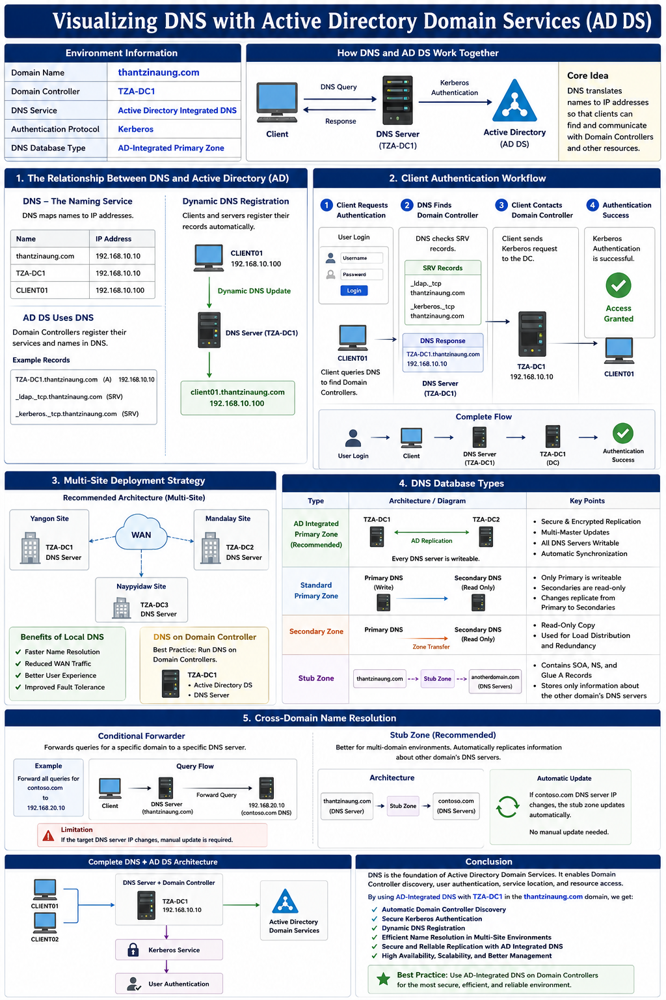

# Visualizing DNS with Active Directory Domain Services (AD DS)

## Environment Information

| Item | Value |
|--------|--------|
| Domain Name | thantzinaung.com |
| Domain Controller | TZA-DC1 |
| DNS Service | Active Directory Integrated DNS |
| Authentication Protocol | Kerberos |
| DNS Zone Type | AD Integrated Primary Zone |

---

# 1. DNS နှင့် Active Directory (AD) အကြား ဆက်စပ်မှု

## DNS ဆိုတာဘာလဲ?

DNS (Domain Name System) သည် Computer Name များကို IP Address များနှင့် ချိတ်ဆက်ပေးသော Naming Service တစ်ခုဖြစ်သည်။

ဥပမာ -

```text
thantzinaung.com  →  192.168.1.100
TZA-DC1           →  192.168.1.100
```

အသုံးပြုသူများသည် IP Address များကို မှတ်သားရန် မလိုအပ်ဘဲ Domain Name များဖြင့်သာ အသုံးပြုနိုင်သည်။

---

## AD DS ဘာကြောင့် DNS လိုအပ်သလဲ?

Active Directory သည် DNS မရှိဘဲ အလုပ်မလုပ်နိုင်ပါ။

Domain Controller (TZA-DC1) သည် မိမိ၏ Services များကို DNS တွင် Register လုပ်ထားရသည်။

### Example

```text
Domain Controller
      │
      ▼
   TZA-DC1
      │
      ▼
DNS Zone: thantzinaung.com
```

Domain Controller ၏ Records များကို DNS Zone ထဲတွင် သိမ်းဆည်းထားသည်။

ဥပမာ -

```text
Host (A) Record

TZA-DC1.thantzinaung.com
      ↓
192.168.1.100
```

---

## Dynamic DNS Registration

Windows Client များနှင့် Server များသည် DNS ထဲသို့ မိမိတို့၏ Host Record များကို အလိုအလျောက် Register လုပ်ကြသည်။

### Visualization

```text
Windows Client
(Client01)

      │
      │ Dynamic Update
      ▼

DNS Server (TZA-DC1)

      │
      ▼

client01.thantzinaung.com
      ↓
192.168.1.100
```

---

# 2. Client Authentication Workflow

User Login ဝင်သောအခါ DNS နှင့် AD DS အကြား လုပ်ဆောင်ပုံ

## Step 1 – Client Requests Authentication

```text
User Login

username:
password:
```

Client Computer သည် Domain Controller ကို ရှာဖွေရန် DNS ကို Query လုပ်သည်။

```text
Client01
    │
    │ Query
    ▼
DNS Server
```

---

## Step 2 – DNS Finds Domain Controller

DNS သည် Domain Controller များ၏ Service Records များကို စစ်ဆေးသည်။

```text
SRV Records

_ldap._tcp.thantzinaung.com
_kerberos._tcp.thantzinaung.com
```

DNS Response

```text
TZA-DC1.thantzinaung.com
192.168.1.100
```

---

## Step 3 – Client Contacts Domain Controller

```text
Client01
     │
     │ Kerberos Request
     ▼
TZA-DC1
```

---

## Step 4 – Authentication Success

```text
Client01
      │
      ▼
TZA-DC1
      │
      ▼
Kerberos Authentication
      │
      ▼
Access Granted
```

---

## Complete Authentication Flow

```text
User Login
    │
    ▼
Client01
    │
    │ DNS Query
    ▼
DNS Server (TZA-DC1)
    │
    │ Return DC Address
    ▼
Client01
    │
    │ Kerberos Request
    ▼
TZA-DC1
    │
    ▼
Authentication Success
```

---

# 3. Multi-Site Deployment Strategy

Company တွင် Branch Office များရှိပါက Site တစ်ခုစီတွင် DNS Server တပ်ဆင်ထားသင့်သည်။

ဥပမာ -

- Yangon
- Mandalay
- Naypyidaw

---

## Recommended Design

```text
                   WAN

      ┌─────────────────────────┐
      │                         │
      ▼                         ▼

 Yangon Site              Mandalay Site

 TZA-DC1                  TZA-DC2
 DNS Server               DNS Server

      ▲                         ▲
      │                         │

      └────────────┬────────────┘
                   │
                   ▼

            Naypyidaw Site

              TZA-DC3
              DNS Server
```

---

## Benefits

### Faster Name Resolution

Yangon User သည် Mandalay DNS Server သို့ WAN Link ဖြတ်ပြီး Query မလုပ်ရပါ။

```text
Yangon Client
      │
      ▼
Yangon DNS
```

Local Site ထဲတွင်ပင် Resolution ပြုလုပ်နိုင်သည်။

---

## DNS on Domain Controller

Best Practice အရ DNS ကို Domain Controller ပေါ်တွင် Run သင့်သည်။

```text
TZA-DC1
├── Active Directory
└── DNS Service
```

အကြောင်းရင်းမှာ AD Integrated DNS ကို အသုံးပြုနိုင်သောကြောင့် ဖြစ်သည်။

---

# 4. DNS Database Types

## Active Directory Integrated Primary Zone (Recommended)

### Architecture

```text
AD Database
      │
      ▼

DNS Zone
(thantzinaung.com)

      │
      ▼

Automatic Replication
```

---

### Advantages

- Secure Replication
- Encrypted Replication
- Multi-Master Updates
- Every DNS Server Writable

---

### Example

```text
TZA-DC1
   ▲
   │
   │ AD Replication
   │
   ▼
TZA-DC2
```

DNS Record အသစ်ထည့်ပါက Server နှစ်ခုလုံးတွင် Update ဖြစ်သည်။

---

## Standard Primary Zone

Primary Server တစ်ခုတည်းသာ Write လုပ်နိုင်သည်။

```text
Primary DNS
     │
     ▼
Secondary DNS
(Read Only)
```

---

### Limitation

Record အသစ်ထည့်လိုပါက -

```text
Client
   │
   ▼
Primary DNS
```

တွင်သာ ပြုလုပ်ရမည်။

---

## Secondary Zone

Read-Only Copy ဖြစ်သည်။

```text
Primary DNS
     │
Zone Transfer
     ▼
Secondary DNS
```

---

## Stub Zone

အခြား Domain ၏ DNS Server Information ကိုသာ သိမ်းထားသော Zone ဖြစ်သည်။

### Contains

- SOA Record
- NS Record
- Glue A Records

---

### Visualization

```text
thantzinaung.com
       │
       ▼
Stub Zone
       │
       ▼
anotherdomain.com
```

---

# 5. Cross-Domain Name Resolution

Domain နှစ်ခုအကြား Name Resolution ပြုလုပ်ခြင်း

---

## Conditional Forwarder

ဥပမာ -

`thantzinaung.com`

မှ

`contoso.com`

သို့ Query ပို့ရန်

```text
Forward all queries for
contoso.com

to

192.168.2.100
```

---

### Visualization

```text
Client
   │
   ▼
DNS Server
   │
   │ Forward Query
   ▼
192.168.2.100
```

---

### Limitation

Target DNS Server IP ပြောင်းလဲသွားပါက Manual Update ပြုလုပ်ရမည်။

---

## Stub Zone (Recommended)

Multi-Domain Environment များတွင် Stub Zone ကို အသုံးပြုခြင်းက ပိုမိုကောင်းမွန်သည်။

---

### Visualization

```text
thantzinaung.com
        │
        │ Stub Zone
        ▼
contoso.com
        │
        ▼
DNS Servers
```

---

### Automatic Update

contoso.com ၏ DNS Server IP ပြောင်းသွားပါက

```text
Stub Zone
     │
     ▼
Auto Update
```

ဖြစ်သောကြောင့် Administrator မှ Manual Update ပြုလုပ်ရန် မလိုအပ်ပါ။

---

# Complete DNS + AD DS Architecture

```text
                 thantzinaung.com

        ┌───────────────────────────┐
        │                           │
        ▼                           ▼

     Client01                   Client02
        │                           │
        └──────────┬────────────────┘
                   │
                   ▼

            DNS Server / DC

                 TZA-DC1
           192.168.1.100

                   │
                   │
                   ▼

         Active Directory DS

                   │
                   ▼

           Kerberos Service

                   │
                   ▼

         User Authentication
```

---

# Conclusion

DNS သည် Active Directory Domain Services (AD DS) ၏ အဓိက အစိတ်အပိုင်းဖြစ်ပြီး Domain Controller များကို ရှာဖွေရန်၊ User Authentication ပြုလုပ်ရန်နှင့် Network Resources များကို Access လုပ်နိုင်ရန် အရေးကြီးသော Infrastructure Service တစ်ခု ဖြစ်သည်။

**thantzinaung.com Domain** တွင် **TZA-DC1 Domain Controller** ကို DNS Server နှင့် တွဲဖက်အသုံးပြုခြင်းအားဖြင့် -

- Domain Controller Discovery လုပ်နိုင်သည်။
- Kerberos Authentication ကို အောင်မြင်စွာ ဆောင်ရွက်နိုင်သည်။
- Dynamic DNS Registration ကို အသုံးပြုနိုင်သည်။
- Multi-Site Environment များတွင် Efficient Name Resolution ရရှိနိုင်သည်။
- AD Integrated DNS Replication ဖြင့် Secure နှင့် Reliable DNS Infrastructure ကို တည်ဆောက်နိုင်သည်။

---


