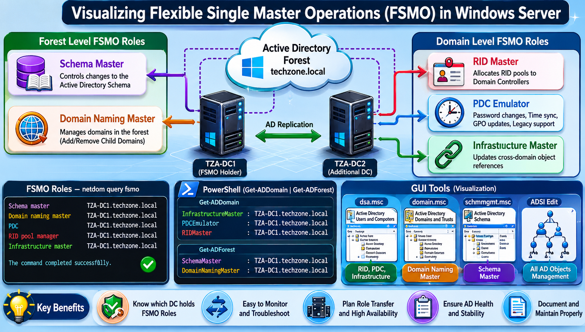
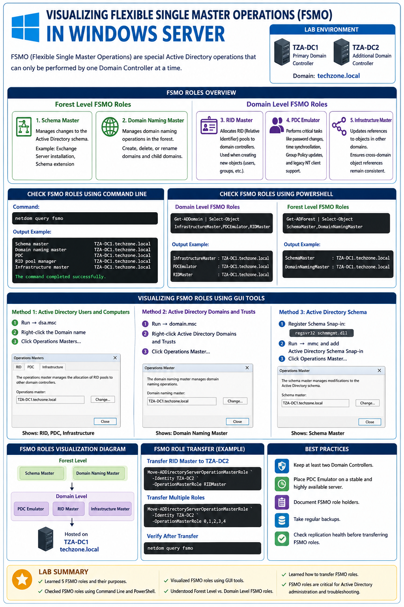
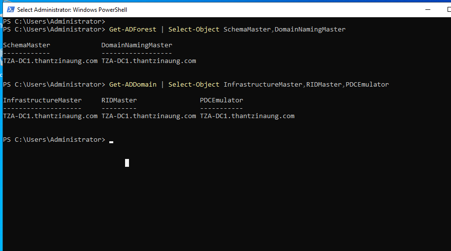
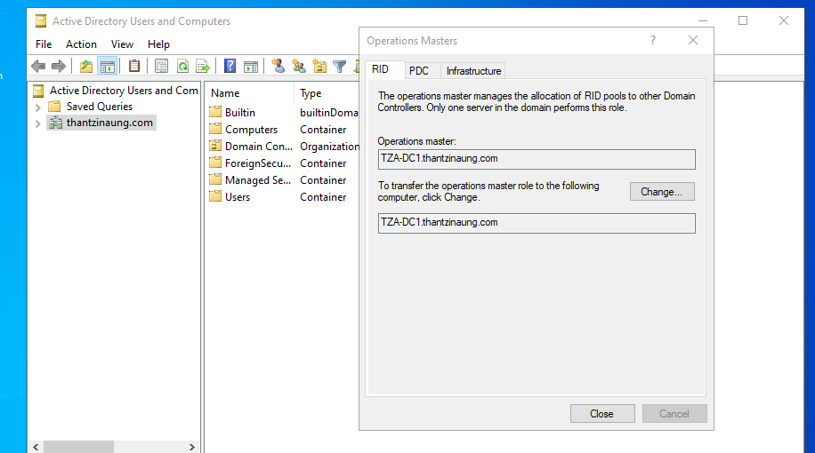
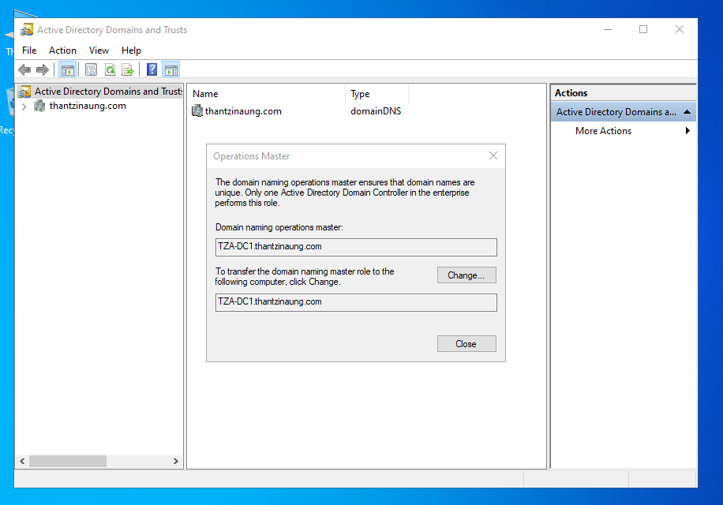
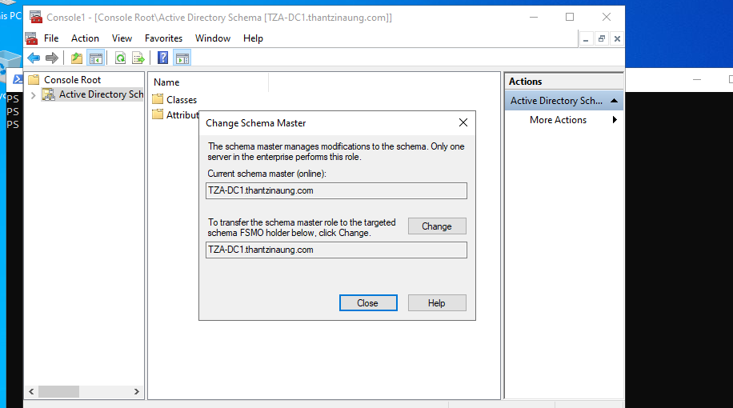
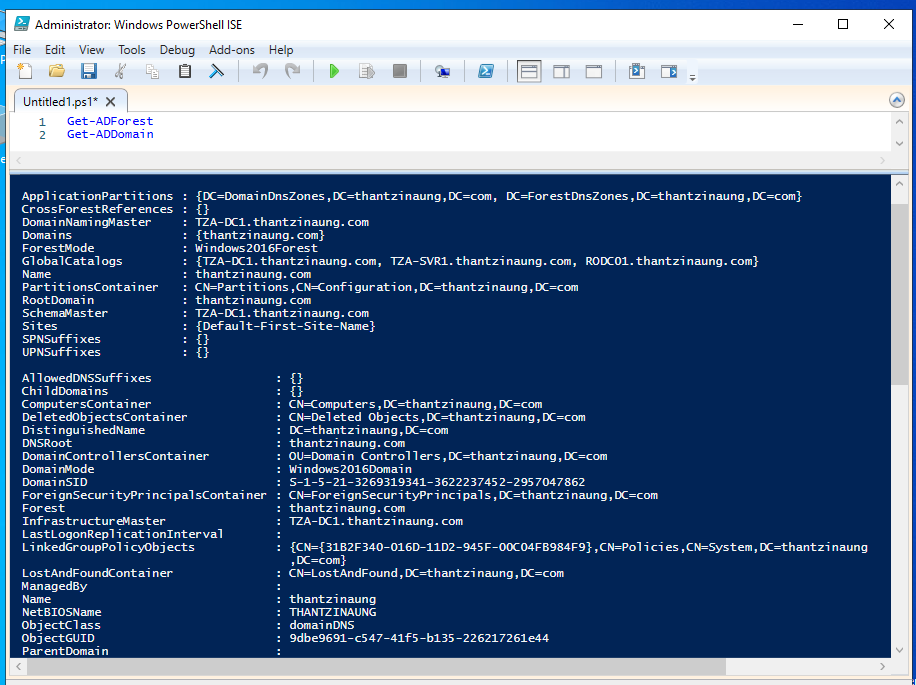
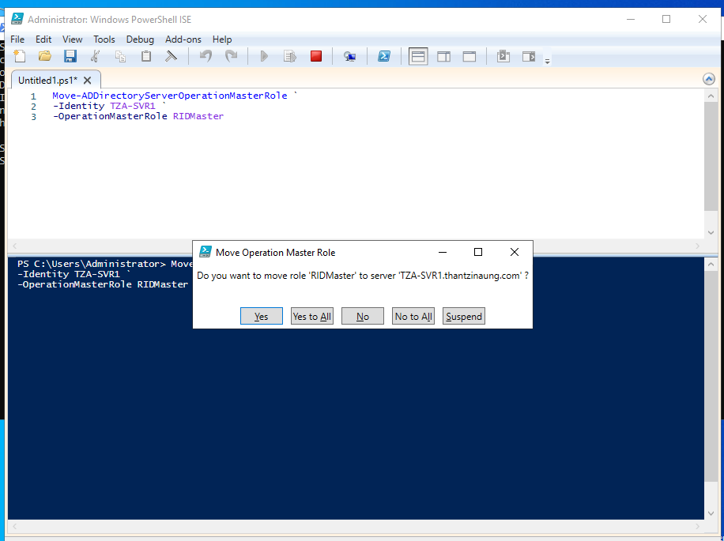
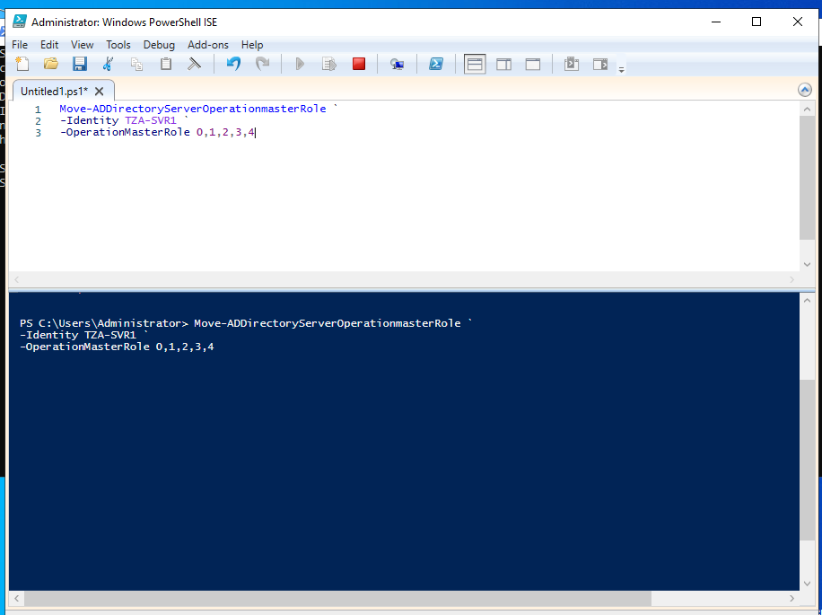

# Visualizing Flexible Single Master Operations (FSMO) in Windows Server

## Objective

ဤ Lab ၏ ရည်ရွယ်ချက်မှာ Windows Server Active Directory Environment တွင် FSMO (Flexible Single Master Operations) Roles များကို လေ့လာပြီး Visualization Tools များအသုံးပြုကာ FSMO Roles မည်သည့် Domain Controller တွင် တာဝန်ယူထားသည်ကို စစ်ဆေးနိုင်ရန် ဖြစ်သည်။

---

# FSMO ဆိုတာဘာလဲ?

Active Directory သည် Multi-Master Replication Architecture ကို အသုံးပြုထားသော်လည်း အချို့သော Operations များကို Domain Controller တစ်ခုတည်းမှသာ စီမံခန့်ခွဲရန် လိုအပ်ပါသည်။

ထို Special Operations များကို FSMO (Flexible Single Master Operations) ဟုခေါ်သည်။

စုစုပေါင်း FSMO Roles (၅) ခု ရှိပါသည်။

### Forest Level FSMO Roles

1. Schema Master
2. Domain Naming Master

### Domain Level FSMO Roles

3. RID Master
4. PDC Emulator
5. Infrastructure Master

---

# Lab Environment

| Server Name | Role                         |
| ----------- | ---------------------------- |
| TZA-DC1     | Primary Domain Controller    |
| TZA-SVR1    | Additional Domain Controller |
| Domain      | thantzinaung.com             |

---

# FSMO Roles Overview

## 1. Schema Master

* Active Directory Schema Changes များကို စီမံခန့်ခွဲသည်။
* Forest အတွင်း Schema Update ပြုလုပ်နိုင်သော DC တစ်ခု ဖြစ်သည်။

ဥပမာ

* Exchange Server Installation
* Active Directory Schema Extension

---

## 2. Domain Naming Master

* Forest အတွင်း Domain အသစ်များ ထည့်ခြင်း
* Child Domain ဖန်တီးခြင်း
* Domain ဖျက်ခြင်း

စသည့် Operations များကို ထိန်းချုပ်သည်။

---

## 3. RID Master

RID (Relative Identifier) Pool များကို Domain Controllers များသို့ ဖြန့်ဝေပေးသည်။

ဥပမာ

User Account အသစ်တစ်ခု ဖန်တီးသည့်အခါ SID တစ်ခုထုတ်ပေးရန် RID လိုအပ်သည်။

---

## 4. PDC Emulator

အရေးကြီးဆုံး FSMO Role ဖြစ်သည်။

တာဝန်များ

* Password Change Synchronization
* Time Synchronization
* Group Policy Updates
* Legacy NT Client Support

---

## 5. Infrastructure Master

Domain Objects များအကြား References များကို Update လုပ်ပေးသည်။

ဥပမာ

User တစ်ဦးကို Domain တစ်ခုမှ Group တစ်ခုတွင် ထည့်သွင်းသောအခါ Object Reference များကို ပြုပြင်ပေးသည်။

---

# FSMO Roles ကို Command Line မှ စစ်ဆေးခြင်း

## Step 1: PowerShell ကို Administrator ဖြင့် ဖွင့်ပါ

Start Menu → Windows PowerShell → Run as Administrator

---

## Step 2: FSMO Roles စစ်ဆေးရန်

```powershell
netdom query fsmo
```

Output Example

```text
Schema master               TZA-DC1.thantzinaung.com
Domain naming master        TZA-DC1.thantzinaung.com
PDC                         TZA-DC1.thantzinaung.com
RID pool manager            TZA-DC1.thantzinaung.com
Infrastructure master       TZA-DC1.thantzinaung.com

The command completed successfully.
```

---

# Visualization with Powershell

## Command

```powershell
Get-ADDomain | Select-Object InfrastructureMaster,PDCEmulator,RIDMaster
```

Output Example

```text
InfrastructureMaster : TZA-DC1.thantzinaung.com
PDCEmulator          : TZA-DC1.thantzinaung.com
RIDMaster            : TZA-DC1.thantzinaung.com
```

---

## Check Forest FSMO Roles

```powershell
Get-ADForest | Select-Object SchemaMaster,DomainNamingMaster
```

Output Example

```text
SchemaMaster       : TZA-DC1.thantzinaung.com
DomainNamingMaster : TZA-DC1.thantzinaung.com
```

---

# FSMO Roles Visualize with GUI

## Method 1 : Active Directory Users and Computers

### Step 1

Run → dsa.msc

### Step 2

Domain Name ပေါ် Right Click

### Step 3

Operations Masters ကို ရွေးပါ

တွေ့ရမည့် FSMO Roles

* RID
* PDC
* Infrastructure

---

## Method 2 : Active Directory Domains and Trusts

### Step 1

Run → domain.msc

### Step 2

Active Directory Domains and Trusts ပေါ် Right Click

### Step 3

Operations Master ကို ရွေးပါ

တွေ့ရမည့် FSMO Role

* Domain Naming Master

---

## Method 3 : Active Directory Schema

Schema Snap-in ကို အရင် Register လုပ်ရမည်။

```powershell
regsvr32 schmmgmt.dll
```

Run

```powershell
mmc
```

Add Snap-in

```text
ctrl + m

Active Directory Schema
```

Operations Master ကို ဖွင့်ပါ။

တွေ့ရမည့် FSMO Role

* Schema Master

---

# FSMO Roles Visualization Diagram

```text
                    Forest Level
          ┌──────────────────────────┐
          │       Schema Master      │
          │   Domain Naming Master   │
          └────────────┬─────────────┘
                       │
                       ▼

                Domain Level
     ┌───────────────────────────────────┐
     │          PDC Emulator             │
     │            RID Master             │
     │      Infrastructure Master        │
     └───────────────────────────────────┘

                  Hosted on
                 TZA-DC1
```

---

# FSMO Role Holder ကို တစ်ကြိမ်တည်း စစ်ဆေးခြင်း

```powershell
Get-ADForest
Get-ADDomain
```

သို့မဟုတ်

```powershell
netdom query fsmo
```

---

# FSMO Roles Transfer ပြုလုပ်ရန်

RID Master ဥပမာ

```powershell
Move-ADDirectoryServerOperationMasterRole `
-Identity TZA-SVR1 `
-OperationMasterRole RIDMaster
```

Multiple Roles Transfer

```powershell
Move-ADDirectoryServerOperationMasterRole `
-Identity TZA-SVR1 ` ` `
-OperationMasterRole 0,1,2,3,4
```

---

# Verification

Transfer ပြီးနောက်

```powershell
netdom query fsmo
```

ဖြင့် ပြန်လည်စစ်ဆေးပါ။

---

# Best Practices

* Domain Controller နှစ်လုံး သို့မဟုတ် ပိုမိုထားရှိပါ။
* PDC Emulator ကို အမြဲ Stable Server ပေါ်တွင် ထားပါ။
* FSMO Role Holders များကို Documentation ပြုလုပ်ထားပါ။
* Backup များ ပုံမှန်ယူထားပါ။
* Role Transfer မပြုလုပ်မီ Replication Status ကို စစ်ဆေးပါ။

---

# Lab Summary

ဤ Lab တွင်

* FSMO Roles (၅) မျိုးကို လေ့လာခဲ့သည်။
* PowerShell ဖြင့် FSMO Roles များကို စစ်ဆေးခဲ့သည်။
* GUI Tools များဖြင့် Visualization ပြုလုပ်ခဲ့သည်။
* Forest Level နှင့် Domain Level FSMO Roles များကို ခွဲခြားသိရှိခဲ့သည်။
* FSMO Role Transfer လုပ်နည်းကို လေ့လာခဲ့သည်။

FSMO Roles များကို နားလည်ထားခြင်းသည် Active Directory Administration နှင့် Troubleshooting လုပ်ငန်းများတွင် အလွန်အရေးကြီးသော အခြေခံအချက်တစ်ခု ဖြစ်ပါသည်။

---









