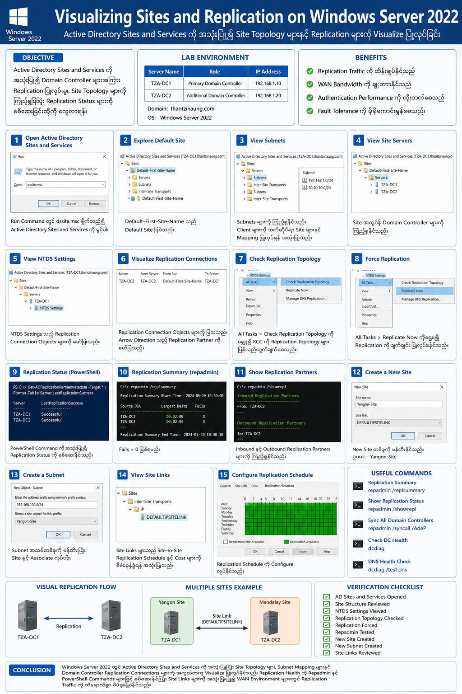
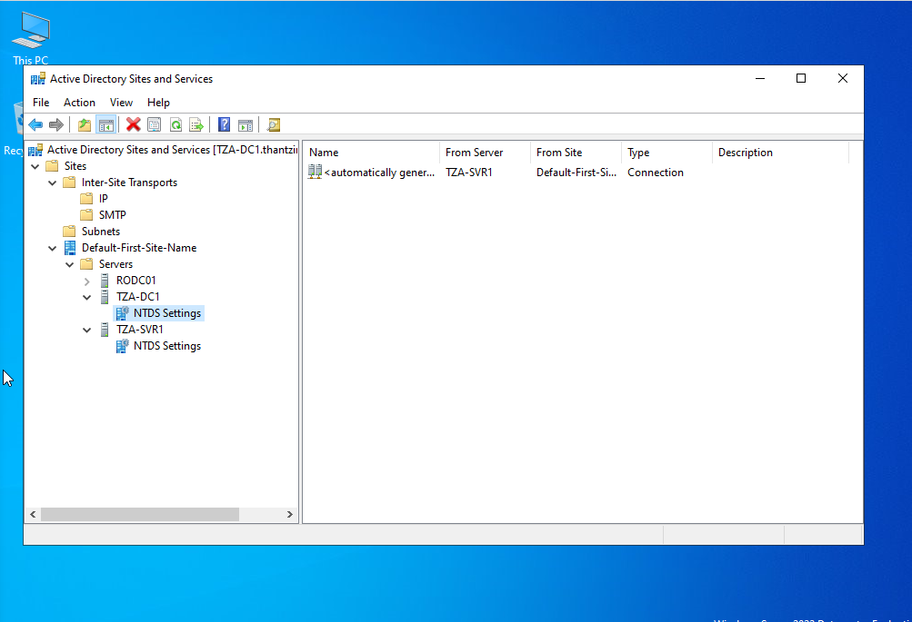
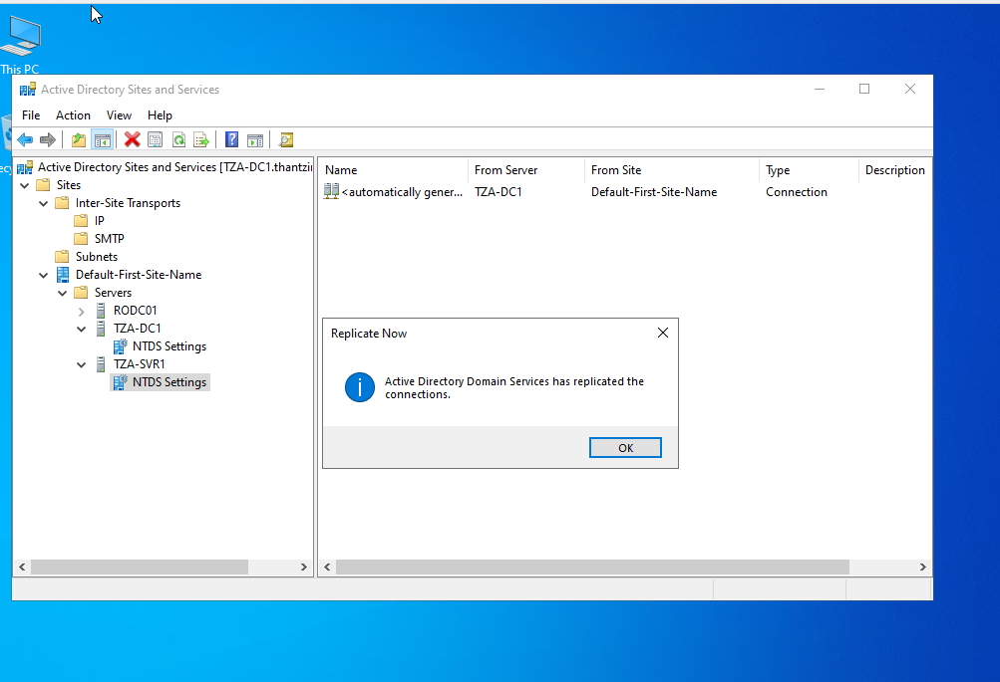

# Visualizing Sites and Replication in Windows Server 2022

## Objective

ဤ Lab ၏ ရည်ရွယ်ချက်မှာ Active Directory Sites and Services ကို အသုံးပြု၍ Domain Controller များအကြား Replication ပြုလုပ်ပုံ၊ Site Topology များကို ကြည့်ရှုခြင်းနှင့် Replication Status များကို စစ်ဆေးခြင်းတို့ဖြစ်သည်။

---

# Background Knowledge

Active Directory Environment တွင် Domain Controller (DC) များအကြား Directory Database ကို Synchronize ပြုလုပ်ရန် Replication Mechanism ကို အသုံးပြုသည်။

Site များကို Network Topology အရ ခွဲခြားသတ်မှတ်ထားပြီး Domain Controller များအကြား Traffic Optimization ပြုလုပ်ရန် အသုံးပြုသည်။

### Benefits of Sites and Replication

* Replication Traffic ကို ထိန်းချုပ်နိုင်သည်
* WAN Bandwidth ကို ချွေတာနိုင်သည်
* Authentication Performance ကို တိုးတက်စေသည်
* Fault Tolerance ကို ပိုမိုကောင်းမွန်စေသည်

---

# Lab Requirements

## Servers

| Server Name | Role                                         |
| ----------- | -------------------------------------------- |
| TZA-DC1     | Primary Domain Controller                    |
| TZA-SVR1    | Additional Domain Controller / Member Server |

## Operating System

* Windows Server 2022

## Domain

* thantzinaung.com

---

# Step 1: Open Active Directory Sites and Services

1. Login ဝင်ပါ
2. Server Manager ကို ဖွင့်ပါ
3. Tools ကို နှိပ်ပါ
4. Active Directory Sites and Services ကို ရွေးပါ

သို့မဟုတ်

```powershell
dssite.msc
```

Run Command ဖြင့်လည်း ဖွင့်နိုင်သည်။

---

# Step 2: Explore Default Site

Left Pane တွင်

```text
Sites
 └── Default-First-Site-Name
```

ကို တွေ့ရမည်။ Default Site သည် Domain Controller များအားလုံး စတင် Install လုပ်စဉ်က ပါဝင်လာသော Site ဖြစ်သည်။

---

# Step 3: View Subnets

Navigate:

```text
Sites
 └── Subnets
```

Subnet များကို ကြည့်ရှုနိုင်သည်။

ဥပမာ

```text
192.168.1.0/24
10.10.10.0/24
```

Subnet များသည် Client Computer များကို သက်ဆိုင်ရာ Site များနှင့် Mapping ပြုလုပ်ရန် အသုံးပြုသည်။

---

# Step 4: View Site Servers

Navigate:

```text
Sites
 └── Default-First-Site-Name
      └── Servers
```

Server များကို မြင်နိုင်သည်။

ဥပမာ

```text
TZA-DC1
TZA-SVR1
```

Server တစ်ခုချင်းစီကို Expand လုပ်ပါ။

---

# Step 5: View NTDS Settings

Navigate:

```text
Servers
 └── TZA-DC1
      └── NTDS Settings
```

NTDS Settings သည် Replication Connection Objects များကို ဖော်ပြပေးသည်။

---

# Step 6: Visualize Replication Connections

NTDS Settings ကို ရွေးချယ်ပါ။

Right Pane တွင်

```text
Connection Objects
```

များကို မြင်နိုင်သည်။

ဥပမာ

```text
TZA-DC2 → TZA-DC1
```

Arrow Direction သည် Replication Partner ကို ဖော်ပြသည်။

---

# Step 7: Generate Replication Topology

NTDS Settings ပေါ်တွင် Right Click နှိပ်ပါ။

```text
All Tasks
   └── Check Replication Topology
```

ကို ရွေးပါ။

KCC (Knowledge Consistency Checker) က Replication Topology ကို ပြန်လည်တွက်ချက်ပေးမည်။

---

# Step 8: Force Replication

NTDS Settings ပေါ်တွင်

```text
Right Click
    └── Replicate Now
```

ကို နှိပ်ပါ။

Dialog Box ပေါ်လာလျှင်

```text
OK
```

နှိပ်ပါ။

Replication ကို ချက်ချင်း ပြုလုပ်မည်ဖြစ်သည်။

---

# Step 9: View Replication Status using PowerShell

PowerShell ကို Administrator အဖြစ် ဖွင့်ပါ။

Command:

```powershell
Get-ADReplicationPartnerMetadata -Target * | Format-Table Server,LastReplicationSuccess
```

Output:

```text
Server      LastReplicationSuccess
------      ----------------------
TZA-DC1     Successful
TZA-DC2     Successful
```

---

# Step 10: Check Replication Health

Command:

```powershell
repadmin /replsummary
```

Sample Output:

```text
Source DSA          Largest Delta   Fails
------------------------------------------
TZA-DC1             00:02:00        0
TZA-DC2             00:02:00        0
```

Fails = 0 ဖြစ်ရမည်။

---

# Step 11: Display Replication Partners

Command:

```powershell
repadmin /showrepl
```

Output တွင်

```text
Inbound Replication Partners
```

နှင့်

```text
Outbound Replication Partners
```

များကို မြင်နိုင်သည်။

---

# Step 12: Create a New Site

Navigate:

```text
Sites
```

Right Click

```text
New Site
```

ရွေးပါ။

Example:

```text
Yangon-Site
```

Site Link:

```text
DEFAULTIPSITELINK
```

ကို ရွေးပြီး OK နှိပ်ပါ။

---

# Step 13: Create a Subnet

Navigate:

```text
Subnets
```

Right Click

```text
New Subnet
```

Example:

```text
192.168.100.0/24
```

Associate with:

```text
Yangon-Site
```

---

# Step 14: View Site Links

Navigate:

```text
Inter-Site Transports
 └── IP
      └── DEFAULTIPSITELINK
```

Site Links များသည် Site-to-Site Replication Schedule နှင့် Cost များကို စီမံခန့်ခွဲရန် အသုံးပြုသည်။

---

# Step 15: Configure Replication Schedule

Site Link ပေါ်တွင်

```text
Properties
```

ကို ဖွင့်ပါ။

Configuration များ

* Cost
* Replication Frequency
* Schedule

တို့ကို ပြင်ဆင်နိုင်သည်။

---

# Useful Replication Commands

### Replication Summary

```powershell
repadmin /replsummary
```

### Show Replication Status

```powershell
repadmin /showrepl
```

### Sync All Domain Controllers

```powershell
repadmin /syncall /AdeP
```

### Check Domain Controller Health

```powershell
dcdiag
```

### DNS Health Check

```powershell
dcdiag /test:dns
```

---

# Visual Replication Flow

```text
           +-------------+
           |   TZA-DC1   |
           +-------------+
                  |
                  |
          Replication
                  |
                  |
           +-------------+
           |   TZA-DC2   |
           +-------------+
```

Multiple Sites Example

```text
     Yangon Site
  +---------------+
  |    TZA-DC1    |
  +---------------+
          |
          |
     Site Link
          |
          |
  +---------------+
  |    TZA-DC2    |
  +---------------+
      Mandalay Site
```

---

# Verification Checklist

| Task                         | Status |
| ---------------------------- | ------ |
| AD Sites and Services Opened | ✔      |
| Site Structure Reviewed      | ✔      |
| NTDS Settings Viewed         | ✔      |
| Replication Topology Checked | ✔      |
| Replication Forced           | ✔      |
| Repadmin Tested              | ✔      |
| New Site Created             | ✔      |
| New Subnet Created           | ✔      |
| Site Links Reviewed          | ✔      |

---

# Conclusion

Windows Server 2022 တွင် Active Directory Sites and Services ကို အသုံးပြု၍ Site Topology များ၊ Subnet Mapping များနှင့် Domain Controller Replication Connections များကို အလွယ်တကူ Visualize ပြုလုပ်နိုင်သည်။

Replication Health ကို Repadmin နှင့် PowerShell Commands များဖြင့် စစ်ဆေးနိုင်ပြီး Site Links များကို အသုံးပြု၍ WAN Environment များတွင် Replication Traffic ကို ထိရောက်စွာ စီမံခန့်ခွဲနိုင်သည်။

---



