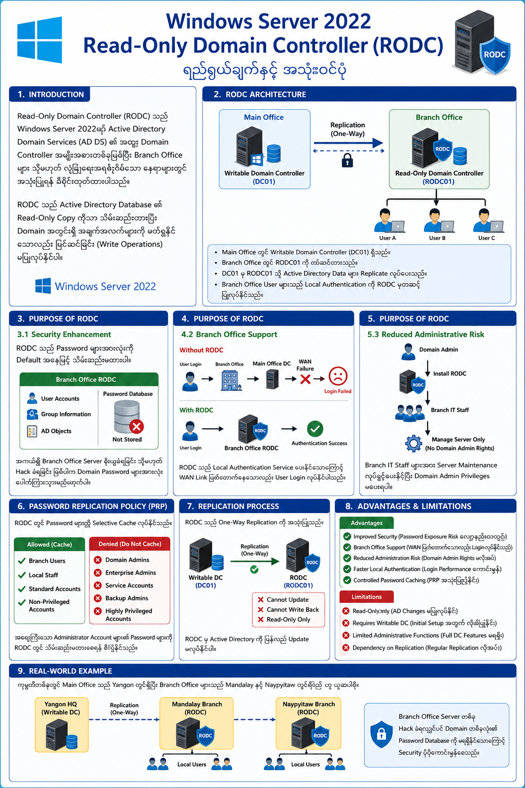

# Visualizing the Purpose of Read-Only Domain Controller (RODC) on the Windows Server

## 1. Introduction

Windows Server 2022 တွင် Read-Only Domain Controller (RODC) သည် Active Directory Domain Services (AD DS) ၏ အထူး Domain Controller အမျိုးအစားတစ်ခုဖြစ်ပြီး Branch Office များ သို့မဟုတ် လုံခြုံရေးအရ စိုးရိမ်ရသော နေရာများတွင် အသုံးပြုရန် ဒီဇိုင်းထုတ်ထားသည်။

RODC သည် Active Directory Database ၏ Read-Only Copy ကိုသာ သိမ်းဆည်းထားပြီး Domain အတွင်းရှိ အချက်အလက်များကို ဖတ်ရှုနိုင်သော်လည်း ပြင်ဆင်ခြင်း (Write Operations) မပြုလုပ်နိုင်ပါ။

---

# 2. RODC Architecture Visualization

```
                Main Office
      ┌──────────────────────────┐
      │ Writable Domain Controller│
      │        (DC01)             │
      └────────────┬─────────────┘
                   │ Replication
                   │
                   ▼
      ┌──────────────────────────┐
      │ Read-Only Domain Controller│
      │         (RODC01)          │
      └────────────┬─────────────┘
                   │
      ┌────────────┼────────────┐
      ▼            ▼            ▼
   User A       User B       User C
```

### Explanation

* Main Office တွင် Writable Domain Controller (DC01) ရှိသည်။
* Branch Office တွင် RODC01 ကို တပ်ဆင်ထားသည်။
* Active Directory Data များကို DC01 မှ RODC01 သို့ Replicate လုပ်ပေးသည်။
* Branch Office User များသည် Local Authentication ကို RODC မှတဆင့် ပြုလုပ်နိုင်သည်။

---

# 3. Purpose of RODC

## 3.1 Security Enhancement

RODC သည် Password များအားလုံးကို Default အနေဖြင့် သိမ်းဆည်းမထားပါ။

### Visualization

```
Branch Office RODC

+---------------------+
| User Accounts       |
| Group Information   |
| AD Objects          |
+---------------------+

Password Database
       ↓
   Not Stored
```

အကယ်၍ Branch Office Server ခိုးယူခံရခြင်း သို့မဟုတ် Hack ခံရခြင်း ဖြစ်ပါက Domain Password များအားလုံး ပေါက်ကြားသွားမည်မဟုတ်ပါ။

---

## 3.2 Branch Office Support

Branch Office များတွင် WAN Link မတည်ငြိမ်သော အခြေအနေများရှိနိုင်သည်။

### Without RODC

```
User Login
     │
     ▼
Branch Office
     │
     ▼
Main Office DC
     │
 WAN Failure
     │
     ▼
Login Failed
```

### With RODC

```
User Login
     │
     ▼
Branch Office RODC
     │
     ▼
Authentication Success
```

RODC သည် Local Authentication Service ပေးနိုင်သောကြောင့် WAN Link ပြတ်တောက်နေသော်လည်း User Login လုပ်နိုင်ပါသည်။

---

## 3.3 Reduced Administrative Risk

Branch Office များတွင် Full Domain Admin ကို မပေးလိုသော အခြေအနေများရှိနိုင်သည်။

RODC သည် Delegated Administration ကို Support လုပ်သည်။

### Visualization

```
Domain Admin
      │
      ▼
 Install RODC
      │
      ▼
Branch IT Staff
      │
      ▼
Manage Server Only

(No Domain Admin Rights)
```

ထို့ကြောင့် Branch IT Staff များအား Server Maintenance လုပ်ခွင့်ပေးနိုင်ပြီး Domain Admin Privileges မပေးရပါ။

---

# 4. Password Replication Policy (PRP)

RODC တွင် Password များကို Selective Cache လုပ်နိုင်သည်။

### Visualization

```
Password Replication Policy

Allowed:
 ├─ Branch Users
 ├─ Local Staff

Denied:
 ├─ Domain Admins
 ├─ Enterprise Admins
 ├─ Service Accounts
```

အရေးကြီးသော Administrator Account များ၏ Password များကို RODC တွင် သိမ်းဆည်းမထားစေရန် စီမံနိုင်သည်။

---

# 5. Replication Process

RODC သည် One-Way Replication ကို အသုံးပြုသည်။

### Visualization

```
Writable DC
     │
     │ Replication
     ▼
   RODC

RODC
     X
     X Cannot Update
     X Cannot Write Back
```

RODC မှ Active Directory ကို ပြန်လည် Update မလုပ်နိုင်ပါ။

---

# 6. Advantages of RODC

| Advantage                   | Description                               |
| --------------------------- | ----------------------------------------- |
| Improved Security           | Password Exposure Risk လျော့နည်းစေသည်     |
| Branch Office Support       | WAN ပြတ်တောက်သော်လည်း Login လုပ်နိုင်သည်  |
| Reduced Administration Risk | Domain Admin Rights မလိုအပ်               |
| Faster Local Authentication | Login Performance ကောင်းမွန်              |
| Controlled Password Caching | Password Replication Policy အသုံးပြုနိုင် |

---

# 7. Limitations of RODC

| Limitation                       | Description                            |
| -------------------------------- | -------------------------------------- |
| Read-Only Only                   | AD Changes မပြုလုပ်နိုင်               |
| Requires Writable DC             | Initial Setup အတွက် Writable DC လိုအပ် |
| Limited Administrative Functions | Full DC Features မရရှိ                 |
| Dependency on Replication        | Regular Replication လိုအပ်             |

---

# 8. Real-World Example

ကုမ္ပဏီတစ်ခုတွင် Main Office သည် Yangon တွင်ရှိပြီး Branch Office များသည် Mandalay နှင့် Naypyitaw တွင် ရှိသည်ဟု ယူဆပါစို့။

```
                 Yangon HQ
          Writable DC (DC01)
                    │
          ┌─────────┴─────────┐
          │                   │
          ▼                   ▼
   Mandalay RODC       Naypyitaw RODC
          │                   │
          ▼                   ▼
     Local Users         Local Users
```

Branch Office Server တစ်ခု Hack ခံရလျှင်ပင် Domain တစ်ခုလုံး၏ Password Database ကို မရရှိနိုင်သောကြောင့် Security ပိုမိုကောင်းမွန်စေသည်။

---

# 9. Conclusion

Read-Only Domain Controller (RODC) သည် Windows Server 2022 တွင် Branch Office များအတွက် လုံခြုံရေးမြင့်မားသော Domain Controller ဖြေရှင်းချက်တစ်ခုဖြစ်သည်။ RODC သည် Active Directory Data ကို Read-Only အနေဖြင့် သိမ်းဆည်းထားပြီး Password Replication Policy၊ Delegated Administration နှင့် Local Authentication စသည့် Features များကို အသုံးပြု၍ Security နှင့် Performance ကို တိုးတက်စေသည်။ ထို့ကြောင့် Physical Security အားနည်းသော Branch Office များတွင် RODC ကို အသုံးပြုခြင်းသည် အကောင်းဆုံး ရွေးချယ်မှုတစ်ခုဖြစ်သည်။

