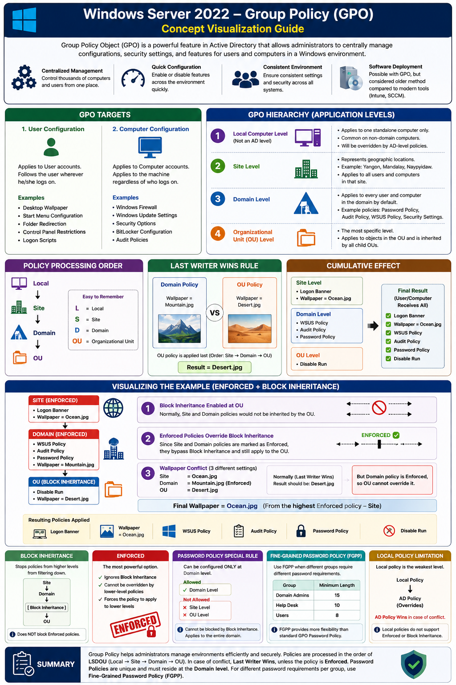

# Windows Server 2022 Group Policy (GPO) Concept Visualization Documentation

## Overview

**Group Policy Object (GPO)** သည် Microsoft Active Directory (AD) Environment များတွင် Administrator များက Computer များနှင့် User များအတွက် Setting များ၊ Security Configuration များ၊ Parameters များနှင့် Features များကို **Centralized Management** ဖြင့် ထိန်းချုပ်နိုင်ရန် အသုံးပြုသော Object တစ်ခုဖြစ်သည်။

GPO ကို အသုံးပြုခြင်းဖြင့် Administrator များသည် Computer ထောင်ပေါင်းများစွာအပေါ်တွင် Policy များကို တစ်နေရာတည်းမှ လွယ်ကူစွာ Apply လုပ်နိုင်ပြီး Feature များကို Enable/Disable လုပ်နိုင်သည်။

ဥပမာ -

- Control Panel ကို ပိတ်ထားခြင်း
- Run Command ကို Disable လုပ်ခြင်း
- Desktop Wallpaper သတ်မှတ်ခြင်း
- Password Requirement များ သတ်မှတ်ခြင်း
- Windows Update (WSUS) Configuration ပြုလုပ်ခြင်း
- Logon Banner ပြသခြင်း

Software Deployment ကိုလည်း GPO ဖြင့် ပြုလုပ်နိုင်သော်လည်း ယနေ့ခေတ်တွင် Microsoft Intune, Configuration Manager (SCCM) ကဲ့သို့သော Modern Management Tools များက ပိုမိုအသုံးများလာသည်။

---

# Group Policy Targets

Group Policy များသည် အဓိကအားဖြင့် အောက်ပါ Target နှစ်မျိုးအပေါ် သက်ရောက်သည်။

## 1. User Configuration

User Account အပေါ် သက်ရောက်သော Policy များဖြစ်သည်။

### ဥပမာ

- Desktop Wallpaper
- Start Menu Configuration
- Folder Redirection
- Control Panel Restrictions
- Logon Scripts

User တစ်ယောက် မည်သည့် Computer တွင် Logon ဝင်သည်ဖြစ်စေ User Policy များကို ရရှိမည်ဖြစ်သည်။

---

## 2. Computer Configuration

Computer Object အပေါ် သက်ရောက်သော Policy များဖြစ်သည်။

### ဥပမာ

- Windows Firewall
- Windows Update Settings
- Security Options
- BitLocker Configuration
- Audit Policies

Computer ကို မည်သူ Logon ဝင်သည်ဖြစ်စေ Policy သည် Computer အပေါ်တွင် အမြဲသက်ရောက်နေမည်ဖြစ်သည်။

---

# GPO Hierarchy (Application Levels)

Group Policy များသည် အဆင့်လိုက် Hierarchy ဖြင့် Apply လုပ်သည်။

## 1. Local Computer Level

Local Policy သည် Computer တစ်လုံးတည်းအတွက်သာ သက်ဆိုင်သည်။

```text
Computer
 └─ Local Policy
```

### Characteristics

- Active Directory Level မဟုတ်
- Standalone Computer များတွင် အသုံးများ
- Domain Policy များ ရောက်လာပါက Override ခံရမည်

---

## 2. Site Level

Site သည် Geographic Location ကို ကိုယ်စားပြုသည်။

### ဥပမာ

```text
Yangon Site
Mandalay Site
Naypyidaw Site
```

Site Level Policy များသည် Site အတွင်းရှိ User နှင့် Computer များအားလုံးအပေါ် သက်ရောက်သည်။

---

## 3. Domain Level

Domain Policy များသည် Domain အတွင်းရှိ User နှင့် Computer အားလုံးအပေါ် Default အနေဖြင့် Apply လုပ်သည်။

### Example Domain

```text
thantzinaung.com
```

### Common Domain Policies

- Password Policy
- Audit Policy
- WSUS Policy
- Security Settings

---

## 4. Organizational Unit (OU) Level

OU သည် အတိကျဆုံး Scope ဖြစ်သည်။

```text
thantzinaung.com
│
├── IT
├── HR
└── Finance
```

OU Policy များသည် OU အတွင်းရှိ Objects များအပေါ် သက်ရောက်ပြီး Child OU များထံသို့လည်း Inherit လုပ်သွားမည်ဖြစ်သည်။

---

# Policy Processing Order

Group Policy များ Apply လုပ်သော အစဉ်မှာ -

```text
Local
   ↓
Site
   ↓
Domain
   ↓
OU
```

### Easy Way to Remember

```text
LSDOU
```

| Letter | Meaning |
|----------|----------|
| L | Local |
| S | Site |
| D | Domain |
| OU | Organizational Unit |

---

# Last Writer Wins Rule

Policy Conflict ဖြစ်ပါက Default အနေဖြင့် နောက်ဆုံး Apply လုပ်သော Policy က အနိုင်ရသည်။

### Example

#### Domain Policy

```text
Wallpaper = Mountain.jpg
```

#### OU Policy

```text
Wallpaper = Desert.jpg
```

Processing Order အရ OU Policy သည် Domain ထက် နောက်မှ Apply ဖြစ်သောကြောင့်

```text
Result = Desert.jpg
```

ဖြစ်မည်။

---

# Cumulative Effect

User တစ်ယောက်သည် Policy တစ်ခုတည်းမဟုတ်ဘဲ Level အားလုံးမှ Policy များကို စုပေါင်းရရှိသည်။

### Site Level

```text
Logon Banner
Wallpaper = Ocean.jpg
```

### Domain Level

```text
WSUS Policy
Audit Policy
Password Policy
```

### OU Level

```text
Disable Run
```

### Final Result

```text
Logon Banner
WSUS Policy
Audit Policy
Password Policy
Disable Run
```

User သည် Policy အားလုံးကို ပေါင်းစပ်ရရှိမည်ဖြစ်သည်။

---

# Visualizing the Example Diagram

အောက်ပါ Diagram ကို လေ့လာကြည့်ပါ။

```text
SITE (ENFORCED)
 ├─ Logon Banner
 └─ Wallpaper = Ocean.jpg

          ↓

DOMAIN (ENFORCED)
 ├─ WSUS Policy
 ├─ Audit Policy
 ├─ Password Policy
 └─ Wallpaper = Mountain.jpg

          ↓

OU (BLOCK INHERITANCE)
 ├─ Disable Run
 └─ Wallpaper = Desert.jpg
```

---

## Step 1: Block Inheritance Enabled

OU တွင် Block Inheritance ဖွင့်ထားသောကြောင့် ပုံမှန်အားဖြင့်

```text
Site Policies
Domain Policies
```

များကို OU သို့ Inherit မလုပ်တော့ပါ။

---

## Step 2: Enforced Policies

သို့သော်

```text
Site = Enforced
Domain = Enforced
```

ဖြစ်နေသောကြောင့် Block Inheritance ကို ကျော်လွန်ပြီး Policy များ ဆက်လက် Apply လုပ်မည်ဖြစ်သည်။

---

## Step 3: Wallpaper Conflict

Wallpaper သုံးခုရှိသည်။

```text
Site     = Ocean.jpg
Domain   = Mountain.jpg
OU       = Desert.jpg
```

ပုံမှန် Last Writer Wins Rule အရ

```text
OU = Desert.jpg
```

ဖြစ်သင့်သည်။

သို့သော် Domain Wallpaper Policy သည်

```text
Enforced
```

ဖြစ်နေသောကြောင့် OU Wallpaper သည် Override မလုပ်နိုင်တော့ပါ။

### Final Result

```text
Wallpaper = Ocean.jpg
```

---

# Resulting Policies

Diagram အရ နောက်ဆုံး Apply ဖြစ်မည့် Policy များမှာ -

```text
✓ Logon Banner
✓ Wallpaper = Ocean.jpg
✓ WSUS Policy
✓ Audit Policy
✓ Password Policy
✓ Disable Run
```

ဖြစ်သည်။

---

# Block Inheritance

Block Inheritance သည် အထက် Level များမှ Policy များကို ဆင်းမလာစေရန် အသုံးပြုသော Feature ဖြစ်သည်။

```text
Site
   ↓
Domain
   ↓
[Block Inheritance]
   ↓
OU
```

Block Inheritance ရှိသောနေရာမှ အောက်သို့ Policy များ ဆင်းမလာတော့ပါ။

### Important Note

Enforced Policy များကို မတားဆီးနိုင်ပါ။

---

# Enforced

Enforced သည် Group Policy တွင် အားအကြီးဆုံး Option ဖြစ်သည်။

```text
Policy
  ↓
Enforced
```

### Features

- Block Inheritance ကို Ignore လုပ်နိုင်သည်
- Lower Level Policy များ Override မလုပ်နိုင်
- Domain နှင့် Site မှ Policy များကို Force Apply လုပ်နိုင်

---

## Example

```text
Domain Policy
Wallpaper = Company.jpg
(Enforced)

OU Policy
Wallpaper = Desert.jpg
```

### Result

```text
Wallpaper = Company.jpg
```

OU Policy သည် နောက်မှ Apply လုပ်သော်လည်း Enforced Policy ကို Override မလုပ်နိုင်ပါ။

---

# Password Policy Special Rule

Password Policy သည် အခြား Policy များနှင့် မတူပါ။

## Allowed Location

```text
✓ Domain Level
```

## Not Allowed

```text
✗ Site Level
✗ OU Level
```

Password Policy ကို Domain Level တွင်သာ Configure လုပ်နိုင်သည်။

---

## Block Inheritance Effect

Password Policy သည်

```text
Block Inheritance
```

ကြောင့် မရပ်တန့်ပါ။

Domain Password Policy သည် Domain အတွင်းရှိ User များအားလုံးအပေါ် သက်ရောက်မည်ဖြစ်သည်။

---

# Fine-Grained Password Policy (FGPP)

Organization တစ်ခုတွင် Group များအလိုက် Password Requirement မတူလိုပါက Standard GPO မဟုတ်ဘဲ **Fine-Grained Password Policy (FGPP)** ကို အသုံးပြုရမည်။

### Example

```text
Domain Admins
 └─ Minimum Length = 15

Help Desk
 └─ Minimum Length = 10

Users
 └─ Minimum Length = 8
```

ဒီလို Group အလိုက် Password Policy များ သတ်မှတ်နိုင်သည်။

---

# Local Policy Limitation

Local Policy သည် Domain Environment တွင် အားအနည်းဆုံး Policy ဖြစ်သည်။

```text
Local Policy
     ↓
AD Policy
```

Conflict ဖြစ်ပါက

```text
AD Policy Wins
```

ဖြစ်မည်။

### Limitations

Local Policy တွင်

```text
Enforced
Block Inheritance
```

ကဲ့သို့ Feature များ မရှိပါ။

---

# Summary

Group Policy သည် Active Directory Environment အတွင်းရှိ User နှင့် Computer များကို Centralized Management ဖြင့် ထိန်းချုပ်နိုင်သော အရေးကြီးသော Administration Tool ဖြစ်သည်။

Policy Processing Order ကို **LSDOU (Local → Site → Domain → OU)** ဟု မှတ်သားနိုင်ပြီး Conflict ဖြစ်ပါက **Last Writer Wins** Rule အရ နောက်ဆုံး Apply လုပ်သော Policy က အနိုင်ရသည်။

သို့သော် **Enforced** Policy များသည် Block Inheritance ကို ကျော်လွန်နိုင်ပြီး Lower-Level Policy များမှ Override လုပ်မရပါ။

Password Policy များသည် Domain Level တွင်သာ တည်ရှိနိုင်ပြီး ကွဲပြားသော Password Requirement များ လိုအပ်ပါက **Fine-Grained Password Policy (FGPP)** ကို အသုံးပြုရမည်ဖြစ်သည်။

---

