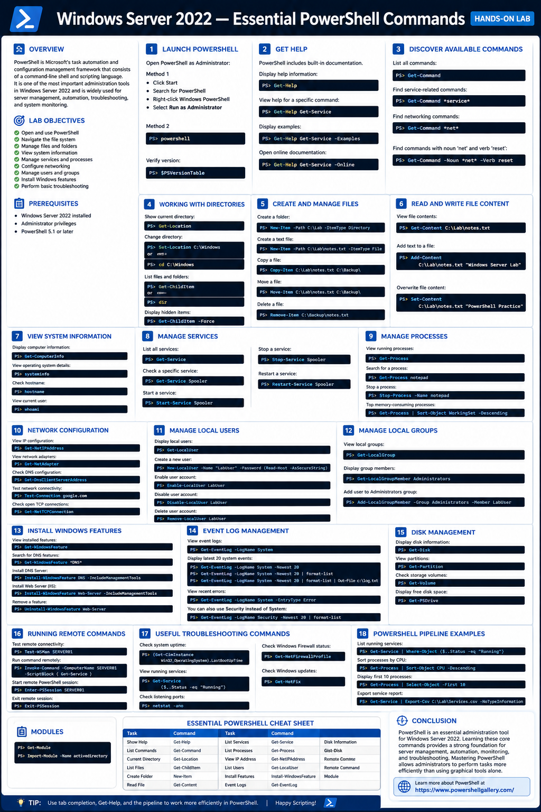
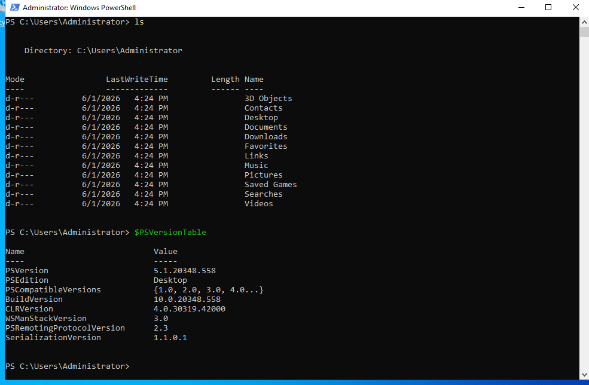
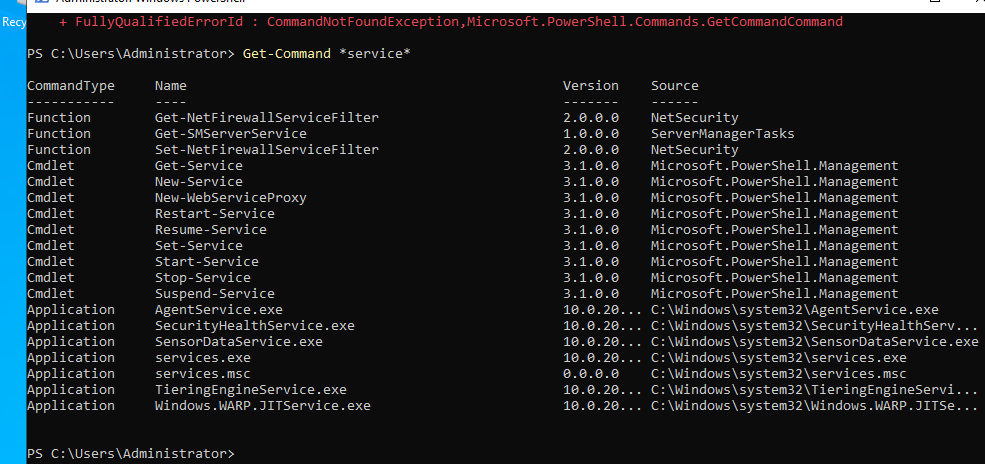
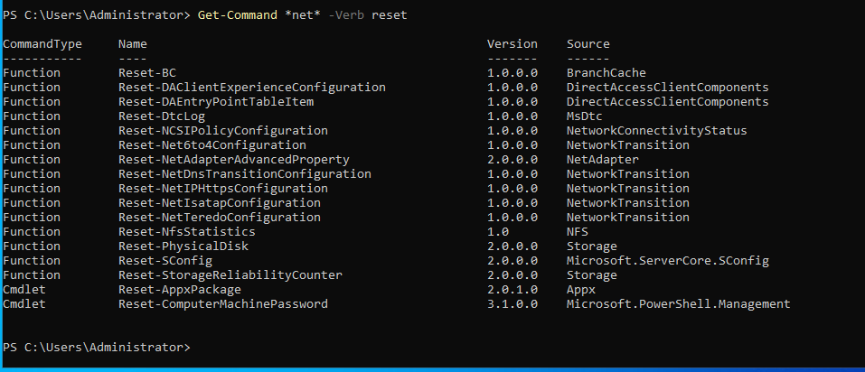
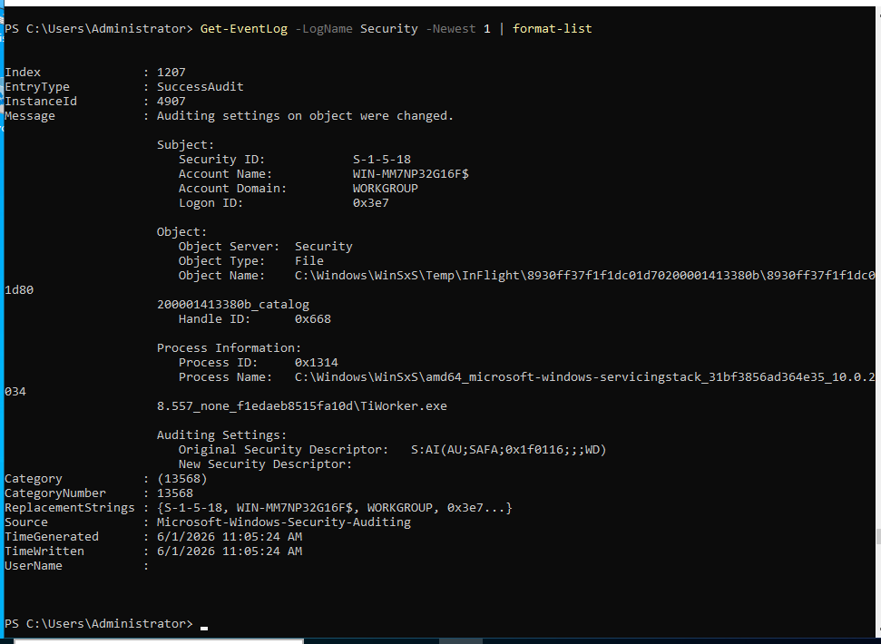
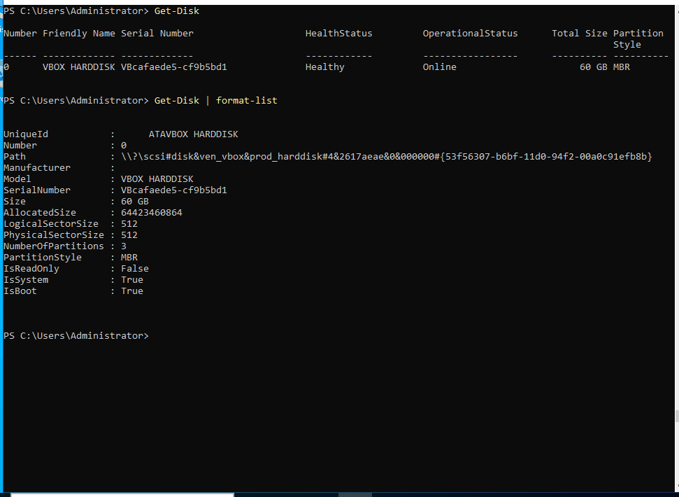

# Windows Server 2022 — Essential PowerShell Commands (Hands-on Lab)

## Overview

PowerShell is Microsoft's task automation and configuration management framework that consists of a command-line shell and scripting language. It is one of the most important administration tools in Windows Server 2022 and is widely used for server management, automation, troubleshooting, and system monitoring.

---

# Lab Objectives

* Open and use PowerShell
* Navigate the file system
* Manage files and folders
* View system information
* Manage services and processes
* Configure networking
* Manage users and groups
* Install Windows features
* Perform basic troubleshooting

---

# Prerequisites

* Windows Server 2022 installed
* Administrator privileges
* PowerShell 5.1 or later

---

# 1. Launch PowerShell

Open PowerShell as Administrator:

### Method 1

* Click **Start**
* Search for **PowerShell**
* Right-click **Windows PowerShell**
* Select **Run as Administrator**

### Method 2

```powershell
powershell
```

Verify version:

```powershell
$PSVersionTable
```

---

# 2. Get Help

PowerShell includes built-in documentation.

Display help information:

```powershell
Get-Help
```

View help for a specific command:

```powershell
Get-Help Get-Service
```

Display examples:

```powershell
Get-Help Get-Service -Examples
```

Open online documentation:

```powershell
Get-Help Get-Service -Online
```

---

# 3. Discover Available Commands

List all commands:

```powershell
Get-Command
```

Find service-related commands:

```powershell
Get-Command *service*
```

Find networking commands:

```powershell
Get-Command *net*
```

```powershell
Get-Command -Noun *net*  -Verb reset
```

---

# 4. Working with Directories

Show current directory:

```powershell
Get-Location
```

Change directory:

```powershell
Set-Location C:\Windows
```

or

```powershell
cd C:\Windows
```

List files and folders:

```powershell
Get-ChildItem
```

or

```powershell
dir
```

Display hidden items:

```powershell
Get-ChildItem -Force
```

---

# 5. Create and Manage Files

Create a folder:

```powershell
New-Item -Path C:\Lab -ItemType Directory
```

Create a text file:

```powershell
New-Item -Path C:\Lab\notes.txt -ItemType File
```

Copy a file:

```powershell
Copy-Item C:\Lab\notes.txt C:\Backup\
```

Move a file:

```powershell
Move-Item C:\Lab\notes.txt C:\Backup\
```

Delete a file:

```powershell
Remove-Item C:\Backup\notes.txt
```

---

# 6. Read and Write File Content

View file contents:

```powershell
Get-Content C:\Lab\notes.txt
```

Add text to a file:

```powershell
Add-Content C:\Lab\notes.txt "Windows Server Lab"
```

Overwrite file content:

```powershell
Set-Content C:\Lab\notes.txt "PowerShell Practice"
```

---

# 7. View System Information

Display computer information:

```powershell
Get-ComputerInfo
```

View operating system details:

```powershell
systeminfo
```

Check hostname:

```powershell
hostname
```

View current user:

```powershell
whoami
```

---

# 8. Manage Services

List all services:

```powershell
Get-Service
```

Check a specific service:

```powershell
Get-Service Spooler
```

Start a service:

```powershell
Start-Service Spooler
```

Stop a service:

```powershell
Stop-Service Spooler
```

Restart a service:

```powershell
Restart-Service Spooler
```

---

# 9. Manage Processes

View running processes:

if running notepad - 

```powershell
Get-Process
```

Search for a process:

```powershell
Get-Process notepad
```

Stop a process:

```powershell
Stop-Process -Name notepad
```

Display top memory-consuming processes:

```powershell
Get-Process | Sort-Object WorkingSet -Descending
```

---

# 10. Network Configuration

View IP configuration:

```powershell
Get-NetIPAddress
```

View network adapters:

```powershell
Get-NetAdapter
```

Check DNS configuration:

```powershell
Get-DnsClientServerAddress
```

Test network connectivity:

```powershell
Test-Connection google.com
```

Check open TCP connections:

```powershell
Get-NetTCPConnection
```

---

# 11. Manage Local Users

Display local users:

```powershell
Get-LocalUser
```

Create a new user:

```powershell
New-LocalUser -Name "LabUser" -Password (Read-Host -AsSecureString)
```

Enable user account:

```powershell
Enable-LocalUser LabUser
```

Disable user account:

```powershell
Disable-LocalUser LabUser
```

Delete user account:

```powershell
Remove-LocalUser LabUser
```

---

# 12. Manage Local Groups

View local groups:

```powershell
Get-LocalGroup
```

Display group members:

```powershell
Get-LocalGroupMember Administrators
```

Add user to Administrators group:

```powershell
Add-LocalGroupMember -Group Administrators -Member LabUser
```

---

# 13. Install Windows Features

View installed features:

```powershell
Get-WindowsFeature
```

Search for DNS features:

```powershell
Get-WindowsFeature *DNS*
```

Install DNS Server:

```powershell
Install-WindowsFeature DNS -IncludeManagementTools
```

Install Web Server (IIS):

```powershell
Install-WindowsFeature Web-Server -IncludeManagementTools
```

Remove a feature:

```powershell
Uninstall-WindowsFeature Web-Server
```

---

# 14. Event Log Management

View event logs:

```powershell
Get-EventLog -LogName System
```

Display latest 20 system events:

```powershell
Get-EventLog -LogName System -Newest 20

Get-EventLog -LogName System -Newest 20 | format-list

Get-EventLog -LogName System -Newest 20 | format-list | Out-File c:\log.txt
```

output in the C:\
```powershell
Get-EventLog -LogName System -Newest 20 | format-list | Out-File c:\log.txt
```

View recent errors:

```powershell
Get-EventLog -LogName System -EntryType Error
```
Cann also use `Security` instead of `System` - Like :

```powershell
Get-EventLog -LogName Security -Newest 20 | format-list
```

---

# 15. Disk Management

Display disk information:

```powershell
Get-Disk
```

View partitions:

```powershell
Get-Partition
```

Check storage volumes:

```powershell
Get-Volume
```

Display free disk space:

```powershell
Get-PSDrive
```

---

# 16. Running Remote Commands

Test remote connectivity:

```powershell
Test-WSMan SERVER01
```

Run command remotely:

```powershell
Invoke-Command -ComputerName SERVER01 -ScriptBlock { Get-Service }
```

Start remote PowerShell session:

```powershell
Enter-PSSession SERVER01
```

Exit remote session:

```powershell
Exit-PSSession
```

---

# 17. Useful Troubleshooting Commands

Check system uptime:

```powershell
(Get-CimInstance Win32_OperatingSystem).LastBootUpTime
```

View running services:

```powershell
Get-Service | Where-Object {$_.Status -eq "Running"}
```

Check listening ports:

```powershell
netstat -ano
```

Check Windows Firewall status:

```powershell
Get-NetFirewallProfile
```

Check Windows updates:

```powershell
Get-HotFix
```

---

# 18. PowerShell Pipeline Examples

List running services:

```powershell
Get-Service | Where-Object {$_.Status -eq "Running"}
```

Sort processes by CPU:

```powershell
Get-Process | Sort-Object CPU -Descending
```

Display first 10 processes:

```powershell
Get-Process | Select-Object -First 10
```

Export service report:

```powershell
Get-Service | Export-Csv C:\Lab\Services.csv -NoTypeInformation
```

---

```powershell
Get-Module
```

```powershell
Import-Module -Name activedirectory
```
---

# Essential PowerShell Cheat Sheet

| Task              | Command                |
| ----------------- | ---------------------- |
| Show Help         | Get-Help               |
| List Commands     | Get-Command            |
| Current Directory | Get-Location           |
| List Files        | Get-ChildItem          |
| Create Folder     | New-Item               |
| Read File         | Get-Content            |
| List Services     | Get-Service            |
| List Processes    | Get-Process            |
| View IP Address   | Get-NetIPAddress       |
| List Users        | Get-LocalUser          |
| Install Features  | Install-WindowsFeature |
| Event Logs        | Get-EventLog           |
| Disk Information  | Get-Disk               |
| Remote Commands   | Invoke-Command         |
| Module            | Get-Module             |

---

# Conclusion

PowerShell is an essential administration tool for Windows Server 2022. Learning these core commands provides a strong foundation for server management, automation, monitoring, and troubleshooting. Mastering PowerShell allows administrators to perform tasks more efficiently than using graphical tools alone.

Can learn to know more about powershell `https://www.powershellgallery.com/`.






