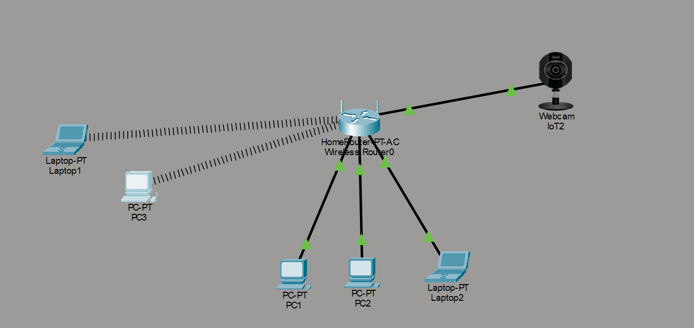
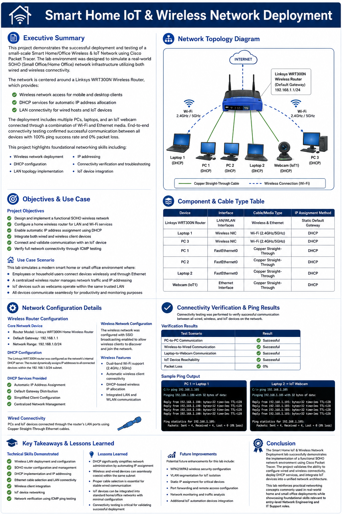

# Smart Home IoT & Wireless Network Deployment

## Executive Summary

This project demonstrates the successful deployment and testing of a small-scale Smart Home/Office Wireless & IoT Network using Cisco Packet Tracer. The lab environment was designed to simulate a real-world SOHO (Small Office/Home Office) network infrastructure utilizing both wired and wireless connectivity.

The network is centered around a Linksys WRT300N Wireless Router, which provides:

- Wireless network access for mobile and desktop clients
- DHCP services for automatic IP address allocation
- LAN connectivity for wired hosts and IoT devices

The deployment includes multiple PCs, laptops, and an IoT webcam connected through a combination of Wi-Fi and Ethernet media. End-to-end connectivity testing confirmed successful communication between all devices with 100% ping success rate and 0% packet loss.

This project highlights foundational networking skills including:

- Wireless network deployment
- DHCP configuration
- LAN topology implementation
- IP addressing
- Connectivity verification and troubleshooting
- IoT device integration

---

# Network Topology Diagram


```md

```

---

# Objectives & Use Case

## Project Objectives

- Design and implement a functional SOHO wireless network
- Configure a home wireless router for LAN and Wi-Fi services
- Enable automatic IP address assignment using DHCP
- Integrate both wired and wireless client devices
- Connect and validate communication with an IoT device
- Verify full network connectivity through ICMP testing

## Use Case Scenario

This lab simulates a modern smart home or small office environment where:

- Employees or household users connect devices wirelessly and through Ethernet
- A centralized wireless router manages network traffic and IP addressing
- IoT devices such as webcams operate within the same trusted LAN
- All devices communicate seamlessly for productivity and monitoring purposes

---

# Component & Cable Type Table

| Device | Interface | Cable/Media Type | IP Assignment Method |
|---|---|---|---|
| Linksys WRT300N Router | LAN/WLAN Interfaces | Wireless & Ethernet | Static Default Gateway |
| Laptop 1 | Wireless NIC | Wi-Fi (2.4GHz/5GHz) | DHCP |
| PC 3 | Wireless NIC | Wi-Fi (2.4GHz/5GHz) | DHCP |
| PC 1 | FastEthernet0 | Copper Straight-Through | DHCP |
| PC 2 | FastEthernet0 | Copper Straight-Through | DHCP |
| Laptop 2 | FastEthernet0 | Copper Straight-Through | DHCP |
| Webcam (IoT1) | Ethernet Interface | Copper Straight-Through | DHCP |

---

# Network Configuration Details

## Wireless Router Configuration

### Core Network Device

- **Router Model:** Linksys WRT300N Home Wireless Router
- **Default Gateway:** `192.168.1.1`
- **Network Range:** `192.168.1.0/24`

### DHCP Configuration

The Linksys WRT300N router was configured as the network’s internal DHCP server. The router dynamically assigns IP addresses to all connected devices within the `192.168.1.0/24` subnet.

### DHCP Services Provided

- Automatic IP Address Assignment
- Default Gateway Distribution
- Simplified Client Configuration
- Centralized Network Management

### Wireless Network Configuration

The wireless network was configured with SSID broadcasting enabled to allow wireless clients to discover and join the network.

### Wireless Features

- Dual-band Wi-Fi support (2.4GHz / 5GHz)
- Automatic wireless client connectivity
- DHCP-based wireless IP allocation
- Integrated LAN and WLAN communication

### Wired Connectivity

PCs and IoT devices connected through the router’s LAN ports using Copper Straight-Through Ethernet cables.

---

# Connectivity Verification & Ping Results

Connectivity testing was performed to verify successful communication between all wired, wireless, and IoT devices on the network.

## Verification Results

| Test Scenario | Result |
|---|---|
| PC-to-PC Communication | Successful |
| Wireless-to-Wired Communication | Successful |
| Laptop-to-Webcam Communication | Successful |
| IoT Device Reachability | Successful |
| Packet Loss | 0% |

---

## Sample Ping Output

### PC 1 → Laptop 1

```bash
C:\> ping 192.168.1.101

Pinging 192.168.1.100 with 32 bytes of data:

Reply from 192.168.1.100: bytes=32 time<1ms TTL=128
Reply from 192.168.1.100: bytes=32 time<1ms TTL=128
Reply from 192.168.1.100: bytes=32 time<1ms TTL=128
Reply from 192.168.1.100: bytes=32 time<1ms TTL=128

Ping statistics for 192.168.1.100:
    Packets: Sent = 4, Received = 4, Lost = 0 (0% loss)
```

### Laptop 2 → IoT Webcam

```bash
C:\> ping 192.168.1.105

Pinging 192.168.1.105 with 32 bytes of data:

Reply from 192.168.1.105: bytes=32 time<1ms TTL=128
Reply from 192.168.1.105: bytes=32 time<1ms TTL=128
Reply from 192.168.1.105: bytes=32 time<1ms TTL=128
Reply from 192.168.1.105: bytes=32 time<1ms TTL=128

Ping statistics for 192.168.1.105:
    Packets: Sent = 4, Received = 4, Lost = 0 (0% loss)
```

---

# Key Takeaways & Lessons Learned

## Technical Skills Demonstrated

- Wireless LAN deployment and configuration
- SOHO router configuration and management
- DHCP implementation and IP addressing
- Ethernet cable selection and LAN connectivity
- Wireless client integration
- IoT device networking
- Network verification using ICMP ping testing

## Lessons Learned

- DHCP significantly simplifies network administration by automating IP assignment
- Wireless and wired devices can seamlessly coexist within the same subnet
- Proper cable selection is essential for stable wired communication
- IoT devices can be integrated into standard home/office networks with minimal configuration
- Connectivity testing is critical for validating successful deployment

## Future Improvements

Potential future enhancements for this lab include:

- WPA2/WPA3 wireless security configuration
- VLAN segmentation for IoT isolation
- Static IP assignment for critical devices
- Port forwarding and remote access configuration
- Network monitoring and traffic analysis
- Additional IoT automation devices integration

---

# Conclusion

The Smart Home IoT & Wireless Network Deployment lab successfully demonstrates the implementation of a functional SOHO network environment using Cisco Packet Tracer. The project validates the ability to configure wired and wireless connectivity, deploy DHCP services, and integrate IoT devices into a unified network architecture.

This lab reinforces practical networking concepts commonly used in real-world home and small office deployments while showcasing foundational skills relevant to entry-level Network Engineering and IT Support roles.

---


## 🛠️ Lab Files & Interactive Testing

You can download the official Cisco Packet Tracer source file directly to inspect the configurations, topology, and test the network connectivity yourself:

💾 **[Download Cisco Packet Tracer Lab File (.pkt)](https://github.com/Thantzinaung94/it_support_documentation/releases/download/network-topology-01/deplying_devices.pkt)**

> ⚠️ **Note:** To open and interact with this project, you will need **Cisco Packet Tracer** installed on your computer.



