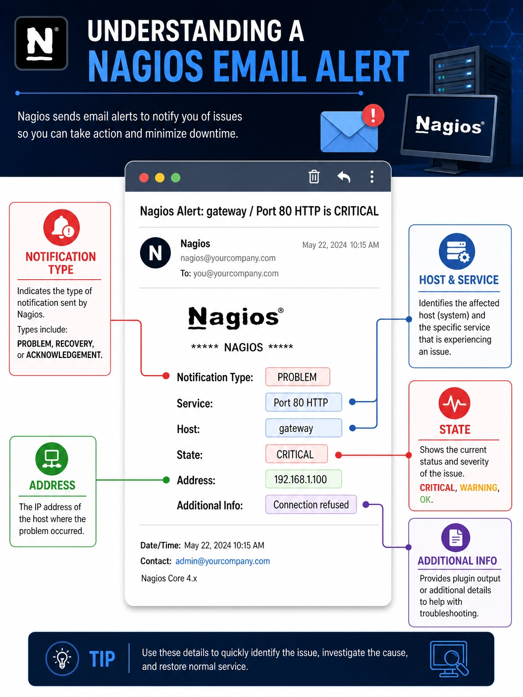

# Understanding a Nagios Email Alert

## 🔔 Understanding a Nagios Email Alert: A Breakdown for IT Professionals

In any production environment, timely and accurate notifications are critical for maintaining system availability and performance. Nagios provides detailed email alerts that help system administrators quickly identify, investigate, and resolve issues within their infrastructure.

---

## 📧 Sample Nagios Email Alert

A typical Nagios email notification may look similar to the example below:

```text
***** Nagios *****

Notification Type: PROBLEM

Service: Port 80 HTTP
Host: gateway
Address: 192.168.1.100
State: CRITICAL

Date/Time: Mon May 12 14:32:15 UTC 2026

Additional Info:

Connection refused by host
```

---

## 🧩 Understanding the Alert Components

### ✅ Notification Type

The **Notification Type** identifies the event that triggered the alert.

Common notification types include:

| Type | Description |
|--------|-------------|
| PROBLEM | An issue has been detected. |
| RECOVERY | A previously failed host or service has returned to normal. |
| ACKNOWLEDGEMENT | An administrator has acknowledged the alert. |
| FLAPPING | The host or service is repeatedly changing states. |
| DOWNTIME | Scheduled maintenance or downtime has been entered. |

> **Example:**  
> `PROBLEM` indicates that Nagios has detected an issue requiring attention.

---

### 🖥️ Host

The **Host** field identifies the monitored system experiencing the issue.

Example:

```text
Host: gateway
```

This may represent:

- A server
- Network device
- Firewall
- Virtual machine
- Cloud instance

The hostname should match the naming convention used within your monitoring environment.

---

### 🚦 State

The **State** field indicates the current status of the host or monitored service.

#### Host States

| State | Meaning |
|---------|---------|
| UP | Host is reachable and responding. |
| DOWN | Host is not responding. |
| UNREACHABLE | Host cannot be reached due to network path issues. |

#### Service States

| State | Meaning |
|---------|---------|
| OK | Service is operating normally. |
| WARNING | Service is functioning but may require attention. |
| CRITICAL | Service failure or serious issue detected. |
| UNKNOWN | Nagios could not determine the service status. |

> **Example:**  
> `CRITICAL` indicates that the monitored service is unavailable or experiencing a major failure.

---

### 🌐 Address

The **Address** field displays the IP address associated with the monitored host.

Example:

```text
Address: 192.168.1.100
```

This information helps administrators:

- Identify the affected device
- Connect directly for troubleshooting
- Correlate events with network logs

---

### ℹ️ Additional Info

The **Additional Info** section contains the output generated by the monitoring plugin that performed the check.

Example:

```text
Connection refused by host
```

Other examples may include:

```text
HTTP CRITICAL - HTTP/1.1 500 Internal Server Error
```

```text
PING CRITICAL - Packet loss = 100%
```

```text
Disk CRITICAL - Free space: 2%
```

This section often provides the most valuable troubleshooting information and should be reviewed carefully.

---

### 📅 Date and Time

The **Date/Time** field indicates when Nagios detected the event.

Example:

```text
Date/Time: Mon May 12 14:32:15 UTC 2026
```

This information is useful for:

- Incident timelines
- SLA reporting
- Root cause analysis
- Correlation with system and application logs

---

### 🔗 Response and Management Links

Many Nagios email templates include direct links to the Nagios web interface.

Common actions available through these links include:

- Viewing service details
- Viewing host details
- Acknowledging alerts
- Scheduling downtime
- Reviewing event history
- Viewing performance graphs

These shortcuts allow administrators to quickly investigate and manage incidents directly from the notification email.

---

## 🔍 Typical Troubleshooting Workflow

When a Nagios alert is received, consider the following approach:

### 1. Review the Alert Details

Verify:

- Notification type
- Host name
- Service name
- Current state
- Plugin output

---

### 2. Verify Host Connectivity

Check whether the host is reachable:

```bash
ping 192.168.1.100
```

---

### 3. Test Service Availability

If the host is reachable, test the affected service:

```bash
curl http://192.168.1.100
```

or

```bash
telnet 192.168.1.100 80
```

---

### 4. Check System Logs

Review relevant logs:

```bash
journalctl -xe
```

```bash
tail -f /var/log/messages
```

```bash
tail -f /var/log/httpd/error_log
```

---

### 5. Acknowledge the Alert

If you are actively working on the issue, acknowledge it in Nagios to inform other team members and reduce duplicate effort.

---

### 6. Add Investigation Notes

Document findings and actions taken to assist future troubleshooting and improve team collaboration.

---

### 7. Monitor for Recovery

Continue monitoring until a **RECOVERY** notification confirms that the service has returned to a healthy state.

---

## ✅ Best Practices for Handling Nagios Alerts

- Prioritize **CRITICAL** alerts immediately.
- Verify whether the issue is new or recurring.
- Confirm host availability before troubleshooting services.
- Use acknowledgements when investigating incidents.
- Add detailed comments and troubleshooting notes.
- Review related hosts and services for broader impact.
- Maintain accurate contact groups and notification settings.
- Periodically review alert thresholds to reduce false positives.

---

## 📣 Final Thoughts

Nagios email alerts are designed to provide concise yet comprehensive information about the health of your infrastructure. Understanding each section of an alert enables faster incident response, more effective troubleshooting, and improved system reliability.

By becoming familiar with notification types, states, plugin outputs, and response workflows, administrators can quickly identify issues, minimize downtime, and maintain a stable production environment.

