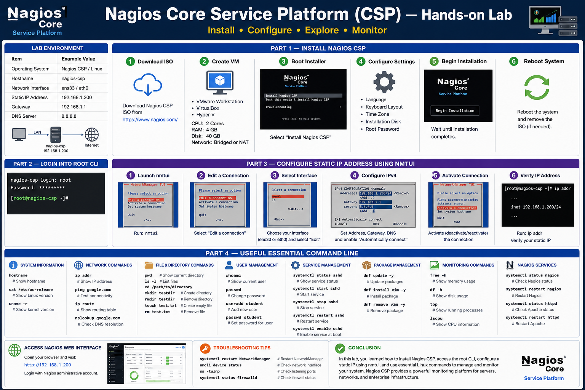
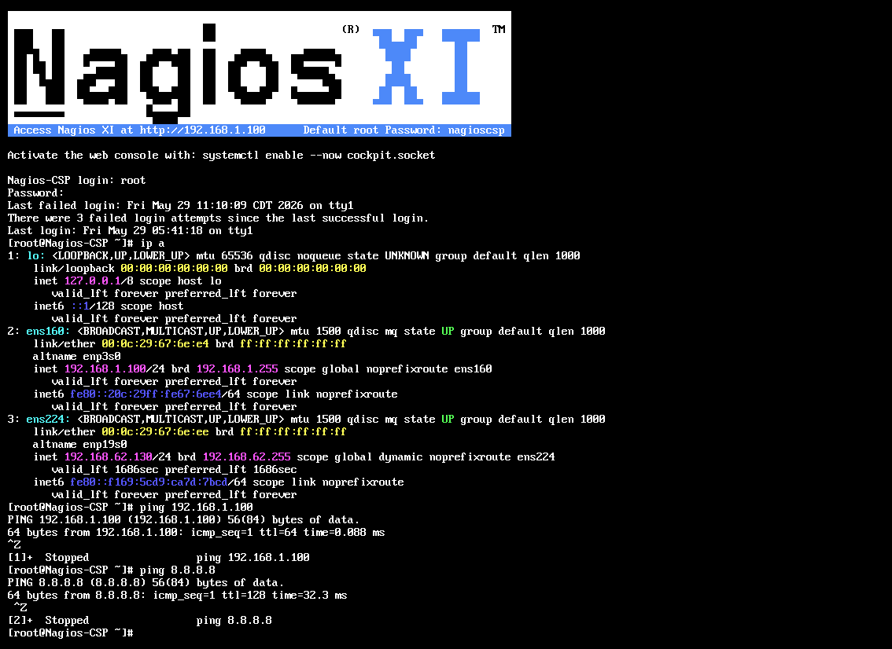

# Nagios Core Service Platform (CSP) — Hands-on Lab

## Objective

This hands-on lab guides students through:

* Installing Nagios CSP
* Logging into the root CLI
* Configuring a static IP address using `nmtui`
* Learning essential Linux command-line utilities

---

# Lab Environment

| Item              | Example Value      |
| ----------------- | ------------------ |
| Operating System  | Nagios CSP / Linux |
| Hostname          | nagios-csp         |
| Network Interface | ens160 / eth0      |
| Static IP Address | 192.168.1.100      |
| Gateway           | 255.255.255.0        |
| DNS Server        | 8.8.8.8 1.1.1.1    |

---

# Part 1 — Install Nagios CSP

## Step 1 — Download Nagios CSP ISO

Download the Nagios CSP ISO image from the official Nagios website.

Official Website:
https://www.nagios.com/

---

## Step 2 — Create a Virtual Machine

Create a virtual machine using:

* VMware Workstation ✅
* Oracle VirtualBox
* Hyper-V

Recommended VM Specifications:

| Resource        | Recommended    |
| --------------- | -------------- |
| CPU             | 2 Cores        |
| RAM             | 4 GB           |
| Disk Space      | 40 GB          |
| Network Adapter | Bridged and NAT |

Attach the Nagios CSP ISO to the virtual machine.

---

## Step 3 — Boot the Installer

1. Start the virtual machine
2. Select:

```bash
Install Nagios CSP
```

3. Wait for the installer to load

---

## Step 4 — Configure Installation Settings

During installation:

### Configure:

* Language
* Keyboard Layout
* Time Zone
* Installation Disk
* Root Password

---

## Step 5 — Begin Installation

Click:

```bash
Begin Installation
```

Wait until installation completes.

---

## Step 6 — Reboot System

After installation finishes:

```bash
Reboot
```

Remove the ISO image if necessary.

---

# Part 2 — Login into Root CLI

After rebooting:

## Login Screen

Enter:

```bash
Username: root
Password: nagioscsp (it can see negios hero section)
```

You will enter the Linux command-line interface (CLI).

Example:

```bash
[root@nagios-csp ~]#
```

---

# Part 3 — Configure Static IP Address Using nmtui

## Step 1 — Launch nmtui

Run:

```bash
nmtui
```

This opens the Network Manager Text User Interface.

---

## Step 2 — Edit a Connection

Select:

```bash
Edit a connection
```

Press `Enter`.

---

## Step 3 — Select Network Interface

Choose your network adapter:

```bash
ens160
```

Select:

```bash
Edit
```

---

## Step 4 — Configure IPv4 Settings

Under IPv4 Configuration:

Change:

```bash
Automatic
```

to:

```bash
Manual
```

Add the following:

| Setting | Example          |
| ------- | ---------------- |
| Address | 192.168.1.100/24 |
| Gateway | 255.255.255.0      |
| DNS     | 8.8.8.8          |

Enable:

```bash
Automatically connect
```

Select:

```bash
OK
```

---

## Step 5 — Restart Network Connection

Go back to:

```bash
Activate a connection
```

Deactivate and reactivate the interface.

Or restart NetworkManager manually:

```bash
systemctl restart NetworkManager
```
---
connection up :
```bash
nmcli connection up ens160
```
---

## Step 6 — Verify IP Address

Run:

```bash
ip addr
```

Example output:

```bash
inet 192.168.1.100/24
```

---

# Part 4 — Useful Essential Command Line

## System Information

### Show hostname

```bash
hostname
```

### Show Linux version

```bash
cat /etc/os-release
```

### Show kernel version

```bash
uname -r
```

---

# Network Commands

### Show IP address

```bash
ip addr
```

### Test network connectivity

```bash
ping google.com
```

### Show routing table

```bash
ip route
```

### Check DNS resolution

```bash
nslookup google.com
```

---

# File and Directory Commands

### Show current directory

```bash
pwd
```

### List files

```bash
ls -l
```

### Change directory

```bash
cd /path/to/directory
```

### Create directory

```bash
mkdir testdir
```

### Remove directory

```bash
rmdir testdir
```

### Create empty file

```bash
touch test.txt
```

### Remove file

```bash
rm test.txt
```

---

# User Management Commands

### Show current user

```bash
whoami
```

### Change password

```bash
passwd
```

### Add new user

```bash
useradd student
```

### Set password for user

```bash
passwd student
```

---

# Service Management Commands

### Show service status

```bash
systemctl status sshd
```

### Start service

```bash
systemctl start sshd
```

### Stop service

```bash
systemctl stop sshd
```

### Restart service

```bash
systemctl restart sshd
```

### Enable service at boot

```bash
systemctl enable sshd
```

---

# Package Management Commands

### Update packages

```bash
dnf update -y
```

### Install package

```bash
dnf install vim -y
```

### Remove package

```bash
dnf remove vim -y
```

---

# Monitoring Commands

### Show memory usage

```bash
free -h
```

### Show disk usage

```bash
df -h
```

### Show running processes

```bash
top
```

### Show CPU information

```bash
lscpu
```

---

# Nagios Service Commands

### Check Nagios status

```bash
systemctl status nagios
```

### Restart Nagios

```bash
systemctl restart nagios
```

### Check Apache status

```bash
systemctl status httpd
```

### Restart Apache

```bash
systemctl restart httpd
```

---

# Access Nagios Web Interface

Open a web browser and visit:

```bash
http://<server-ip-address>
```

Example:

```bash
http://192.168.1.100
```

Login using the Nagios administrative account.

---

# Troubleshooting Tips

## Restart NetworkManager

```bash
systemctl restart NetworkManager
```

## Check Network Interface

```bash
nmcli device status
```

## Check Listening Ports

```bash
ss -tulnp
```

## Check Firewall Status

```bash
systemctl status firewalld
```

---

# Conclusion

In this lab, students learned how to:

* Install Nagios CSP
* Access the root CLI
* Configure a static IP address using `nmtui`
* Use essential Linux command-line utilities
* Verify network and service functionality

Nagios CSP provides a powerful monitoring platform for servers, networks, and enterprise infrastructure management.





[Nagios_CSP_Installation_Guide](./asset/pdf/Nagios_CSP_Installation_Guide.pdf)