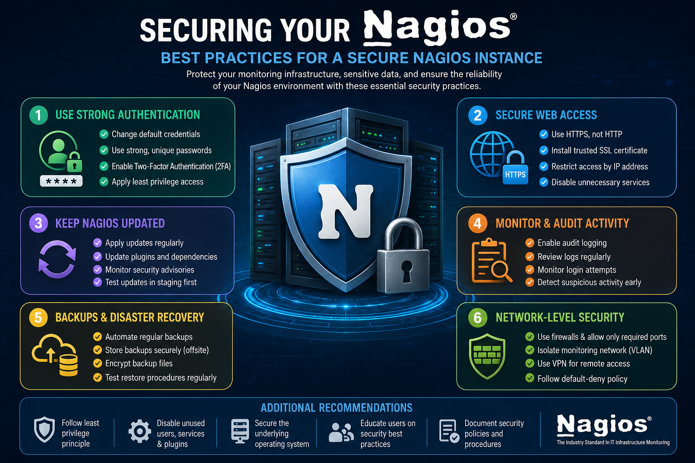

# Securing Nagios Instance: Best Practices

## Overview

**Nagios Core Service Platform (CSP)** is a powerful enterprise-class monitoring solution that provides comprehensive visibility into servers, network devices, applications, and services across an organization's IT infrastructure.

Because Nagios has access to critical operational data and infrastructure components, securing the monitoring platform is essential. An improperly secured Nagios instance can expose sensitive information, allow unauthorized access, or become a target for cyberattacks.

This guide outlines key security best practices to help administrators protect their Nagios deployment and maintain a secure monitoring environment.

---

# 🔐 1. Use Strong Authentication

## Change Default Credentials Immediately

After installing Nagios CSP, replace all default usernames and passwords. Attackers commonly attempt to gain access using known default credentials.

### Best Practice

* Change administrator passwords immediately after installation.
* Disable unused accounts.
* Remove temporary or test accounts.

---

## Use Strong and Unique Passwords

Weak passwords significantly increase the risk of unauthorized access.

### Password Recommendations

* Minimum 12–16 characters.
* Include uppercase and lowercase letters.
* Include numbers and special characters.
* Avoid dictionary words and personal information.
* Use unique passwords for each account.

---

## Enable Two-Factor Authentication (2FA)

Two-Factor Authentication adds an additional layer of protection by requiring a second verification method beyond the password.

### Benefits

* Prevents unauthorized access even if passwords are compromised.
* Reduces the risk of credential-based attacks.
* Enhances compliance with security standards.

### Configuration

Navigate to:

```text
Admin → Security Settings → Two-Factor Authentication
```

Enable 2FA for all administrative and privileged accounts.

---

# 🔒 2. Secure Web Access

## Use HTTPS Instead of HTTP

The Nagios web interface should always be accessed through HTTPS.

### Why HTTPS?

HTTPS encrypts communication between users and the Nagios server, protecting:

* Login credentials
* Monitoring data
* Configuration changes
* Administrative sessions

### Recommendation

Redirect all HTTP traffic to HTTPS and disable insecure access whenever possible.

---

## Install a Trusted SSL Certificate

Use certificates issued by a trusted Certificate Authority (CA).

### Avoid

* Self-signed certificates in production environments
* Expired certificates
* Weak cryptographic algorithms

### Benefits

* Prevents browser security warnings
* Protects against man-in-the-middle attacks
* Ensures encrypted communication

---

## Restrict Access by IP Address

Limit who can access the Nagios web interface.

### Methods

* Firewall rules
* Reverse proxy restrictions
* Access control lists (ACLs)

### Example

Allow only:

```text
IT Administration Network
VPN Network
Monitoring Team Workstations
```

Block all other source addresses.

---

# 🧱 3. Keep Nagios and Dependencies Updated

## Apply Updates Regularly

Software vulnerabilities are continually discovered and patched.

Keep the following components updated:

* Nagios CSP
* Nagios Core
* Nagios Plugins
* NRPE Agents
* Operating System Packages
* Web Server Components

### Benefits

* Fixes known vulnerabilities
* Improves system stability
* Enhances compatibility and performance

---

## Monitor Security Advisories

Subscribe to official Nagios security notifications and release announcements.

### Recommended Actions

* Review security bulletins regularly.
* Test updates in a staging environment.
* Apply critical security patches immediately.

---

# 📊 4. Monitor and Audit Activity

## Enable Audit Logging

Audit logs provide visibility into user and system activity.

### Track Events Such As

* User logins
* Failed authentication attempts
* Configuration modifications
* Permission changes
* Administrative actions

### Benefits

* Improves accountability
* Supports compliance requirements
* Helps identify suspicious activity

---

## Review Logs Regularly

Administrators should periodically review:

```text
Authentication Logs
Nagios Audit Logs
System Logs
Web Server Logs
```

Look for:

* Repeated failed logins
* Unusual access patterns
* Unauthorized configuration changes
* Privilege escalation attempts

---

# 🔄 5. Backups and Disaster Recovery

## Automate Regular Backups

A reliable backup strategy ensures rapid recovery from hardware failures, accidental changes, or security incidents.

### Backup Components

* Nagios configuration files
* Databases
* Performance data
* Custom scripts
* Reports and dashboards

### Recommended Methods

* Scheduled backups using cron jobs
* Built-in Nagios backup tools
* Enterprise backup solutions

---

## Store Backups Securely

Backups should be protected with the same level of security as production data.

### Recommendations

* Encrypt backup files.
* Store backups offsite.
* Use secure cloud storage.
* Restrict backup access to authorized personnel.

---

## Test Recovery Procedures

Backups are only valuable if they can be restored successfully.

### Best Practice

Conduct periodic recovery tests to verify:

* Backup integrity
* Recovery speed
* Disaster recovery readiness

Document restoration procedures for operational teams.

---

# 🔧 6. Implement Network-Level Security

## Use Firewalls

Allow only required services and block unnecessary network traffic.

### Common Nagios Ports

| Service            | Port |
| ------------------ | ---- |
| HTTPS              | 443  |
| HTTP (if required) | 80   |
| NRPE               | 5666 |
| SSH                | 22   |

### Security Recommendation

Implement a default-deny firewall policy and explicitly allow only necessary ports.

---

## Isolate the Monitoring Environment

Place the Nagios server in a dedicated monitoring network segment.

### Options

* Dedicated VLAN
* Management Network
* Segregated Security Zone (DMZ/Internal)

### Benefits

* Reduces attack surface
* Limits lateral movement
* Enhances network security

---

## Require VPN Access for Remote Administration

Remote administrative access should never be exposed directly to the Internet.

### Recommended Approach

```text
Administrator
      ↓
Secure VPN Connection
      ↓
Nagios Management Network
      ↓
Nagios CSP Server
```

Benefits include:

* Encrypted communications
* Strong authentication
* Controlled access

---

# Additional Security Recommendations

## Principle of Least Privilege

Grant users only the permissions required to perform their responsibilities.

### Examples

* Operators: View-only access
* Team Leads: Limited configuration access
* Administrators: Full system control

---

## Disable Unused Services

Remove or disable unnecessary:

* Plugins
* User accounts
* Services
* Open ports

Reducing functionality reduces the attack surface.

---

## Secure the Underlying Operating System

Implement operating system hardening practices:

* Enable SELinux
* Configure automatic security updates
* Remove unused packages
* Secure SSH access
* Disable root login via SSH

---

# ✅ Final Thoughts

Securing a Nagios instance requires a layered security approach that extends beyond the application itself. Effective protection includes strong authentication, encrypted communications, regular updates, audit logging, secure backups, network segmentation, and operating system hardening.

By implementing the best practices outlined in this guide, organizations can significantly reduce security risks and ensure that their monitoring infrastructure remains reliable, resilient, and protected against evolving threats.

A secure Nagios deployment allows administrators to focus on what matters most—maintaining the health, availability, and performance of critical IT systems.


