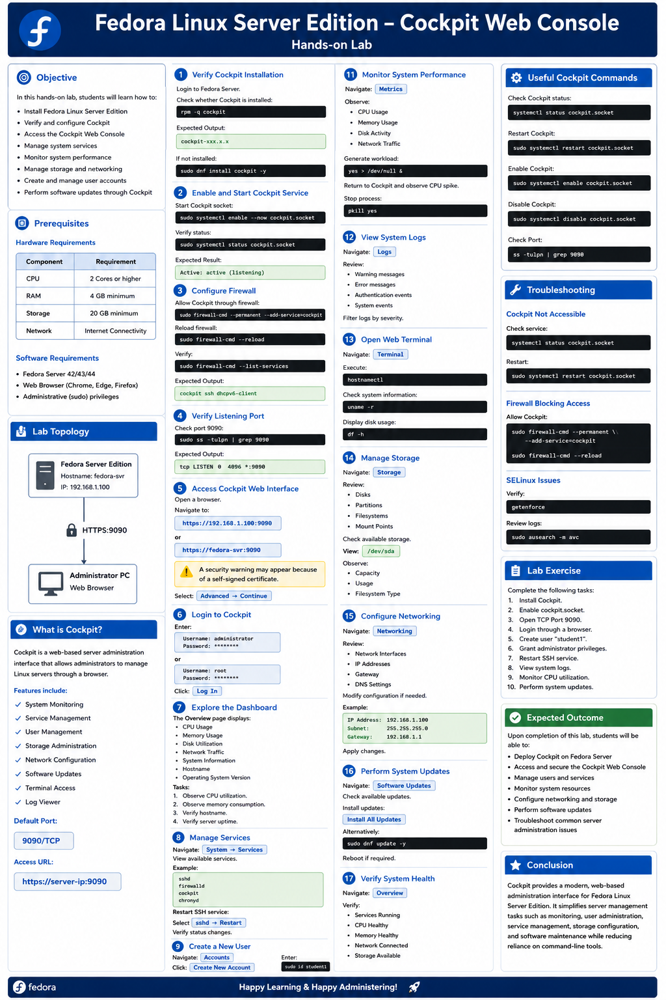
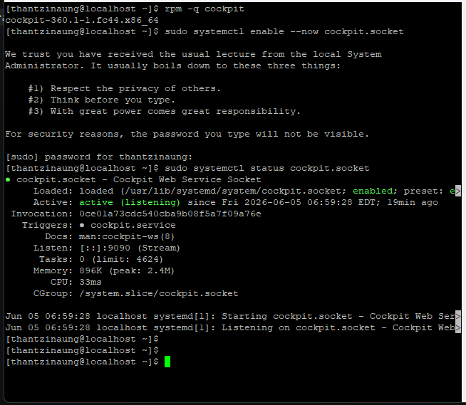
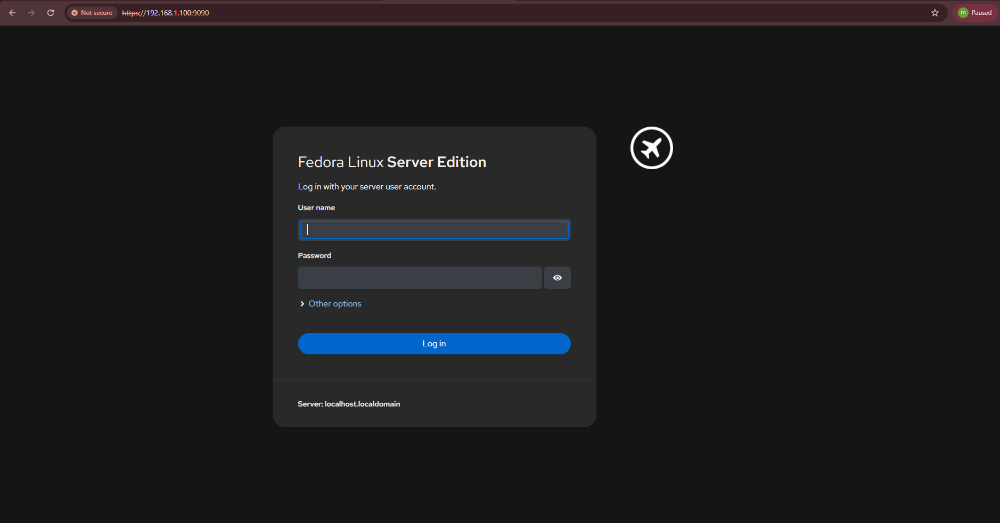
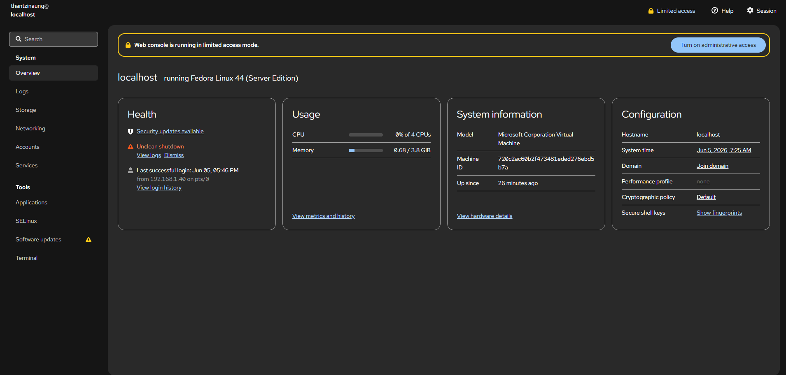
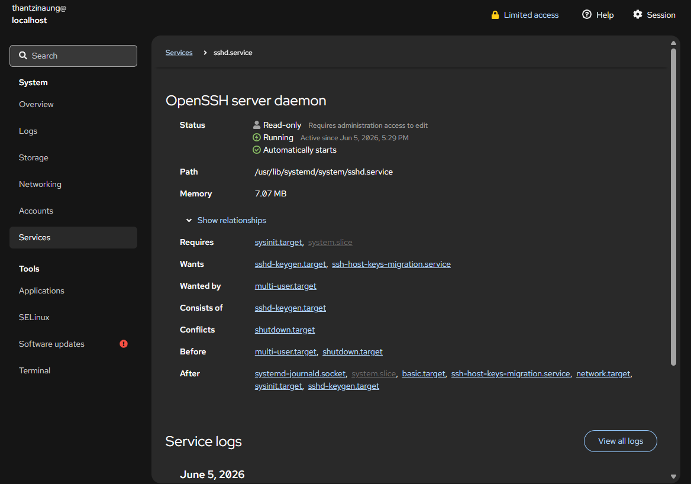
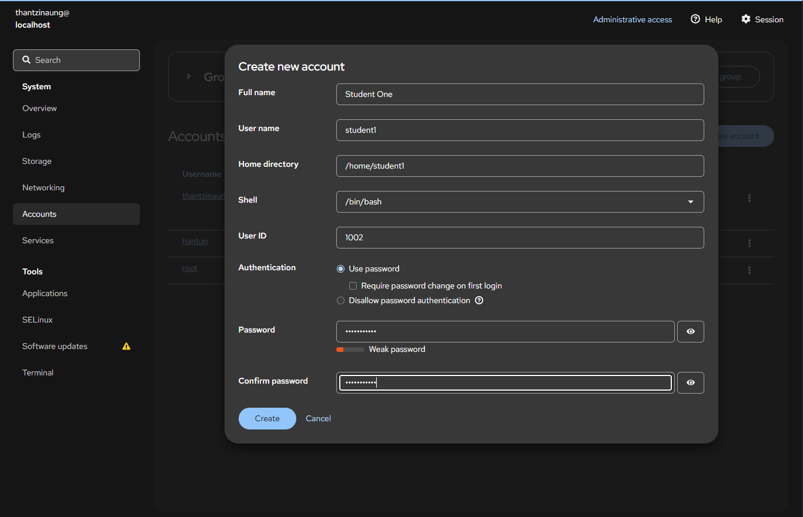
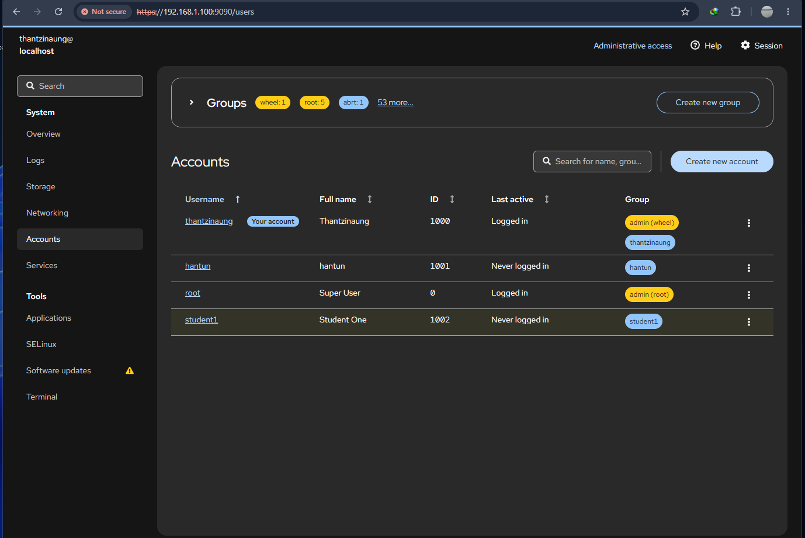
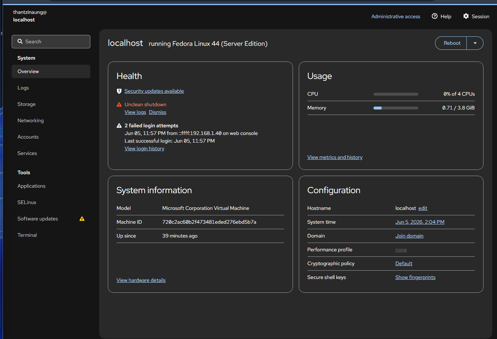
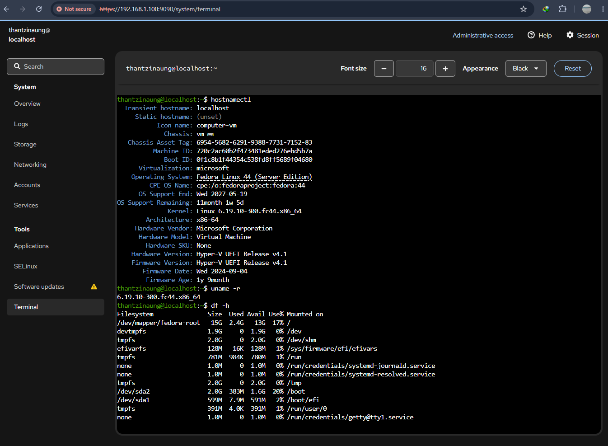
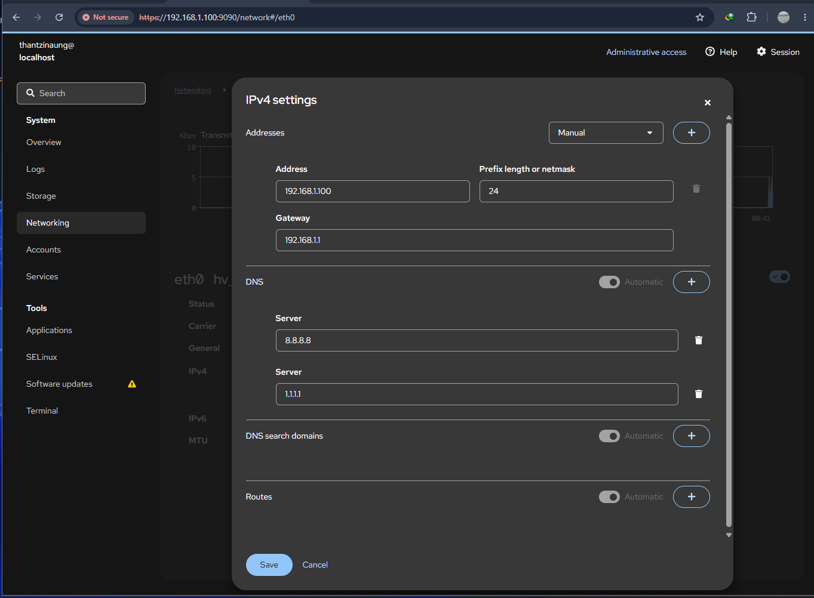

# Fedora Linux Server Edition – Cockpit Web Console Hands-on Lab

## Lab Title

**Managing Fedora Linux Server Edition with Cockpit Web Console**

---

# Objective

In this hands-on lab, students will learn how to:

* Install Fedora Linux Server Edition
* Verify and configure Cockpit
* Access the Cockpit Web Console
* Manage system services
* Monitor system performance
* Manage storage and networking
* Create and manage user accounts
* Perform software updates through Cockpit

---

# Prerequisites

### Hardware

| Component | Requirement           |
| --------- | --------------------- |
| CPU       | 2 Cores               |
| RAM       | 4 GB                  |
| Storage   | 20 GB                 |
| Network   | Internet Connectivity |

### Software

* Fedora Server 44
* Web Browser (Chrome, Edge, Firefox)
* Administrative (sudo) privileges

---

# Lab Topology

```text
+------------------------+
| Fedora Server Edition  |
| Hostname: thantzinaung |
| IP: 192.168.1.100      |
+-----------+------------+
            |
            |
      HTTPS:9090
            |
+-----------v------------+
| Administrator PC       |
| Web Browser            |
+------------------------+
```

---

# What is Cockpit?

Cockpit is a web-based server administration interface that allows administrators to manage Linux servers through a browser.

Features include:

* System Monitoring
* Service Management
* User Management
* Storage Administration
* Network Configuration
* Software Updates
* Terminal Access
* Log Viewer

Default Port:

```bash
9090/TCP
```

Access URL:

```text
https://server-ip:9090
```

---

# Step 1: Verify Cockpit Installation

Login to Fedora Server.

Check whether Cockpit is installed:

```bash
rpm -q cockpit
```

Expected Output:

```bash
cockpit-360.1-1.fc44.x86_64
```

If not installed:

```bash
sudo dnf install cockpit -y
```
* Actually cockpit built in default on  Fedora server
---

# Step 2: Enable and Start Cockpit Service

Start Cockpit socket:

```bash
sudo systemctl enable --now cockpit.socket
```

Verify status:

```bash
sudo systemctl status cockpit.socket
```

Expected Result:

```text
Active: active (listening)
```

---

# Step 3: Configure Firewall

Allow Cockpit through firewall:

```bash
sudo firewall-cmd --permanent --add-service=cockpit
```

Reload firewall:

```bash
sudo firewall-cmd --reload
```

Verify:

```bash
sudo firewall-cmd --list-services
```

Expected Output:

```text
cockpit ssh dhcpv6-client
```

---

# Step 4: Verify Listening Port

Check port 9090:

```bash
sudo ss -tulpn | grep 9090
```

---

# Step 5: Access Cockpit Web Interface

Open a browser.

Navigate to:

```text
https://192.168.1.100:9090
```

or

```text
https://fedora-svr:9090
```

A security warning may appear because of a self-signed certificate.

Select:

```text
Advanced → Continue
```

---

# Step 6: Login to Cockpit

Enter:

```text
Username: thantzinaung
Password: ********
```

or

```text
Username: root
Password: ********
```

Click:

```text
Log In
```

---

# Step 7: Explore the Dashboard

The Overview page displays:

* CPU Usage
* Memory Usage
* Disk Utilization
* Network Traffic
* System Information
* Hostname
* Operating System Version

Tasks:

1. Observe CPU utilization.
2. Observe memory consumption.
3. Verify hostname.
4. Verify server uptime.

---

# Step 8: Manage Services

Navigate:

```text
System → Services
```

View available services.

Example:

```text
sshd
firewalld
cockpit
chronyd
```

Restart SSH service:

```text
Select sshd → Restart
```

Verify status changes.

---

# Step 9: Create a New User

Navigate:

```text
Accounts
```

Click:

```text
Create New Account
```

Enter:

```text
Username: student1
Full Name: Student One
Password: password123
```

Click:

```text
Create
```

Verify account creation.

---

# Step 10: Grant Administrator Privileges

Select:

```text
student1
```

choose in the groups:

```text
wheel (Server Administrator)
```

Verify:

```bash
sudo id student1
```

---

# Step 11: Monitor System Performance

Navigate:

```text
Overview
```

Observe:

* CPU Usage
* Memory Usage
* Disk Activity

Generate workload:

```bash
yes > /dev/null &
```

Return to Cockpit and observe CPU spike.

Stop process:

```bash
pkill yes
```

---

# Step 12: View System Logs

Navigate:

```text
Logs
```

can see:

* Warning messages
* Error messages
* Authentication events
* System events

Filter logs by severity.

---

# Step 13: Open Web Terminal

Navigate:

```text
Terminal
```

Execute:

```bash
hostnamectl
```

Check system information:

```bash
uname -r
```

Display disk usage:

```bash
df -h
```

---

# Step 14: Manage Storage

Navigate:

```text
Storage
```

Can see:

* Disks
* Partitions
* Filesystems
* Mount Points

---

# Step 15: Configure Networking

Navigate:

```text
Networking
```

Review:

* Network Interfaces
* IP Addresses
* Gateway
* DNS Settings

Modify configuration if needed.

Example:

```text
IP Address: 192.168.1.100
Subnet: 255.255.255.0
Gateway: 192.168.1.1
```

Apply changes.

---

# Step 16: Perform System Updates

Navigate:

```text
Software Updates
```

Check available updates.

Install updates:

```text
Install All Updates
```

Alternatively:

```bash
sudo dnf update -y
```

Reboot if required.

---

# Step 17: Verify System Health

Navigate:

```text
Overview
```

Verify:

* Services Running
* CPU Healthy
* Memory Healthy
* Network Connected
* Storage Available

---

# Useful Cockpit Commands

Check Cockpit status:

```bash
systemctl status cockpit.socket
```

Restart Cockpit:

```bash
sudo systemctl restart cockpit.socket
```

Enable Cockpit:

```bash
sudo systemctl enable cockpit.socket
```

Disable Cockpit:

```bash
sudo systemctl disable cockpit.socket
```

Check Port:

```bash
ss -tulpn | grep 9090
```

---

# Troubleshooting

### Cockpit Not Accessible

Check service:

```bash
systemctl status cockpit.socket
```

Restart:

```bash
sudo systemctl restart cockpit.socket
```

### Firewall Blocking Access

Allow Cockpit:

```bash
sudo firewall-cmd --permanent --add-service=cockpit
sudo firewall-cmd --reload
```

### SELinux Issues

Verify:

```bash
getenforce
```

Review logs:

```bash
sudo ausearch -m avc
```

---

# Lab Exercise

Complete the following tasks:

1. Install Cockpit.
2. Enable cockpit.socket.
3. Open TCP Port 9090.
4. Login through a browser.
5. Create user "student1".
6. Grant administrator privileges.
7. Restart SSH service.
8. View system logs.
9. Monitor CPU utilization.
10. Perform system updates.

---

# Conclusion

Cockpit provides a modern, web-based administration interface for Fedora Linux Server Edition. It simplifies server management tasks such as monitoring, user administration, service management, storage configuration, and software maintenance while reducing reliance on command-line tools.

---










