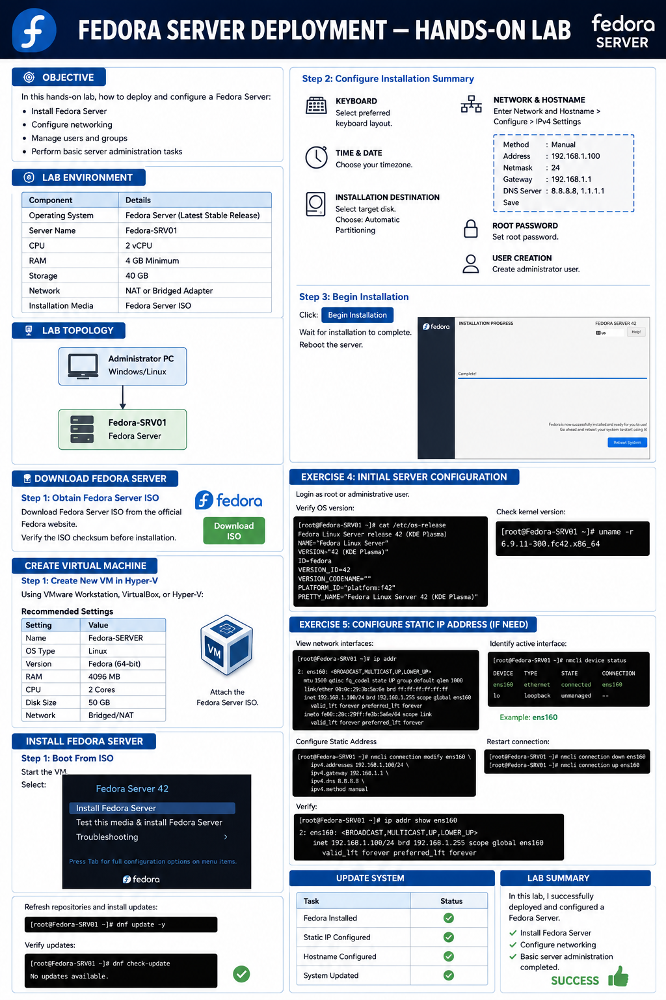
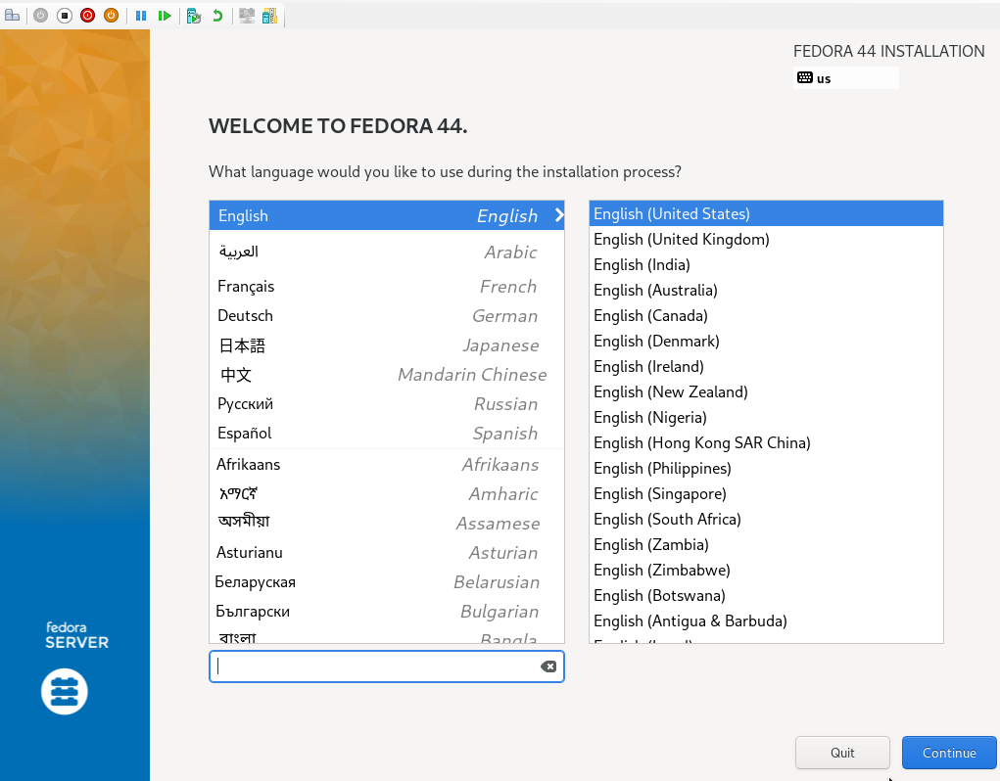
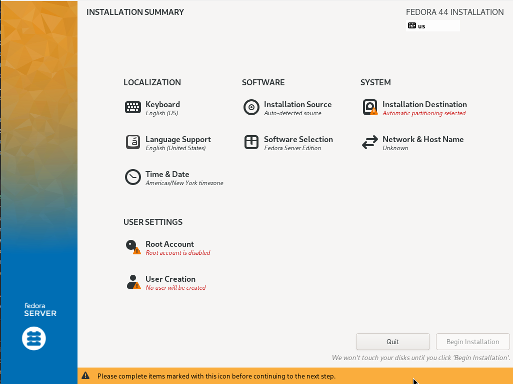
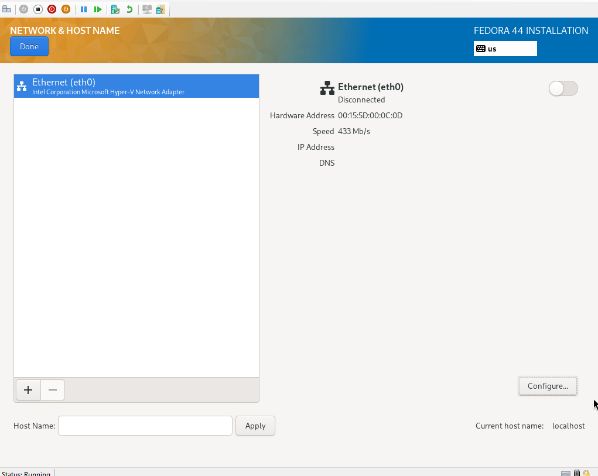
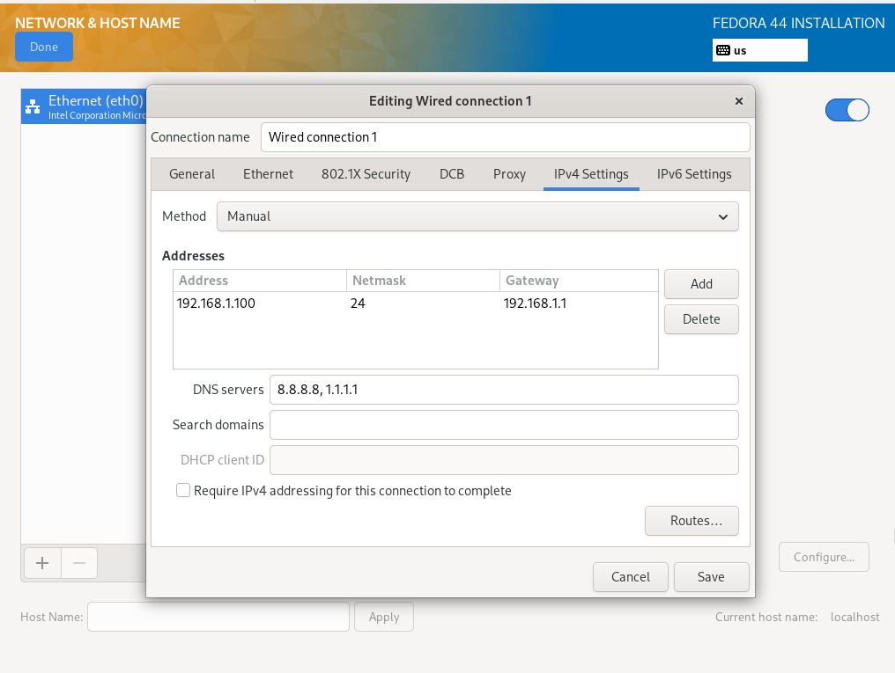
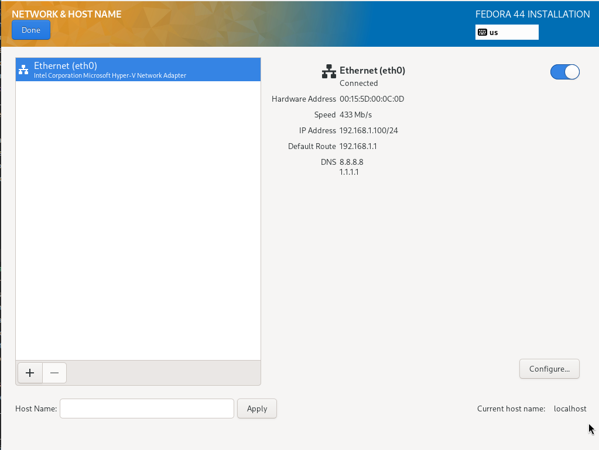
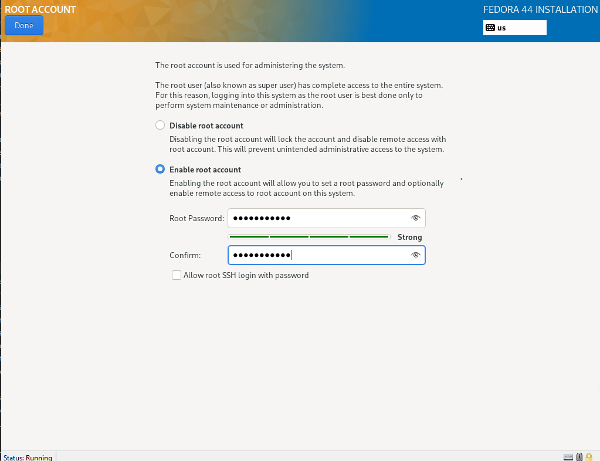
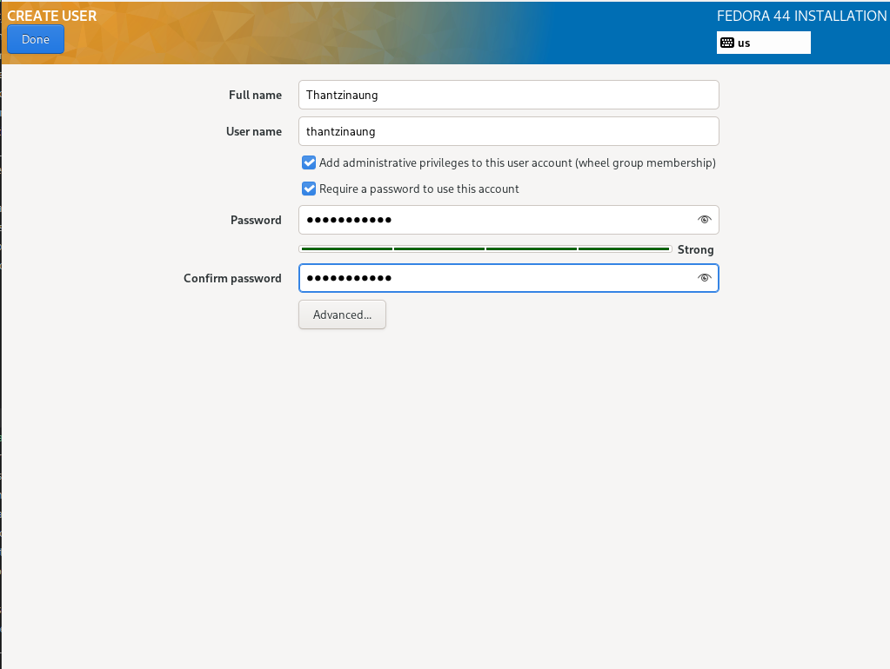
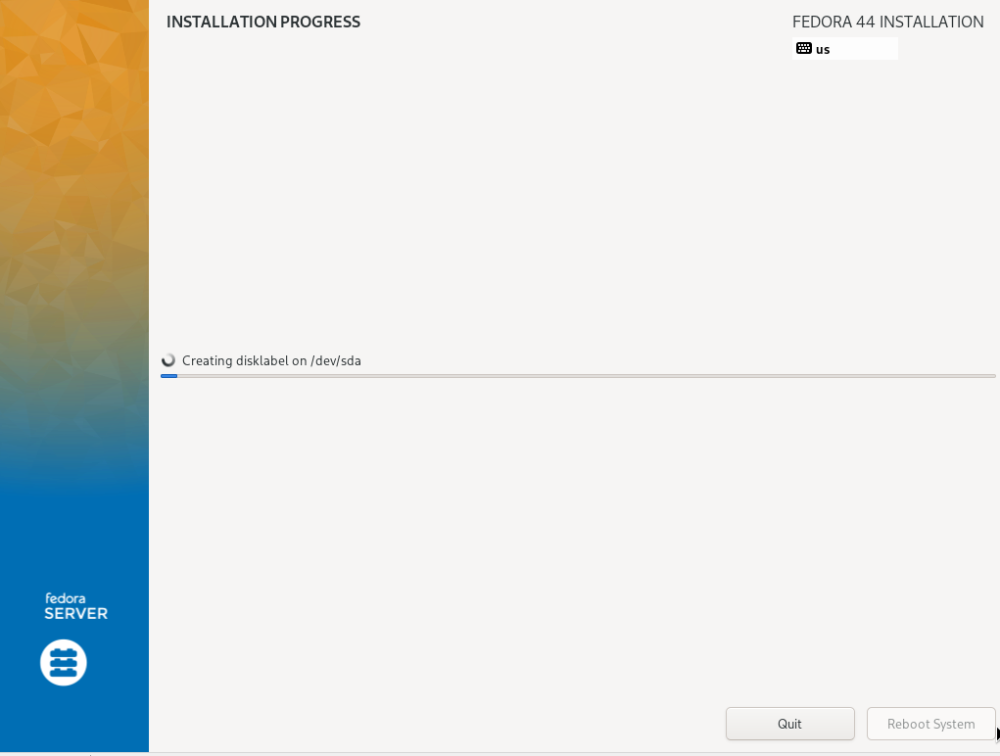
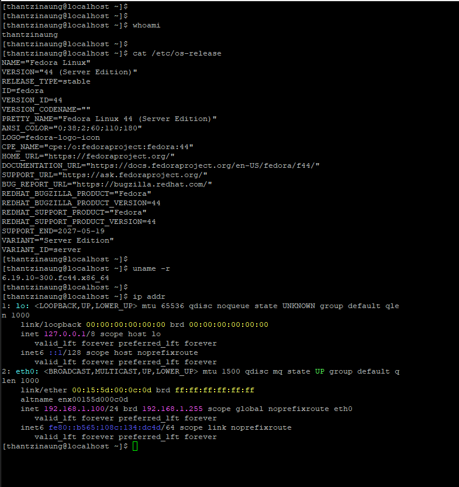

# Fedora Server Deployment — Hands-on Lab

## Objective

In this hands-on lab, how to deploy and configure a Fedora Server:

* Install Fedora Server
* Configure networking
* Manage users and groups
* Perform basic server administration tasks

---

# Lab Environment

| Component          | Details                               |
| ------------------ | ------------------------------------- |
| Operating System   | Fedora Server (Latest Stable Release) |
| Server Name        | Fedora-SRV01                          |
| CPU                | 2 vCPU                                |
| RAM                | 4 GB Minimum                          |
| Storage            | 40 GB                                 |
| Network            | NAT or Bridged Adapter                |
| Installation Media | Fedora Server ISO                     |

---

# Lab Topology

```text
+--------------------+
| Administrator PC   |
|  Windows/Linux     |
+---------+----------+
          |
          |
          |
+---------+----------+
| Fedora-SRV01       |
| Fedora Server      |
+--------------------+
```

---

# Download Fedora Server

## Step 1: Obtain Fedora Server ISO

Download Fedora Server ISO from the official Fedora website.

Verify the ISO checksum before installation.

---

# Create Virtual Machine

## Step 1: Create New VM in Hyper-V

Using VMware Workstation, VirtualBox, or Hyper-V:

### Recommended Settings

| Setting   | Value           |
| --------- | --------------- |
| Name      | Fedora-SERVER    |
| OS Type   | Linux           |
| Version   | Fedora (64-bit) |
| RAM       | 4096 MB         |
| CPU       | 2 Cores         |
| Disk Size | 50 GB           |
| Network   | Bridged/NAT     |

Attach the Fedora Server ISO.

---

# Install Fedora Server

## Step 1: Boot From ISO

Start the VM.

Select:

```text
Install Fedora Server
```

---

## Step 2: Configure Installation Summary

### Keyboard

Select preferred keyboard layout.

### Time & Date

Choose your timezone.

### Installation Destination

Select target disk.

Choose:

```text
Automatic Partitioning
```

### Network & Hostname

```text
Enter Network and Hostname > Configure >
IPv4Settings > 
Method : Manual
Address: 192.168.1.100 
Netmask: 24
Gateway: 192.168.1.1
DNS Server: 8.8.8.8, 1.1.1.1
Save
```

Set:

* Root Password
* Administrator User Account

---

## Step 3: Begin Installation

Click:

```text
Begin Installation
```
Wait for installation to complete.

Reboot the server.

---

# Exercise 4: Initial Server Configuration

Login as root or administrative user.

Verify OS version:

```bash
cat /etc/os-release
```

Example Output:

```text
Fedora Linux Server release 42
```

Check kernel version:

```bash
uname -r
```

---

# Exercise 5: Configure Static IP Address (if need)

View network interfaces:

```bash
ip addr
```

Identify active interface:

```bash
nmcli device status
```

Example:

```text
eth0
```

---

## Configure Static Address

```bash
nmcli connection modify ens160 \
ipv4.addresses 192.168.1.100/24 \
ipv4.gateway 192.168.1.1 \
ipv4.dns 8.8.8.8 \
ipv4.method manual
```

Restart connection:

```bash
nmcli connection down eth0
nmcli connection up eth0
```

Verify:

```bash
ip addr show eth0
```

---

# Update System

Refresh repositories and install updates:

```bash
sudo dnf update -y
```

Verify updates:

```bash
sudo dnf check-update
```
---

# Verification Checklist

| Task                 | Status |
| -------------------- | ------ |
| Fedora Installed     | ✓      |
| Static IP Configured | ✓      |
| Hostname Configured  | ✓      |
| System Updated       | ✓      |


---

# Lab Summary

In this lab,I successfully deployed and configured a Fedora Server. 
* Install Fedora Server
* Configure networking

---











