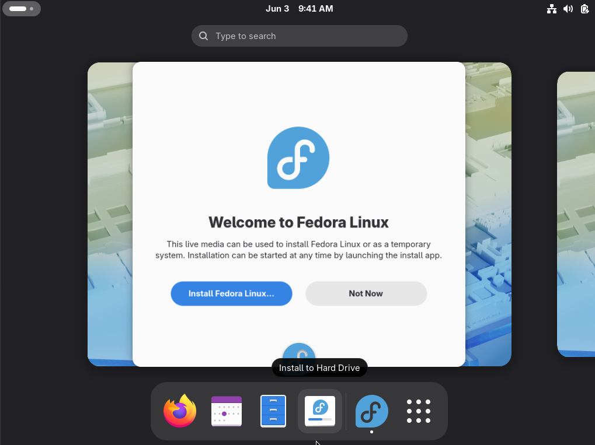
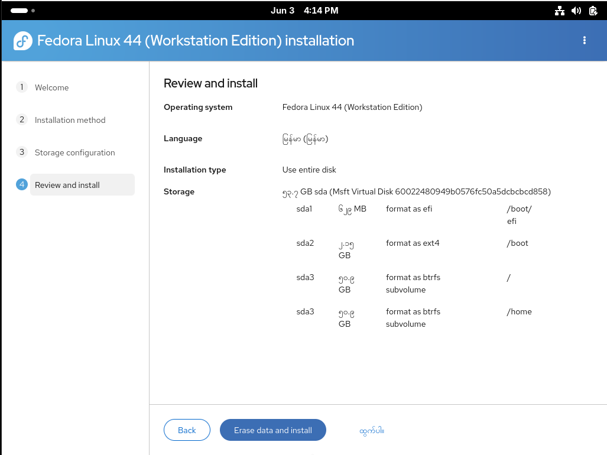
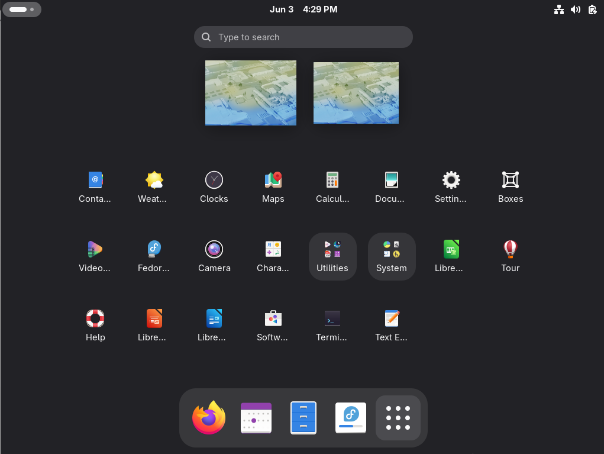
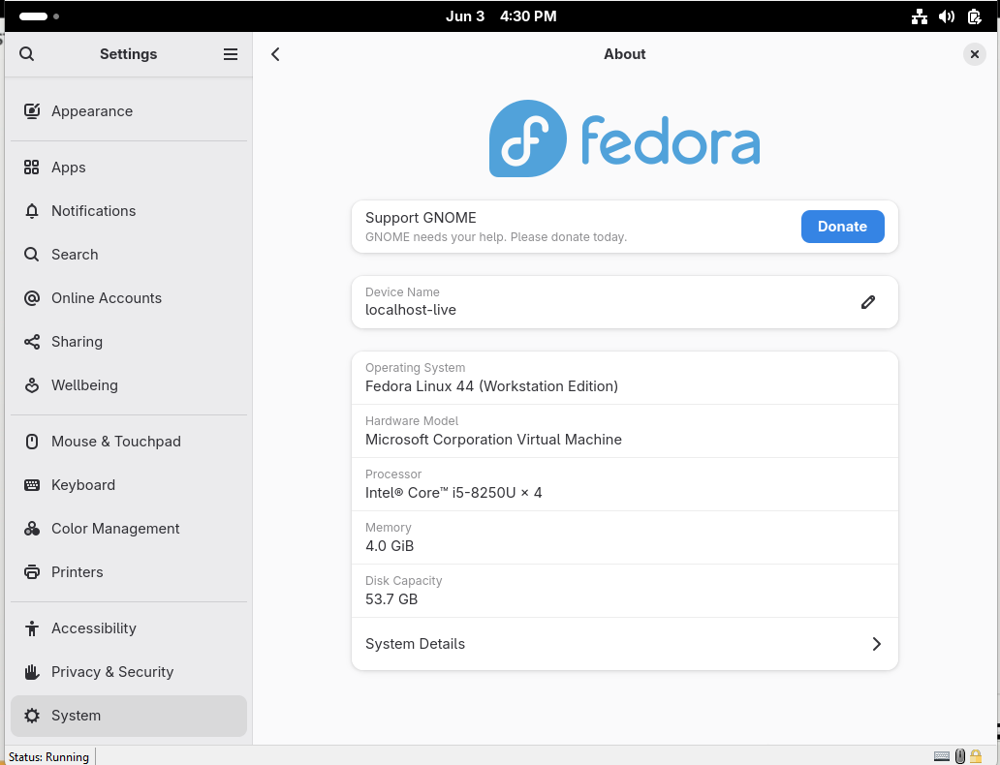
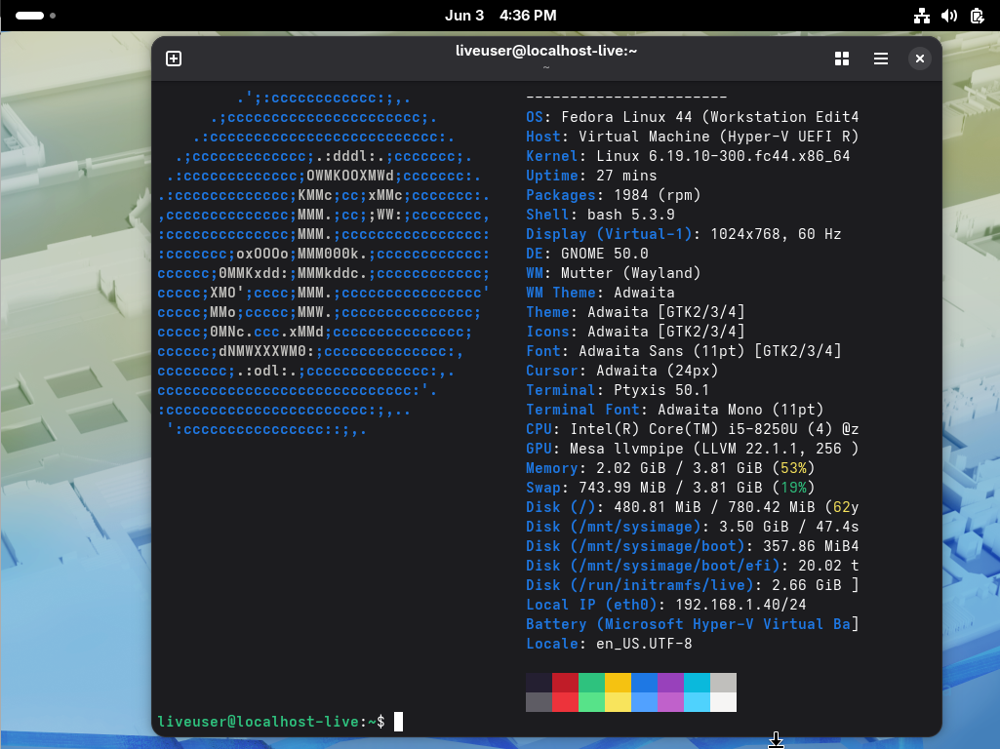

# Fedora Workstation 44 — Hands-on Lab

## Lab Overview

This hands-on lab introduces Fedora Workstation 44, one of the most popular Linux desktop operating systems. Participants will learn how to install Fedora Workstation, perform basic system administration tasks, manage software packages, configure networking, and use essential Linux commands.

---

# Lab Objectives

* Install Fedora Workstation 44
* Configure system settings
* Manage users and groups
* Install and update software packages
* Configure networking
* Use basic Linux command-line tools
* Monitor system resources
* Manage files and directories
* Perform system updates

---

# Prerequisites

### Hardware Requirements

| Component | Minimum                 |
| --------- | ----------------------- |
| CPU       | Dual-Core 2 GHz         |
| RAM       | 4 GB (8 GB Recommended) |
| Storage   | 50 GB Free Space        |
| Network   | Internet Connection     |

### Software Requirements

* Fedora Workstation 44 ISO
* VMware Workstation / VirtualBox / Hyper-V (in this lab, I use Hyper-v)
* Administrative privileges

---

# Lab Environment

| Machine     | Hostname | OS                    |
| ----------- | -------- | --------------------- |
| Workstation | fedora44 | Fedora Workstation 44 |

---

# Exercise 1: Installing Fedora Workstation 44

## Step 1: Download Fedora Workstation 44

Download the Fedora Workstation 44 ISO image from the official Fedora website.

## Step 2: Create Virtual Machine

### Recommended VM Settings

| Setting | Value  |
| ------- | ------ |
| CPU     | 2 vCPU |
| Memory  | 4 GB   |
| Disk    | 40 GB  |
| Network | NAT    |

## Step 3: Start Installation

1. Boot from Fedora ISO.
2. Select:

```
Start Fedora Workstation Live
```

3. Once the desktop loads, click:

```
Install Fedora
```

## Step 4: Configure Installation

Configure:

* Language
* Keyboard Layout
* Installation Destination
* Time & Date

Click:

```
Begin Installation
```

After installation completes:

```
Reboot System
```

---

# Exercise 2: Verify Installation

Open Terminal and verify OS information.

```bash
cat /etc/os-release
```

Expected output:

```bash
NAME="Fedora Linux"
VERSION="44"
```

Check kernel version:

```bash
uname -r
```

Check hostname:

```bash
hostnamectl
```

---

# Exercise 3: System Update

Update the operating system.

Refresh repositories:

```bash
sudo dnf check-update
```

Install updates:

```bash
sudo dnf upgrade -y
```

Verify updates:

```bash
sudo dnf history
```

---

# Exercise 4: User Management

## Create New User

```bash
sudo useradd trainee1
```

Set password:

```bash
sudo passwd trainee1
```

## Verify User

```bash
id trainee1
```

## Switch User

```bash
su - trainee1
```

Return to administrator account:

```bash
exit
```

---

# Exercise 5: File and Directory Management

## Create Directory Structure

```bash
mkdir -p ~/Lab/Documents
mkdir -p ~/Lab/Projects
```

Verify:

```bash
tree ~/Lab
```

## Create Files

```bash
touch ~/Lab/Documents/file1.txt
touch ~/Lab/Documents/file2.txt
```

List files:

```bash
ls -lh ~/Lab/Documents
```

Copy file:

```bash
cp file1.txt file3.txt
```

Rename file:

```bash
mv file3.txt report.txt
```

Delete file:

```bash
rm report.txt
```

---

# Exercise 6: Managing Software Packages

## Search Package

```bash
dnf search vlc
```

## Install Package

```bash
sudo dnf install vlc -y
```

## Verify Installation

```bash
rpm -qa | grep vlc
```

## Remove Package

```bash
sudo dnf remove vlc -y
```

---

# Exercise 7: Network Configuration

Display network information:

```bash
ip addr
```

Display routing table:

```bash
ip route
```

Test connectivity:

```bash
ping -c 4 google.com
```

Display DNS servers:

```bash
cat /etc/resolv.conf
```

Display active connections:

```bash
nmcli connection show
```

---

# Exercise 8: Firewall Management

Check firewall status:

```bash
sudo firewall-cmd --state
```

List active zones:

```bash
sudo firewall-cmd --get-active-zones
```

Allow SSH service:

```bash
sudo firewall-cmd --permanent --add-service=ssh
```

Reload firewall:

```bash
sudo firewall-cmd --reload
```

Verify:

```bash
sudo firewall-cmd --list-services
```

---

# Exercise 9: Process Management

Display running processes:

```bash
ps aux
```

Interactive process viewer:

```bash
top
```

Install htop:

```bash
sudo dnf install htop -y
```

Launch htop:

```bash
htop
```

Find process:

```bash
pgrep firefox
```

Terminate process:

```bash
kill PID
```

---

# Exercise 10: Storage Management

Display disk usage:

```bash
df -h
```

Display block devices:

```bash
lsblk
```

Check directory size:

```bash
du -sh ~/Downloads
```

---

# Exercise 11: Service Management

View service status:

```bash
systemctl status sshd
```

Start service:

```bash
sudo systemctl start sshd
```

Enable service at boot:

```bash
sudo systemctl enable sshd
```

Verify:

```bash
systemctl is-enabled sshd
```

---

# Exercise 12: Using GNOME Desktop

## Activities Overview

Press:

```
Super Key
```

Features:

* Application Launcher
* Search
* Workspaces
* Running Applications

## Settings Application

Navigate to:

```
Settings
```

Configure:

* Appearance
* Network
* Bluetooth
* Users
* Displays
* Power Management

---

# Exercise 13: Screenshot and Screen Recording

Take screenshot:

```
PrtSc
```

Capture selected area:

```
Shift + PrtSc
```

Start screen recording:

```
Ctrl + Shift + Alt + R
```

Stop recording using same shortcut.

---

# Exercise 14: System Monitoring

Open GNOME System Monitor.

View:

* CPU Usage
* Memory Usage
* Network Activity
* Running Processes

Command line monitoring:

```bash
free -h
```

```bash
vmstat
```

```bash
iostat
```

---

# Exercise 15: System Information Collection

Generate system report:

```bash
hostnamectl
```

```bash
lscpu
```

```bash
free -h
```

```bash
lsblk
```

Save report:

```bash
(
hostnamectl
lscpu
free -h
lsblk
) > system-report.txt
```

Verify:

```bash
cat system-report.txt
```

---

# Lab Challenge

Perform the following tasks:

1. Create a user named:

```bash
student1
```

2. Create directory structure:

```bash
/home/student1/LabData
```

3. Install:

```bash
git
```

4. Verify network connectivity.

5. Generate a system report.

6. Save the report inside:

```bash
/home/student1/LabData
```

---

# Lab Summary

In this hands-on lab, I successfully:

* Installed Fedora Workstation 44
* Updated the operating system
* Managed users and permissions
* Installed software packages
* Configured networking
* Managed services and processes
* Used GNOME Desktop Environment
* Performed system monitoring
* Generated system reports
---

# Essential Fedora Commands Cheat Sheet

```bash
sudo dnf update -y
sudo dnf install package-name
sudo dnf remove package-name

ip addr
ip route

systemctl status service
systemctl start service
systemctl enable service

firewall-cmd --list-services

df -h
lsblk
free -h

top
htop
ps aux

useradd username
passwd username

mkdir directory
touch file
cp source destination
mv source destination
rm file
```






