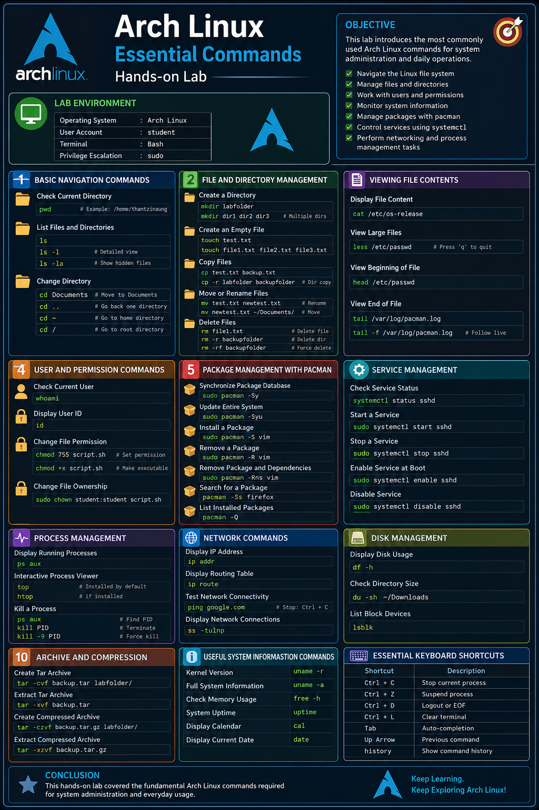
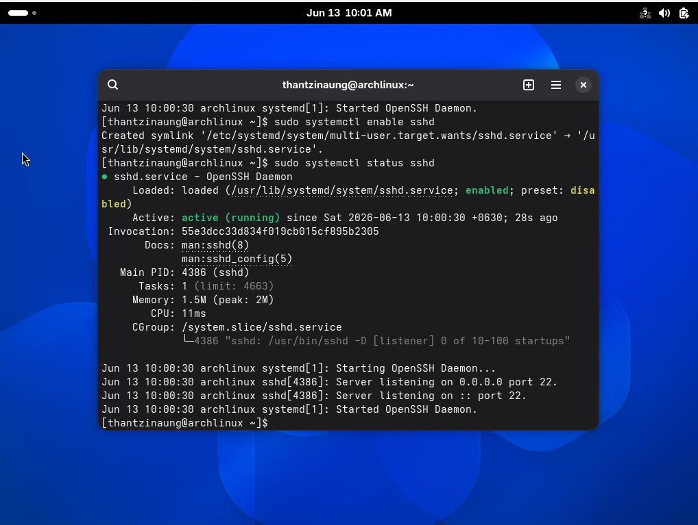

# Arch Linux Essential Commands - Hands-on Lab

## Objective

This lab introduces the most commonly used Arch Linux commands for system administration and daily operations.

* Navigate the Linux file system
* Manage files and directories
* Work with users and permissions
* Monitor system information
* Manage packages with `pacman`
* Control services using `systemctl`
* Perform networking and process management tasks

---

# Lab Environment

| Item                 | Value      |
| -------------------- | ---------- |
| Operating System     | Arch Linux |
| User Account         | student    |
| Terminal             | Bash       |
| Privilege Escalation | sudo       |

---

# Part 1: Basic Navigation Commands

## Check Current Directory

```bash
pwd
```

Example Output:

```text
/home/thantzinaung
```

---

## List Files and Directories

```bash
ls
```

Detailed View:

```bash
ls -l
```

Show Hidden Files:

```bash
ls -la
```

---

## Change Directory

Move to Documents:

```bash
cd Documents
```

Go Back One Directory:

```bash
cd ..
```

Go to Home Directory:

```bash
cd ~
```

Go to Root Directory:

```bash
cd /
```

---

# Part 2: File and Directory Management

## Create a Directory

```bash
mkdir labfolder
```

Create Multiple Directories:

```bash
mkdir dir1 dir2 dir3
```

---

## Create an Empty File

```bash
touch test.txt
```

Create Multiple Files:

```bash
touch file1.txt file2.txt file3.txt
```

---

## Copy Files

```bash
cp test.txt backup.txt
```

Copy a Directory:

```bash
cp -r labfolder backupfolder
```

---

## Move or Rename Files

Rename:

```bash
mv test.txt newtest.txt
```

Move:

```bash
mv newtest.txt ~/Documents/
```

---

## Delete Files

```bash
rm file1.txt
```

Delete Directory Recursively:

```bash
rm -r backupfolder
```

Force Delete:

```bash
rm -rf backupfolder
```

---

# Part 3: Viewing File Contents

## Display File Content

```bash
cat /etc/os-release
```

---

## View Large Files

```bash
less /etc/passwd
```

Quit:

```
q
```

---

## View Beginning of File

```bash
head /etc/passwd
```

---

## View End of File

```bash
tail /var/log/pacman.log
```

Follow Live Log:

```bash
tail -f /var/log/pacman.log
```

---

# Part 4: User and Permission Commands

## Check Current User

```bash
whoami
```

---

## Display User ID

```bash
id
```

---

## Change File Permission

```bash
chmod 755 script.sh
```

Make File Executable:

```bash
chmod +x script.sh
```

---

## Change File Ownership

```bash
sudo chown student:student script.sh
```

---

# Part 5: Package Management with Pacman

## Synchronize Package Database

```bash
sudo pacman -Sy
```

---

## Update Entire System

```bash
sudo pacman -Syu
```

---

## Install a Package

```bash
sudo pacman -S vim
```

---

## Remove a Package

```bash
sudo pacman -R vim
```

Remove Package and Dependencies:

```bash
sudo pacman -Rns vim
```

---

## Search for a Package

```bash
pacman -Ss firefox
```

---

## List Installed Packages

```bash
pacman -Q
```

---

# Part 6: Service Management

## Check Service Status

```bash
systemctl status sshd
```

---

## Start a Service

```bash
sudo systemctl start sshd
```

---

## Stop a Service

```bash
sudo systemctl stop sshd
```

---

## Enable Service at Boot

```bash
sudo systemctl enable sshd
```

---

## Disable Service

```bash
sudo systemctl disable sshd
```

---

# Part 7: Process Management

## Display Running Processes

```bash
ps aux
```

---

## Interactive Process Viewer

```bash
top
```

If installed:

```bash
htop
```

---

## Kill a Process

Find PID:

```bash
ps aux
```

Terminate:

```bash
kill PID
```

Force Kill:

```bash
kill -9 PID
```

---

# Part 8: Network Commands

## Display IP Address

```bash
ip addr
```

---

## Display Routing Table

```bash
ip route
```

---

## Test Network Connectivity

```bash
ping google.com
```

Stop:

```
Ctrl + C
```

---

## Display Network Connections

```bash
ss -tulnp
```

---

# Part 9: Disk Management

## Display Disk Usage

```bash
df -h
```

---

## Check Directory Size

```bash
du -sh ~/Downloads
```

---

## List Block Devices

```bash
lsblk
```

---

# Part 10: Archive and Compression

## Create Tar Archive

```bash
tar -cvf backup.tar labfolder/
```

---

## Extract Tar Archive

```bash
tar -xvf backup.tar
```

---

## Create Compressed Archive

```bash
tar -czvf backup.tar.gz labfolder/
```

---

## Extract Compressed Archive

```bash
tar -xzvf backup.tar.gz
```

---

# Part 11: Useful System Information Commands

## Kernel Version

```bash
uname -r
```

---

## Full System Information

```bash
uname -a
```

---

## Check Memory Usage

```bash
free -h
```

---

## System Uptime

```bash
uptime
```

---

## Display Calendar

```bash
cal
```

---

## Display Current Date

```bash
date
```

---

# Essential Keyboard Shortcuts

| Shortcut | Description          |
| -------- | -------------------- |
| Ctrl + C | Stop current process |
| Ctrl + Z | Suspend process      |
| Ctrl + D | Logout or EOF        |
| Ctrl + L | Clear terminal       |
| Tab      | Auto-completion      |
| Up Arrow | Previous command     |
| history  | Show command history |

---

# Conclusion

This hands-on lab covered the fundamental Arch Linux commands required for system administration and everyday usage.

---


