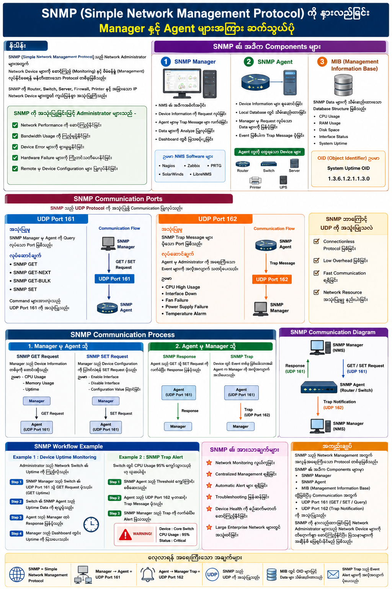

# Understanding SNMP (Simple Network Management Protocol)

## Communication between Manager & Agent

---

# Overview

**SNMP (Simple Network Management Protocol)** သည် Network Administrator များအတွက် Network Device များကို စောင့်ကြည့် (Monitoring) နှင့် စီမံခန့်ခွဲ (Management) လုပ်နိုင်စေရန် ဖန်တီးထားသော Protocol တစ်ခုဖြစ်သည်။

SNMP ကို Router, Switch, Server, Firewall, Printer နှင့် အခြားသော IP Network Device များတွင် ကျယ်ပြန့်စွာ အသုံးပြုကြသည်။

SNMP ကို အသုံးပြုခြင်းဖြင့် Administrator များသည် -

* Network Performance ကို စောင့်ကြည့်နိုင်ခြင်း
* Bandwidth Usage ကို ကြည့်ရှုနိုင်ခြင်း
* Device Error များကို ရှာဖွေနိုင်ခြင်း
* Hardware Failure များကို ကြိုတင်သတိပေးနိုင်ခြင်း
* Remote မှ Device Configuration များ ပြုလုပ်နိုင်ခြင်း

တို့ကို လုပ်ဆောင်နိုင်သည်။

---

# SNMP ၏ အဓိက Components များ

## 1. SNMP Manager

SNMP Manager သည် Network Management System (NMS) ၏ အဓိကအစိတ်အပိုင်းဖြစ်ပြီး Network Device များထံမှ အချက်အလက်များကို တောင်းယူ (Query) သို့မဟုတ် Trap Message များကို လက်ခံရယူသည်။

### SNMP Manager ၏ တာဝန်များ

* Device Information ကို Request လုပ်ခြင်း
* Agent များမှ Trap Message များ လက်ခံခြင်း
* Data များကို Analyze ပြုလုပ်ခြင်း
* Dashboard တွင် ပြသပေးခြင်း

ဥပမာ NMS Software များ

* Nagios
* Zabbix
* PRTG
* SolarWinds
* LibreNMS

---

## 2. SNMP Agent

SNMP Agent သည် Network Device များအတွင်း Run နေသော Software Service တစ်ခုဖြစ်သည်။

Agent သည်

* Device Information များ စုဆောင်းခြင်း
* Local Database တွင် သိမ်းဆည်းထားခြင်း
* Manager မှ Request လုပ်သော Data များကို ပြန်ပို့ခြင်း
* Event ဖြစ်ပါက Trap Message ပို့ခြင်း

တို့ကို လုပ်ဆောင်သည်။

SNMP Agent ကို အောက်ပါ Device များတွင် တွေ့ရသည်။

* Router
* Switch
* Windows Server
* Linux Server
* Printer
* UPS Device

---

## 3. MIB (Management Information Base)

MIB သည် SNMP Data များကို သိမ်းဆည်းထားသော Database Structure ဖြစ်သည်။

MIB တွင်

* CPU Usage
* RAM Usage
* Disk Space
* Interface Status
* System Uptime

အစရှိသော Data များကို OID (Object Identifier) များဖြင့် သတ်မှတ်ထားသည်။

ဥပမာ

```
System Uptime OID

1.3.6.1.2.1.1.3.0
```

---

# SNMP Communication Ports

SNMP သည် UDP Protocol ကို အသုံးပြု၍ Communication ပြုလုပ်သည်။

---

## UDP Port 161

### အသုံးပြုမှု

SNMP Manager မှ Agent ကို Query လုပ်သော Port ဖြစ်သည်။

### လုပ်ဆောင်ချက်

* SNMP GET
* SNMP GET-NEXT
* SNMP GET-BULK
* SNMP SET

Command များအားလုံးသည် UDP Port 161 ကို အသုံးပြုသည်။

### Communication Flow

```
SNMP Manager
       |
       | GET / SET Request
       V
UDP Port 161
       |
SNMP Agent
```

---

## UDP Port 162

### အသုံးပြုမှု

SNMP Trap Message များ ပို့သော Port ဖြစ်သည်။

### လုပ်ဆောင်ချက်

Agent မှ Administrator ကို အရေးကြီးသော Event များကို အလိုအလျောက် သတင်းပို့ပေးသည်။

ဥပမာ

* CPU High Usage
* Interface Down
* Fan Failure
* Power Supply Failure
* Temperature Alarm

### Communication Flow

```
SNMP Agent
      |
      | Trap Message
      V
UDP Port 162
      |
SNMP Manager
```

---

# SNMP ဘာကြောင့် UDP ကို အသုံးပြုသလဲ

SNMP သည် UDP ကို အသုံးပြုရသော အကြောင်းရင်းများမှာ

* Connectionless Protocol ဖြစ်ခြင်း
* Low Overhead ဖြစ်ခြင်း
* Fast Communication ရရှိခြင်း
* Network Resource အသုံးပြုမှု နည်းပါးခြင်း

တို့ကြောင့် ဖြစ်သည်။

---

# SNMP Communication Process

## 1. Manager မှ Agent သို့

### SNMP GET Request

Manager သည် Device Information တစ်ခုကို တောင်းဆိုသည်။

ဥပမာ

* CPU Usage
* Memory Usage
* Uptime

Communication

```
Manager
    |
    | GET Request
    |
    V
Agent (UDP Port 161)
```

---

### SNMP SET Request

Manager သည် Device Configuration ကို ပြောင်းလဲရန် SET Request ပို့သည်။

ဥပမာ

* Enable Interface
* Disable Interface
* Configuration Value ပြောင်းခြင်း

Communication

```
Manager
    |
    | SET Request
    |
    V
Agent (UDP Port 161)
```

---

## 2. Agent မှ Manager သို့

### SNMP Response

Agent သည် GET သို့ SET Request ကို လက်ခံပြီး Response ပြန်ပို့သည်။

```
Agent
    |
    | Response
    |
    V
Manager
```

---

### SNMP Trap

Device တွင် Event တစ်ခု ဖြစ်ပေါ်သောအခါ Agent က Manager ကို အလိုအလျောက် အသိပေးသည်။

```
Agent
    |
    | Trap
    |
    V
Manager (UDP Port 162)
```

---

# SNMP Workflow Example

## Example 1 : Device Uptime Monitoring

Administrator သည် Network Switch ၏ Uptime ကို ကြည့်လိုလျှင်-

### Step 1

SNMP Manager သည် Switch ၏ UDP Port 161 သို့ GET Request ပို့သည်။

```
GET Uptime
```

### Step 2

Switch ၏ SNMP Agent သည် Uptime Data ကို ရယူသည်။

### Step 3

Agent သည် Manager ထံ Response ပြန်ပို့သည်။

### Step 4

Manager သည် Dashboard တွင် Uptime ကို ပြသပေးသည်။

---

## Example 2 : SNMP Trap Alert

Switch တွင် CPU Usage 95% ကျော်သွားသည်ဟု ယူဆပါစို့။

### Step 1

SNMP Agent သည် Threshold ကျော်ကြောင်း စစ်ဆေးသည်။

### Step 2

Agent သည် UDP Port 162 မှတဆင့် Trap Message ပို့သည်။

### Step 3

SNMP Manager သည် Trap ကို လက်ခံပြီး Alert ပြသသည်။

ဥပမာ

```
WARNING!

Device : Core Switch
CPU Usage : 95%
Status : Critical
```

Administrator သည် ပြဿနာကို ချက်ချင်း ဖြေရှင်းနိုင်မည် ဖြစ်သည်။

---

# SNMP Communication Diagram

```
                 +-------------------+
                 |   SNMP Manager    |
                 |     (NMS)         |
                 +-------------------+
                    ^           |
                    |           |
          Response  |           | GET / SET
                    |           |
               UDP 161      UDP 161
                    |           |
                    V           V
              +-------------------+
              |    SNMP Agent     |
              | (Router/Switch)   |
              +-------------------+
                    |
                    | Trap
                    |
                 UDP 162
                    |
                    V
             +------------------+
             |   SNMP Manager   |
             +------------------+
```

---

# SNMP ၏ အားသာချက်များ

* Network Monitoring လွယ်ကူခြင်း
* Centralized Management ရရှိခြင်း
* Automatic Alert များ ရရှိခြင်း
* Troubleshooting မြန်ဆန်ခြင်း
* Device Health ကို စဉ်ဆက်မပြတ် စောင့်ကြည့်နိုင်ခြင်း
* Large Enterprise Network များတွင် အသုံးဝင်ခြင်း

---

# အကျဉ်းချုပ်

SNMP သည် Network Management အတွက် အလွန်အရေးကြီးသော Protocol တစ်ခုဖြစ်သည်။

SNMP ၏ အဓိက Components များမှာ

* SNMP Manager
* SNMP Agent
* MIB (Management Information Base)

တို့ဖြစ်ပြီး Communication အတွက်

* UDP Port 161 (GET / SET / Query)
* UDP Port 162 (Trap Notification)

ကို အသုံးပြုသည်။

SNMP ကို နားလည်ထားခြင်းဖြင့် Network Administrator များသည် Network Device များကို ထိရောက်စွာ စောင့်ကြည့်နိုင်ပြီး ပြဿနာများကို အချိန်မီ ဖြေရှင်းနိုင်မည် ဖြစ်သည်။

---

# လေ့လာရန် အရေးကြီးသော အချက်များ

✅ SNMP = Simple Network Management Protocol

✅ Manager → Agent = UDP Port 161

✅ Agent → Manager Trap = UDP Port 162

✅ SNMP သည် UDP ကို အသုံးပြုသည်

✅ MIB တွင် OID များဖြင့် Data များ သိမ်းဆည်းထားသည်

✅ SNMP Trap သည် Event Alert များကို အလိုအလျောက် ပို့ပေးသည်

---

