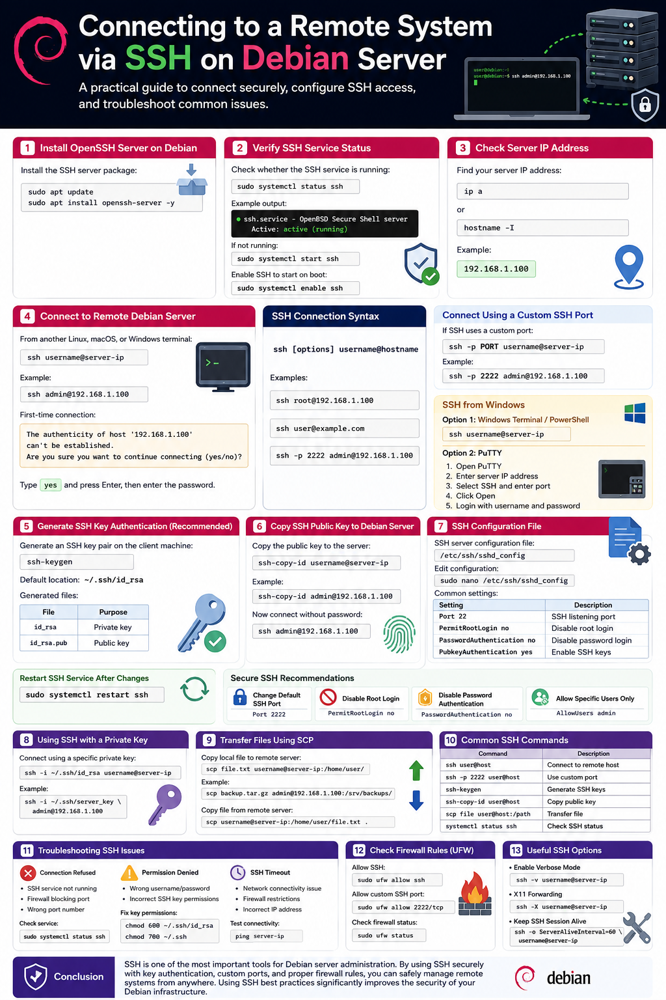

# Connecting to a Remote System via SSH on Debian Server

Secure Shell (SSH) is the standard protocol used to securely connect to remote Linux servers. With SSH, administrators can manage servers remotely through a secure encrypted connection.

This guide explains how to connect to a remote Debian server using SSH, configure SSH access, troubleshoot common problems, and improve server security.

---

# What is SSH?

SSH (Secure Shell) is a secure network protocol used to:

- Connect to remote systems
- Execute commands remotely
- Transfer files securely
- Manage servers over the internet or local network

SSH encrypts all communication between the client and the server.

---

# Prerequisites

Before connecting to a Debian server via SSH, ensure:

- The Debian server is powered on
- The server has network connectivity
- SSH server is installed on the Debian machine
- You know:
  - Server IP address
  - Username
  - Password or SSH key

---

# Step 1: Install OpenSSH Server on Debian

On the Debian server, install the SSH server package:

```bash
sudo apt update
sudo apt install openssh-server -y
```

---

# Step 2: Verify SSH Service Status

Check whether the SSH service is running:

```bash
sudo systemctl status ssh
```

Example output:

```bash
● ssh.service - OpenBSD Secure Shell server
   Active: active (running)
```

If the service is not running:

```bash
sudo systemctl start ssh
```

Enable SSH to start automatically during boot:

```bash
sudo systemctl enable ssh
```

---

# Step 3: Check Server IP Address

Find the Debian server IP address:

```bash
ip a
```

Or:

```bash
hostname -I
```

Example:

```bash
192.168.1.100
```

---

# Step 4: Connect to Remote Debian Server

From another Linux, macOS, or Windows terminal:

```bash
ssh username@server-ip
```

Example:

```bash
ssh admin@192.168.1.100
```

First-time connection example:

```bash
The authenticity of host '192.168.1.100' can't be established.
Are you sure you want to continue connecting (yes/no)?
```

Type:

```bash
yes
```

Then enter the password.

---

# SSH Connection Syntax

```bash
ssh [options] username@hostname
```

Examples:

```bash
ssh root@192.168.1.100
```

```bash
ssh user@example.com
```

```bash
ssh -p 2222 admin@192.168.1.100
```

---

# Connect Using a Custom SSH Port

If the SSH server uses a custom port:

```bash
ssh -p PORT username@server-ip
```

Example:

```bash
ssh -p 2222 admin@192.168.1.100
```

---

# SSH from Windows

## Option 1: Windows Terminal / PowerShell

Modern Windows versions include OpenSSH client:

```powershell
ssh username@server-ip
```

---

## Option 2: PuTTY

PuTTY is a popular SSH client for Windows.

Steps:

1. Open PuTTY
2. Enter server IP address
3. Select SSH
4. Enter port number
5. Click Open
6. Login with username and password

---

# Generate SSH Key Authentication (Recommended)

Password authentication is less secure than SSH keys.

Generate an SSH key pair on the client machine:

```bash
ssh-keygen
```

Default key location:

```bash
~/.ssh/id_rsa
```

Generated files:

| File | Purpose |
|---|---|
| id_rsa | Private key |
| id_rsa.pub | Public key |

---

# Copy SSH Public Key to Debian Server

Use:

```bash
ssh-copy-id username@server-ip
```

Example:

```bash
ssh-copy-id admin@192.168.1.100
```

Now connect without entering a password:

```bash
ssh admin@192.168.1.100
```

---

# SSH Configuration File

SSH server configuration file:

```bash
/etc/ssh/sshd_config
```

Edit configuration:

```bash
sudo nano /etc/ssh/sshd_config
```

Common settings:

| Setting | Description |
|---|---|
| Port 22 | SSH listening port |
| PermitRootLogin no | Disable root login |
| PasswordAuthentication no | Disable password login |
| PubkeyAuthentication yes | Enable SSH keys |

---

# Restart SSH Service After Changes

```bash
sudo systemctl restart ssh
```

---

# Secure SSH Recommendations

## Change Default SSH Port

Example:

```bash
Port 2222
```

---

## Disable Root Login

```bash
PermitRootLogin no
```

---

## Disable Password Authentication

```bash
PasswordAuthentication no
```

Use only SSH keys.

---

## Allow Specific Users Only

```bash
AllowUsers admin
```

---

# Using SSH with a Private Key

Connect using a specific private key:

```bash
ssh -i ~/.ssh/id_rsa username@server-ip
```

Example:

```bash
ssh -i ~/.ssh/server_key admin@192.168.1.100
```

---

# Transfer Files Using SCP

Copy local file to remote server:

```bash
scp file.txt username@server-ip:/home/user/
```

Example:

```bash
scp backup.tar.gz admin@192.168.1.100:/srv/backups/
```

Copy file from remote server:

```bash
scp username@server-ip:/home/user/file.txt .
```

---

# Common SSH Commands

| Command | Description |
|---|---|
| ssh user@host | Connect to remote host |
| ssh -p 2222 user@host | Use custom port |
| ssh-keygen | Generate SSH keys |
| ssh-copy-id user@host | Copy public key |
| scp file user@host:/path | Transfer file |
| systemctl status ssh | Check SSH status |

---

# Troubleshooting SSH Issues

## Connection Refused

Possible causes:

- SSH service not running
- Firewall blocking port
- Wrong port number

Check service:

```bash
sudo systemctl status ssh
```

---

## Permission Denied

Possible causes:

- Wrong username/password
- Incorrect SSH key permissions

Fix key permissions:

```bash
chmod 600 ~/.ssh/id_rsa
chmod 700 ~/.ssh
```

---

## SSH Timeout

Possible causes:

- Network connectivity issue
- Firewall restrictions
- Incorrect IP address

Test connectivity:

```bash
ping server-ip
```

---

# Check Firewall Rules

If using UFW:

Allow SSH:

```bash
sudo ufw allow ssh
```

Custom SSH port:

```bash
sudo ufw allow 2222/tcp
```

Check firewall status:

```bash
sudo ufw status
```

---

# Useful SSH Options

## Enable Verbose Mode

Useful for debugging:

```bash
ssh -v username@server-ip
```

---

## X11 Forwarding

Run graphical applications remotely:

```bash
ssh -X username@server-ip
```

---

## Keep SSH Session Alive

```bash
ssh -o ServerAliveInterval=60 username@server-ip
```

---

# Conclusion

SSH is one of the most important tools for Debian server administration. By using SSH securely with key authentication, custom ports, and proper firewall rules, you can safely manage remote systems from anywhere.

Using SSH best practices significantly improves the security of your Debian infrastructure.

