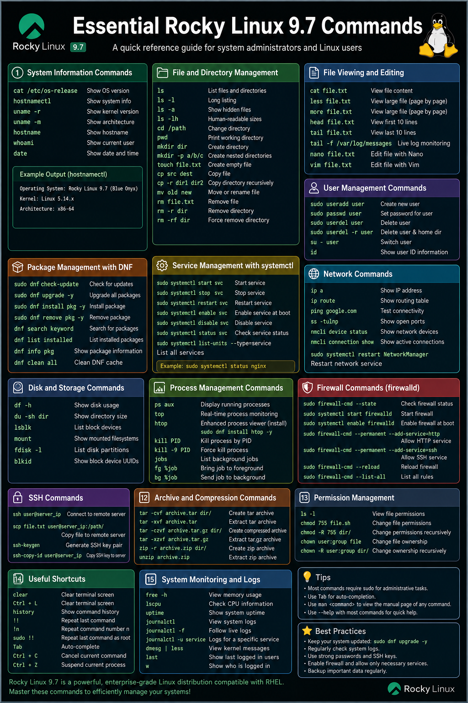

# Essential Rocky Linux 9.7 Commands

## Introduction

Rocky Linux 9.7 is an enterprise-grade Linux distribution designed to be stable, secure, and compatible with Red Hat Enterprise Linux (RHEL). This documentation covers essential command-line commands every system administrator and Linux learner should know when working with Rocky Linux 9.7.

---

# 1. System Information Commands

## Check Operating System Version

```bash
cat /etc/os-release
```

or

```bash
hostnamectl
```

### Example Output

```bash
Operating System: Rocky Linux 9.7 (Blue Onyx)
Kernel: Linux 5.14.x
Architecture: x86-64
```

---

## Check Kernel Version

```bash
uname -r
```

---

## Check System Architecture

```bash
uname -m
```

---

## Display Current Hostname

```bash
hostname
```

---

## Show Current Logged-in User

```bash
whoami
```

---

## Display Current Date and Time

```bash
date
```

---

# 2. File and Directory Management

## List Files and Directories

```bash
ls
```

### Common Options

```bash
ls -l      # Long listing
ls -a      # Show hidden files
ls -lh     # Human-readable sizes
```

---

## Change Directory

```bash
cd /path/to/directory
```

### Example

```bash
cd /home/user/Documents
```

---

## Display Current Directory

```bash
pwd
```

---

## Create Directory

```bash
mkdir myfolder
```

Create nested directories:

```bash
mkdir -p project/app/config
```

---

## Create Empty File

```bash
touch file.txt
```

---

## Copy Files and Directories

```bash
cp source.txt destination.txt
```

Copy directories recursively:

```bash
cp -r folder1 folder2
```

---

## Move or Rename Files

```bash
mv oldname.txt newname.txt
```

---

## Remove Files

```bash
rm file.txt
```

Remove directories recursively:

```bash
rm -r foldername
```

Force remove:

```bash
rm -rf foldername
```

---

# 3. File Viewing and Editing

## View File Content

```bash
cat filename.txt
```

---

## View Large Files Page by Page

```bash
less filename.txt
```

or

```bash
more filename.txt
```

---

## View First 10 Lines

```bash
head filename.txt
```

---

## View Last 10 Lines

```bash
tail filename.txt
```

Live log monitoring:

```bash
tail -f /var/log/messages
```

---

## Edit Files with Nano

```bash
nano filename.txt
```

---

## Edit Files with Vim

```bash
vim filename.txt
```

---

# 4. User Management Commands

## Create New User

```bash
sudo useradd username
```

Set password:

```bash
sudo passwd username
```

---

## Delete User

```bash
sudo userdel username
```

Delete user and home directory:

```bash
sudo userdel -r username
```

---

## Switch User

```bash
su - username
```

---

## Display User ID Information

```bash
id
```

---

# 5. Package Management with DNF

## Check Current OS Version information
```bash
cat /etc/os-release
```

## Update Package Repository

```bash
sudo dnf check-update
```

---

## Update System Packages

```bash
sudo dnf update
```
---

## Upgrade System Packages

```bash
sudo dnf upgrade -y
```
---
## Remove Useless Old folder and file
```bash
sudo dnf autoremove
```
---

## Install Packages

```bash
sudo dnf install nginx -y
```

---

## Remove Packages

```bash
sudo dnf remove nginx -y
```

---

## Search for Packages

```bash
dnf search apache
```

---

## Display Installed Packages

```bash
dnf list installed
```

---

# 6. Service Management with systemctl

## Start a Service

```bash
sudo systemctl start nginx
```

---

## Stop a Service

```bash
sudo systemctl stop nginx
```

---

## Restart a Service

```bash
sudo systemctl restart nginx
```

---

## Enable Service at Boot

```bash
sudo systemctl enable nginx
```

---

## Disable Service

```bash
sudo systemctl disable nginx
```

---

## Check Service Status

```bash
sudo systemctl status nginx
```

---

# 7. Network Commands

## Show IP Address

```bash
ip a
```

---

## Display Routing Table

```bash
ip route
```

---

## Test Network Connectivity

```bash
ping google.com
```

---

## Check Open Ports

```bash
ss -tulnp
```

---

## Display Active Network Connections

```bash
nmcli device status
```

---

## Restart Network Service

```bash
sudo systemctl restart NetworkManager
```

---

# 8. Disk and Storage Commands

## Show Disk Usage

```bash
df -h
```

---

## Display Directory Size

```bash
du -sh foldername
```

---

## List Block Devices

```bash
lsblk
```

---

## Show Mounted File Systems

```bash
mount
```

---

# 9. Process Management Commands

## Display Running Processes

```bash
ps aux
```

---

## Real-Time Process Monitoring

```bash
top
```

Install and use htop:

```bash
sudo dnf install htop -y
htop
```

---

## Kill Process by PID

```bash
kill PID
```

Force kill:

```bash
kill -9 PID
```

---

# 10. Firewall Commands

Rocky Linux 9.7 uses firewalld for firewall management.

## Check Firewall Status

```bash
sudo firewall-cmd --state
```

---

## Start Firewall

```bash
sudo systemctl start firewalld
```

---

## Enable Firewall at Boot

```bash
sudo systemctl enable firewalld
```

---

## Allow HTTP Service

```bash
sudo firewall-cmd --permanent --add-service=http
sudo firewall-cmd --reload
```

---

## Allow SSH Port

```bash
sudo firewall-cmd --permanent --add-service=ssh
sudo firewall-cmd --reload
```

---

# 11. SSH Commands

## Connect to Remote Server

```bash
ssh user@server_ip
```

---

## Copy File to Remote Server

```bash
scp file.txt user@server_ip:/home/user/
```

---

## Generate SSH Key Pair

```bash
ssh-keygen
```

---

# 12. Archive and Compression Commands

## Create tar Archive

```bash
tar -cvf archive.tar folder/
```

---

## Extract tar Archive

```bash
tar -xvf archive.tar
```

---

## Create Compressed Archive

```bash
tar -czvf archive.tar.gz folder/
```

---

## Extract tar.gz Archive

```bash
tar -xzvf archive.tar.gz
```

---

# 13. Permission Management

## View File Permissions

```bash
ls -l
```

---

## Change File Permissions

```bash
chmod 755 script.sh
```

---

## Change File Ownership

```bash
sudo chown user:user filename
```

---

# 14. Useful Shortcuts

## Clear Terminal Screen

```bash
clear
```

Shortcut:

```bash
Ctrl + L
```

---

## Command History

```bash
history
```

---

## Repeat Previous Command as Root

```bash
sudo !!
```

---

# 15. System Monitoring and Logs

## View Memory Usage

```bash
free -h
```

---

## Check CPU Information

```bash
lscpu
```

---

## View System Logs

```bash
journalctl
```

Live logs:

```bash
journalctl -f
```

---

# Conclusion

These essential commands provide the foundation for managing and administering Rocky Linux 9.7 systems effectively. Mastering these commands will help you perform daily server administration, troubleshoot issues, manage services, configure networking, and maintain system security.

For advanced administration, consider learning:

- Shell scripting
- SELinux management
- LVM storage management
- Podman and containers
- Automation with Ansible
- Advanced networking and firewall configuration

