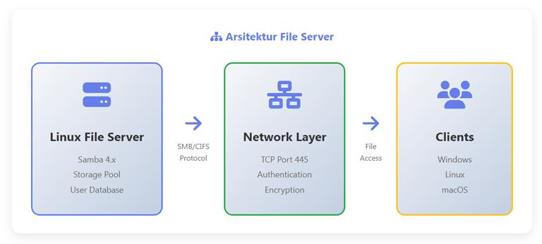
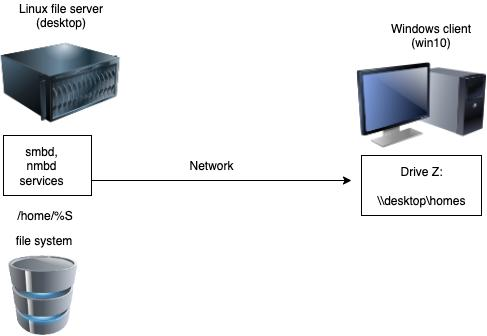
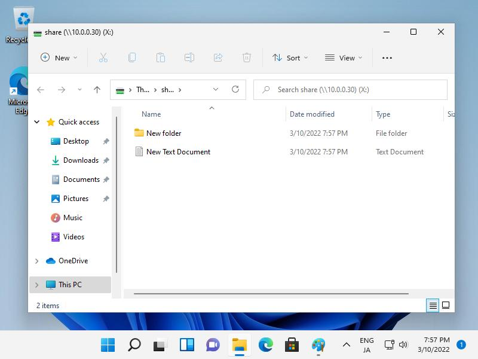
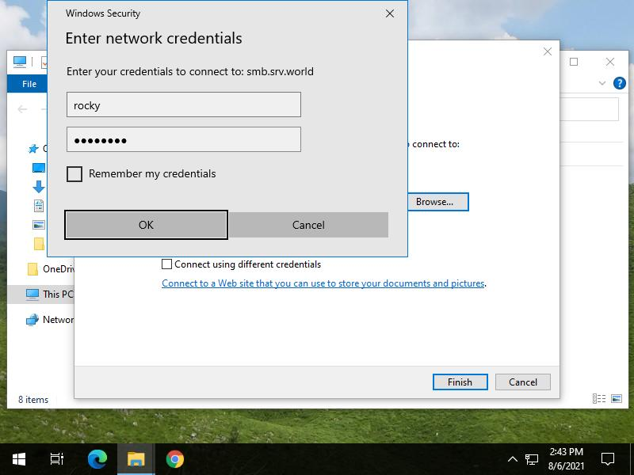
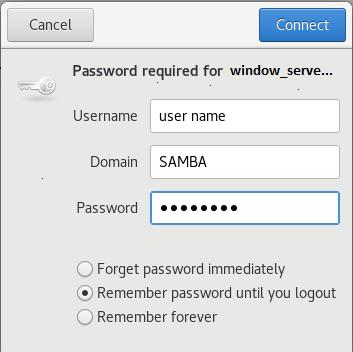
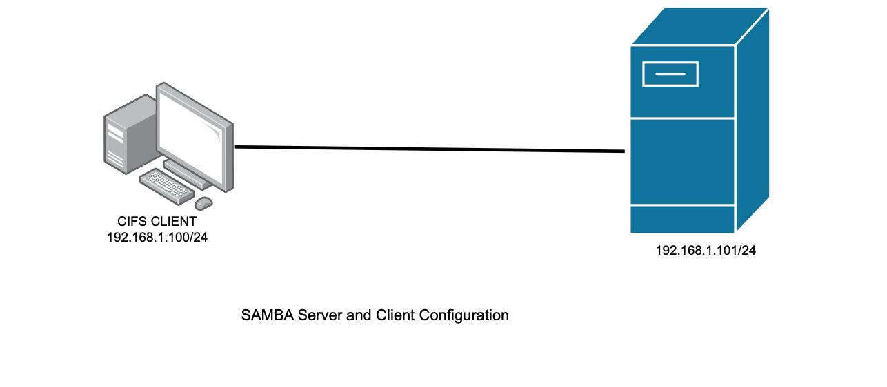
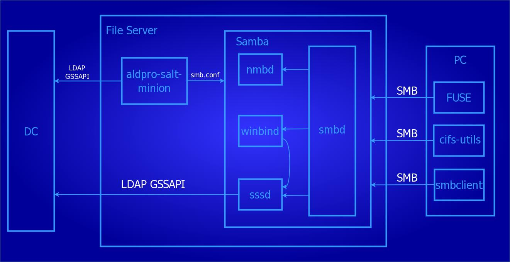
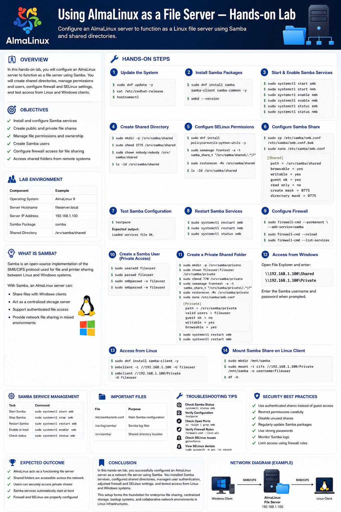
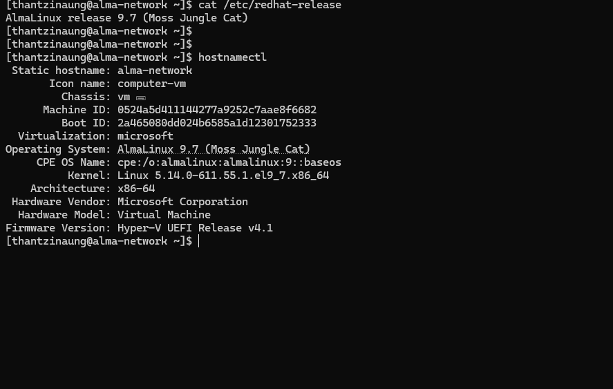
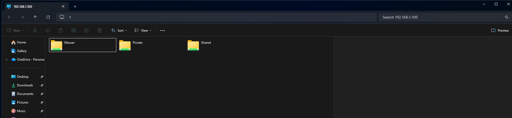

# Using AlmaLinux as a File Server — Hands-on Lab

## Overview

In this hands-on lab, configure an AlmaLinux server to function as a Linux file server using Samba and shared directories. A file server allows multiple users and systems to store, share, and access files over a network.

This lab covers:

- Installing Samba on AlmaLinux
- Creating shared directories
- Configuring Samba shares
- Managing permissions and users
- Accessing shared files from Windows/Linux clients
- Configuring firewall settings
- Testing file sharing functionality

---

# Objectives

- Install and configure Samba services
- Create public and private file shares
- Manage file permissions and ownership
- Create Samba users
- Configure firewall access for file sharing
- Access shared folders from remote systems

---

# Lab Environment

| Component | Example |
|---|---|
| Operating System | AlmaLinux 9 |
| Server Hostname | fileserver.local |
| Server IP Address | 192.168.1.100 |
| Samba Package | samba |
| Shared Directory | /srv/samba/shared |

---

# What is Samba?

Samba is an open-source implementation of the SMB/CIFS protocol used for file and printer sharing between Linux and Windows systems.

With Samba, an AlmaLinux server can:

- Share files with Windows clients
- Act as a centralized storage server
- Support authenticated file access
- Provide network file sharing in mixed environments

---
# Network File Sharing Architecture








---

# Step 1 — Update the System

Update all installed packages before starting.

```bash
sudo dnf update -y
```

Verify system information:

```bash
cat /etc/redhat-release
hostnamectl
```

---

# Step 2 — Install Samba Packages

Install Samba and related tools.

```bash
sudo dnf install samba samba-client samba-common -y
```

Verify installation:

```bash
smbd --version
```

output : `Version 4.22.4`

---

# Step 3 — Start and Enable Samba Services

Start the Samba services:

```bash
sudo systemctl start smb
sudo systemctl start nmb
```

Enable services at boot:

```bash
sudo systemctl enable smb
sudo systemctl enable nmb
```

Check service status:

```bash
sudo systemctl status smb
sudo systemctl status nmb
```

---

# Step 4 — Create Shared Directory

Create a directory for shared files.

```bash
sudo mkdir -p /srv/samba/shared
```

Set permissions:

```bash
sudo chmod 2775 /srv/samba/shared
```

Set ownership:

```bash
sudo chown nobody:nobody /srv/samba/shared
```

Verify:

```bash
ls -ld /srv/samba/shared
```

---

# Step 5 — Configure SELinux Permissions

Allow Samba to access the shared directory.

Install SELinux utilities:

```bash
sudo dnf install policycoreutils-python-utils -y
```

Set Samba context:

```bash
sudo semanage fcontext -a -t samba_share_t "/srv/samba/shared(/.*)?"
```

Apply context:

```bash
sudo restorecon -Rv /srv/samba/shared
```

Verify SELinux label:

```bash
ls -Zd /srv/samba/shared
```

---

# Step 6 — Configure Samba Share

Backup the original Samba configuration file:

```bash
sudo cp /etc/samba/smb.conf /etc/samba/smb.conf.bak
```

Edit the Samba configuration:

```bash
sudo nano /etc/samba/smb.conf
```

Add the following configuration at the end of the file:

```ini
[Shared]
   path = /srv/samba/shared
   browsable = yes
   writable = yes
   guest ok = yes
   read only = no
   create mask = 0775
   directory mask = 0775
```

Save and exit.

---

# Step 7 — Test Samba Configuration

Validate the configuration syntax:

```bash
testparm
```

If the output shows:

```text
Loaded services file OK.
```

the configuration is valid.

---

# Step 8 — Restart Samba Services

Apply the configuration changes:

```bash
sudo systemctl restart smb
sudo systemctl restart nmb
```

Verify services:

```bash
sudo systemctl status smb
```

---

# Step 9 — Configure Firewall

Allow Samba traffic through the firewall.

```bash
sudo firewall-cmd --permanent --add-service=samba
```

Reload firewall rules:

```bash
sudo firewall-cmd --reload
```

Verify firewall configuration:

```bash
sudo firewall-cmd --list-services
```

---

# Step 10 — Create a Samba User (Private Access)

Create a Linux user:

```bash
sudo useradd fileuser
sudo passwd fileuser
```

Add the user to Samba:

```bash
sudo smbpasswd -a fileuser
```

Enable the Samba account:

```bash
sudo smbpasswd -e fileuser
```

---

# Step 11 — Create a Private Shared Folder

Create a secure directory:

```bash
sudo mkdir -p /srv/samba/private
```

Set ownership:

```bash
sudo chown fileuser:fileuser /srv/samba/private
```

Set permissions:

```bash
sudo chmod 770 /srv/samba/private
```

Configure SELinux:

```bash
sudo semanage fcontext -a -t samba_share_t "/srv/samba/private(/.*)?"
sudo restorecon -Rv /srv/samba/private
```

Edit Samba configuration again:

```bash
sudo nano /etc/samba/smb.conf
```

Add:

```ini
[Private]
   path = /srv/samba/private
   valid users = fileuser
   guest ok = no
   writable = yes
   browsable = yes
```

Restart Samba:

```bash
sudo systemctl restart smb
sudo systemctl restart nmb
```

---

# Step 12 — Access the Shared Folder from Windows

Open File Explorer and enter:

```text
\\192.168.1.100\Shared
```

For the private share:

```text
\\192.168.1.100\Private
```

Enter the Samba username and password when prompted.

## Troubleshooting 
Open firewall zone if need -

```bash
sudo firewall-cmd --get-active-zones

sudo firewall-cmd --zone=public --add-service=samba --permanent
sudo firewall-cmd --reload

```
---

# Step 13 — Access the Share from Linux

Install Samba client tools:

```bash
sudo dnf install samba-client -y
```

List available shares:

```bash
smbclient -L //192.168.1.100 -U fileuser
```

Access the share:

```bash
smbclient //192.168.1.100/Private -U fileuser
```

---

# Step 14 — Mount Samba Share on Linux Client

Create a mount point:

```bash
sudo mkdir /mnt/samba
```

Mount the share:

```bash
sudo mount -t cifs //192.168.1.100/Private /mnt/samba -o username=fileuser
```

* if need `cifs` pacakge install

Verify:

```bash
df -h
```

---

# Samba Service Management Commands

| Task | Command |
|---|---|
| Start Samba | `sudo systemctl start smb` |
| Stop Samba | `sudo systemctl stop smb` |
| Restart Samba | `sudo systemctl restart smb` |
| Enable at boot | `sudo systemctl enable smb` |
| Check status | `sudo systemctl status smb` |

---

# Important Samba Configuration File

| File | Purpose |
|---|---|
| `/etc/samba/smb.conf` | Main Samba configuration |
| `/var/log/samba/` | Samba log files |
| `/srv/samba/` | Shared directory location |

---

# Troubleshooting Tips

## Check Samba Status

```bash
systemctl status smb
```

## Verify Configuration

```bash
testparm
```

## Check Open Ports

```bash
ss -tulpn | grep smb
```

## Verify Firewall Rules

```bash
firewall-cmd --list-all
```

## Check SELinux Issues

```bash
getenforce
```

View SELinux denials:

```bash
sudo ausearch -m avc -ts recent
```

---

# Security Best Practices

- Use authenticated shares instead of guest access
- Restrict permissions carefully
- Disable unused shares
- Regularly update Samba packages
- Use strong passwords
- Monitor Samba logs
- Limit access using firewall rules

---

# Expected Outcome

At the end of this lab:

- AlmaLinux acts as a functioning file server
- Shared folders are accessible across the network
- Users can securely access private shares
- Samba services automatically start at boot
- Firewall and SELinux are properly configured

---

# Conclusion

In this hands-on lab, you successfully configured an AlmaLinux server as a network file server using Samba. You installed Samba services, configured shared directories, managed user authentication, adjusted firewall and SELinux settings, and tested access from Linux and Windows systems.

This setup forms the foundation for enterprise file sharing, centralized storage, backup systems, and collaborative network environments in Linux infrastructures.



