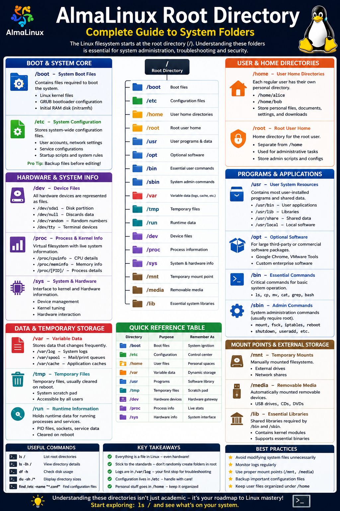

# AlmaLinux Root Directory: File System Layout

Linux systems are organized using a hierarchical filesystem structure that begins at the root directory (`/`). Every file, application, device, and configuration in AlmaLinux exists somewhere under this root structure.

Understanding these directories is essential for Linux administration, troubleshooting, security, and system management.

---

# Overview of the Linux Root Filesystem

The root directory (`/`) is the top-level directory in Linux. All other directories branch from it.

```bash
/
├── boot
├── etc
├── home
├── var
├── usr
├── dev
├── proc
├── sys
├── tmp
├── media
├── mnt
├── opt
├── root
├── bin
├── sbin
└── lib
```

---

# Boot & System Core

## `/boot` — System Boot Files

The `/boot` directory contains files required to start the operating system.

### Contents

- Linux kernel files
- GRUB bootloader configuration
- Initial RAM filesystem (`initramfs`)

### Common Files

```bash
/boot/vmlinuz
/boot/grub2/
/boot/initramfs
```

### Purpose

Think of `/boot` as the ignition system of Linux. Without it, the system cannot start.

### View Boot Files

```bash
ls /boot
```

---

## `/etc` — System Configuration Center

The `/etc` directory stores system-wide configuration files.

### Important Files

| File | Purpose |
|---|---|
| `/etc/passwd` | User account information |
| `/etc/shadow` | Encrypted passwords |
| `/etc/hosts` | Local hostname mappings |
| `/etc/resolv.conf` | DNS configuration |
| `/etc/fstab` | Filesystem mount settings |

### Common Services Configurations

- SSH
- Apache
- Nginx
- NetworkManager
- Firewalld

### Example

```bash
cat /etc/hosts
```

### Important Note

Always backup configuration files before editing them.

```bash
sudo cp /etc/ssh/sshd_config /etc/ssh/sshd_config.bak
```

---

# Hardware & System Information

## `/dev` — Device Files

Linux treats hardware devices as files.

### Common Device Files

| Device | Description |
|---|---|
| `/dev/sda` | Hard drive |
| `/dev/sda1` | Disk partition |
| `/dev/null` | Discards data |
| `/dev/random` | Random number generator |
| `/dev/tty` | Terminal device |

### Example

```bash
ls /dev
```

### Redirect Output to `/dev/null`

```bash
command > /dev/null
```

---

## `/proc` — Process & Kernel Information

The `/proc` directory is a virtual filesystem containing live system information.

### Useful Files

| File | Purpose |
|---|---|
| `/proc/cpuinfo` | CPU details |
| `/proc/meminfo` | Memory information |
| `/proc/uptime` | System uptime |
| `/proc/[PID]` | Process information |

### Example Commands

```bash
cat /proc/cpuinfo
```

```bash
cat /proc/meminfo
```

---

## `/sys` — System & Hardware Interface

The `/sys` filesystem provides a modern interface to kernel and hardware information.

### Purpose

- Device management
- Kernel tuning
- Hardware interaction

### Example

```bash
ls /sys
```

---

# User Directories

## `/home` — User Home Directories

Each regular user receives a personal directory under `/home`.

### Examples

```bash
/home/alice
/home/bob
```

### Contents

Users typically store:

- Documents
- Downloads
- Desktop files
- Application settings

### Example

```bash
ls /home
```

---

## `/root` — Root User Home Directory

The `/root` directory belongs to the system administrator (root user).

### Purpose

- Administrative scripts
- Root user configuration
- System management files

### Important Difference

`/root` is separate from `/home` for security and reliability.

---

# Programs & Applications

## `/usr` — User System Resources

The `/usr` directory contains most installed software and shared resources.

### Important Subdirectories

| Directory | Purpose |
|---|---|
| `/usr/bin` | User applications |
| `/usr/lib` | Shared libraries |
| `/usr/share` | Documentation and shared files |
| `/usr/local` | Custom-installed software |

### Example

```bash
ls /usr/bin
```

---

## `/opt` — Optional Software

The `/opt` directory stores large third-party or commercial software packages.

### Examples

- Google Chrome
- VMware Tools
- Custom enterprise software

### Example

```bash
ls /opt
```

---

## `/bin` — Essential User Commands

Contains critical command-line tools required for basic system operation.

### Common Commands

```bash
ls
cp
mv
cat
grep
bash
```

### Example

```bash
ls /bin
```

---

## `/sbin` — System Administration Commands

Contains administrative utilities used by the root user.

### Common Commands

```bash
mount
fsck
iptables
reboot
shutdown
```

### Example

```bash
ls /sbin
```

---

# Data & Temporary Storage

## `/var` — Variable Data

Stores data that changes frequently.

### Important Subdirectories

| Directory | Purpose |
|---|---|
| `/var/log` | System logs |
| `/var/cache` | Cached data |
| `/var/spool` | Mail and print queues |
| `/var/tmp` | Temporary files |

### Example

```bash
ls /var/log
```

### View System Logs

```bash
sudo tail -f /var/log/messages
```

---

## `/tmp` — Temporary Files

Applications use `/tmp` for temporary storage.

### Characteristics

- Temporary workspace
- Usually cleared during reboot
- Accessible by all users

### Example

```bash
touch /tmp/testfile
```

---

## `/run` — Runtime Information

Contains temporary runtime data for active processes and services.

### Stores

- Process IDs (PID files)
- Sockets
- Runtime service data

### Example

```bash
ls /run
```

---

# Mount Points & External Storage

## `/mnt` — Temporary Mount Point

Traditionally used for manually mounting filesystems.

### Example

```bash
sudo mount /dev/sdb1 /mnt
```

---

## `/media` — Removable Media

Automatically mounted removable devices appear here.

### Examples

- USB drives
- DVDs
- CDs

### Example

```bash
ls /media
```

---

# System Libraries

## `/lib` — Essential Shared Libraries

Contains shared libraries required by essential binaries in `/bin` and `/sbin`.

### Purpose

- Supports executable programs
- Contains kernel modules

### Example

```bash
ls /lib
```

---

# Quick Reference Table

| Directory | Purpose | Description |
|---|---|---|
| `/boot` | Boot files | System startup files |
| `/etc` | Configuration | System settings |
| `/home` | User data | Personal directories |
| `/root` | Root user | Administrator home |
| `/usr` | Programs | Installed software |
| `/var` | Variable data | Logs and cache |
| `/tmp` | Temporary files | Scratch storage |
| `/dev` | Devices | Hardware interface |
| `/proc` | Process info | Live kernel data |
| `/sys` | Hardware info | System interface |
| `/bin` | Essential commands | Basic utilities |
| `/sbin` | Admin commands | System tools |
| `/media` | Removable storage | USB/CD mounts |
| `/mnt` | Manual mounts | Temporary mount point |
| `/lib` | Libraries | Shared code |

---

# Useful Commands for Exploring the Filesystem

## List Root Directories

```bash
ls /
```

## View Directory Details

```bash
ls -lh /
```

## Check Disk Usage

```bash
df -h
```

## Display Directory Sizes

```bash
du -sh /*
```

## Find Files

```bash
find /etc -name "*.conf"
```

---

# Best Practices

## 1. Avoid Modifying System Files Unnecessarily

Incorrect changes in `/etc`, `/boot`, or `/lib` can break the system.

---

## 2. Monitor Logs Regularly

System logs help identify issues early.

```bash
sudo journalctl -xe
```

---

## 3. Keep User Files Organized

Store personal files under `/home`.

---

## 4. Use Proper Mount Points

- Temporary mounts → `/mnt`
- Removable devices → `/media`

---

## 5. Backup Critical Configuration Files

Always backup before editing system configurations.

```bash
sudo cp filename filename.bak
```

---

# Key Takeaways

- Linux uses a hierarchical filesystem beginning at `/`
- Everything in Linux is treated as a file
- System configuration files live in `/etc`
- User data belongs in `/home`
- Logs are stored in `/var/log`
- Hardware devices appear in `/dev`
- Runtime and process information can be viewed in `/proc`

Understanding the Linux filesystem is a foundational skill for every system administrator and Linux user. Once you know where things live, troubleshooting and managing AlmaLinux becomes significantly easier.

---

# Conclusion

The AlmaLinux filesystem structure is designed for organization, stability, and flexibility. Each directory serves a specific purpose that helps Linux systems remain efficient and maintainable.

Mastering these directories will improve your ability to:

- Troubleshoot problems
- Configure services
- Manage users
- Monitor system health
- Administer servers effectively

Start exploring your system today:

```bash
ls /
```

The Linux filesystem is your roadmap to system administration mastery.

