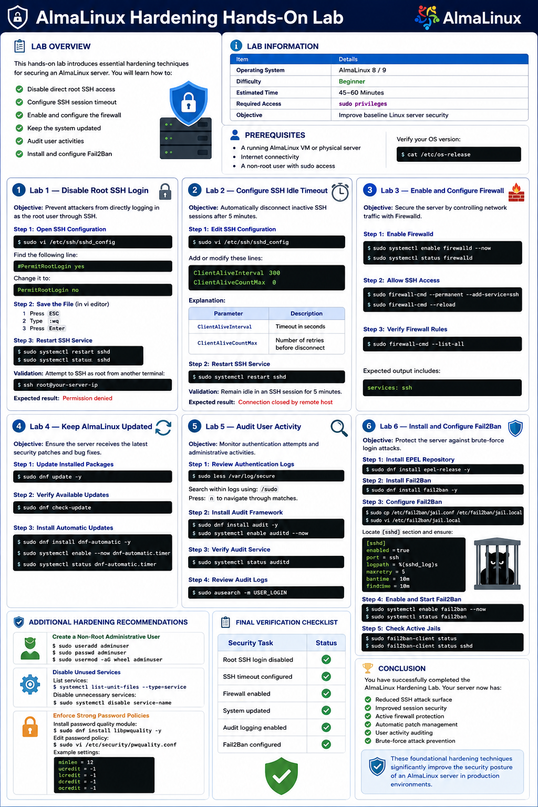

# AlmaLinux Hardening Hands-On Lab

## Lab Overview

This hands-on lab introduces essential hardening techniques for securing an AlmaLinux server. 

- Disable direct root SSH access
- Configure SSH session timeout
- Enable and configure the firewall
- Keep the system updated
- Audit user activities
- Install and configure Fail2Ban

---

# Lab Information

| Item | Details |
|---|---|
| Operating System | AlmaLinux 8 / 9 |
| Difficulty | Beginner |
| Estimated Time | 45–60 Minutes |
| Required Access | sudo privileges |
| Objective | Improve baseline Linux server security |

---

# Prerequisites

Before starting, ensure you have:

- A running AlmaLinux VM or physical server
- Internet connectivity
- A non-root user with sudo access

Verify your OS version:

```bash
cat /etc/os-release
```

---

# Lab 1 — Disable Root SSH Login

## Objective

Prevent attackers from directly logging in as the root user through SSH.

---

## Step 1: Open SSH Configuration

Edit the SSH daemon configuration file:

```bash
sudo vi /etc/ssh/sshd_config
```

Find the following line:

```bash
#PermitRootLogin yes
```

Change it to:

```bash
PermitRootLogin no
```

---

## Step 2: Save the File

In `vi` editor:

1. Press `ESC`
2. Type:

```bash
:wq
```

3. Press `Enter`

---

## Step 3: Restart SSH Service

Apply the changes:

```bash
sudo systemctl restart sshd
```

Verify SSH service status:

```bash
sudo systemctl status sshd
```

---

## Validation

Attempt to SSH as root from another terminal:

```bash
ssh root@your-server-ip
```

Expected result:

```text
Permission denied
```

---

# Lab 2 — Configure SSH Idle Timeout

## Objective

Automatically disconnect inactive SSH sessions after 5 minutes.

---

## Step 1: Edit SSH Configuration

Open the SSH configuration file again:

```bash
sudo vi /etc/ssh/sshd_config
```

Add or modify these lines:

```bash
ClientAliveInterval 300
ClientAliveCountMax 3
```

### Explanation

| Parameter | Description |
|---|---|
| ClientAliveInterval | Timeout in seconds |
| ClientAliveCountMax | Number of retries before disconnect |

---

## Step 2: Restart SSH Service

```bash
sudo systemctl restart sshd
```

---

## Validation

Remain idle in an SSH session for 15 minutes. (5 * 3 = 15m)

Expected result:

```text
Connection closed by remote host
```

---

# Lab 3 — Enable and Configure Firewall

## Objective

Secure the server by controlling network traffic with Firewalld.

---

## Step 1: Enable Firewalld

Start and enable the firewall service:

```bash
sudo systemctl enable firewalld --now
```

Verify:

```bash
sudo systemctl status firewalld
```

Install if need :
```bash
sudo dnf reinstall iptables iptables-nft
```

---

## Step 2: Allow SSH Access

Allow SSH traffic permanently:

```bash
sudo firewall-cmd --permanent --add-service=ssh
```

Reload firewall rules:

```bash
sudo firewall-cmd --reload
```

---

## Step 3: Verify Firewall Rules

List active rules:

```bash
sudo firewall-cmd --list-all
```

Expected output includes:

```text
services: ssh
```

---

# Lab 4 — Keep AlmaLinux Updated

## Objective

Ensure the server receives the latest security patches and bug fixes.

---

## Step 1: Update Installed Packages

Run system updates:

```bash
sudo dnf update -y
```

---

## Step 2: Verify Available Updates

Check for pending updates:

```bash
sudo dnf check-update
```

---

## Step 3: Install Automatic Updates

Install dnf-automatic:

```bash
sudo dnf install dnf-automatic -y
```

Enable automatic updates:

```bash
sudo systemctl enable --now dnf-automatic.timer
```

Check timer status:

```bash
sudo systemctl status dnf-automatic.timer
```

---

# Lab 5 — Audit User Activity

## Objective

Monitor authentication attempts and administrative activities.

---

## Step 1: Review Authentication Logs

View sudo and authentication logs:

```bash
sudo less /var/log/secure
```

Search within logs using:

```text
/sudo
```

Press:

```text
n
```

to navigate through matches.

---

## Step 2: Install Audit Framework

Install audit tools:

```bash
sudo dnf install audit -y
```

Enable audit daemon:

```bash
sudo systemctl enable auditd --now
```

---

## Step 3: Verify Audit Service

```bash
sudo systemctl status auditd
```

---

## Step 4: Review Audit Logs

Check audit records:

```bash
sudo ausearch -m USER_LOGIN
```

---

# Lab 6 — Install and Configure Fail2Ban

## Objective

Protect the server against brute-force login attacks.

---

## Step 1: Install EPEL Repository

Fail2Ban may require EPEL repository:

```bash
sudo dnf install epel-release -y
```

---

## Step 2: Install Fail2Ban

```bash
sudo dnf install fail2ban -y
```

---

## Step 3: Configure Fail2Ban

Create local jail configuration:

```bash
sudo cp /etc/fail2ban/jail.conf /etc/fail2ban/jail.local
```

Edit configuration:

```bash
sudo vi /etc/fail2ban/jail.local
```

Locate `[sshd]` section and ensure:

```ini
[sshd]
enabled = true
port = ssh
logpath = %(sshd_log)s
maxretry = 5
bantime = 10m
findtime = 10m
```

---

## Step 4: Enable and Start Fail2Ban

```bash
sudo systemctl enable fail2ban --now
```

Verify status:

```bash
sudo systemctl status fail2ban
```

---

## Step 5: Check Active Jails

```bash
sudo fail2ban-client status
```

Check SSH jail:

```bash
sudo fail2ban-client status sshd
```

---

# Additional Hardening Recommendations

## Create a Non-Root Administrative User

```bash
sudo useradd adminuser
sudo passwd adminuser
sudo usermod -aG wheel adminuser
```

---

## Disable Unused Services

List services:

```bash
sudo systemctl list-unit-files --type=service
```

Disable unnecessary services:

```bash
sudo systemctl disable service-name
```

---

## Enforce Strong Password Policies

Install password quality module:

```bash
sudo dnf install libpwquality -y
```

Edit password policy:

```bash
sudo vi /etc/security/pwquality.conf
```

Example settings:

```ini
minlen = 12
ucredit = -1
lcredit = -1
dcredit = -1
ocredit = -1
```

---

# Final Verification Checklist

| Security Task | Status |
|---|---|
| Root SSH login disabled | ✅ |
| SSH timeout configured | ✅ |
| Firewall enabled | ✅ |
| System updated | ✅ |
| Audit logging enabled | ✅ |
| Fail2Ban configured | ✅ |

---

# Conclusion

You have successfully completed the AlmaLinux Hardening Lab. Your server now has:

- Reduced SSH attack surface
- Improved session security
- Active firewall protection
- Automatic patch management
- User activity auditing
- Brute-force attack prevention

These foundational hardening techniques significantly improve the security posture of an AlmaLinux server in production environments.

