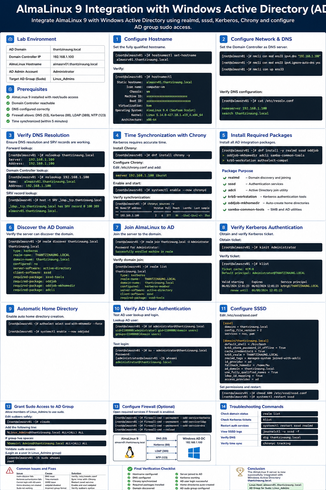

# AlmaLinux 9 Integration with Windows Active Directory (AD)

## Overview

How to integrate an AlmaLinux 9 server into a Windows Active Directory (AD) domain using:

- `realmd`
- `sssd`
- `Kerberos`
- `Chrony`
- DNS integration
- AD-based sudo access

At the end of this lab, the AlmaLinux server will:

- Join the AD domain `thantzinaung.local`
- Authenticate AD users
- Allow members of the AD group `Linux_Admins` to use `sudo`
- Synchronize time with the Domain Controller

---

# Lab Environment

| Component | Value |
|---|---|
| AD Domain | `thantzinaung.local` |
| Domain Controller | `192.168.1.100` |
| AlmaLinux Hostname | `almasrv01.thantzinaung.local` |
| AD Admin Account | `Administrator` |
| Target Sudo Group | `Linux_Admins` |

---

# Prerequisites

Before starting:

- AlmaLinux 9 installed
- Root or sudo access available
- Domain Controller reachable
- DNS working correctly
- Firewall allows:
  - DNS (53)
  - Kerberos (88)
  - LDAP (389)
  - NTP (123)

---

# Step 1 — Configure Hostname

Set the fully qualified hostname.

## Command

```bash
sudo hostnamectl set-hostname almasrv01.thantzinaung.local
```

## Verify

```bash
hostnamectl
```

Expected output:

```text
Static hostname: almasrv01.thantzinaung.local
```

---

# Step 2 — Configure Network and DNS

Active Directory relies heavily on DNS. The Linux server must use the Domain Controller as its DNS server.

---

## Edit Network Configuration

Identify your network interface:

```bash
ip addr
```

Example interface:

```text
eth0
```

---

## Configure DNS using NetworkManager

```bash
sudo nmcli con mod eth0 ipv4.dns "192.168.1.100"
sudo nmcli con mod eth0 ipv4.ignore-auto-dns yes
sudo nmcli con up eth0
```

---

## Verify DNS Configuration

```bash
sudo cat /etc/resolv.conf
```

Expected:

```text
nameserver 192.168.1.100
search thantzinaung.local
```

---

# Step 3 — Verify DNS Resolution

Proper DNS resolution is mandatory for domain joining.

---

## Test Forward Lookup

```bash
nslookup thantzinaung.local
```

Expected:

```text
Server: 192.168.1.100
Address: 192.168.1.100
```

---

## Test Domain Controller Lookup

```bash
nslookup 192.168.1.100
```

---

## Test SRV Records

AD services publish SRV records in DNS.

```bash
host -t SRV _ldap._tcp.thantzinaung.local
```

Expected result should display the Domain Controller hostname.

---

# Step 4 — Configure Time Synchronization with Chrony

Kerberos authentication requires accurate time synchronization.

If time differs by more than 5 minutes, authentication will fail.

---

# Install Chrony

```bash
sudo dnf install chrony -y
```

---

# Configure Chrony

Edit configuration:

```bash
sudo nano /etc/chrony.conf
```

Add or modify:

```text
server 192.168.1.100 iburst
```

Comment out public NTP servers if necessary.

Example:

```text
# pool 2.almalinux.pool.ntp.org iburst
```

---

# Enable and Start Chrony

```bash
sudo systemctl enable --now chronyd
```

---

# Verify Time Synchronization

```bash
chronyc sources
```

Check synchronization status:

```bash
timedatectl
```

Expected:

```text
System clock synchronized: yes
```

---

# Step 5 — Install Required Packages

Install all required AD integration tools.

```bash
sudo dnf install realmd sssd oddjob oddjob-mkhomedir adcli samba-common-tools krb5-workstation authselect-compat -y
```

---

# Package Purpose

| Package | Purpose |
|---|---|
| `realmd` | Domain discovery and joining |
| `sssd` | Authentication services |
| `adcli` | Active Directory join utility |
| `krb5-workstation` | Kerberos authentication tools |
| `oddjob-mkhomedir` | Auto-create home directories |
| `samba-common-tools` | SMB and AD utilities |

---

# Step 6 — Discover the AD Domain

Verify the Linux server can discover the domain.

```bash
realm discover thantzinaung.local
```

Expected output should show:

- Domain name
- Kerberos realm
- Client software
- Required packages

Example:

```text
thantzinaung.local
  type: kerberos
  realm-name: THANTZINAUNG.LOCAL
```

---

# Step 7 — Join AlmaLinux to Active Directory

Join the server to the AD domain.

```bash
sudo realm join thantzinaung.local -U Administrator
```

You will be prompted for the AD Administrator password.

---

# Verify Domain Join

```bash
realm list
```

Expected output:

```text
domain-name: thantzinaung.local
configured: kerberos-member
```

---

# Step 8 — Verify Kerberos Authentication

Obtain a Kerberos ticket.

```bash
kinit Administrator
```

Enter the password.

---

# Verify Ticket

```bash
klist
```

Expected output:

```text
Ticket cache: KCM:0
Default principal: Administrator@THANTZINAUNG.LOCAL
```

---

# Step 9 — Configure Automatic Home Directory Creation

Enable automatic home directory creation for AD users.

```bash
sudo authselect select sssd with-mkhomedir --force
```

Enable oddjobd:

```bash
sudo systemctl enable --now oddjobd
```

---

# Step 10 — Verify AD User Authentication

Test retrieving AD user information.

```bash
id administrator@thantzinaung.local
```

Example output:

```text
uid=...
gid=...
groups=...
```

---

# Test Login

```bash
su - administrator@thantzinaung.local
```

If successful:

- Authentication works
- Home directory is created automatically

---

# Step 11 — Configure SSSD

Edit the SSSD configuration file.

```bash
sudo nano /etc/sssd/sssd.conf
```

Example configuration:

```ini
[sssd]
domains = thantzinaung.local
config_file_version = 2
services = nss, pam

[domain/thantzinaung.local]
default_shell = /bin/bash
krb5_store_password_if_offline = True
cache_credentials = True
krb5_realm = THANTZINAUNG.LOCAL
realmd_tags = manages-system joined-with-adcli
id_provider = ad
fallback_homedir = /home/%u
ad_domain = thantzinaung.local
use_fully_qualified_names = True
ldap_id_mapping = True
access_provider = ad
```

---

# Set Proper Permissions

```bash
sudo chmod 600 /etc/sssd/sssd.conf
```

Restart SSSD:

```bash
sudo systemctl restart sssd
```

---

# Step 12 — Grant Sudo Access to AD Group

Allow members of the AD group `Linux_Admins` to use sudo.

---

# Edit Sudoers Safely

Use `visudo`:

```bash
sudo visudo
```

Add the following line:

```text
%Linux_Admins@thantzinaung.local ALL=(ALL) ALL
```

---

# Alternative Format (Escaped Spaces)

If the group contains spaces:

```text
%Domain\ Admins@thantzinaung.local ALL=(ALL) ALL
```

---

# Validate Sudo Access

Login as an AD user who belongs to `Linux_Admins`.

Test sudo:

```bash
sudo whoami
```

Expected output:

```text
root
```

---

# Step 13 — Configure Firewall (Optional)

If firewall restrictions exist:

```bash
sudo firewall-cmd --permanent --add-service=kerberos
sudo firewall-cmd --permanent --add-service=ldap
sudo firewall-cmd --permanent --add-service=dns
sudo firewall-cmd --reload
```

---

# Step 14 — Troubleshooting Commands

---

## Check Domain Status

```bash
realm list
```

---

## Check Kerberos Tickets

```bash
klist
```

---

## Restart Authentication Services

```bash
sudo systemctl restart sssd
sudo systemctl restart realmd
```

---

## View SSSD Logs

```bash
sudo journalctl -u sssd -f
```

---

## Verify DNS

```bash
dig thantzinaung.local
```

---

## Verify Time Sync

```bash
chronyc tracking
```

---

# Common Issues and Fixes

| Issue | Cause | Solution |
|---|---|---|
| `realm discover` fails | DNS issue | Verify `/etc/resolv.conf` |
| Kerberos authentication fails | Time mismatch | Sync time with Chrony |
| Cannot login with AD users | SSSD issue | Restart `sssd` |
| Home directory not created | `oddjobd` disabled | Enable `oddjobd` |
| Sudo not working | Incorrect group format | Verify sudoers syntax |

---

# Final Verification Checklist

| Task | Status |
|---|---|
| Hostname configured | ✅ |
| DNS configured | ✅ |
| Chrony synchronized | ✅ |
| Required packages installed | ✅ |
| Domain discovered | ✅ |
| Server joined to AD | ✅ |
| Kerberos working | ✅ |
| AD user login successful | ✅ |
| Home directories auto-created | ✅ |
| AD sudo group configured | ✅ |

---

# Conclusion

The AlmaLinux 9 server is now fully integrated with the Active Directory domain:

- Domain: `thantzinaung.local`
- Linux Host: `almasrv01.thantzinaung.local`
- Sudo Group: `Linux_Admins`

AD users can now:

- Authenticate directly against Active Directory
- Access the Linux server using domain credentials
- Receive centralized access control
- Use sudo privileges through AD group membership

