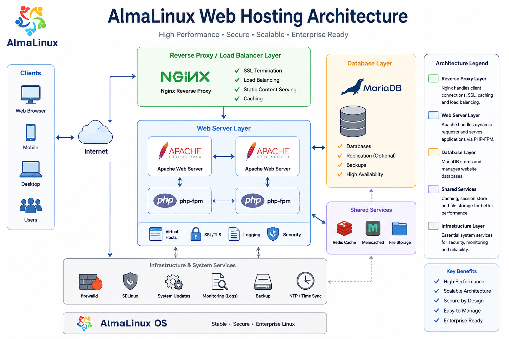
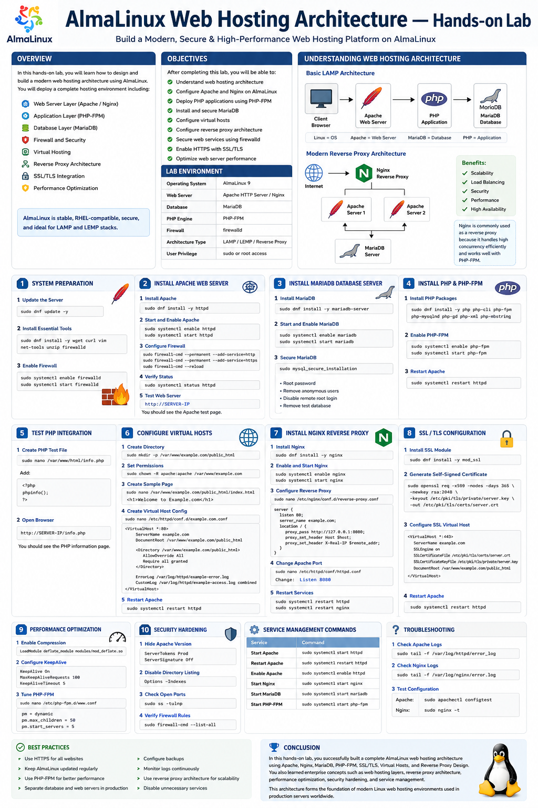
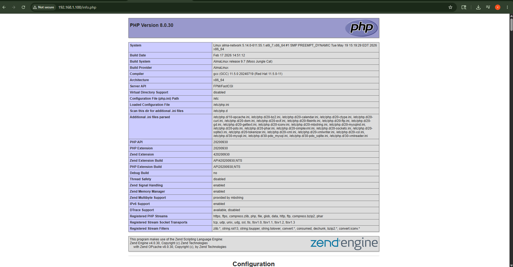
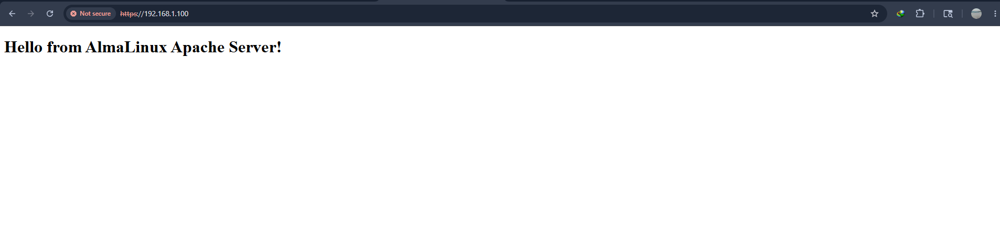

# AlmaLinux Web Hosting Architecture — Hands-on Lab

## Overview

In this hands-on lab, design and build a modern web hosting architecture using AlmaLinux. The lab covers the deployment of a complete hosting environment including:

- Web Server Layer (Apache / Nginx)
- Application Layer (PHP-FPM)
- Database Layer (MariaDB)
- Firewall and Security
- Virtual Hosting
- Reverse Proxy Architecture
- SSL/TLS Integration
- Performance Optimization


AlmaLinux is widely used for enterprise-grade hosting because it is stable, RHEL-compatible, secure, and highly suitable for LAMP and LEMP stacks.

---

# Objectives


- Understand web hosting architecture
- Configure Apache and Nginx on AlmaLinux
- Deploy PHP applications using PHP-FPM
- Install and secure MariaDB
- Configure virtual hosts
- Configure reverse proxy architecture
- Secure web services using firewalld
- Enable HTTPS with SSL/TLS
- Optimize web server performance

---

# Lab Environment

| Component | Details |
|---|---|
| Operating System | AlmaLinux 9 |
| Web Server | Apache HTTP Server / Nginx |
| Database | MariaDB |
| PHP Engine | PHP-FPM |
| Firewall | firewalld |
| Architecture Type | LAMP / LEMP / Reverse Proxy |
| User Privilege | sudo or root access |

---

# Understanding Web Hosting Architecture

A web hosting architecture consists of multiple layers working together to deliver websites and applications to users.

## Basic LAMP Architecture

```text
Client Browser
       |
       v
Apache Web Server
       |
       v
PHP Application
       |
       v
MariaDB Database
```

- Linux = Operating System
- Apache = Web Server
- MariaDB = Database Server
- PHP = Application Processing

---

## Modern Reverse Proxy Architecture

```text
                Internet
                    |
                    v
             Nginx Reverse Proxy
                    |
        -------------------------
        |                       |
        v                       v
   Apache Server 1        Apache Server 2
        |                       |
        -------------------------
                    |
                    v
              MariaDB Server
```

This architecture improves:

- Scalability
- Load balancing
- Security
- Performance
- High availability

Nginx is commonly used as a reverse proxy because it handles high concurrency efficiently and works well with PHP-FPM.

---

# Lab 1 — System Preparation

## Step 1: Update the Server

```bash
sudo dnf update -y
```

## Step 2: Install Essential Tools

```bash
sudo dnf install -y wget curl vim net-tools unzip firewalld
```

## Step 3: Enable Firewall

```bash
sudo systemctl enable firewalld
sudo systemctl start firewalld
```

---

# Lab 2 — Installing Apache Web Server

Apache is one of the most widely used web servers in enterprise hosting environments.

## Install Apache

```bash
sudo dnf install -y httpd
```

## Start and Enable Apache

```bash
sudo systemctl enable httpd
sudo systemctl start httpd
```

## Configure Firewall

```bash
sudo firewall-cmd --permanent --add-service=http
sudo firewall-cmd --permanent --add-service=https
sudo firewall-cmd --reload
```

## Verify Apache Status

```bash
sudo systemctl status httpd
```

## Test Web Server

Open browser:

```text
http://SERVER-IP
```

You should see the Apache test page.

---

# Lab 3 — Installing MariaDB Database Server

MariaDB is a high-performance open-source relational database widely used in hosting environments.

## Install MariaDB

```bash
sudo dnf install -y mariadb-server
```

## Start and Enable MariaDB

```bash
sudo systemctl enable mariadb
sudo systemctl start mariadb
```

## Secure MariaDB

```bash
sudo mysql_secure_installation
```

Configure:

- Root password
- Remove anonymous users
- Disable remote root login
- Remove test database

---

# Lab 4 — Installing PHP and PHP-FPM

PHP-FPM improves PHP performance and resource management compared to traditional mod_php.

## Install PHP Packages

```bash
sudo dnf install -y php php-cli php-fpm php-mysqlnd php-gd php-xml php-mbstring
```

## Enable PHP-FPM

```bash
sudo systemctl enable php-fpm
sudo systemctl start php-fpm
```

## Restart Apache

```bash
sudo systemctl restart httpd
```

---

# Lab 5 — Testing PHP Integration

## Create PHP Test File

```bash
sudo nano /var/www/html/info.php
```

Add:

```php
<?php
phpinfo();
?>
```

## Open Browser

```text
http://SERVER-IP/info.php
```

You should see the PHP information page.

---

# Lab 6 — Configuring Virtual Hosts

Virtual hosts allow multiple websites to run on a single server.

## Create Website Directory

```bash
sudo mkdir -p /var/www/example.com/public_html
```

## Set Permissions

```bash
sudo chown -R apache:apache /var/www/example.com
```

## Create Sample Web Page

```bash
sudo nano /var/www/example.com/public_html/index.html
```

Add:

```html
<h1>Welcome to Example.com</h1>
```

## Create Virtual Host Configuration

```bash
sudo nano /etc/httpd/conf.d/example.com.conf
```

Add:

```apache
<VirtualHost *:80>
    ServerName example.com
    DocumentRoot /var/www/example.com/public_html

    <Directory /var/www/example.com/public_html>
        AllowOverride All
        Require all granted
    </Directory>

    ErrorLog /var/log/httpd/example-error.log
    CustomLog /var/log/httpd/example-access.log combined
</VirtualHost>
```

## Restart Apache

```bash
sudo systemctl restart httpd
```

---

# Lab 7 — Installing Nginx Reverse Proxy

Nginx is highly efficient for handling static files and reverse proxy workloads.

## Install Nginx

```bash
sudo dnf install -y nginx
```

## Enable and Start Nginx

```bash
sudo systemctl enable nginx
sudo systemctl start nginx
```

## Configure Reverse Proxy

```bash
sudo nano /etc/nginx/conf.d/reverse-proxy.conf
```

Add:

```nginx
server {
    listen 80;

    server_name example.com;

    location / {
        proxy_pass http://127.0.0.1:8080;

        proxy_set_header Host $host;
        proxy_set_header X-Real-IP $remote_addr;
    }
}
```

## Change Apache Port

Edit:

```bash
sudo nano /etc/httpd/conf/httpd.conf
```

Change:

```apache
Listen 8080
```

## Restart Services

```bash
sudo systemctl restart httpd
sudo systemctl restart nginx
```

---

# Lab 8 — SSL/TLS Configuration

HTTPS encrypts web traffic and secures communication.

## Install SSL Module

```bash
sudo dnf install -y mod_ssl
```

## Generate Self-Signed Certificate

```bash
sudo openssl req -x509 -nodes -days 365 \
-newkey rsa:2048 \
-keyout /etc/pki/tls/private/server.key \
-out /etc/pki/tls/certs/server.crt
```

 Questions and Answers :
 ```text
Country Name (2 letter code) [XX]:MM
State or Province Name (full name) []:Yangon
Organization Name (eg, company) [Default Company Ltd]:TZA
Organizational Unit Name (eg, section) []:IT
Common Name (eg, your name or your server's hostname) []:192.168.1.100
Email Address []:thantzinaung2025.94@gmail.com
 ```

## Configure SSL Virtual Host

```bash
sudo nano /etc/httpd/conf.d/ssl.conf
```

```apache
<VirtualHost *:443>
    ServerName example.com

    SSLEngine on
    SSLCertificateFile /etc/pki/tls/certs/server.crt
    SSLCertificateKeyFile /etc/pki/tls/private/server.key

    DocumentRoot /var/www/example.com/public_html
</VirtualHost>
```

## Restart Apache

```bash
sudo systemctl restart httpd
```

## check config
```bash
sudo httpd -t
```
---

# Lab 9 — Performance Optimization

Modern hosting environments use caching and PHP-FPM for improved performance.

## Enable Compression
check module 
```bash
httpd -M | grep deflate
```
note :: You don't need to add if the output is `deflate_module (shared)` 
(or)
Add follow command in this `sudo nano /etc/httpd/conf.modules.d/00-base.conf` path if the output is empty 

```apache
LoadModule deflate_module modules/mod_deflate.so
```

## Configure KeepAlive
```bash
sudo nano /etc/httpd/conf/httpd.conf
```

```apache
KeepAlive On
MaxKeepAliveRequests 100
KeepAliveTimeout 5
```

## Tune PHP-FPM

Edit:

```bash
sudo nano /etc/php-fpm.d/www.conf
```

Adjust:

```ini
pm = dynamic
pm.max_children = 50
pm.start_servers = 5
```

---

# Lab 10 — Security Hardening

## Hide Apache Version
```bash
sudo nano /etc/httpd/conf/httpd.conf
```

```apache
ServerTokens Prod
ServerSignature Off
```

## Disable Directory Listing

```apache
Options -Indexes
```

## Check Open Ports

```bash
sudo ss -tulnp
```

## Verify Firewall Rules

```bash
sudo firewall-cmd --list-all
```

---

# Service Management Commands

| Service | Command |
|---|---|
| Start Apache | `sudo systemctl start httpd` |
| Restart Apache | `sudo systemctl restart httpd` |
| Enable Apache | `sudo systemctl enable httpd` |
| Start Nginx | `sudo systemctl start nginx` |
| Start MariaDB | `sudo systemctl start mariadb` |
| Start PHP-FPM | `sudo systemctl start php-fpm` |

---

# Troubleshooting

## Check SELinux disable Nginx
allow connect:

```bash
sudo setsebool -P httpd_can_network_connect 1
```

## Check Apache Logs

```bash
sudo tail -f /var/log/httpd/error_log
```

## Check Nginx Logs

```bash
sudo tail -f /var/log/nginx/error.log
```

## Test Configuration

### Apache

```bash
sudo apachectl configtest
```

### Nginx

```bash
sudo nginx -t
```

---

# Best Practices

- Use HTTPS for all websites
- Keep AlmaLinux updated regularly
- Use PHP-FPM for better performance
- Separate database and web servers in production
- Configure backups
- Monitor logs continuously
- Use reverse proxy architecture for scalability
- Disable unnecessary services

---

# Conclusion

In this hands-on lab, you successfully built a complete AlmaLinux web hosting architecture using:

- Apache
- Nginx
- MariaDB
- PHP-FPM
- SSL/TLS
- Virtual Hosts
- Reverse Proxy Design

You also learned enterprise concepts such as:

- Web hosting layers
- Reverse proxy architecture
- Performance optimization
- Security hardening
- Service management

This architecture forms the foundation of modern Linux web hosting environments used in production servers worldwide.




