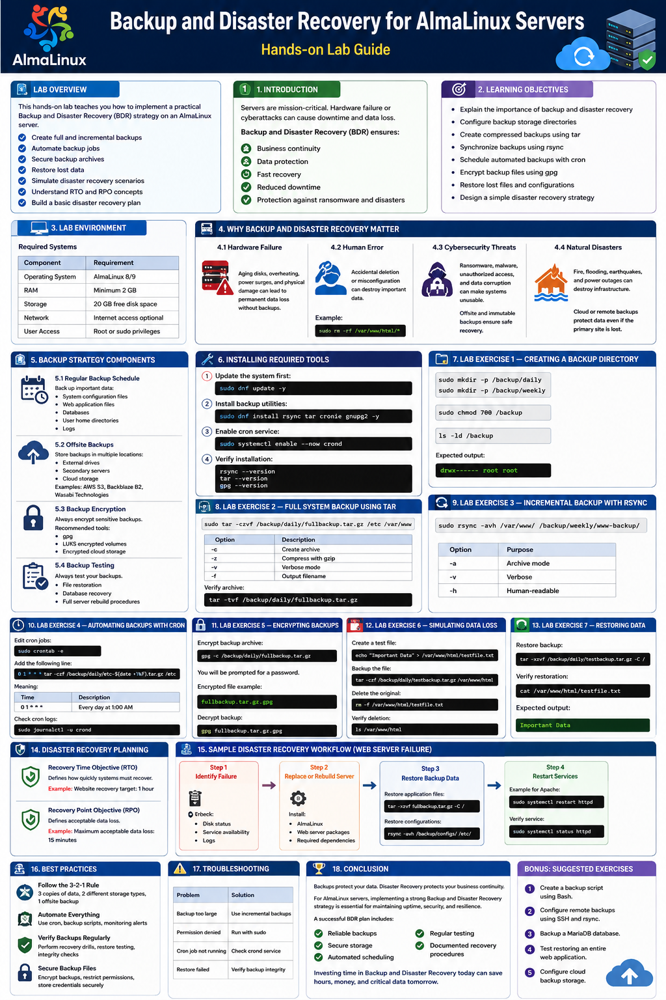

# Backup and Disaster Recovery for AlmaLinux Servers

## Lab Overview

This hands-on lab how to implement a practical Backup and Disaster Recovery (BDR) strategy on an AlmaLinux server.

- Create full and incremental backups
- Automate backup jobs
- Secure backup archives
- Restore lost data
- Simulate disaster recovery scenarios
- Understand RTO and RPO concepts
- Build a basic disaster recovery plan

---

# 1. Introduction

In today’s digital infrastructure, servers are mission-critical. Whether you're running web applications, databases, or file-sharing services on AlmaLinux, a single hardware failure or cyberattack can lead to major downtime and permanent data loss.

Backup and Disaster Recovery (BDR) ensures:

- Business continuity
- Data protection
- Fast recovery
- Reduced downtime
- Protection against ransomware and disasters

---

# 2. Learning Objectives

- Explain the importance of backup and disaster recovery
- Configure backup storage directories
- Create compressed backups using `tar`
- Synchronize backups using `rsync`
- Schedule automated backups with `cron`
- Encrypt backup files using `gpg`
- Restore lost files and configurations
- Design a simple disaster recovery strategy

---

# 3. Lab Environment

## Required Systems

| Component | Requirement |
|---|---|
| Operating System | AlmaLinux 8/9 |
| RAM | Minimum 2 GB |
| Storage | 20 GB free disk space |
| Network | Internet access optional |
| User Access | Root or sudo privileges |

---

# 4. Why Backup and Disaster Recovery Matter

## 4.1 Hardware Failure

Storage devices eventually fail because of:

- Aging disks
- Overheating
- Power surges
- Physical damage

Without backups, data loss may become permanent.

---

## 4.2 Human Error

Administrators can accidentally delete files or misconfigure systems.

### Example

```bash
sudo rm -rf /var/www/html/*
```

This command deletes all website files.

With proper backups, restoration becomes simple.

---

## 4.3 Cybersecurity Threats

Modern threats include:

- Ransomware
- Malware
- Unauthorized access
- Data corruption

Offsite and immutable backups help recover systems safely.

---

## 4.4 Natural Disasters

Environmental risks include:

- Fire
- Flooding
- Earthquakes
- Power outages

Cloud or remote backups protect data even if the primary site is destroyed.

---

# 5. Backup Strategy Components

## 5.1 Regular Backup Schedule

Important data to back up:

- System configuration files
- Web application files
- Databases
- User home directories
- Logs

---

## 5.2 Offsite Backups

Recommended storage locations:

- External drives
- Secondary servers
- Cloud storage

Examples include:

- Amazon Web Services S3
- Backblaze B2
- Wasabi Technologies

---

## 5.3 Backup Encryption

Sensitive backups should always be encrypted.

Recommended tools:

- `gpg`
- LUKS encrypted volumes
- Encrypted cloud storage

---

## 5.4 Backup Testing

A backup is only useful if it can be restored successfully.

Always test:

- File restoration
- Database recovery
- Full server rebuild procedures

---

# 6. Installing Required Tools

Update the system first:

```bash
sudo dnf update -y
```

Install backup utilities:

```bash
sudo dnf install rsync tar cronie gnupg2 -y
```

Enable cron service:

```bash
sudo systemctl enable --now crond
```

Verify installation:

```bash
rsync --version
tar --version
gpg --version
```

---

# 7. Lab Exercise 1 — Creating a Backup Directory

Create backup storage folders:

```bash
sudo mkdir -p /backup/daily
sudo mkdir -p /backup/weekly
```

Set permissions:

```bash
sudo chmod 700 /backup
```

Verify:

```bash
ls -ld /backup
```

Expected output:

```bash
drwx------ root root
```

---

# 8. Lab Exercise 2 — Full System Backup Using tar

Create a backup of `/etc` and `/var/www`:

```bash
sudo tar -czvf /backup/daily/fullbackup.tar.gz /etc /var/www
```

## Explanation

| Option | Description |
|---|---|
| `-c` | Create archive |
| `-z` | Compress with gzip |
| `-v` | Verbose mode |
| `-f` | Output filename |

Verify archive:

```bash
tar -tvf /backup/daily/fullbackup.tar.gz
```

---

# 9. Lab Exercise 3 — Incremental Backup with rsync

Create a synchronized backup:

```bash
sudo rsync -avh /var/www/ /backup/weekly/www-backup/
```

## Explanation

| Option | Purpose |
|---|---|
| `-a` | Archive mode |
| `-v` | Verbose |
| `-h` | Human-readable |

---

# 10. Lab Exercise 4 — Automating Backups with Cron

Edit cron jobs:

```bash
sudo crontab -e
```

Add the following line:

```bash
0 1 * * * tar -czf /backup/daily/etc-$(date +\%F).tar.gz /etc
```

## Meaning

| Time | Description |
|---|---|
| `0 1 * * *` | Every day at 1:00 AM |

Check cron logs:

```bash
sudo journalctl -u crond
```

---

# 11. Lab Exercise 5 — Encrypting Backups

Encrypt backup archive:

```bash
gpg -c /backup/daily/fullbackup.tar.gz
```

You will be prompted for a password.

Encrypted file example:

```bash
fullbackup.tar.gz.gpg
```

Decrypt backup:

```bash
gpg fullbackup.tar.gz.gpg
```

---

# 12. Lab Exercise 6 — Simulating Data Loss

Create a test file:

```bash
echo "Important Data" > /var/www/html/testfile.txt
```

Backup the file:

```bash
tar -czf /backup/daily/testbackup.tar.gz /var/www/html
```

Delete the original:

```bash
rm -f /var/www/html/testfile.txt
```

Verify deletion:

```bash
ls /var/www/html
```

---

# 13. Lab Exercise 7 — Restoring Data

Restore backup:

```bash
tar -xzvf /backup/daily/testbackup.tar.gz -C /
```

Verify restoration:

```bash
cat /var/www/html/testfile.txt
```

Expected output:

```bash
Important Data
```

---

# 14. Disaster Recovery Planning

## Recovery Time Objective (RTO)

Defines how quickly systems must recover.

### Example

- Website recovery target: 1 hour

---

## Recovery Point Objective (RPO)

Defines acceptable data loss.

### Example

- Maximum acceptable data loss: 15 minutes

---

# 15. Sample Disaster Recovery Workflow

## Scenario: Web Server Failure

### Step 1 — Identify Failure

Check:

- Disk status
- Service availability
- Logs

---

### Step 2 — Replace or Rebuild Server

Install:

- AlmaLinux
- Web server packages
- Required dependencies

---

### Step 3 — Restore Backup Data

Restore application files:

```bash
tar -xzvf fullbackup.tar.gz -C /
```

Restore configurations:

```bash
rsync -avh /backup/configs/ /etc/
```

---

### Step 4 — Restart Services

Example for Apache:

```bash
sudo systemctl restart httpd
```

Verify service:

```bash
sudo systemctl status httpd
```

---

# 16. Best Practices

## Follow the 3-2-1 Rule

Keep:

- 3 copies of data
- 2 different storage types
- 1 offsite backup

---

## Automate Everything

Use:

- `cron`
- Backup scripts
- Monitoring alerts

---

## Verify Backups Regularly

Perform:

- Recovery drills
- Restore testing
- Integrity checks

---

## Secure Backup Files

Always:

- Encrypt backups
- Restrict permissions
- Store credentials securely

---

# 17. Troubleshooting

| Problem | Solution |
|---|---|
| Backup too large | Use incremental backups |
| Permission denied | Run with sudo |
| Cron job not running | Check crond service |
| Restore failed | Verify backup integrity |

---

# 18. Conclusion

Backups protect your data. Disaster Recovery protects your business continuity.

For AlmaLinux servers, implementing a strong Backup and Disaster Recovery strategy is essential for maintaining uptime, security, and resilience.

A successful BDR plan includes:

- Reliable backups
- Secure storage
- Automated scheduling
- Regular testing
- Documented recovery procedures

Investing time in Backup and Disaster Recovery today can save hours, money, and critical data tomorrow.

---

