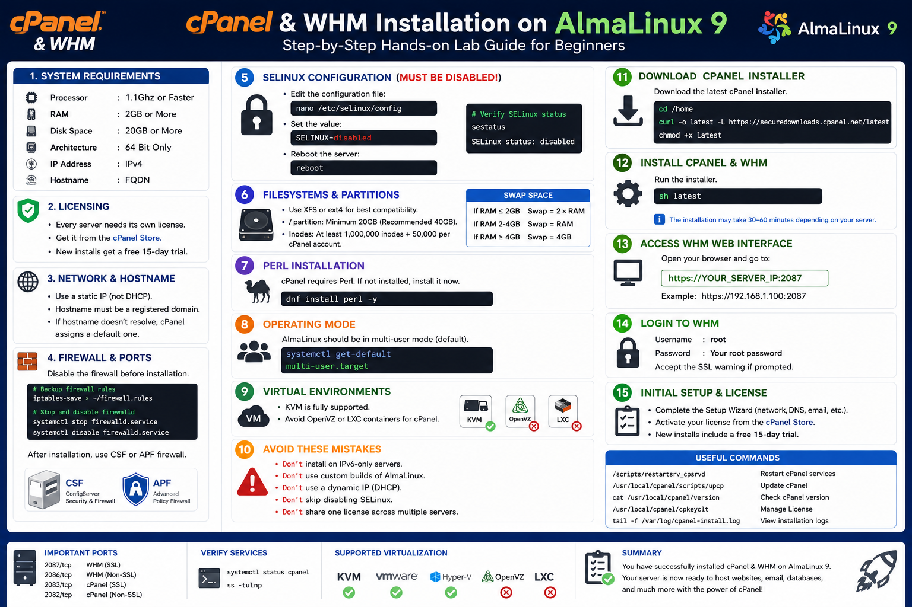
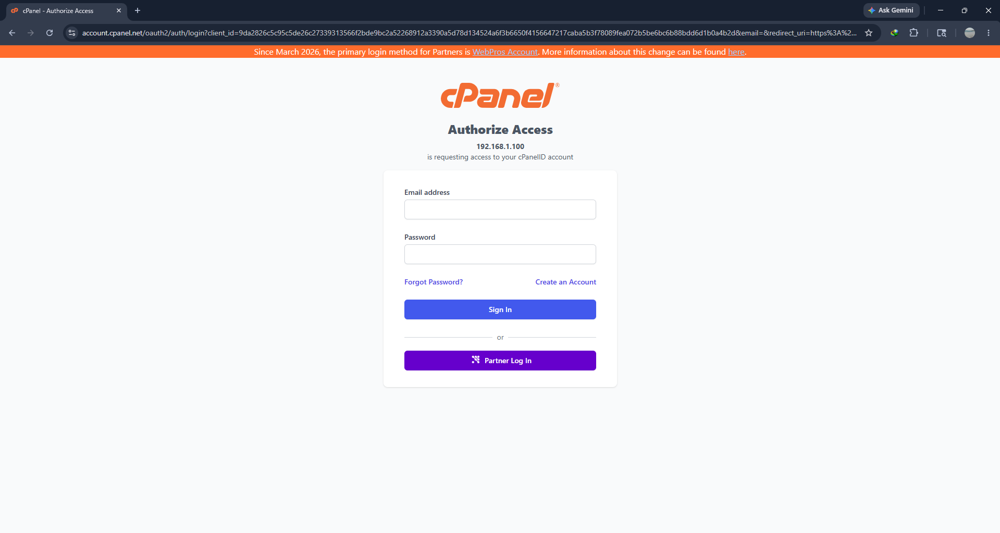
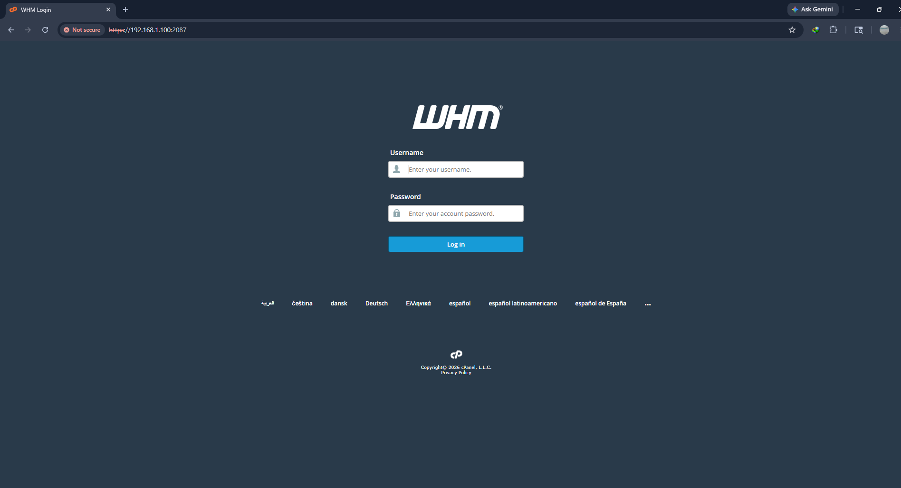

# cPanel & WHM Installation on AlmaLinux 9 — Hands-on Lab

## Overview

This hands-on lab the complete installation of cPanel & WHM on AlmaLinux 9.

- Prepare an AlmaLinux server for cPanel installation
- Configure hostname and networking
- Disable SELinux and firewall services
- Install required packages
- Install cPanel & WHM
- Access the WHM web interface
- Perform initial setup tasks

---

# Lab Objectives

In this lab :

- Verify cPanel system requirements
- Configure a fully qualified domain name (FQDN)
- Disable incompatible services
- Prepare storage and swap space
- Install Perl dependencies
- Download and install cPanel
- Access WHM through a web browser

---

# Prerequisites

Before starting, make sure you have:

- AlmaLinux 9 minimal installation
- Root access or sudo privileges
- Stable internet connection
- Static IPv4 address
- Valid domain name for hostname
- At least 20 GB storage
- Minimum 2 GB RAM

---

# System Requirements

| Component | Requirement |
|---|---|
| CPU | 1.1 GHz or Faster |
| RAM | 2 GB or More |
| Disk Space | 20 GB Minimum |
| Architecture | 64-bit Only |
| IP Address | IPv4 |
| Hostname | Fully Qualified Domain Name (FQDN) |

---

# Lab Topology

## Example Environment

| Device | Hostname | IP Address |
|---|---|---|
| AlmaLinux Server | `server.example.com` | `192.168.1.100` |

---

# Step 1 — Update AlmaLinux System

First, update all installed packages.

```bash
dnf update -y
```

Reboot if the kernel was updated.

```bash
reboot
```

---

# Step 2 — Configure Hostname

cPanel requires a valid FQDN hostname.

## Set Hostname

```bash
sudo hostnamectl set-hostname tza.thantzinaung.com
```

## Verify Hostname

```bash
hostnamectl
```

## Check Hosts File

Edit the hosts file:

```bash
sudo nano /etc/hosts
```

Example configuration:

```text
192.168.1.100   tza.thantzinaung.com   server
```

---

# Step 3 — Verify Static IP Address

Check network configuration:

```bash
ip addr
```

Verify the server is using a static IP address and not DHCP.

---

# Step 4 — Disable Firewalld

Before installing cPanel, stop and disable the default firewall.

## Backup Existing Firewall Rules

```bash
sudo iptables-save > ~/firewall.rules
```

## Stop Firewalld

```bash
sudo systemctl stop firewalld.service
```

## Disable Firewalld

```bash
sudo systemctl disable firewalld.service
```

## Verify Status

```bash
sudo systemctl status firewalld
```

---

# Step 5 — Disable SELinux

cPanel requires SELinux to be disabled.

## Edit SELinux Configuration

```bash
nano /etc/selinux/config
```

Change:

```text
SELINUX=enforcing
```

To:

```text
SELINUX=disabled
```

## Reboot the Server

```bash
sudo reboot
```

## Verify SELinux Status

```bash
sestatus
```

Expected output:

```text
SELinux status: disabled
```

---

# Step 6 — Verify Filesystem and Disk Space

cPanel works best with:

- XFS
- ext4

## Check Filesystem

```bash
df -Th
```

## Recommended Partition Sizes

| Partition | Recommended Size |
|---|---|
| `/` | 20 GB Minimum |
| `/home` | Large enough for hosting accounts |
| `swap` | Based on RAM |

---

# Step 7 — Configure Swap Space

## Swap Recommendations

| RAM Size | Recommended Swap |
|---|---|
| ≤ 2 GB | 2 × RAM |
| 2–4 GB | Equal to RAM |
| ≥ 4 GB | 4 GB |

## Check RAM Size
```bash
sudo dmidecode -t memory | grep Size
```

## Check Existing Swap

```bash
swapon --show
```

## Create Swap File Example (4 GB)

```bash
sudo fallocate -l 4G /swapfile
sudo chmod 600 /swapfile
sudo mkswap /swapfile
sudo swapon /swapfile
```

## Make Swap Persistent

```bash
echo '/swapfile swap swap defaults 0 0' >> /etc/fstab
```

## Verify Swap

```bash
free -h
```

---

# Step 8 — Install Perl

cPanel requires Perl.

## Install Perl

```bash
sudo dnf install perl -y
```

## Verify Perl

```bash
perl -v
```

---

# Step 9 — Verify System Operating Mode

cPanel should run in multi-user mode.

## Check Default Target

```bash
systemctl get-default
```

Expected output:

```text
multi-user.target
```

---

# Step 10 — Download cPanel Installer

Move to the home directory:

```bash
cd /home
```

Download the latest installer:

```bash
sudo curl -o latest -L https://securedownloads.cpanel.net/latest
```

Make it executable:

```bash
sudo chmod +x latest
```

---

# Step 11 — Install cPanel & WHM

Run the installer:

```bash
sh latest
```

The installation may take between 30–60 minutes depending on internet speed and server performance.

---

# Step 12 — Access WHM Web Interface

After installation completes, open your browser and visit:

```text
https://YOUR_SERVER_IP:2087
```

Example:

```text
https://192.168.1.100:2087
```

---

# Step 13 — Login to WHM

Use:

| Field | Value |
|---|---|
| Username | `root` |
| Password | Your root password |

Accept the SSL warning if prompted.

---

# Step 14 — Initial WHM Setup Wizard

Complete the setup wizard.

## Configure:

- Contact email address
- Nameservers
- Networking settings
- Shared IP address
- Service configuration

---

# Step 15 — Activate cPanel License

Every cPanel server requires a license.

You can obtain one from the official cPanel website:

- cPanel Store

New installations usually include a free 15-day trial license.

---

# Recommended Firewall After Installation

After cPanel installation, install one of the following:

- ConfigServer Security & Firewall (CSF)
- Advanced Policy Firewall (APF)

CSF is the most commonly used firewall for cPanel servers.

---

# Virtualization Support

| Virtualization | Support Status |
|---|---|
| KVM | Supported |
| VMware | Supported |
| Hyper-V | Supported |
| OpenVZ | Not Recommended |
| LXC | Not Recommended |

---

# Common Installation Mistakes to Avoid

## Do NOT:

- Use IPv6-only networking
- Install on DHCP-based servers
- Skip disabling SELinux
- Use unofficial AlmaLinux images
- Share one license across multiple servers
- Use unsupported container virtualization

---

# Verify cPanel Services

## Check cPanel Service Status

```bash
systemctl status cpanel
```

## Check Listening Ports

```bash
ss -tulnp
```

Important ports:

| Port | Service |
|---|---|
| 2087 | WHM Secure |
| 2083 | cPanel Secure |
| 2086 | WHM Non-SSL |
| 2082 | cPanel Non-SSL |

---

# Useful cPanel Commands

## Restart cPanel Service

```bash
/scripts/restartsrv_cpsrvd
```

## Update cPanel

```bash
/usr/local/cpanel/scripts/upcp
```

## Check cPanel Version

```bash
cat /usr/local/cpanel/version
```

---

# Troubleshooting

## Installer Fails

Check logs:

```bash
tail -f /var/log/cpanel-install.log
```

## Hostname Issues

Verify DNS resolution:

```bash
hostname -f
ping server.example.com
```

## License Problems

Refresh license:

```bash
/usr/local/cpanel/cpkeyclt
```

---

# Lab Summary

In this hands-on lab, you successfully:

- Prepared AlmaLinux 9 for cPanel
- Configured hostname and networking
- Disabled SELinux and firewalld
- Installed required dependencies
- Installed cPanel & WHM
- Accessed WHM web interface
- Learned basic administration commands

---

# Conclusion

You now have a working cPanel & WHM server running on **AlmaLinux 9**.

This setup provides a professional web hosting management platform capable of managing:

- Websites
- Domains
- Email accounts
- Databases
- DNS services
- FTP accounts
- SSL certificates

With proper firewall configuration, backups, and regular updates, your cPanel server is ready for production hosting environments.



