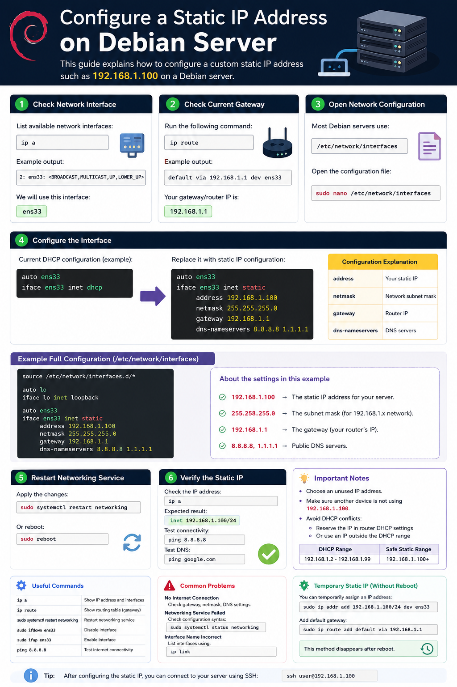
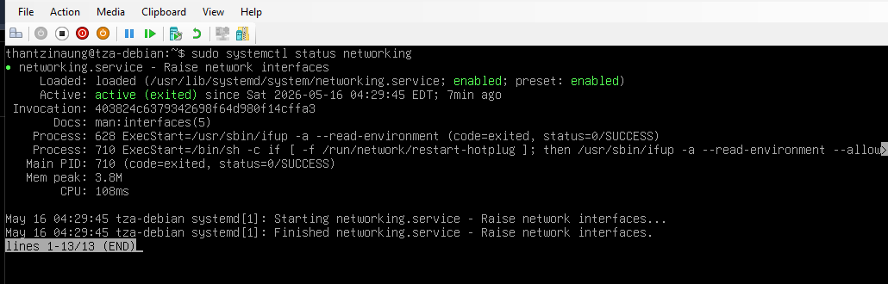

# Configure a Static IP Address on Debian Server

When Debian Server is installed, it usually receives an IP address automatically from a DHCP server (such as your router). If you want your server to always use the same IP address, you must configure a static IP.

This guide explains how to configure a custom static IP address such as:

```bash
192.168.1.100
```

---

# Step 1: Check Current Network Interface

List available network interfaces:

```bash
ip a
```

Example output:

```bash
2: ens33: <BROADCAST,MULTICAST,UP,LOWER_UP>
```

Your interface may be named:

- `eth0`
- `ens18`
- `ens33`
- `enp0s3`

In this here, I will use:

```bash
eth0
```

---

# Step 2: Check Current Gateway

Run:

```bash
ip route
```

Example:

```bash
default via 192.168.1.2 dev eth0
```

Your gateway/router IP is:

```bash
192.168.1.2
```

---

# Step 3: Configure Static IP

Debian may use either:

- `/etc/network/interfaces`
- NetworkManager
- Netplan (rare on Debian)
- systemd-networkd

Most Debian servers use:

```bash
/etc/network/interfaces
```

Open the configuration file:

```bash
sudo nano /etc/network/interfaces
```

---

# Step 4: Configure the Interface

Find the DHCP configuration.

Example:

```bash
auto eth0
iface eth0 inet dhcp
```

Replace it with:

```bash
auto eth0
iface eth0 inet static
    address 192.168.1.100
    netmask 255.255.255.0
    gateway 192.168.1.1
    dns-nameservers 8.8.8.8 1.1.1.1
```

---

# Configuration Explanation

| Setting | Description |
|---|---|
| address | Your static IP |
| netmask | Network subnet mask |
| gateway | Router IP |
| dns-nameservers | DNS servers |

---

# Example Full Configuration

```bash
source /etc/network/interfaces.d/*

auto lo
iface lo inet loopback

auto eth0
iface eth0 inet static
    address 192.168.1.100
    netmask 255.255.255.0
    gateway 192.168.1.1
    dns-nameservers 8.8.8.8 1.1.1.1
```

---

# Step 5: Restart Networking Service

Apply the changes:

```bash
sudo systemctl restart networking
```

Or reboot:

```bash
sudo reboot
```

---

# Step 6: Verify the Static IP

Check the IP address:

```bash
ip a
```

Expected result:

```bash
inet 192.168.1.100/24
```

Check network connectivity:

```bash
ping 8.8.8.8
```

Test DNS:

```bash
ping google.com
```

---

# Temporary Static IP (Without Reboot)
## This use for test

You can temporarily assign an IP address:

```bash
sudo ip addr add 192.168.1.100/24 dev ens33
```

Add default gateway:

```bash
sudo ip route add default via 192.168.1.1
```

This method disappears after reboot.

---

# Remove Old DHCP Lease (Optional)

Sometimes Debian still keeps old DHCP information.

Release DHCP lease:

```bash
sudo dhclient -r
```

Renew:

```bash
sudo dhclient
```

---

# Restart Interface Only

Disable interface:

```bash
sudo ifdown eth0
```

Enable interface:

```bash
sudo ifup eth0
```

---

# Important Notes

## Choose an Unused IP Address

Before using:

```bash
192.168.1.100
```

Make sure another device is not already using it.

Test:

```bash
ping 192.168.1.100
```

No reply usually means it is available.

---

## Avoid DHCP Conflicts

Your router may automatically assign IPs.

To avoid conflicts:

- Reserve the IP in router DHCP settings
- Or use an IP outside the DHCP range

Example:

| DHCP Range | Safe Static Range |
|---|---|
| 192.168.1.3 - 192.168.1.99 | 192.168.1.100+ |

---

# Common Problems

## No Internet Connection

Check:

- Correct gateway
- Correct subnet mask
- DNS configuration

---

## Networking Service Failed

Check configuration syntax:

```bash
sudo systemctl status networking
```

---

## Interface Name Incorrect

List interfaces again:

```bash
ip link
```

---

# Modern Debian Using NetworkManager

If your server uses NetworkManager:
## I don't need in this here, because I modified by command like 'sudo nano /etc/network/interfaces' and also I did't install NetworkManager (This NetworkManager is just for knowledge)

Check:

```bash
nmcli device status
```

Set static IP:

```bash
sudo nmcli con mod "Wired connection 1" \
ipv4.addresses 192.168.1.100/24 \
ipv4.gateway 192.168.1.1 \
ipv4.dns "8.8.8.8 1.1.1.1" \
ipv4.method manual
```

Activate:

```bash
sudo nmcli con up "Wired connection 1"
```

---

# Conclusion

Setting a static IP on Debian Server ensures your server always keeps the same address, which is important for:

- SSH access
- Web servers
- Database servers
- File sharing
- DNS servers
- Monitoring systems

A properly configured static IP makes remote administration more stable and predictable.


