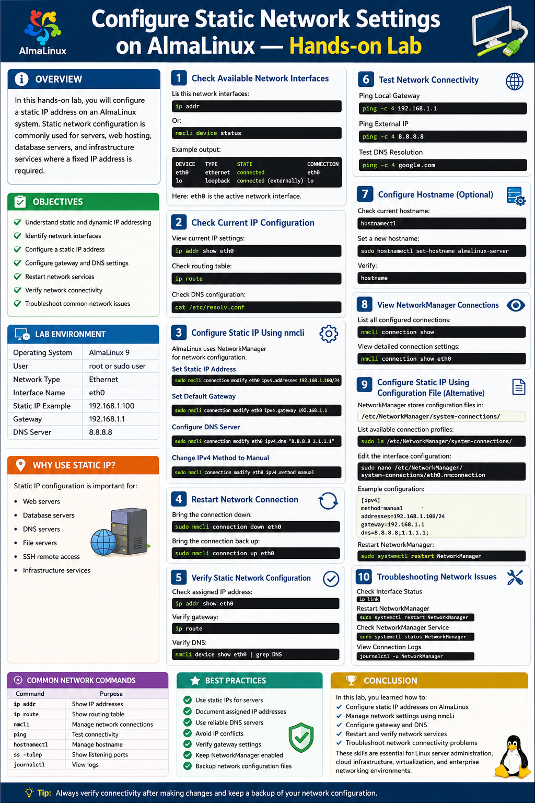
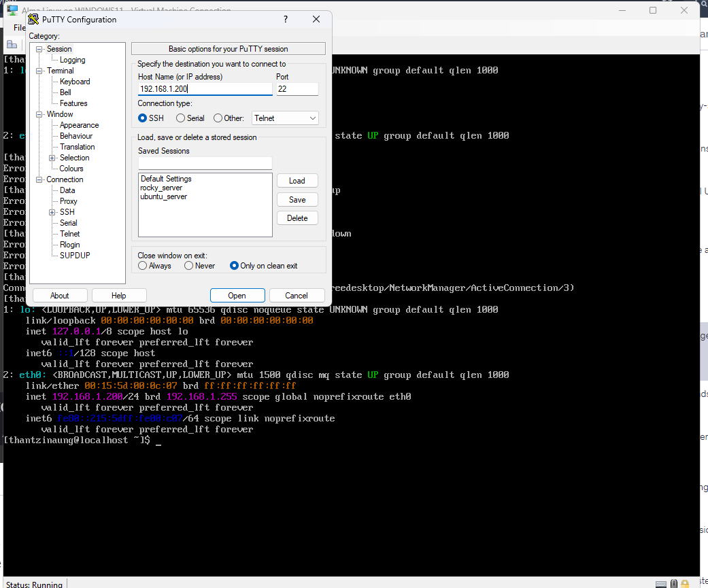
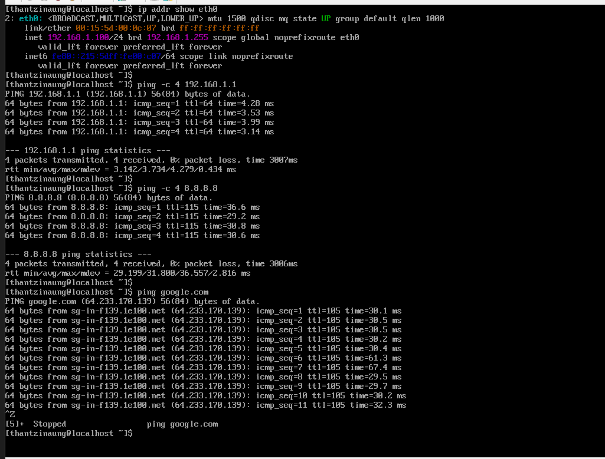
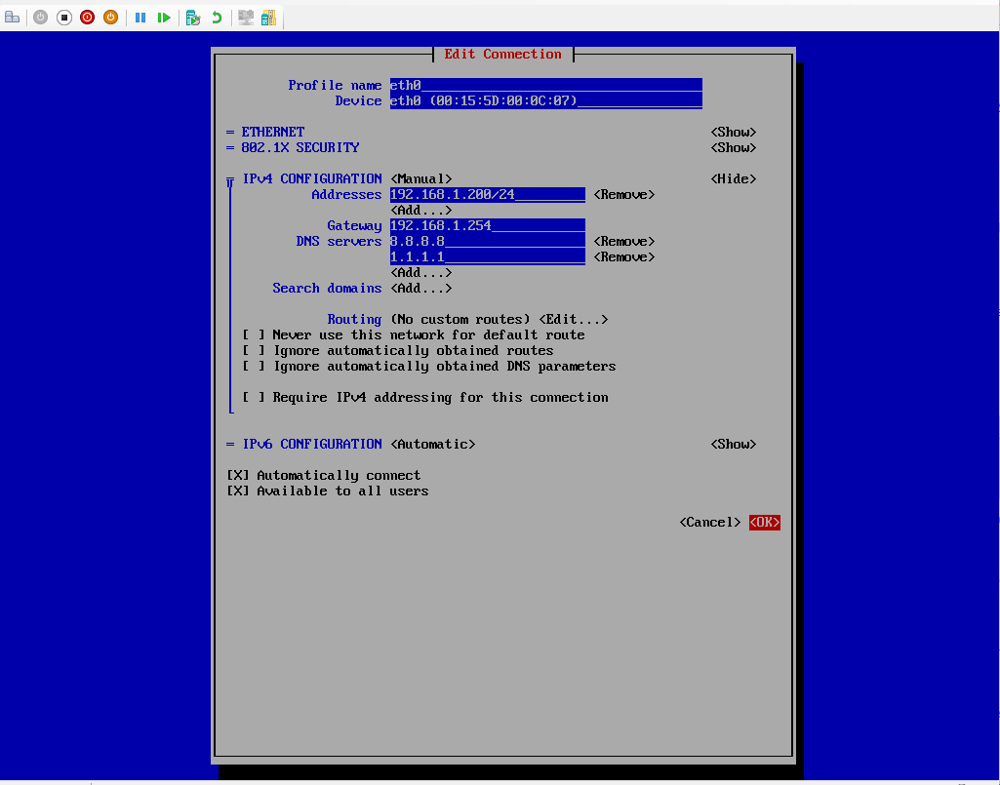
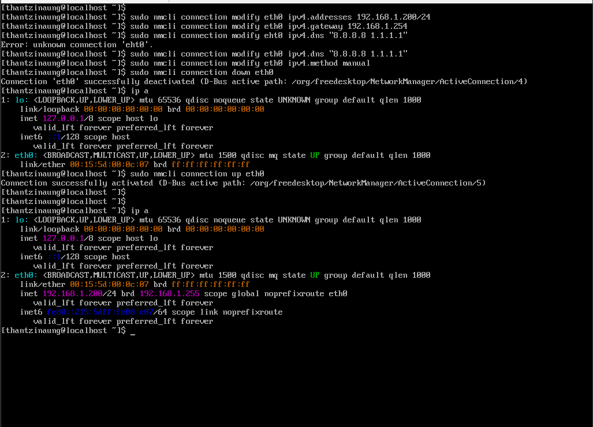

# Configure Static Network Settings on AlmaLinux — Hands-on Lab

## Overview

In this hands-on lab, configure a static IP address on an AlmaLinux system. Static network configuration is commonly used for servers, web hosting, database servers, and infrastructure services where a fixed IP address is required.

- Understand static and dynamic IP addressing
- Identify network interfaces
- Configure a static IP address
- Configure gateway and DNS settings
- Restart network services
- Verify network connectivity
- Troubleshoot common network issues

---

# Lab Environment

| Component | Example |
|---|---|
| Operating System | AlmaLinux 9 |
| User | root or sudo user |
| Network Type | Ethernet |
| Interface Name | `eth0` |
| Static IP Example | `192.168.1.100` |
| Gateway | `192.168.1.1` |
| DNS Server | `8.8.8.8` |

---

# Understanding Static IP Addressing

A static IP address is manually assigned to a server and does not change automatically.

## Why Use Static IP?

Static IP configuration is important for:

- Web servers
- Database servers
- DNS servers
- File servers
- SSH remote access
- Infrastructure services

---

# Step 1 — Check Available Network Interfaces

List all network interfaces:

```bash
ip addr
```

Or:

```bash
nmcli device status
```

Example output:

```bash
DEVICE    TYPE      STATE                   CONNECTION
eth0    ethernet  connected                 eth0
lo        loopback  connected (externally)  lo
```

Here:

- `eth0` is the active network interface

---

# Step 2 — Check Current IP Configuration

View current IP settings:

```bash
ip addr show eth0
```

Check routing table:

```bash
ip route
```

Check DNS configuration:

```bash
cat /etc/resolv.conf
```

---

# Step 3 — Configure Static IP Using nmcli

AlmaLinux uses NetworkManager for network configuration.

## Set Static IP Address

```bash
sudo nmcli connection modify eth0 ipv4.addresses 192.168.1.100/24
```

## Set Default Gateway

```bash
sudo nmcli connection modify eth0 ipv4.gateway 192.168.1.1
```

## Configure DNS Server

```bash
sudo nmcli connection modify eth0 ipv4.dns "8.8.8.8 1.1.1.1"
```

## Change IPv4 Method to Manual

```bash
sudo nmcli connection modify eth0 ipv4.method manual
```

---

# Step 4 — Restart Network Connection

Bring the connection down:

```bash
sudo nmcli connection down eth0
```

Bring the connection back up:

```bash
sudo nmcli connection up eth0
```

---

# Step 5 — Verify Static Network Configuration

Check assigned IP address:

```bash
ip addr show eth0
```

Verify gateway:

```bash
ip route
```

Verify DNS:

```bash
nmcli device show ens160 | grep DNS
```

---

# Step 6 — Test Network Connectivity

## Ping Local Gateway

```bash
ping -c 4 192.168.1.1
```

## Ping External IP

```bash
ping -c 4 8.8.8.8
```

## Test DNS Resolution

```bash
ping -c 4 google.com
```

---

# Step 7 — Configure Hostname (Optional)

Check current hostname:

```bash
hostnamectl
```

Set a new hostname:

```bash
sudo hostnamectl set-hostname almalinux-server
```

Verify:

```bash
hostname
```

---

# Step 8 — View NetworkManager Connections

List all configured connections:

```bash
nmcli connection show
```

View detailed connection settings:

```bash
nmcli connection show eth0
```

---

# Step 9 — Configure Static IP Using Configuration File (Alternative Method)

NetworkManager stores configuration files in:

```bash
/etc/NetworkManager/system-connections/
```

Example:

```bash
sudo ls /etc/NetworkManager/system-connections/
```

Edit the interface configuration:

```bash
sudo nano /etc/NetworkManager/system-connections/ens160.nmconnection
```

Example configuration:

```ini
[ipv4]
method=manual
addresses=192.168.1.100/24
gateway=192.168.1.1
dns=8.8.8.8;1.1.1.1;
```

Restart NetworkManager:

```bash
sudo systemctl restart NetworkManager
```

---

# Step 10 — Troubleshooting Network Issues

## Check Interface Status

```bash
ip link
```

## Restart NetworkManager

```bash
sudo systemctl restart NetworkManager
```

## Check NetworkManager Service

```bash
sudo systemctl status NetworkManager
```

## View Connection Logs

```bash
journalctl -u NetworkManager
```

---

# Common Network Commands

| Command | Purpose |
|---|---|
| `ip addr` | Show IP addresses |
| `ip route` | Show routing table |
| `nmcli` | Manage network connections |
| `ping` | Test connectivity |
| `hostnamectl` | Manage hostname |
| `ss -tulnp` | Show listening ports |
| `journalctl` | View logs |

---

# Best Practices

- Use static IPs for servers
- Document assigned IP addresses
- Use reliable DNS servers
- Avoid IP conflicts
- Verify gateway settings
- Keep NetworkManager enabled
- Backup network configuration files

---

# Conclusion

In this lab, you learned how to:

- Configure static IP addresses on AlmaLinux
- Manage network settings using `nmcli`
- Configure gateway and DNS
- Restart and verify network services
- Troubleshoot network connectivity problems

These skills are essential for Linux server administration, cloud infrastructure, virtualization, and enterprise networking environments.





