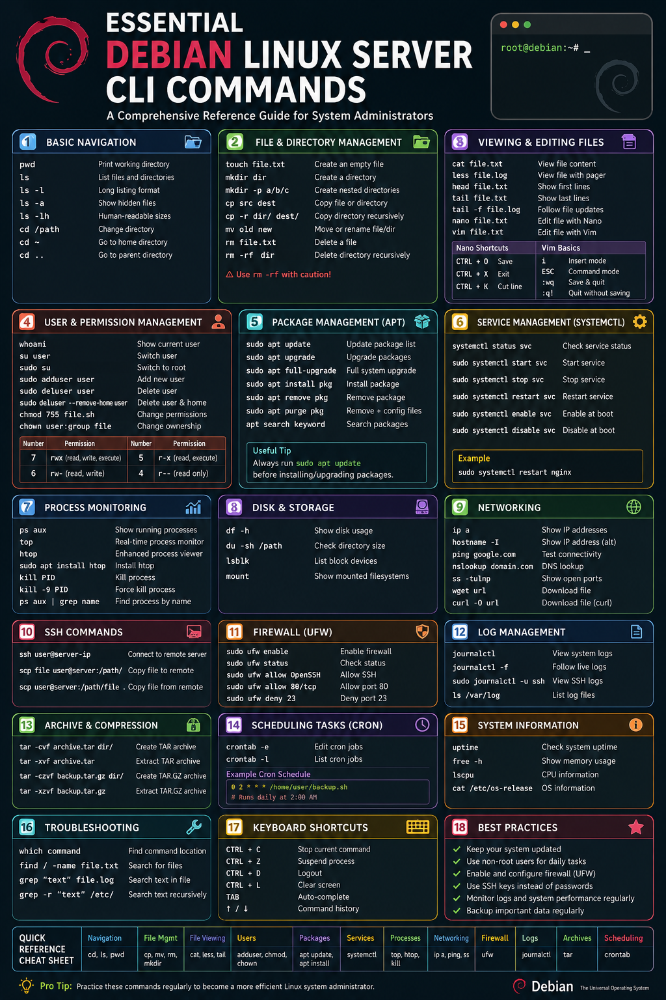

# Essential Debian Linux Server CLI Commands

## Introduction

Managing a Debian Linux server efficiently requires strong knowledge of the command-line interface (CLI). Whether you are a beginner system administrator or an advanced DevOps engineer, mastering essential Debian CLI commands is critical for:

- Server administration
- User management
- Networking
- File operations
- Security
- Process monitoring
- Package management
- Troubleshooting

This guide covers the most important Debian Linux server commands every administrator should know.

---

# 1. Basic Navigation Commands

## Check Current Directory

```bash
pwd
```

Displays the current working directory.

Example:

```bash
/home/admin
```

---

## List Files and Directories

```bash
ls
```

Useful options:

```bash
ls -l
ls -a
ls -lh
```

Explanation:

| Command | Description |
|---|---|
| `ls -l` | Long listing format |
| `ls -a` | Show hidden files |
| `ls -lh` | Human-readable sizes |

---

## Change Directory

```bash
cd /path/to/directory
```

Examples:

```bash
cd /var/log
cd ~
cd ..
```

---

# 2. File and Directory Management

## Create Files

```bash
touch filename.txt
```

Example:

```bash
touch notes.txt
```

---

## Create Directories

```bash
mkdir myfolder
```

Create nested directories:

```bash
mkdir -p project/config/logs
```

---

## Copy Files

```bash
cp source destination
```

Examples:

```bash
cp file.txt /backup/
cp -r website/ /backup/
```

---

## Move or Rename Files

```bash
mv oldname.txt newname.txt
```

Move file:

```bash
mv file.txt /tmp/
```

---

## Delete Files

```bash
rm filename.txt
```

Delete directory recursively:

```bash
rm -rf foldername
```

⚠ Warning: `rm -rf` permanently deletes files.

---

# 3. Viewing and Editing Files

## View File Content

```bash
cat filename.txt
```

---

## Read Large Files

```bash
less filename.log
```

Navigation:

- `q` → quit
- `/word` → search

---

## View File Beginning or End

```bash
head file.txt
tail file.txt
```

Live monitoring:

```bash
tail -f /var/log/syslog
```

---

## Edit Files with Nano

```bash
nano filename.txt
```

Useful shortcuts:

| Shortcut | Action |
|---|---|
| `CTRL + O` | Save |
| `CTRL + X` | Exit |
| `CTRL + K` | Cut line |

---

## Edit Files with Vim

```bash
vim filename.txt
```

Basic usage:

| Key | Action |
|---|---|
| `i` | Insert mode |
| `ESC` | Command mode |
| `:wq` | Save and quit |
| `:q!` | Quit without saving |

---

# 4. User and Permission Management

## Check Current User

```bash
whoami
```

---

## Switch User

```bash
su username
```

Switch to root:

```bash
sudo su
```

---

## Add New User

```bash
sudo adduser john
```

---

## Delete User

```bash
sudo deluser john
```

Remove home directory:

```bash
sudo deluser --remove-home john
```

---

## Change File Permissions

```bash
chmod 755 script.sh
```

Permission explanation:

| Number | Permission |
|---|---|
| 7 | rwx |
| 6 | rw- |
| 5 | r-x |
| 4 | r-- |

---

## Change File Ownership

```bash
chown user:user file.txt
```

Example:

```bash
sudo chown www-data:www-data website/
```

---

# 5. Package Management with APT

## Update Package List

```bash
sudo apt update
```

---

## Upgrade Installed Packages

```bash
sudo apt upgrade
```

---

## Full System Upgrade

```bash
sudo apt full-upgrade
```

---

## Install Packages

```bash
sudo apt install nginx
```

---

## Remove Packages

```bash
sudo apt remove nginx
```

Remove configuration files too:

```bash
sudo apt purge nginx
```

---

## Search Packages

```bash
apt search apache
```

---

# 6. Service Management with systemctl

## Check Service Status

```bash
systemctl status nginx
```

---

## Start a Service

```bash
sudo systemctl start nginx
```

---

## Stop a Service

```bash
sudo systemctl stop nginx
```

---

## Restart a Service

```bash
sudo systemctl restart nginx
```

---

## Enable Service at Boot

```bash
sudo systemctl enable nginx
```

---

## Disable Service

```bash
sudo systemctl disable nginx
```

---

# 7. Process Monitoring Commands

## Display Running Processes

```bash
ps aux
```

---

## Real-Time Process Monitoring

```bash
top
```

Enhanced version:

```bash
htop
```

Install htop:

```bash
sudo apt install htop
```

---

## Kill a Process

```bash
kill PID
```

Force kill:

```bash
kill -9 PID
```

Find PID:

```bash
ps aux | grep nginx
```

---

# 8. Disk and Storage Commands

## Show Disk Usage

```bash
df -h
```

---

## Check Directory Size

```bash
du -sh /var/log
```

---

## List Block Devices

```bash
lsblk
```

---

## Display Mounted Filesystems

```bash
mount
```

---

# 9. Networking Commands

## Check IP Address

```bash
ip a
```

Alternative:

```bash
hostname -I
```

---

## Test Network Connectivity

```bash
ping google.com
```

---

## DNS Lookup

```bash
nslookup openai.com
```

Install if missing:

```bash
sudo apt install dnsutils
```

---

## Check Open Ports

```bash
ss -tulnp
```

---

## Download Files

```bash
wget https://example.com/file.zip
```

Alternative:

```bash
curl -O https://example.com/file.zip
```

---

# 10. SSH Commands

## Connect to Remote Server

```bash
ssh user@server-ip
```

Example:

```bash
ssh admin@192.168.1.10
```

---

## Copy Files with SCP

```bash
scp file.txt user@server:/home/user/
```

Download remote file:

```bash
scp user@server:/file.txt .
```

---

# 11. Firewall Commands (UFW)

## Enable Firewall

```bash
sudo ufw enable
```

---

## Check Firewall Status

```bash
sudo ufw status
```

---

## Allow SSH

```bash
sudo ufw allow OpenSSH
```

---

## Allow Specific Port

```bash
sudo ufw allow 80/tcp
```

---

## Deny Port

```bash
sudo ufw deny 23
```

---

# 12. Log Management

## View System Logs

```bash
journalctl
```

---

## Follow Live Logs

```bash
journalctl -f
```

---

## Check SSH Logs

```bash
sudo journalctl -u ssh
```

---

# 13. Archive and Compression

## Create TAR Archive

```bash
tar -cvf archive.tar folder/
```

---

## Extract TAR Archive

```bash
tar -xvf archive.tar
```

---

## Create Compressed Archive

```bash
tar -czvf backup.tar.gz folder/
```

---

## Extract GZIP Archive

```bash
tar -xzvf backup.tar.gz
```

---

# 14. Scheduling Tasks with Cron

## Edit Cron Jobs

```bash
crontab -e
```

---

## View Cron Jobs

```bash
crontab -l
```

---

## Cron Schedule Example

```bash
0 2 * * * /home/user/backup.sh
```

Meaning:

- Runs daily at 2:00 AM

---

# 15. Useful System Information Commands

## Check System Uptime

```bash
uptime
```

---

## View Memory Usage

```bash
free -h
```

---

## Display CPU Information

```bash
lscpu
```

---

## Display OS Information

```bash
cat /etc/os-release
```

---

# 16. Essential Troubleshooting Commands

## Find Command Location

```bash
which nginx
```

---

## Search for Files

```bash
find / -name filename.txt
```

---

## Search Text Inside Files

```bash
grep "error" logfile.log
```

Recursive search:

```bash
grep -r "database" /etc/
```

---

# 17. Useful Keyboard Shortcuts

| Shortcut | Description |
|---|---|
| `CTRL + C` | Stop current command |
| `CTRL + Z` | Suspend process |
| `CTRL + D` | Logout |
| `CTRL + L` | Clear screen |
| `TAB` | Auto-complete |
| `↑ / ↓` | Command history |

---

# 18. Recommended Best Practices

## Keep the Server Updated

```bash
sudo apt update && sudo apt upgrade -y
```

---

## Use Non-Root Users

Avoid logging in directly as root.

---

## Enable Firewall

Always configure UFW or another firewall.

---

## Use SSH Keys

Disable password authentication when possible.

---

## Monitor Logs Regularly

Check:

```bash
/var/log/
journalctl
```

---

# Conclusion

Learning essential Debian Linux server CLI commands is the foundation of effective server administration. These commands help administrators manage:

- Files
- Users
- Processes
- Services
- Networking
- Security
- System performance

Mastering these commands will significantly improve your Linux server management skills and troubleshooting efficiency.

---

# Quick Reference Cheat Sheet

| Category | Command |
|---|---|
| Navigation | `cd`, `ls`, `pwd` |
| File Management | `cp`, `mv`, `rm`, `mkdir` |
| File Viewing | `cat`, `less`, `tail` |
| Users | `adduser`, `chmod`, `chown` |
| Packages | `apt update`, `apt install` |
| Services | `systemctl` |
| Processes | `top`, `htop`, `kill` |
| Networking | `ip a`, `ping`, `ss` |
| Firewall | `ufw` |
| Logs | `journalctl` |
| Archives | `tar` |
| Scheduling | `crontab` |

