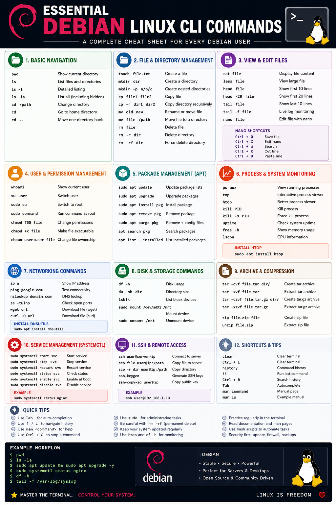

# Essential Debian Linux CLI Commands

Debian Linux is one of the most stable and widely used Linux distributions. Whether you are a beginner system administrator, developer, or Linux enthusiast, learning the essential Command Line Interface (CLI) commands is critical for managing systems efficiently.

This guide covers the most important Debian Linux CLI commands for daily administration, troubleshooting, file management, networking, and package handling.

---

# Table of Contents

1. Introduction to the Linux CLI
2. Basic Terminal Navigation
3. File and Directory Management
4. File Viewing and Editing
5. User and Permission Management
6. Package Management with APT
7. Process and System Monitoring
8. Networking Commands
9. Disk and Storage Commands
10. Archive and Compression
11. Service Management with systemctl
12. SSH and Remote Access
13. Useful Shortcuts and Tips
14. Conclusion

---

## if you don't have sudo permission 
```bash
su -
apt update
apt install sudo -y
usermod -aG sudo thantzinaung
reboot
```

# 1. Introduction to the Linux CLI

The Linux CLI (Command Line Interface) allows users to interact directly with the operating system using commands.

Open the terminal using:

```bash
Ctrl + Alt + T
```

Or access a remote Debian server using SSH:

```bash
ssh username@server-ip
```

---

# 2. Basic Terminal Navigation

## Check Current Directory

```bash
pwd
```

Displays the current working directory.

Example:

```bash
/home/admin
```

---

## List Files and Directories

```bash
ls
```

Detailed listing:

```bash
ls -l
```

Show hidden files:

```bash
ls -la
```

---

## Change Directory

```bash
cd /path/to/directory
```

Go to home directory:

```bash
cd
```

Move one directory back:

```bash
cd ..
```

---

# 3. File and Directory Management

## Create Files

```bash
touch file.txt
```

---

## Create Directories

```bash
mkdir myfolder
```

Create nested directories:

```bash
mkdir -p projects/linux/scripts
```

---

## Copy Files

```bash
cp file.txt backup.txt
```

Copy directories recursively:

```bash
cp -r folder1 folder2
```

---

## Move or Rename Files

```bash
mv oldname.txt newname.txt
```

Move file to another directory:

```bash
mv file.txt /home/user/Documents/
```

---

## Delete Files

```bash
rm file.txt
```

Delete directories recursively:

```bash
rm -r myfolder
```

Force delete:

```bash
rm -rf myfolder
```

⚠️ Be careful with `rm -rf` because it permanently removes files.

---

# 4. File Viewing and Editing

## View File Contents

```bash
cat file.txt
```

---

## Read Large Files

```bash
less logfile.log
```

Navigation:

- `q` → quit
- `/keyword` → search

---

## Display First Lines

```bash
head file.txt
```

Display first 20 lines:

```bash
head -20 file.txt
```

---

## Display Last Lines

```bash
tail file.txt
```

Live log monitoring:

```bash
tail -f /var/log/syslog
```

---

## Edit Files Using Nano

```bash
nano file.txt
```

Useful shortcuts:

- `Ctrl + O` → Save
- `Ctrl + X` → Exit

---

# 5. User and Permission Management

## Check Current User

```bash
whoami
```

---

## Switch User

```bash
su username
```

Switch to root:

```bash
sudo su
```

---

## Execute Commands as Root

```bash
sudo command
```

Example:

```bash
sudo apt update
```

---

## Change File Permissions

```bash
chmod 755 script.sh
```

Make file executable:

```bash
chmod +x script.sh
```

---

## Change File Ownership

```bash
sudo chown user:user file.txt
```

---

# 6. Package Management with APT

Debian uses the APT package manager.

## Update Package Lists

```bash
sudo apt update
```

---

## Upgrade Installed Packages

```bash
sudo apt upgrade
```

---

## Install Packages

```bash
sudo apt install nginx
```

---

## Remove Packages

```bash
sudo apt remove nginx
```

Remove configuration files too:

```bash
sudo apt purge nginx
```

---

## Search for Packages

```bash
apt search apache2
```

---

## Show Installed Packages

```bash
apt list --installed
```

---

# 7. Process and System Monitoring

## View Running Processes

```bash
ps aux
```

---

## Interactive Process Viewer

```bash
top
```

Better alternative:

```bash
htop
```

Install htop:

```bash
sudo apt install htop
```

---

## Kill a Process

Find process ID:

```bash
ps aux
```

Kill process:

```bash
kill PID
```

Force kill:

```bash
kill -9 PID
```

---

## Check System Uptime

```bash
uptime
```

---

## Display Memory Usage

```bash
free -h
```

---

## CPU Information

```bash
lscpu
```

---

# 8. Networking Commands

## Show IP Address

```bash
ip a
```

---

## Test Connectivity

```bash
ping google.com
```

Stop with:

```bash
Ctrl + C
```

---

## DNS Lookup

```bash
nslookup google.com
```

Install if missing:

```bash
sudo apt install dnsutils
```

---

## Check Open Ports

```bash
ss -tulnp
```

---

## Download Files

```bash
wget https://example.com/file.zip
```

Using curl:

```bash
curl -O https://example.com/file.zip
```

---

# 9. Disk and Storage Commands

## Disk Usage

```bash
df -h
```

---

## Directory Size

```bash
du -sh foldername
```

---

## List Block Devices

```bash
lsblk
```

---

## Mount a Device

```bash
sudo mount /dev/sdb1 /mnt
```

---

## Unmount Device

```bash
sudo umount /mnt
```

---

# 10. Archive and Compression

## Create tar Archive

```bash
tar -cvf archive.tar myfolder/
```

---

## Extract tar Archive

```bash
tar -xvf archive.tar
```

---

## Create Compressed Archive

```bash
tar -czvf archive.tar.gz myfolder/
```

---

## Extract tar.gz Archive

```bash
tar -xzvf archive.tar.gz
```

---

## Zip Files

```bash
zip archive.zip file.txt
```

---

## Unzip Files

```bash
unzip archive.zip
```

---

# 11. Service Management with systemctl

Modern Debian systems use `systemd`.

## Start a Service

```bash
sudo systemctl start nginx
```

---

## Stop a Service

```bash
sudo systemctl stop nginx
```

---

## Restart a Service

```bash
sudo systemctl restart nginx
```

---

## Check Service Status

```bash
sudo systemctl status nginx
```

---

## Enable Service at Boot

```bash
sudo systemctl enable nginx
```

---

## Disable Service

```bash
sudo systemctl disable nginx
```

---

# 12. SSH and Remote Access

## Connect to Remote Server

```bash
ssh user@server-ip
```

---

## Copy Files Securely

```bash
scp file.txt user@server-ip:/home/user/
```

Copy directories:

```bash
scp -r folder/ user@server-ip:/home/user/
```

---

## Generate SSH Keys

```bash
ssh-keygen
```

Copy public key to server:

```bash
ssh-copy-id user@server-ip
```

---

# 13. Useful Shortcuts and Tips

## Clear Terminal

```bash
clear
```

Shortcut:

```bash
Ctrl + L
```

---

## Command History

```bash
history
```

Run previous command:

```bash
!!
```

---

## Search Command History

```bash
Ctrl + R
```

---

## Autocomplete

Press:

```bash
Tab
```

---

## View Manual Pages

```bash
man command
```

Example:

```bash
man ls
```

---

# 14. Conclusion

Learning essential Debian Linux CLI commands is the foundation of Linux system administration. Mastering these commands will help you:

- Navigate the filesystem efficiently
- Manage files and permissions
- Install and maintain software
- Monitor system performance
- Troubleshoot networking issues
- Administer Linux servers professionally

The best way to improve is through daily practice in the terminal.

Start experimenting with these commands on your Debian system and gradually move into advanced Linux administration topics such as:

- Bash scripting
- Cron jobs
- Firewall management
- Docker and containers
- Web server administration
- System security
- Automation and DevOps

