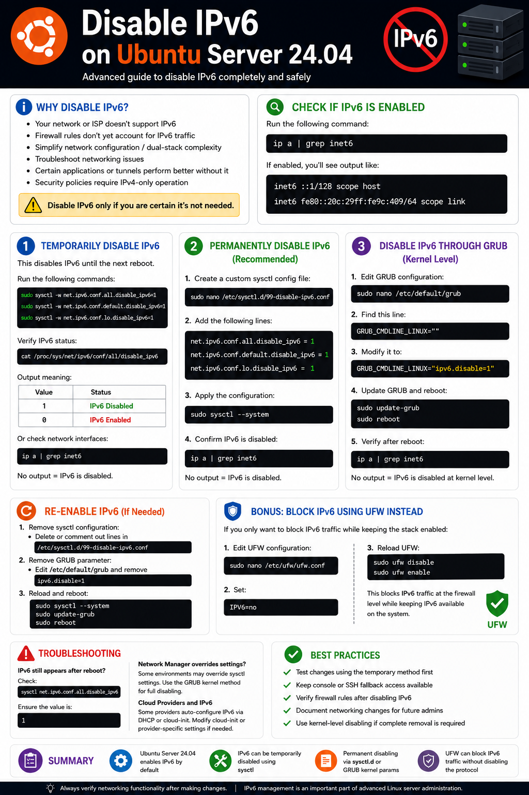

# Advanced: Disable IPv6 on Ubuntu Server 24.04

In this guide, we’ll walk through the advanced process of disabling IPv6 completely and safely on Ubuntu Server 24.04.

IPv6 is enabled by default in modern Linux distributions, including Ubuntu. While IPv6 is the future of networking, some environments still operate entirely on IPv4. In those situations, administrators may choose to disable IPv6 to simplify networking, improve compatibility, or tighten security configurations.

---

# Why Disable IPv6?

There are several practical reasons to disable IPv6 on a server:

- Your infrastructure or ISP does not support IPv6
- Your firewall rules only protect IPv4 traffic
- You want to simplify network management
- You are troubleshooting connectivity problems
- Certain VPNs, tunnels, or applications behave better without dual-stack networking
- Security policies require IPv4-only operation

> ⚠️ Disabling IPv6 should only be done if you are certain your environment does not require it.

---

# Check Whether IPv6 Is Enabled

Before making changes, check if IPv6 is currently active.

```bash
ip a | grep inet6
```

If IPv6 is enabled, you’ll see output similar to:

```bash
inet6 ::1/128 scope host
inet6 fe80::20c:29ff:fe9c:409/64 scope link
```

---

# Method 1: Temporarily Disable IPv6

This method disables IPv6 immediately without requiring a reboot. The changes remain active until the next restart.

## Disable IPv6 Using sysctl

Run the following commands:

```bash
sudo sysctl -w net.ipv6.conf.all.disable_ipv6=1
sudo sysctl -w net.ipv6.conf.default.disable_ipv6=1
sudo sysctl -w net.ipv6.conf.lo.disable_ipv6=1
```

### What These Settings Mean

| Setting | Description |
|---|---|
| `all.disable_ipv6` | Disables IPv6 on all interfaces |
| `default.disable_ipv6` | Disables IPv6 for newly created interfaces |
| `lo.disable_ipv6` | Disables IPv6 on the loopback interface |

---

# Verify IPv6 Status

Check whether IPv6 is disabled:

```bash
cat /proc/sys/net/ipv6/conf/all/disable_ipv6
```

### Output Meaning

| Value | Status |
|---|---|
| `1` | IPv6 Disabled |
| `0` | IPv6 Enabled |

You can also confirm by checking network interfaces:

```bash
ip a | grep inet6
```

If no results appear, IPv6 is disabled.

---

# Method 2: Permanently Disable IPv6 (Recommended)

This method ensures IPv6 remains disabled after every reboot.

---

# Create a Custom sysctl Configuration

Open a new configuration file:

```bash
sudo nano /etc/sysctl.d/99-disable-ipv6.conf
```

Add the following lines:

```bash
net.ipv6.conf.all.disable_ipv6 = 1
net.ipv6.conf.default.disable_ipv6 = 1
net.ipv6.conf.lo.disable_ipv6 = 1
```

Save and exit the file.

---

# Apply the Configuration

Reload all sysctl settings:

```bash
sudo sysctl --system
```

---

# Confirm IPv6 Is Disabled

Run:

```bash
ip a | grep inet6
```

If no IPv6 addresses appear, the configuration was successful.

---

# Method 3: Disable IPv6 Through GRUB (Kernel Level)

For complete system-wide disabling at boot time, you can disable IPv6 directly through the Linux kernel.

---

# Edit GRUB Configuration

Open the GRUB configuration file:

```bash
sudo nano /etc/default/grub
```

Find this line:

```bash
GRUB_CMDLINE_LINUX=""
```

Modify it to:

```bash
GRUB_CMDLINE_LINUX="ipv6.disable=1"
```

---

# Update GRUB

Apply the changes:

```bash
sudo update-grub
```

Then reboot:

```bash
sudo reboot
```

---

# Verify Kernel-Level Disable

After rebooting, run:

```bash
ip a | grep inet6
```

No output means IPv6 is fully disabled at the kernel level.

---

# Re-Enable IPv6

If you later decide to restore IPv6 support:

## Remove sysctl Configuration

Delete or comment out the lines inside:

```bash
/etc/sysctl.d/99-disable-ipv6.conf
```

## Remove GRUB Parameter

Edit:

```bash
sudo nano /etc/default/grub
```

Remove:

```bash
ipv6.disable=1
```

---

# Reload Configuration

Run:

```bash
sudo sysctl --system
sudo update-grub
sudo reboot
```

---

# Bonus: Block IPv6 Using UFW Instead

If you only want to block IPv6 traffic while leaving the IPv6 stack enabled, Ubuntu’s firewall can handle this.

---

# Configure UFW

Open the UFW configuration:

```bash
sudo nano /etc/ufw/ufw.conf
```

Set:

```bash
IPV6=no
```

---

# Reload UFW

Run:

```bash
sudo ufw disable
sudo ufw enable
```

This blocks IPv6 traffic at the firewall level while keeping IPv6 technically available on the system.

---

# Troubleshooting

## IPv6 Still Appears After Reboot

Check whether another service is re-enabling IPv6:

```bash
sysctl net.ipv6.conf.all.disable_ipv6
```

Ensure the value is:

```bash
1
```

---

## Network Manager Overrides Settings

Some desktop or cloud environments may override sysctl settings. In those cases, use the GRUB kernel method for full disabling.

---

## Cloud Providers and IPv6

Some cloud providers automatically configure IPv6 addresses through DHCP or cloud-init. You may need to modify cloud-init or provider-specific networking settings.

---

# Best Practices

- Test changes using the temporary method first
- Keep console or SSH fallback access available
- Verify firewall rules after disabling IPv6
- Document networking changes for future administrators
- Use kernel-level disabling if complete removal is required

---

# Summary

- Ubuntu Server 24.04 enables IPv6 by default
- IPv6 can be temporarily disabled using `sysctl`
- Permanent disabling can be configured through:
  - `sysctl.d`
  - GRUB kernel parameters
- UFW can block IPv6 traffic without disabling the protocol itself
- Always verify networking functionality after making changes

IPv6 management is an important part of advanced Linux server administration, especially in controlled enterprise or IPv4-only environments.

